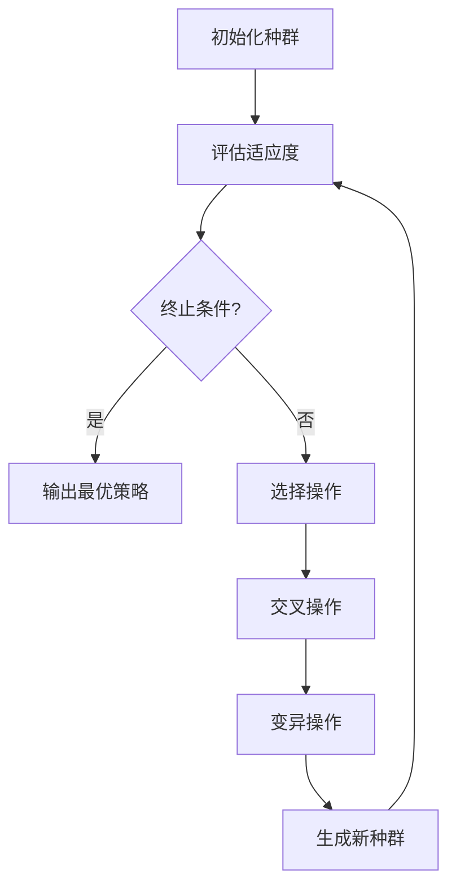
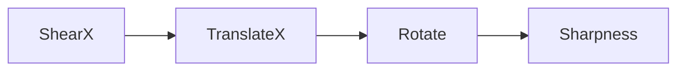

# AutoAugment原理与代码实例讲解

## 1.背景介绍

### 1.1 数据增强的重要性

在深度学习领域中,训练数据的质量和数量对模型性能有着至关重要的影响。然而,获取高质量的标注数据通常是一项耗时且昂贵的过程。为了缓解这一问题,数据增强(Data Augmentation)技术应运而生。

数据增强是指通过一些转换操作(如裁剪、旋转、翻转等)来人工生成新的训练样本,从而扩大训练数据集的规模。这种方法不仅能够提高模型的泛化能力,还能够减少过拟合的风险。

### 1.2 传统数据增强方法的局限性

传统的数据增强方法通常依赖于人工设计的转换策略,例如随机裁剪、随机翻转等。然而,这些人工设计的策略往往是基于经验和直觉,可能无法充分挖掘数据的潜力,并且需要大量的人力和时间来调整参数。

此外,不同的任务和数据集可能需要不同的增强策略,人工设计的方法难以灵活适应不同场景。因此,自动化的数据增强方法变得越来越受关注。

## 2.核心概念与联系

### 2.1 AutoAugment概述

AutoAugment是谷歌大脑团队在2018年提出的一种自动数据增强算法。它的核心思想是通过搜索和学习的方式,自动发现最佳的数据增强策略,而不是依赖于人工设计。

AutoAugment将数据增强策略表示为一个有向无环图(DAG),其中每个节点代表一种数据转换操作,边则表示操作的执行顺序。通过在一个搜索空间中探索不同的DAG结构和参数组合,AutoAugment可以找到在验证集上表现最佳的增强策略。

### 2.2 搜索算法

AutoAugment采用了一种基于强化学习的搜索算法,称为遗传算法(Genetic Algorithm)。遗传算法是一种启发式优化算法,模拟自然选择和遗传机制,通过不断进化和迭代来寻找最优解。

在AutoAugment中,每个DAG被视为一个"个体",其适应度由在验证集上的性能决定。算法通过选择、交叉和变异等操作来生成新的"个体",并不断优化适应度最高的"个体"。

### 2.3 子策略和整体策略

为了加速搜索过程,AutoAugment将增强策略划分为多个子策略。每个子策略由5个操作节点组成,表示一个小的增强操作序列。整体策略则由多个子策略组合而成。

这种分解方式不仅降低了搜索空间的复杂度,还提高了策略的可迁移性。在不同的数据集和任务上,只需要重新搜索子策略,而无需从头开始搜索整体策略。

## 3.核心算法原理具体操作步骤

AutoAugment算法的具体操作步骤如下:



1. **初始化种群**:首先随机生成一定数量的DAG作为初始种群。
2. **评估适应度**:对每个DAG进行数据增强,并在验证集上评估模型的性能,作为该DAG的适应度。
3. **终止条件**:检查是否满足终止条件,如达到最大迭代次数或性能收敛。如果满足,则输出当前最优的增强策略;否则进入下一步。
4. **选择操作**:根据适应度,从当前种群中选择一部分个体作为父代。
5. **交叉操作**:随机选择两个父代个体,并在它们之间进行交叉操作,生成新的子代个体。
6. **变异操作**:对子代个体进行小概率的变异操作,以引入新的特征。
7. **生成新种群**:将交叉和变异后的子代个体与部分父代个体合并,形成新的种群。
8. **回到步骤2**,重复上述过程,直到满足终止条件。

通过上述迭代过程,AutoAugment可以不断优化数据增强策略,最终得到在验证集上表现最佳的策略。

## 4.数学模型和公式详细讲解举例说明

### 4.1 DAG表示

在AutoAugment中,数据增强策略被表示为一个有向无环图(DAG)。每个节点代表一种数据转换操作,边则表示操作的执行顺序。

我们可以使用邻接矩阵来表示DAG。设有$n$个操作节点,则DAG可以用一个$n \times n$的邻接矩阵$A$表示,其中$A_{ij}=1$表示从节点$i$到节点$j$有一条边,否则$A_{ij}=0$。

例如,下面是一个简单的DAG及其对应的邻接矩阵:



$$
A = \begin{bmatrix}
0 & 1 & 0 & 0\
0 & 0 & 1 & 0\
0 & 0 & 0 & 1\
0 & 0 & 0 & 0
\end{bmatrix}
$$

### 4.2 适应度函数

在遗传算法中,适应度函数(Fitness Function)用于评估每个个体的优劣程度。在AutoAugment中,适应度函数是基于模型在验证集上的性能来定义的。

设$f(x, \theta)$为模型在输入$x$和参数$\theta$下的预测,$y$为真实标签,则适应度函数可以定义为:

$$
\text{Fitness}(\theta) = \frac{1}{N}\sum_{i=1}^N \mathcal{L}(f(x_i, \theta), y_i)
$$

其中$\mathcal{L}$是损失函数(如交叉熵损失),$N$是验证集的样本数。适应度函数的值越小,表示模型在验证集上的性能越好。

在实际操作中,我们可以将适应度函数设置为模型在验证集上的准确率或其他评价指标。

### 4.3 选择、交叉和变异操作

在遗传算法中,选择、交叉和变异是三种基本的遗传操作。

**选择操作**:根据适应度函数,从当前种群中选择一部分个体作为父代。常用的选择方法包括轮盘赌选择(Roulette Wheel Selection)、锦标赛选择(Tournament Selection)等。

**交叉操作**:交叉操作通过组合父代个体的特征来产生新的子代个体。在AutoAugment中,我们可以采用单点交叉或多点交叉的方式,将两个父代DAG的部分节点和边进行交换,生成新的子代DAG。

**变异操作**:变异操作通过改变个体的某些特征来引入新的特征。在AutoAugment中,我们可以对DAG进行节点添加、删除或替换等变异操作,以增加种群的多样性。

通过不断进行选择、交叉和变异操作,算法可以逐步优化种群中的个体,最终得到性能最佳的数据增强策略。

## 5.项目实践:代码实例和详细解释说明

以下是一个使用PyTorch实现的AutoAugment代码示例,包括DAG表示、适应度函数计算、遗传操作等核心部分。

### 5.1 导入必要的库

```python
import random
import numpy as np
import torch
import torch.nn as nn
import torch.optim as optim
```

### 5.2 定义数据转换操作

```python
ops = [
    'ShearX', 'ShearY', 'TranslateX', 'TranslateY', 'Rotate',
    'AutoContrast', 'Invert', 'Equalize', 'Solarize', 'Posterize',
    'Contrast', 'Color', 'Brightness', 'Sharpness', 'Cutout'
]

def apply_op(img, op, magnitude):
    # 实现各种数据转换操作的具体逻辑
    pass
```

### 5.3 DAG表示

```python
class DAG:
    def __init__(self, n_nodes):
        self.n_nodes = n_nodes
        self.adj_matrix = np.zeros((n_nodes, n_nodes), dtype=np.int32)
        self.ops = np.random.choice(ops, size=n_nodes)
        self.magnitudes = np.random.randint(1, 11, size=n_nodes)

    def apply(self, img):
        for i in range(self.n_nodes):
            for j in range(self.n_nodes):
                if self.adj_matrix[i, j] == 1:
                    img = apply_op(img, self.ops[j], self.magnitudes[j])
        return img

    def mutate(self, prob=0.1):
        # 实现变异操作的逻辑
        pass

    def crossover(self, other):
        # 实现交叉操作的逻辑
        pass
```

### 5.4 适应度函数

```python
def fitness(dag, model, val_loader):
    model.eval()
    correct = 0
    total = 0
    with torch.no_grad():
        for data in val_loader:
            images, labels = data
            augmented_images = [dag.apply(img) for img in images]
            augmented_images = torch.stack(augmented_images)
            outputs = model(augmented_images)
            _, predicted = torch.max(outputs.data, 1)
            total += labels.size(0)
            correct += (predicted == labels).sum().item()
    accuracy = correct / total
    return accuracy
```

### 5.5 遗传算法主循环

```python
def autoaugment(model, train_loader, val_loader, population_size=50, max_iter=100):
    population = [DAG(5) for _ in range(population_size)]
    best_dag = None
    best_fitness = 0

    for i in range(max_iter):
        fitnesses = [fitness(dag, model, val_loader) for dag in population]
        best_idx = np.argmax(fitnesses)
        best_dag = population[best_idx]
        best_fitness = fitnesses[best_idx]

        # 选择、交叉和变异操作
        new_population = []
        for _ in range(population_size):
            parent1, parent2 = random.sample(population, 2)
            child = parent1.crossover(parent2)
            child.mutate()
            new_population.append(child)
        population = new_population

        print(f"Iteration {i}: Best fitness = {best_fitness}")

    return best_dag
```

### 5.6 使用AutoAugment

```python
# 初始化模型和数据加载器
model = ...
train_loader = ...
val_loader = ...

# 运行AutoAugment算法
best_dag = autoaugment(model, train_loader, val_loader)

# 使用最佳增强策略进行训练
for epoch in range(num_epochs):
    for data in train_loader:
        images, labels = data
        augmented_images = [best_dag.apply(img) for img in images]
        augmented_images = torch.stack(augmented_images)
        # 训练模型
        ...
```

上述代码展示了AutoAugment算法的核心实现,包括DAG表示、适应度函数计算、遗传操作等。在实际应用中,您可能需要进一步优化和扩展这些代码,以满足特定的需求。

## 6.实际应用场景

AutoAugment算法已被广泛应用于各种计算机视觉任务,如图像分类、目标检测、语义分割等。以下是一些典型的应用场景:

### 6.1 图像分类

图像分类是计算机视觉领域的基础任务之一。AutoAugment可以通过自动搜索最佳的数据增强策略,提高图像分类模型的性能。谷歌团队在ImageNet数据集上使用AutoAugment,将Top-1准确率从79.9%提高到83.5%。

### 6.2 目标检测

在目标检测任务中,AutoAugment也展现出了优异的性能。谷歌团队在COCO数据集上应用AutoAugment,将Mask R-CNN模型的mAP提高了4.6%。

### 6.3 语义分割

语义分割是将图像像素级别地分配到不同的类别。AutoAugment可以有效增强语义分割模型的泛化能力。在Cityscapes数据集上,使用AutoAugment可以将DeepLabv3+模型的mIoU提高约2%。

### 6.4 其他应用

除了上述任务外,AutoAugment还被应用于人脸识别、医学图像分析等领域。它的自动化特性使其可以轻松地扩展到各种任务和数据集。

## 7.工具和资源推荐

如果您希望在自己的项目中使