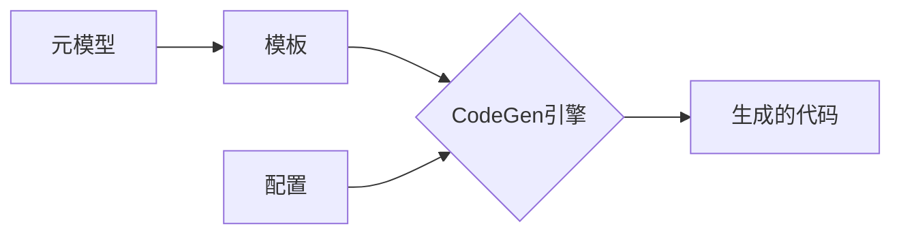

# CodeGen原理与代码实例讲解

## 1.背景介绍

### 1.1 CodeGen的起源与发展
CodeGen(Code Generation)是一种自动化编程技术,旨在根据给定的输入和约束条件自动生成代码。它起源于20世纪60年代,最初主要应用于编译器的代码生成阶段。随着人工智能和机器学习的发展,CodeGen技术也不断进步,目前已经成为软件开发中的重要工具之一。

### 1.2 CodeGen的意义与价值
CodeGen技术可以显著提高软件开发效率,减少人工编码的工作量。通过自动生成代码,可以避免手工编码过程中的错误,提高代码质量。此外,CodeGen还可以根据需求的变化快速生成新的代码,使软件具有更好的可维护性和扩展性。

### 1.3 CodeGen的应用领域
CodeGen技术在很多领域都有广泛应用,包括:
- 编译器
- 代码生成器
- 低代码/无代码开发平台
- 模型驱动开发(MDD)
- 领域特定语言(DSL)
- 自动化测试

## 2.核心概念与联系

### 2.1 CodeGen的输入
CodeGen的输入通常包括以下几个方面:
- 元模型(Meta-Model):描述问题领域的概念模型
- 模板(Template):定义生成代码的结构和样式
- 配置(Configuration):指定生成代码的各种参数和选项

### 2.2 CodeGen的处理过程
CodeGen的处理过程可以分为以下几个步骤:
- 解析(Parsing):分析和理解输入的元模型、模板等内容
- 转换(Transformation):根据转换规则将输入转换为中间表示
- 生成(Generation):根据中间表示生成最终的代码

### 2.3 CodeGen的输出
CodeGen的输出就是根据输入自动生成的源代码,可以是各种编程语言,如Java、C++、Python等。生成的代码通常具有以下特点:
- 结构化:代码结构清晰,易于理解和维护
- 可读性:代码具有良好的可读性,便于人工review和修改
- 一致性:批量生成的代码风格一致,避免手工编码的随意性

### 2.4 CodeGen技术之间的联系
下图展示了CodeGen各项技术之间的关系:



## 3.核心算法原理具体操作步骤

### 3.1 解析阶段
1. 读入元模型、模板等输入内容
2. 对输入进行词法分析,识别其中的关键信息
3. 进行语法分析,生成抽象语法树(AST)
4. 构建符号表,建立AST节点之间的引用关系

### 3.2 转换阶段
1. 遍历AST,应用一系列转换规则
2. 常见的转换规则包括:
   - 模式匹配和替换
   - 访问者模式
   - 模板实例化
3. 处理继承、多态等面向对象特性
4. 逐步将AST转换为代码生成的中间表示(IR)

### 3.3 生成阶段
1. 以IR作为输入,应用代码生成模板
2. 模板通常基于以下机制:
   - 占位符替换
   - 条件分支
   - 循环
3. 使用缩进、换行等格式化输出代码
4. 将生成的代码写入文件

## 4.数学模型和公式详细讲解举例说明

### 4.1 编译器中的代码生成
在编译器的代码生成阶段,通常使用中间代码表示(Intermediate Representation)作为桥梁,将前端的抽象语法树转换为目标代码。常见的IR形式有:
- 三地址码(Three-Address Code):使用类似汇编语言的形式表示程序,每条指令最多有三个操作数。例如:
  $x=y+z$
- 四元式(Quadruple):用四元组(op,arg1,arg2,result)表示一条语句。例如:
  $(+,a,b,t1)$
  $(*, t1, 2, t2)$
- P-代码(P-Code):一种与机器无关的中间代码,类似于字节码。

### 4.2 模板引擎的数学模型
许多CodeGen工具使用模板引擎来生成代码。以Velocity模板引擎为例,它使用一种简单的数学模型来表示模板:
- 变量引用:$${var}$
- 条件语句:
  #if(${condition})
  ...
  #end
- 循环语句:
  #foreach(${item} in ${collection})
  ...
  #end

模板引擎在渲染时,会将变量替换为具体的值,并根据条件和循环语句生成对应的代码片段。

## 5.项目实践：代码实例和详细解释说明

下面以一个简单的Java类生成器为例,演示CodeGen的实现过程。

### 5.1 定义元模型
首先定义一个简单的Java类元模型,包含类名、属性、方法等信息:

```java
public class ClassModel {
    private String className;
    private List<FieldModel> fields = new ArrayList<>();
    private List<MethodModel> methods = new ArrayList<>();

    // 省略getter/setter
}

public class FieldModel {
    private String name;
    private String type;

    // 省略getter/setter
}

public class MethodModel {
    private String name;
    private String returnType;
    private List<ParameterModel> parameters = new ArrayList<>();

    // 省略getter/setter
}
```

### 5.2 准备模板
使用Velocity模板引擎,编写Java类的代码模板:

```velocity
public class ${className} {
    #foreach($field in $fields)
    private ${field.type} ${field.name};
    #end

    #foreach($method in $methods)
    public ${method.returnType} ${method.name}(#foreach($parameter in $method.parameters)${parameter.type} ${parameter.name}#if($foreach.hasNext), #end#end) {
        // TODO
    }
    #end
}
```

### 5.3 生成代码
使用Velocity引擎渲染上述模板,生成Java代码:

```java
VelocityEngine ve = new VelocityEngine();
ve.init();

Template t = ve.getTemplate("class.vm");

VelocityContext ctx = new VelocityContext();
ctx.put("className", "Person");

List<FieldModel> fields = new ArrayList<>();
fields.add(new FieldModel("name", "String"));
fields.add(new FieldModel("age", "int"));
ctx.put("fields", fields);

List<MethodModel> methods = new ArrayList<>();
MethodModel method = new MethodModel();
method.setName("sayHello");
method.setReturnType("void");
method.getParameters().add(new ParameterModel("msg", "String"));
methods.add(method);
ctx.put("methods", methods);

StringWriter writer = new StringWriter();
t.merge(ctx, writer);

System.out.println(writer.toString());
```

最终生成的代码如下:

```java
public class Person {
    private String name;
    private int age;

    public void sayHello(String msg) {
        // TODO
    }
}
```

## 6.实际应用场景

CodeGen技术在实际开发中有广泛的应用,下面列举几个典型场景:

### 6.1 数据库访问层代码生成
对于数据库驱动的应用,手工编写数据库访问代码非常繁琐。可以根据数据库表结构,自动生成对应的实体类、DAO接口和实现类,显著提高开发效率。常见的工具有MyBatis Generator、JPA Buddy等。

### 6.2 微服务脚手架生成
微服务开发通常需要大量样板代码,如服务注册、服务发现、配置管理、链路追踪等。使用CodeGen可以根据服务定义,一键生成微服务项目的基础架构代码,开发人员只需关注业务逻辑即可。Spring Initializr就是一个典型的微服务脚手架生成器。

### 6.3 前端页面生成
对于CRUD类的管理后台,前端页面的结构非常相似。可以根据后端接口定义,自动生成前端的列表、表单、弹窗等页面,并封装好与后端交互的逻辑。阿里巴巴的代码生成器 Naga 就是一个很好的例子。

### 6.4 代码重构
在对遗留系统进行重构时,可以使用CodeGen批量修改代码,如更新 API 调用、修改配置项等。这样可以避免手工修改引入错误,提高重构效率。Spoon 是一个基于 Java AST 的代码生成和转换库,可用于重构等场景。

## 7.工具和资源推荐

### 7.1 开源代码生成器
- Acceleo:基于模型驱动的代码生成器
- FreeMarker:通用的模板引擎
- JHipster:基于Spring Boot和Angular的Web应用生成器
- Yeoman:前端项目脚手架生成器

### 7.2 相关开源项目
- Roslyn:微软开发的 C# 和 Visual Basic 编译器 API
- Spoon:基于Java AST的代码分析和转换库
- JavaPoet:用于生成Java源文件的 API
- Javaparser:用于解析Java源代码的库

### 7.3 学习资源
- 《DSL实战》:关于领域特定语言和代码生成的书籍
- 《Generative Programming》:介绍生成式编程的理论和实践
- Martin Fowler的文章:《Language Workbenches》《Code Generation》等
- ThoughtWorks的技术雷达:持续跟踪代码生成技术的最新趋势

## 8.总结：未来发展趋势与挑战

### 8.1 AI驱动的代码生成
随着人工智能技术的发展,特别是自然语言处理和机器学习的进步,代码生成有望实现更高的自动化水平。通过分析需求文档、用例等非结构化信息,结合已有代码库的学习,AI系统可以自主设计软件架构、生成代码。GitHub Copilot就是一个有益的尝试。

### 8.2 低代码/无代码开发平台
低代码和无代码开发平台通过可视化建模、拖拽组装等方式,让非专业开发者也能构建应用程序。这类平台背后依赖强大的代码生成引擎,将图形化的应用模型转换为可执行代码。Mendix、OutSystems等就是这一领域的代表。未来低代码平台有望进一步降低开发门槛,加速企业数字化转型。

### 8.3 挑战与展望
尽管CodeGen技术已经相当成熟,但仍然面临不少挑战:
- 如何提高生成代码的质量和性能
- 如何增强代码生成的灵活性和可定制性
- 如何与手写代码更好地结合,提供无缝的开发体验

未来,CodeGen技术将与AI、云计算、大数据等新兴技术深度融合,为软件开发注入新的活力。程序员也将从重复的编码工作中解放出来,更多地投入到创新性的工作中。

## 9.附录：常见问题与解答

### 9.1 CodeGen会取代程序员吗?
不会。CodeGen是程序员的有力助手,可以帮助程序员从繁琐的编码工作中解脱出来,提高开发效率。但软件开发的核心仍然是分析问题、设计方案、优化算法等创造性的工作,这需要程序员的智慧。CodeGen只是把程序员从"搬砖"中解放出来,让他们有更多时间专注于"盖房子"。

### 9.2 手写代码和生成代码如何协作?
通常采用"生成的代码不修改"的原则,将手写代码和生成代码分离。生成的代码作为中间产物,通过扩展点、回调函数等方式与手写代码互操作。当需求变更时,只修改CodeGen的输入(如模型、模板),重新生成代码,而不直接修改生成的代码。

### 9.3 如何保证生成代码的质量?
可以采取以下措施:
- 充分测试和验证CodeGen的转换规则
- 对生成的代码进行静态检查和单元测试
- 定期Review生成的代码,优化模板和生成逻辑
- 持续集成,确保每次代码生成后都能顺利构建和测试
- 建立完善的文档和使用指南,规范CodeGen的使用流程

总之,CodeGen作为现代软件工程的利器,必将在未来的开发实践中扮演越来越重要的角色。程序员应该积极拥抱这一技术,用创新的思维探索CodeGen的更多可能性,让软件开发变得更加智能和高效。

作者：禅与计算机程序设计艺术 / Zen and the Art