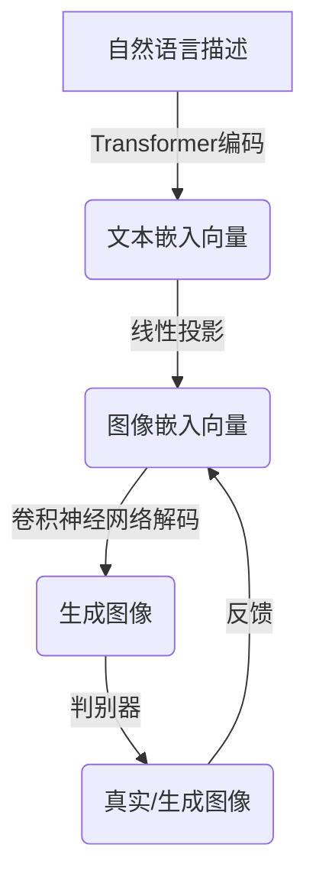

# DALL-E原理与代码实例讲解

## 1. 背景介绍

在人工智能领域,生成式AI模型已经取得了令人瞩目的进展。其中,DALL-E是OpenAI推出的一款突破性的文本到图像生成模型,它能够根据自然语言描述生成逼真的图像,展现出了令人惊叹的创造力和想象力。DALL-E的出现不仅推动了计算机视觉和自然语言处理等领域的发展,也为艺术创作、设计、教育等领域带来了新的可能性。

## 2. 核心概念与联系

### 2.1 生成式对抗网络(GAN)

DALL-E的核心技术是基于生成式对抗网络(Generative Adversarial Networks, GAN)。GAN由两个神经网络组成:生成器(Generator)和判别器(Discriminator)。生成器的目标是生成逼真的图像,而判别器则负责区分生成的图像和真实图像。通过这种对抗式的训练过程,生成器不断优化,最终能够生成高质量的图像。

### 2.2 自然语言处理(NLP)

DALL-E将自然语言描述作为输入,因此需要利用自然语言处理技术将文本转换为模型可以理解的表示形式。DALL-E使用了Transformer模型,这是一种在自然语言处理任务中表现出色的模型架构。

### 2.3 计算机视觉(CV)

DALL-E的输出是图像,因此需要利用计算机视觉技术对生成的图像进行处理和评估。DALL-E使用了卷积神经网络(CNN)作为图像编码器,将图像转换为向量表示。

### 2.4 多模态学习

DALL-E将自然语言和图像两种模态融合在一起,属于多模态学习的范畴。多模态学习旨在从不同模态的数据中学习统一的表示,并利用不同模态之间的相关性提高模型的性能。

## 3. 核心算法原理具体操作步骤

DALL-E的核心算法原理可以分为以下几个步骤:



1. **自然语言编码**:DALL-E使用Transformer模型对自然语言描述进行编码,得到文本嵌入向量。

2. **线性投影**:将文本嵌入向量线性投影到图像嵌入空间,得到初始的图像嵌入向量。

3. **图像解码**:使用卷积神经网络(CNN)对图像嵌入向量进行解码,生成初始图像。

4. **对抗训练**:生成器生成的图像被判别器评估为真实或生成图像。判别器的反馈被用于优化生成器,使其能够生成更加逼真的图像。

5. **迭代优化**:重复上述步骤,不断优化生成器和判别器,直到生成器能够生成高质量的图像为止。

## 4. 数学模型和公式详细讲解举例说明

### 4.1 Transformer模型

Transformer是一种基于注意力机制的序列到序列模型,广泛应用于自然语言处理任务。对于一个长度为 $n$ 的输入序列 $X = (x_1, x_2, \dots, x_n)$,Transformer模型计算其输出序列 $Y = (y_1, y_2, \dots, y_m)$ 的过程可以表示为:

$$Y = \text{Transformer}(X)$$

Transformer模型的核心是多头注意力机制(Multi-Head Attention),它允许模型同时关注输入序列中的多个位置,捕捉长距离依赖关系。对于查询向量 $q$、键向量 $k$ 和值向量 $v$,注意力计算公式如下:

$$\text{Attention}(q, k, v) = \text{softmax}\left(\frac{qk^T}{\sqrt{d_k}}\right)v$$

其中 $d_k$ 是缩放因子,用于防止内积过大导致梯度消失或爆炸。

### 4.2 生成式对抗网络(GAN)

生成式对抗网络由生成器 $G$ 和判别器 $D$ 组成,它们相互对抗地训练。生成器的目标是生成逼真的样本,使判别器无法区分真实样本和生成样本;判别器的目标是正确区分真实样本和生成样本。

对于真实样本 $x$ 和生成样本 $G(z)$,其目标函数可以表示为:

$$\min_G \max_D V(D, G) = \mathbb{E}_{x \sim p_\text{data}(x)}[\log D(x)] + \mathbb{E}_{z \sim p_z(z)}[\log (1 - D(G(z)))]$$

其中 $p_\text{data}(x)$ 是真实数据分布, $p_z(z)$ 是噪声分布。

在训练过程中,生成器 $G$ 试图最小化目标函数,以生成更加逼真的样本;判别器 $D$ 试图最大化目标函数,以更好地区分真实样本和生成样本。

## 5. 项目实践:代码实例和详细解释说明

以下是一个使用PyTorch实现DALL-E的简化版本代码示例:

```python
import torch
import torch.nn as nn
import torch.optim as optim

# Transformer模型
class Transformer(nn.Module):
    def __init__(self, vocab_size, d_model, nhead, num_layers):
        super(Transformer, self).__init__()
        self.embedding = nn.Embedding(vocab_size, d_model)
        self.encoder = nn.TransformerEncoder(nn.TransformerEncoderLayer(d_model, nhead), num_layers)
        self.decoder = nn.Linear(d_model, vocab_size)

    def forward(self, x):
        x = self.embedding(x)
        x = self.encoder(x)
        x = self.decoder(x)
        return x

# 生成器
class Generator(nn.Module):
    def __init__(self, text_dim, img_dim):
        super(Generator, self).__init__()
        self.transformer = Transformer(vocab_size, text_dim, nhead, num_layers)
        self.proj = nn.Linear(text_dim, img_dim)
        self.decoder = nn.ConvTranspose2d(...)  # CNN解码器

    def forward(self, text):
        text_emb = self.transformer(text)
        img_emb = self.proj(text_emb)
        img = self.decoder(img_emb)
        return img

# 判别器
class Discriminator(nn.Module):
    def __init__(self, img_dim):
        super(Discriminator, self).__init__()
        self.encoder = nn.Conv2d(...)  # CNN编码器
        self.classifier = nn.Linear(img_dim, 1)

    def forward(self, img):
        img_emb = self.encoder(img)
        output = self.classifier(img_emb)
        return output

# 训练
text = ...  # 自然语言描述
generator = Generator(text_dim, img_dim)
discriminator = Discriminator(img_dim)

criterion = nn.BCELoss()
g_optimizer = optim.Adam(generator.parameters(), lr=0.0002)
d_optimizer = optim.Adam(discriminator.parameters(), lr=0.0002)

for epoch in range(num_epochs):
    # 训练生成器
    g_optimizer.zero_grad()
    fake_img = generator(text)
    d_fake = discriminator(fake_img)
    g_loss = criterion(d_fake, torch.ones_like(d_fake))
    g_loss.backward()
    g_optimizer.step()

    # 训练判别器
    d_optimizer.zero_grad()
    real_img = ...  # 真实图像
    d_real = discriminator(real_img)
    d_fake = discriminator(fake_img.detach())
    d_loss = criterion(d_real, torch.ones_like(d_real)) + criterion(d_fake, torch.zeros_like(d_fake))
    d_loss.backward()
    d_optimizer.step()
```

上述代码实现了DALL-E的核心组件:Transformer模型、生成器和判别器。

1. `Transformer`类实现了Transformer模型,用于编码自然语言描述。
2. `Generator`类实现了生成器,它将自然语言描述编码为文本嵌入向量,然后通过线性投影和卷积神经网络解码器生成图像。
3. `Discriminator`类实现了判别器,它使用卷积神经网络编码器提取图像特征,然后通过线性分类器判断图像是真实还是生成。
4. 在训练过程中,生成器和判别器相互对抗地优化,生成器试图生成更加逼真的图像以欺骗判别器,而判别器则试图更好地区分真实图像和生成图像。

需要注意的是,这只是一个简化版本的实现,实际的DALL-E模型会更加复杂和精细。

## 6. 实际应用场景

DALL-E的文本到图像生成能力为许多领域带来了新的可能性:

1. **艺术创作**:艺术家可以使用DALL-E根据自然语言描述生成图像,作为创作灵感或素材。
2. **设计**:设计师可以使用DALL-E快速生成各种设计概念和草图,加快设计流程。
3. **教育**:教师可以使用DALL-E生成各种教学素材,如插图、示意图等,以提高课程的吸引力和可理解性。
4. **游戏开发**:游戏开发者可以使用DALL-E生成游戏场景、角色和物品,节省人力和时间成本。
5. **视觉辅助**:DALL-E可以为视觉障碍者生成图像描述,帮助他们更好地理解视觉信息。
6. **内容创作**:内容创作者可以使用DALL-E生成各种图像素材,如封面图、插图等,丰富内容表现形式。

## 7. 工具和资源推荐

1. **OpenAI DALL-E**:OpenAI官方提供的DALL-E在线演示,可以尝试输入自然语言描述生成图像。
2. **Hugging Face Diffusers**:Hugging Face提供的开源文本到图像生成库,支持多种模型和技术。
3. **Stable Diffusion**:一款基于潜在扩散模型的开源文本到图像生成模型,具有出色的性能和灵活性。
4. **NVIDIA Canvas**:NVIDIA推出的基于GAN的AI绘画应用程序,支持草图到图像和文本到图像生成。
5. **Google Colab**:提供免费的云端GPU资源,适合运行和训练大型深度学习模型。

## 8. 总结:未来发展趋势与挑战

虽然DALL-E取得了令人瞩目的成就,但文本到图像生成技术仍然面临着一些挑战和限制:

1. **偏差和公平性**:生成的图像可能存在偏见和不公平的表现,需要解决这一问题。
2. **创意和原创性**:生成的图像可能缺乏真正的创意和原创性,只是基于训练数据的重组。
3. **可解释性和控制性**:目前难以解释生成过程,也难以精确控制生成结果。
4. **计算资源需求**:训练大型生成模型需要大量的计算资源,对硬件要求较高。
5. **版权和伦理问题**:生成图像可能涉及版权和伦理问题,需要相关法规和准则的指导。

未来,文本到图像生成技术可能会在以下方向发展:

1. **多模态融合**:将视觉、语言、音频等多种模态融合,实现更加通用和智能的生成模型。
2. **可控生成**:提高对生成过程的控制能力,实现更加精确和个性化的生成结果。
3. **创意增强**:赋予模型更强的创意能力,生成具有独创性和艺术性的作品。
4. **解释性和透明度**:提高模型的可解释性和透明度,确保生成过程的公平性和可信度。
5. **应用拓展**:将文本到图像生成技术应用于更多领域,如医疗影像、科学可视化等。

## 9. 附录:常见问题与解答

1. **DALL-E是如何生成图像的?**

DALL-E使用生成式对抗网络(GAN)和自然语言处理技术,将自然语言描述编码为文本嵌入向量,然后通过卷积神经网络解码器生成图像。生成器和判别器相互对抗地训练,最终生成器能够生成高质量的图像。

2. **DALL-E生成的图像是否完全原创?**

DALL-E生成的图像是基于训练数据的重组和组合,因此不能算是完全原创。但它能够展现出一定的创造力和想象力,生