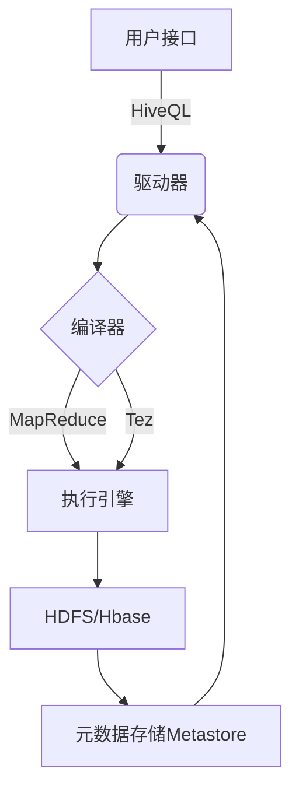
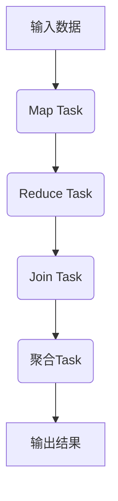

# HiveQL在实时数据分析中的应用

## 1.背景介绍

随着大数据时代的到来,海量数据的实时处理和分析已经成为了当前企业面临的重大挑战。传统的数据库系统很难满足对大规模数据集的高效查询和分析需求。Apache Hive作为一种建立在Hadoop之上的数据仓库基础架构,为大数据环境下的数据查询分析提供了强大的SQL支持。HiveQL作为Hive的查询语言,在实时大数据分析中扮演着关键角色。

### 1.1 大数据分析的挑战

- **数据量爆炸式增长** 随着互联网、物联网、移动设备等新兴技术的迅猛发展,企业每天都会产生大量的结构化和非结构化数据,这些数据的规模已经远远超出了传统数据库系统的处理能力。

- **数据种类日益增多** 除了传统的结构化数据,还有日志数据、网络数据、多媒体数据等非结构化数据需要处理和分析。

- **实时性要求提高** 企业需要对最新的数据进行实时分析,以便及时发现问题并做出正确决策。

- **分析复杂度加大** 对海量数据进行多维度的复杂分析,需要强大的计算能力和高效的查询引擎。

### 1.2 Hive在大数据分析中的作用

Apache Hive通过将结构化的数据文件映射为数据库中的表,使用户可以使用类SQL语言HiveQL来查询和分析存储在分布式文件系统中的大规模数据集。Hive的设计目标是通过类SQL语句,将结构化的数据文件映射为一张数据库表,并将SQL语句转化为MapReduce任务执行在Hadoop集群上。这种设计使得Hive可以轻松地处理TB甚至PB级别的数据。

## 2.核心概念与联系

在深入探讨HiveQL在实时数据分析中的应用之前,我们需要先了解一些Hive的核心概念。

### 2.1 Hive架构

Hive的架构主要由以下几个核心组件组成:



1. **用户接口**: 用户可以通过命令行(CLI)、JDBC/ODBC或Web UI等方式向Hive发送HiveQL查询。

2. **驱动器(Driver)**: 接收用户的HiveQL查询,与元数据存储进行交互,协调查询的生命周期。

3. **编译器(Compiler)**: 将HiveQL查询转换为MapReduce任务或Tez作业。

4. **执行引擎**: 在Hadoop集群上执行编译后的MapReduce或Tez作业。

5. **HDFS/Hbase**: 存储用户数据的分布式文件系统。

6. **元数据存储(Metastore)**: 存储表、列、分区等元数据信息。

### 2.2 HiveQL概述

HiveQL是Hive的查询语言,它类似于SQL,但并不完全相同。HiveQL允许用户使用类似SQL的语法来查询存储在HDFS或Hbase中的数据。它支持大多数SQL语法,如SELECT、INSERT、UPDATE、DELETE等,同时也提供了一些用于大数据处理的特有功能,如分区、分桶等。

HiveQL查询的执行过程如下:

1. 用户通过CLI、JDBC等接口提交HiveQL查询。
2. 驱动器接收查询,与Metastore交互获取元数据信息。
3. 编译器将HiveQL查询转换为MapReduce任务或Tez作业。
4. 执行引擎在Hadoop集群上并行执行编译后的作业。
5. 查询结果存储在HDFS或Hbase中,用户可通过CLI等接口查看。

## 3.核心算法原理具体操作步骤

HiveQL在实时大数据分析中的核心算法原理主要体现在以下几个方面:

### 3.1 查询优化

Hive的查询优化主要包括以下几个步骤:

1. **语法解析**: 将HiveQL查询解析为抽象语法树(AST)。

2. **类型检查**: 对AST进行类型检查,确保类型正确。

3. **语义分析**: 构建查询块,解析表和列,构建查询计划。

4. **查询重写**: 对查询计划进行优化,如谓词下推、投影修剪等。

5. **执行计划生成**: 根据优化后的查询计划生成MapReduce作业或Tez作业。

查询优化的目标是减少不必要的数据传输,提高查询效率。

### 3.2 MapReduce执行

对于简单查询,Hive会将其转换为一个或多个MapReduce作业在Hadoop集群上执行。MapReduce作业的执行过程如下:

1. **Map阶段**: 每个Mapper从HDFS读取输入数据,根据查询条件过滤数据,并进行部分聚合运算。

2. **Shuffle阶段**: 将Map输出的键值对按键进行分区和排序,分发到不同的Reducer。

3. **Reduce阶段**: 每个Reducer对收到的数据进行合并和最终聚合运算,输出结果到HDFS。

MapReduce的并行计算模型可以充分利用Hadoop集群的计算资源,适合处理TB级以上的大数据集。

### 3.3 Tez执行引擎

对于复杂查询,Hive可以使用Tez作为执行引擎,Tez是一种基于有向无环图的执行框架,相比MapReduce具有更好的性能。Tez作业的执行过程如下:



1. **Map Task**: 从HDFS读取输入数据,进行过滤和投影等操作。

2. **Reduce Task**: 对Map输出进行分区、排序和归并操作。

3. **Join Task**: 执行Join操作,将来自不同源的数据进行连接。

4. **聚合Task**: 对Join输出进行分组和聚合操作。

5. **输出结果**: 将最终结果写入HDFS。

Tez通过有向无环图的执行模型,可以更好地优化作业执行流程,减少不必要的数据传输,提高查询性能。

## 4.数学模型和公式详细讲解举例说明

在大数据分析中,常常需要使用一些数学模型和公式进行数据挖掘和分析。HiveQL提供了丰富的内置函数,支持各种数学运算和统计分析。

### 4.1 数学函数

HiveQL提供了常用的数学函数,如三角函数、指数函数、对数函数等,可以方便地进行数学运算。

例如,计算给定数据集的平均值:

$$\overline{x} = \frac{1}{n}\sum_{i=1}^{n}x_i$$

可以使用HiveQL的AVG函数实现:

```sql
SELECT AVG(col) FROM table;
```

### 4.2 统计函数

HiveQL还提供了丰富的统计函数,如方差、标准差、相关系数等,可以对数据进行描述性统计分析。

例如,计算给定数据集的标准差:

$$\sigma = \sqrt{\frac{1}{n}\sum_{i=1}^{n}(x_i - \overline{x})^2}$$

可以使用HiveQL的STDDEV函数实现:

```sql
SELECT STDDEV(col) FROM table;
```

### 4.3 数据挖掘算法

对于更复杂的数据挖掘算法,HiveQL可以与其他大数据工具集成使用,如Apache Mahout、Spark MLlib等。这些工具提供了各种机器学习算法的实现,可以在Hadoop集群上高效运行。

例如,使用K-Means算法对数据进行聚类分析:

$$J = \sum_{i=1}^{k}\sum_{x \in C_i}||x - \mu_i||^2$$

其中,k是聚类数量,$\mu_i$是第i个聚类的质心,$C_i$是第i个聚类包含的数据点集合。

可以使用Mahout的K-Means实现进行聚类分析,并将结果存储在Hive表中进行查询。

## 5.项目实践:代码实例和详细解释说明

为了更好地理解HiveQL在实时数据分析中的应用,我们将通过一个实际项目案例来演示。假设我们有一个网站日志数据集,需要对其进行分析,了解用户访问情况、热门页面等信息。

### 5.1 创建表

首先,我们需要在Hive中创建表来存储网站日志数据。假设日志数据的格式如下:

```
192.168.1.1 - - [01/Aug/2022:00:00:01 +0800] "GET /index.html HTTP/1.1" 200 5326
```

我们可以使用以下HiveQL语句创建表:

```sql
CREATE TABLE web_logs (
    ip STRING,
    identd STRING,
    user STRING,
    time STRING,
    request STRING,
    status INT,
    bytes INT
)
ROW FORMAT SERDE 'org.apache.hadoop.hive.serde2.RegexSerDe'
WITH SERDEPROPERTIES (
    'input.regex' = '([^ ]*) ([^ ]*) ([^ ]*) (-|$$[^$$]*$$) ([^ \"]*|\"[^\"]*\") ([^ ]*) ([^ ]*)'
)
STORED AS TEXTFILE;
```

这里我们使用了RegexSerDe来解析日志数据,并将其存储为文本文件。

### 5.2 加载数据

接下来,我们需要将日志数据加载到Hive表中。假设日志数据存储在HDFS的`/user/logs/access.log`路径下,可以使用以下语句加载数据:

```sql
LOAD DATA INPATH '/user/logs/access.log' INTO TABLE web_logs;
```

### 5.3 数据分析

加载完数据后,我们就可以使用HiveQL进行各种数据分析操作了。

#### 5.3.1 统计访问次数

```sql
SELECT COUNT(*) AS total_visits FROM web_logs;
```

这条语句会统计日志表中的总记录数,即网站的总访问次数。

#### 5.3.2 统计访问状态码分布

```sql
SELECT status, COUNT(*) AS count
FROM web_logs
GROUP BY status;
```

这条语句会按照HTTP状态码对访问记录进行分组,并统计每个状态码的访问次数,可以了解网站的访问状况。

#### 5.3.3 统计热门页面

```sql
SELECT request, COUNT(*) AS count
FROM web_logs
GROUP BY request
ORDER BY count DESC
LIMIT 10;
```

这条语句会按照访问的URL进行分组,并统计每个URL的访问次数,最后按访问次数降序排列,取前10条记录,可以了解网站的热门页面。

#### 5.3.4 分析访问时间分布

```sql
SELECT HOUR(time) AS hour, COUNT(*) AS count
FROM web_logs
GROUP BY HOUR(time)
ORDER BY hour;
```

这条语句会按照访问时间的小时数进行分组,统计每个小时的访问次数,可以分析网站的访问高峰时段。

以上只是一些简单的示例,在实际项目中,我们还可以进行更复杂的分析,如使用窗口函数、JOIN操作等。HiveQL提供了丰富的功能,可以满足各种数据分析需求。

## 6.实际应用场景

HiveQL在实时大数据分析领域有着广泛的应用,下面列举了一些典型的应用场景:

### 6.1 网络日志分析

互联网公司通常会收集大量的网络日志数据,如Web访问日志、应用程序日志等。使用HiveQL可以对这些海量日志数据进行实时分析,了解用户行为、系统运行状况等信息,为产品优化和运维决策提供数据支持。

### 6.2 用户行为分析

电商、社交网络等互联网企业需要深入分析用户的行为数据,如浏览记录、购买记录、社交活动等,以发现用户偏好和潜在需求。HiveQL可以高效地对这些用户行为大数据进行分析挖掘,为个性化推荐、营销策略等提供依据。

### 6.3 风险控制与反欺诈

金融、保险等行业需要对大量的交易数据进行实时监控和分析,以发现潜在的风险和欺诈行为。HiveQL可以对海量交易数据进行复杂的模式匹配和异常检测,提高风控和反欺诈的能力。