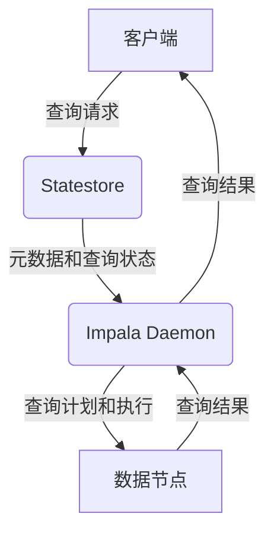
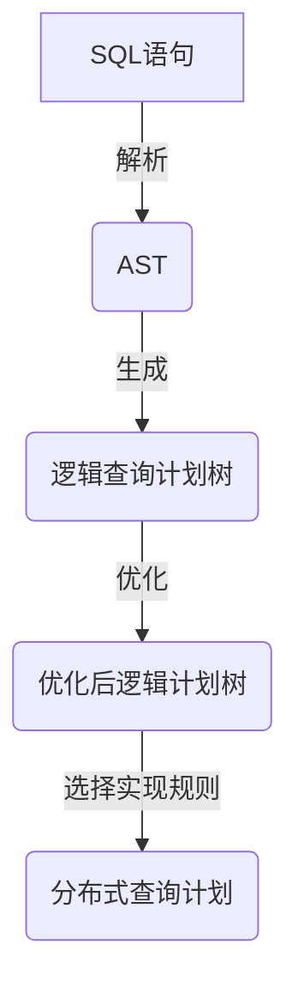
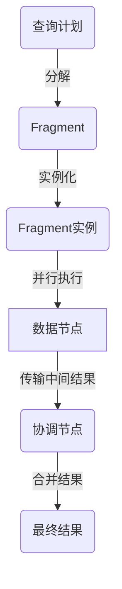

# Impala原理与代码实例讲解

## 1.背景介绍

在大数据时代,快速高效地处理海量数据成为了企业和组织面临的一大挑战。Apache Impala作为一种开源的大规模并行处理(MPP)SQL查询引擎,凭借其出色的性能和高度兼容SQL的特性,成为了Hadoop生态系统中最受欢迎的查询工具之一。

Impala诞生于2012年,最初由Cloudera公司的工程师开发,旨在提供实时分析Hadoop中的结构化数据。与Hive等其他查询引擎不同,Impala采用了全新的架构设计,使其能够直接读取HDFS和HBase等数据源中的数据,并通过分布式查询执行引擎实现高效的并行查询处理。

### 1.1 Impala的主要特点

- **低延迟查询**:Impala可以在秒级内完成大数据查询,满足实时分析需求。
- **高度并行**:采用MPP架构,实现查询的高度并行化执行。
- **SQL兼容性**:支持ANSI SQL-92标准,用户无需学习新的查询语言。
- **HDFS无缝集成**:可直接查询存储在HDFS上的数据文件。
- **元数据一致性**:与Hive共享元数据,可以无缝查询Hive表。
- **多数据源支持**:支持HDFS、HBase、Kudu等多种数据源。

### 1.2 Impala的应用场景

- **交互式分析**:通过JDBC/ODBC接口,支持各种BI工具连接进行实时查询分析。
- **ETL工作流**:可作为高效的ETL工具,从各种数据源提取、转换并加载数据。
- **数据探索**:SQL友好的查询方式,适合数据分析师探索大数据集。
- **机器学习特征工程**:高效地从海量数据中提取特征,为机器学习算法做准备。

## 2.核心概念与联系

为了理解Impala的工作原理,我们需要先了解其核心概念及它们之间的联系。

### 2.1 Impala架构概览

Impala采用无共享架构,由以下三个主要组件组成:



- **Statestore**:存储集群的健康状况、元数据信息和查询执行状态等。
- **Impala Daemon**:接收客户端查询请求,负责查询计划、调度和执行。
- **数据节点**:存储实际数据,并在Impala Daemon的调度下执行查询任务。

### 2.2 查询执行流程

1. **查询编译**:客户端发起SQL查询请求,Impala Daemon对SQL进行解析和查询计划优化。
2. **查询调度**:根据查询计划,将任务分发到相应的数据节点执行。
3. **任务执行**:数据节点并行执行查询任务,如扫描、聚合、连接等操作。
4. **结果传输**:执行节点将中间结果传输给协调节点进行合并。
5. **查询结果**:协调节点将最终结果返回给客户端。

### 2.3 并行执行引擎

Impala采用了全新的并行执行引擎,可高效利用集群资源。主要特点包括:

- **无共享架构**:避免资源争用,提高并行度。
- **向量化执行**:批量处理数据,充分利用现代CPU指令集。
- **代码生成**:动态生成查询代码,减少解释器开销。
- **I/O管理**:细粒度调度I/O操作,最大化磁盘吞吐。

## 3.核心算法原理具体操作步骤

### 3.1 查询编译

Impala查询编译过程包括以下几个主要步骤:

1. **SQL解析**:将SQL语句解析为抽象语法树(AST)。
2. **逻辑查询计划**:根据AST生成逻辑查询计划树。
3. **代数优化**:对逻辑计划树进行代数等价变换优化。
4. **实现规则选择**:为逻辑计划节点选择最佳实现算法。
5. **查询计划构建**:生成分布式查询执行计划。



### 3.2 查询调度与执行

1. **查询分片**:根据数据分布,将查询计划分解为多个执行单元(Fragment)。
2. **Fragment实例化**:为每个Fragment创建多个实例,并分发到数据节点执行。
3. **并行执行**:数据节点并行执行Fragment实例,生成中间结果。
4. **结果合并**:协调节点合并中间结果,生成最终结果。



### 3.3 并行执行引擎

Impala采用了多种先进技术,实现高效的并行执行:

1. **无共享架构**:避免资源争用,提高并行度。
2. **向量化执行**:批量处理数据,利用SIMD指令集。
3. **代码生成**:动态生成查询代码,减少解释器开销。
4. **I/O管理**:细粒度调度I/O操作,最大化磁盘吞吐。

这些技术的有机结合,使Impala能够充分利用现代硬件资源,实现高性能查询处理。

## 4.数学模型和公式详细讲解举例说明

在查询优化过程中,代价模型扮演着重要角色。Impala采用了基于统计信息的代价模型,估算不同查询计划的执行代价,从而选择最优计划。

### 4.1 代价模型概述

Impala的代价模型主要考虑以下三个因素:

- **CPU代价**:执行查询操作所需的CPU时间。
- **I/O代价**:从磁盘读取数据所需的时间。
- **网络代价**:在节点间传输数据所需的时间。

总代价可表示为:

$$
Cost = CPU\_Cost + IO\_Cost + Network\_Cost
$$

各个代价分量的计算方法如下。

### 4.2 CPU代价

CPU代价主要取决于需要处理的数据量和操作的复杂度。对于单个操作节点,CPU代价可估算为:

$$
CPU\_Cost = Rows * Cpu\_Weight
$$

其中:
- $Rows$表示需要处理的行数
- $Cpu\_Weight$表示该操作的CPU权重系数,反映了操作的复杂度

对于整个查询计划,CPU代价是所有节点CPU代价之和。

### 4.3 I/O代价

I/O代价取决于需要读取的数据量和存储介质的吞吐能力。可估算为:

$$
IO\_Cost = \frac{Bytes}{Throughput}
$$

其中:
- $Bytes$表示需要读取的数据量
- $Throughput$表示存储介质的吞吐能力(如磁盘吞吐率)

### 4.4 网络代价

网络代价取决于需要在节点间传输的数据量和网络带宽。可估算为:

$$
Network\_Cost = \frac{Bytes}{Bandwidth}
$$

其中:
- $Bytes$表示需要传输的数据量
- $Bandwidth$表示网络带宽

通过上述模型,Impala能够比较不同查询计划的代价,选择最优计划执行。同时,代价模型也为查询执行提供了重要的资源估算依据。

## 5.项目实践:代码实例和详细解释说明

为了更好地理解Impala的使用,我们来看一个实际的项目案例。假设我们有一个电商数据集,包含订单、产品和用户三个表,现在需要分析每个产品类别的销售额。

### 5.1 创建表

首先,我们需要在Impala中创建相应的表结构:

```sql
-- 订单表
CREATE TABLE orders (
    order_id BIGINT,
    product_id BIGINT,
    user_id BIGINT,
    order_date STRING,
    quantity INT,
    price FLOAT
) ROW FORMAT DELIMITED FIELDS TERMINATED BY ','
  STORED AS TEXTFILE;

-- 产品表
CREATE TABLE products (
    product_id BIGINT,
    product_name STRING,
    category STRING
) ROW FORMAT DELIMITED FIELDS TERMINATED BY ',';

-- 用户表
CREATE TABLE users (
    user_id BIGINT,
    name STRING,
    city STRING
) ROW FORMAT DELIMITED FIELDS TERMINATED BY ',';
```

### 5.2 加载数据

接下来,我们从HDFS加载样本数据:

```sql
LOAD DATA INPATH '/user/impala/datasets/orders' INTO TABLE orders;
LOAD DATA INPATH '/user/impala/datasets/products' INTO TABLE products;
LOAD DATA INPATH '/user/impala/datasets/users' INTO TABLE users;
```

### 5.3 分析查询

现在,我们可以编写SQL查询来分析每个产品类别的销售额:

```sql
SELECT p.category, SUM(o.quantity * o.price) AS revenue
FROM orders o
JOIN products p ON o.product_id = p.product_id
GROUP BY p.category
ORDER BY revenue DESC;
```

这条查询执行了以下操作:

1. 从orders表中扫描订单数据
2. 从products表中扫描产品信息
3. 使用product_id列连接两个表
4. 对连接结果进行聚合,计算每个类别的销售额
5. 按销售额降序排列输出结果

通过EXPLAIN语句,我们可以查看Impala为此查询生成的执行计划:

```
+------------------+
|    PLAN FRAGMENT |
+------------------+
|PLAN FRAGMENT 0   |
|  OUTPUT STREAM   |
|   SORT           |
|    HASH JOIN     |
|     SCAN orders  |
|     SCAN products|
+------------------+
```

可以看到,Impala为此查询生成了一个执行Fragment,包含以下步骤:

1. 并行扫描orders和products表
2. 使用HASH JOIN算法连接两个表
3. 对连接结果进行排序
4. 发送最终结果到客户端

### 5.4 查询优化

在实际场景中,我们还可以对查询进行优化,以提高查询性能。例如,我们可以在products表上创建一个Parquet表,并压缩存储数据:

```sql
CREATE TABLE products_parquet (
    product_id BIGINT,
    product_name STRING,
    category STRING
)
STORED AS PARQUET;

INSERT INTO products_parquet
SELECT * FROM products;
```

然后,修改查询语句,从Parquet表中读取产品信息:

```sql
SELECT p.category, SUM(o.quantity * o.price) AS revenue
FROM orders o
JOIN products_parquet p ON o.product_id = p.product_id
GROUP BY p.category
ORDER BY revenue DESC;
```

由于Parquet表的列式存储和压缩特性,此查询可以显著减少I/O开销,从而提高查询性能。

通过上述实例,我们可以看到Impala强大的SQL查询能力,以及如何利用其特性(如表分区、压缩等)来优化查询性能。

## 6.实际应用场景

作为一款高性能的SQL查询引擎,Impala在实际应用中发挥着重要作用。以下是一些典型的应用场景:

### 6.1 交互式数据探索

Impala可以与BI工具(如Tableau、QlikView等)无缝集成,支持交互式的数据探索和可视化分析。分析师可以通过熟悉的SQL语言,快速查询和探索大数据集,发现数据洞察。

### 6.2 实时报表

由于Impala的低延迟查询特性,企业可以基于它构建实时报表系统。报表数据可以随时从最新的数据源中查询得到,确保决策者可以基于最新信息做出正确决策。

### 6.3 ETL工作流

Impala不仅可以高效查询数据,还可以作为ETL工具,从各种数据源提取、转换并加载数据到数据仓库或数据湖中。相比于MapReduce等批处理工具,Impala可以提供更低延迟、更好的SQL支持。

### 6.4 机器学习特征工程

在机器学习项目中,特征工程是一个非常重要的环节。Impala可以高效地从海量数据中提取特征,为机器学习算法做