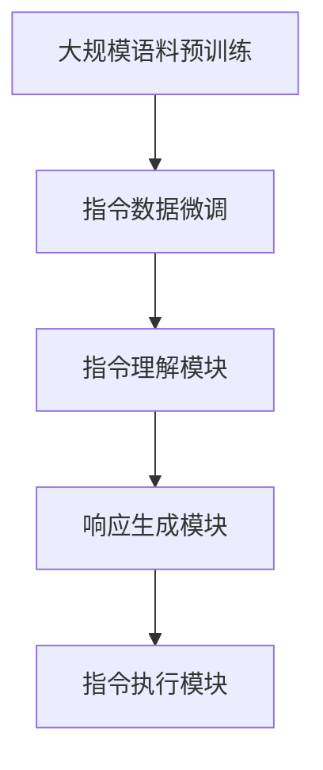

# InstructGPT原理与代码实例讲解

## 1.背景介绍

### 1.1 人工智能的发展历程

人工智能(Artificial Intelligence, AI)是当代科技领域最具革命性和颠覆性的技术之一。自20世纪50年代AI概念被正式提出以来,经历了多个发展阶段,从早期的专家系统、机器学习,到近年来的深度学习和大规模预训练语言模型的兴起。

### 1.2 大规模预训练语言模型的崛起

近年来,benefitting from大量数据和算力的支持,大规模预训练语言模型取得了突破性进展,在自然语言处理、问答系统、文本生成等任务上展现出了强大的能力。代表性模型包括GPT(Generative Pre-trained Transformer)、BERT(Bidirectional Encoder Representations from Transformers)、XLNet等。

### 1.3 InstructGPT的重要意义

InstructGPT是一种新型的大规模预训练语言模型,旨在更好地理解和执行人类的自然语言指令。相比传统的语言模型,InstructGPT在训练过程中引入了大量的指令数据,使其能够更好地捕捉指令的语义,并生成符合预期的响应。InstructGPT的出现为人机交互、任务执行等领域带来了新的可能性。

## 2.核心概念与联系

### 2.1 自然语言处理(NLP)

自然语言处理是人工智能的一个重要分支,旨在使计算机能够理解和生成人类语言。它涉及多个子领域,包括词法分析、句法分析、语义分析、语音识别、机器翻译等。

### 2.2 语言模型(Language Model)

语言模型是自然语言处理中的一个核心概念,它通过学习大量文本数据,捕捉语言的统计规律,从而能够预测下一个词或句子的可能性。传统的语言模型通常基于N-gram或神经网络等方法。

### 2.3 预训练与微调(Pre-training and Fine-tuning)

预训练是指在大规模无标注数据上训练语言模型,捕捉通用的语言知识。微调则是在特定任务数据上进一步调整模型参数,使其适应具体的应用场景。这种预训练+微调的范式大大提高了模型的性能和泛化能力。

### 2.4 Transformer架构

Transformer是一种全新的基于注意力机制的神经网络架构,被广泛应用于序列到序列的建模任务,如机器翻译、语言模型等。它不依赖于循环或卷积结构,能够更好地捕捉长距离依赖关系,并支持高效的并行计算。

### 2.5 指令跟踪(Instruction Following)

指令跟踪是指根据给定的自然语言指令执行相应的任务或操作。这对于人机交互、任务规划和自动化等领域具有重要意义。传统的语言模型往往难以很好地理解和执行复杂的指令。

## 3.核心算法原理具体操作步骤

InstructGPT的核心算法原理可以概括为以下几个关键步骤:



### 3.1 大规模语料预训练

首先,InstructGPT在大规模无标注语料(如网页数据、书籍等)上进行预训练,以捕捉通用的语言知识和模式。这一步通常采用Transformer解码器结构,并使用掩码语言模型(Masked Language Model)等目标函数进行训练。

### 3.2 指令数据微调

在预训练的基础上,InstructGPT使用包含大量指令数据的数据集(如网络上的任务描述、操作指南等)进行进一步的微调训练。这一步的目的是使模型能够更好地理解和捕捉指令的语义信息。

在微调过程中,常采用以下策略:

1. **数据增强**: 通过对指令数据进行变换(如同义词替换、语序改变等)来增强数据多样性,提高模型的泛化能力。

2. **多任务学习**: 在训练时同时优化多个相关任务(如指令理解、响应生成等),以捕捉不同任务之间的共享知识。

3. **反馈训练**: 根据模型生成的响应,人工标注其质量并反馈到模型中,进行迭代式的训练。

### 3.3 指令理解模块

指令理解模块的目标是从给定的自然语言指令中准确理解其语义,包括任务目标、约束条件、上下文信息等。这一模块通常采用序列标注或问答等方法来实现。

### 3.4 响应生成模块

根据理解后的指令语义,响应生成模块需要生成符合预期的自然语言响应。这可以看作是一个条件语言生成任务,常采用Transformer解码器结构,结合注意力机制和上下文信息进行生成。

### 3.5 指令执行模块

对于某些需要执行具体操作的指令(如编程、数据分析等),InstructGPT还包括一个指令执行模块。该模块将自然语言指令转换为可执行的形式(如代码、命令等),并与外部系统交互执行相应的操作。

## 4.数学模型和公式详细讲解举例说明

### 4.1 Transformer架构

Transformer是InstructGPT等大规模预训练语言模型的核心架构,其数学原理基于自注意力(Self-Attention)机制。给定一个长度为n的序列$X = (x_1, x_2, ..., x_n)$,自注意力机制计算每个位置$i$的表示$y_i$如下:

$$y_i = \sum_{j=1}^{n}\alpha_{ij}(x_jW^V)$$

其中,$\alpha_{ij}$是注意力权重,表示位置$i$对位置$j$的注意力程度,$W^V$是可学习的值矩阵。注意力权重$\alpha_{ij}$由位置$i$和$j$的查询(Query)向量$q_i$和键(Key)向量$k_j$计算得到:

$$\alpha_{ij} = \mathrm{softmax}(\frac{q_i k_j^T}{\sqrt{d_k}})$$

这里,$d_k$是缩放因子,用于防止较深层次的值过大导致梯度消失。通过多头注意力(Multi-Head Attention)机制,模型可以同时关注序列的不同位置关系。

### 4.2 掩码语言模型(Masked Language Model)

掩码语言模型是预训练语言模型的一种常用目标函数,其思想是在输入序列中随机掩码部分词元,然后让模型基于上下文预测被掩码的词元。给定一个长度为n的序列$X = (x_1, x_2, ..., x_n)$,其中$x_m$被掩码,模型需要最大化如下条件概率:

$$\log P(x_m|X\backslash x_m;\theta)$$

其中,$\theta$是模型参数,$X\backslash x_m$表示除$x_m$之外的序列。这种方式可以使模型学习双向语境信息,并捕捉词元之间的长距离依赖关系。

## 5.项目实践:代码实例和详细解释说明

以下是一个使用Python和Hugging Face Transformers库实现InstructGPT的简单示例:

```python
from transformers import AutoTokenizer, AutoModelForCausalLM

# 加载预训练模型和分词器
tokenizer = AutoTokenizer.from_pretrained("microsoft/InstructGPT-davinci-001")
model = AutoModelForCausalLM.from_pretrained("microsoft/InstructGPT-davinci-001")

# 定义指令
instruction = "请为一个新的社交媒体应用程序撰写一份功能需求文档,包括以下几个部分:1.背景介绍 2.核心功能 3.用户体验设计 4.技术架构 5.发展路线图"

# 对指令进行编码
input_ids = tokenizer(instruction, return_tensors="pt").input_ids

# 生成响应
output_ids = model.generate(input_ids, max_length=1024, do_sample=True, top_k=50, top_p=0.95, num_return_sequences=1)

# 解码响应
response = tokenizer.decode(output_ids[0], skip_special_tokens=True)

print(response)
```

上述代码加载了微软开源的InstructGPT-davinci-001模型,并提供了一个简单的指令示例。以下是对关键步骤的解释:

1. **加载预训练模型和分词器**:使用Hugging Face的`AutoTokenizer`和`AutoModelForCausalLM`类加载预训练的InstructGPT模型和相应的分词器。

2. **定义指令**:定义一个自然语言指令字符串,描述需要执行的任务。

3. **对指令进行编码**:使用分词器将指令字符串编码为模型可接受的输入张量`input_ids`。

4. **生成响应**:调用模型的`generate`方法,输入`input_ids`,并设置相关参数(如最大长度、采样策略等),生成响应序列。这里使用了top-k和nucleus采样策略,以提高响应的多样性。

5. **解码响应**:使用分词器将生成的输出序列`output_ids`解码为自然语言文本。

运行上述代码,模型将根据给定的指令生成一份社交媒体应用程序的功能需求文档。需要注意的是,这只是一个简单的示例,在实际应用中可能需要进一步的优化和调整。

## 6.实际应用场景

InstructGPT及其相关技术在多个领域具有广泛的应用前景:

### 6.1 智能助手

InstructGPT可以作为一种智能助手,根据用户的自然语言指令执行各种任务,如信息查询、内容创作、任务规划等。相比传统的命令式交互,InstructGPT提供了更自然、更富表现力的交互方式。

### 6.2 自动化系统

在企业和工业领域,InstructGPT可用于构建自动化系统,根据人类的指令执行各种操作,如数据处理、报告生成、流程控制等,从而提高效率、降低人工成本。

### 6.3 教育和培训

InstructGPT可用于智能教育系统的构建,根据学生的需求提供个性化的学习资源和指导。同时,它也可以作为一种培训辅助工具,帮助员工掌握新技能和知识。

### 6.4 创作辅助

InstructGPT在内容创作领域也有潜在应用,可以根据用户的指令生成文本内容,如新闻报道、故事情节、广告文案等,为创作者提供灵感和素材。

### 6.5 可编程系统

将InstructGPT与其他系统(如编程环境、数据库等)集成,可以构建出可编程的智能系统。用户可以通过自然语言指令操作这些系统,实现更高效、更人性化的交互方式。

## 7.工具和资源推荐

以下是一些与InstructGPT相关的有用工具和资源:

- **Hugging Face Transformers**:一个流行的自然语言处理库,提供了多种预训练语言模型(包括InstructGPT)的接口和工具。
- **OpenAI API**:OpenAI提供了一系列基于GPT架构的语言模型API,包括InstructGPT等。
- **Anthropic**:一家专注于构建安全和可控的人工智能系统的公司,开发了InstructGPT等相关技术。
- **InstructGPT示例库**:一些开源的InstructGPT示例项目和应用程序,可供学习和参考。
- **InstructGPT论文和技术报告**:描述InstructGPT原理和实现细节的学术论文和技术报告。
- **InstructGPT社区和论坛**:一些专门讨论InstructGPT及其应用的在线社区和论坛。

## 8.总结:未来发展趋势与挑战

### 8.1 更强大的语言理解能力

未来,InstructGPT及其相关技术将继续提升对自然语言的理解能力,包括更好地捕捉语义、上下文和逻辑关系,以及处理更复杂、更抽象的指令。

### 8.2 多模态交互

除了文本,InstructGPT有望与视觉、语音等其他模态相结合,实现多模态的人机交互,使交互更加自然和高效。

### 8.3 可解释性和可控性

提高InstructGPT的可解释性和可控性是一个重要的发展方向,确保模型的决策和行