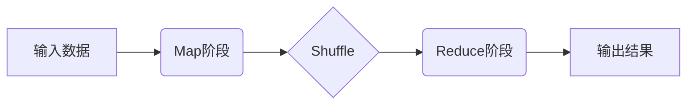
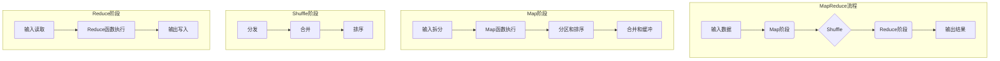

# MapReduce原理与代码实例讲解

## 1.背景介绍

### 1.1 大数据时代的到来

随着互联网、物联网、社交网络等新兴技术的快速发展,数据量呈现出爆炸式增长。传统的数据处理方式已经无法满足大数据时代的需求。大数据时代对数据处理能力提出了更高的要求,需要一种全新的计算模型来应对日益增长的数据量和复杂的计算需求。

### 1.2 Google的MapReduce解决方案

为了解决海量数据处理的挑战,Google于2004年提出了MapReduce编程模型。MapReduce是一种分布式计算模型,它将大规模数据处理任务分解为多个小任务,并行运行在大规模计算机集群上,最终汇总这些小任务的结果。这种计算模型具有高度的可扩展性、容错性和高效性,非常适合处理大规模数据集。

### 1.3 MapReduce的影响

MapReduce的出现彻底改变了大数据处理的范式,成为分布式计算的事实标准。它的简单编程模型和强大的数据处理能力,使得开发者能够更加轻松地处理海量数据。MapReduce技术被广泛应用于搜索引擎、推荐系统、数据挖掘、机器学习等诸多领域,极大地推动了大数据技术的发展。

## 2.核心概念与联系

### 2.1 MapReduce编程模型

MapReduce编程模型由两个主要阶段组成:Map阶段和Reduce阶段。

1. **Map阶段**:输入数据被拆分为多个小数据块,并行地传递给多个Map任务进行处理。每个Map任务会对输入的数据块进行转换处理,生成中间结果。

2. **Reduce阶段**:Map阶段产生的中间结果会根据Key进行分组,然后传递给对应的Reduce任务。Reduce任务会对相同Key的一组值进行合并操作,最终生成最终结果。



### 2.2 键值对

在MapReduce中,数据被表示为键值对(Key-Value Pair)的形式。Map函数接收输入的键值对,并生成一组新的键值对作为中间结果。Reduce函数接收中间结果中的键值对,对具有相同键的值进行聚合操作。

### 2.3 分布式计算

MapReduce利用了分布式计算的思想,将计算任务分解为多个小任务,并行运行在计算机集群上。这种方式可以充分利用集群的计算资源,大幅提高数据处理的效率和吞吐量。

### 2.4 容错机制

MapReduce具有良好的容错机制,可以自动检测和处理计算节点的故障。如果某个节点发生故障,MapReduce会自动将该节点的任务重新调度到其他节点上执行,从而保证计算任务的完成。

## 3.核心算法原理具体操作步骤

MapReduce的核心算法原理可以分为以下几个步骤:

### 3.1 输入数据拆分

MapReduce首先将输入数据拆分为多个数据块(通常为64MB或128MB),这些数据块被存储在分布式文件系统(如HDFS)中。

### 3.2 Map阶段

1. **输入拆分**:MapReduce会为每个输入数据块创建一个Map任务。

2. **Map函数执行**:每个Map任务会并行地读取对应的输入数据块,并对数据执行Map函数。Map函数会将输入的键值对转换为一组新的键值对,作为中间结果输出。

3. **分区和排序**:Map阶段产生的中间结果会根据分区函数进行分区,并按照键进行排序。

4. **合并和缓冲**:对于同一个分区内的数据,MapReduce会对它们进行合并和缓冲,形成一个分区文件。

### 3.3 Shuffle阶段

Shuffle阶段负责将Map阶段产生的中间结果传输到对应的Reduce任务上。具体步骤如下:

1. **分发**:将Map阶段产生的分区文件分发到对应的Reduce任务所在的节点上。

2. **合并**:在每个Reduce节点上,MapReduce会将属于同一个Reduce任务的所有分区文件进行合并,形成一个大文件。

3. **排序**:对合并后的大文件进行排序,以便Reduce任务可以高效地处理。

### 3.4 Reduce阶段

1. **输入读取**:Reduce任务会读取Shuffle阶段合并并排序后的大文件。

2. **Reduce函数执行**:对于具有相同键的一组值,Reduce任务会执行Reduce函数,将这些值合并为一个较小的值集合。

3. **输出写入**:Reduce任务会将最终的结果写入到输出文件中,通常存储在分布式文件系统中。



## 4.数学模型和公式详细讲解举例说明

在MapReduce中,常见的数学模型和公式包括:

### 4.1 数据分区

MapReduce使用分区函数将中间结果划分到不同的分区中,以便在Reduce阶段进行并行处理。常用的分区函数是哈希分区函数:

$$
partition(key) = (hash(key) \& Integer.MAX\_VALUE) \% numPartitions
$$

其中,`hash(key)`是对键进行哈希运算,`numPartitions`是分区的总数量。这个函数可以保证相同的键被分配到同一个分区中。

### 4.2 数据排序

在Map阶段和Reduce阶段,中间结果都需要进行排序操作。常用的排序算法是快速排序算法,其时间复杂度为$O(n\log n)$。

### 4.3 数据聚合

在Reduce阶段,需要对具有相同键的一组值进行聚合操作。常见的聚合操作包括求和、求平均值、求最大/最小值等。例如,对于求和操作,可以使用以下公式:

$$
sum = \sum_{i=1}^{n} x_i
$$

其中,$x_i$表示第$i$个值,求和结果为$sum$。

### 4.4 向量空间模型

在文本挖掘和信息检索领域,常使用向量空间模型(Vector Space Model)来表示文档和查询。假设有$m$个文档和$n$个不同的词项,每个文档可以表示为一个$n$维向量:

$$
\vec{d_j} = (w_{1j}, w_{2j}, \cdots, w_{nj})
$$

其中,$w_{ij}$表示第$i$个词项在第$j$个文档中的权重。常用的权重计算公式是TF-IDF(Term Frequency-Inverse Document Frequency):

$$
w_{ij} = tf_{ij} \times \log\left(\frac{N}{df_i}\right)
$$

- $tf_{ij}$表示第$i$个词项在第$j$个文档中出现的频率
- $df_i$表示第$i$个词项出现在文档集合中的文档数量
- $N$表示文档总数量

通过MapReduce,可以高效地计算每个词项的TF-IDF权重,从而构建向量空间模型。

## 5.项目实践:代码实例和详细解释说明

为了更好地理解MapReduce的原理和使用方法,我们来看一个实际的代码示例。这个示例使用Python实现了一个简单的WordCount程序,用于统计文本文件中每个单词出现的次数。

### 5.1 MapReduce框架

我们首先需要定义一个MapReduce框架,提供`map`和`reduce`函数的执行环境。

```python
import collections

class MapReduce:
    def __init__(self):
        self.data = collections.defaultdict(list)

    def map(self, key, value):
        raise NotImplementedError

    def reduce(self, key, values):
        raise NotImplementedError

    def run(self, inputs):
        # Map阶段
        for input_key, input_value in inputs:
            yield self.map(input_key, input_value)

        # Reduce阶段
        for key, values in self.data.items():
            yield key, self.reduce(key, values)

    def emit(self, key, value):
        self.data[key].append(value)
```

这个`MapReduce`类提供了一个通用的框架,用户需要实现`map`和`reduce`函数来完成具体的计算任务。`run`方法执行MapReduce流程,`emit`方法用于在Map阶段输出中间结果。

### 5.2 WordCount示例

现在,我们来实现WordCount程序。首先定义`WordCount`类,继承自`MapReduce`类:

```python
class WordCount(MapReduce):
    def map(self, key, value):
        for word in value.split():
            self.emit(word, 1)

    def reduce(self, key, values):
        return sum(values)
```

在Map函数中,我们将文本按空格拆分为单词,并为每个单词输出键值对`(word, 1)`。在Reduce函数中,我们对具有相同键的值进行求和,得到每个单词出现的总次数。

接下来,我们可以运行WordCount程序:

```python
inputs = [
    (1, "Hello World"),
    (2, "Hello Python"),
    (3, "Hello MapReduce"),
]

word_count = WordCount()
results = word_count.run(inputs)

for key, value in results:
    print(f"{key}: {value}")
```

输出结果:

```
Hello: 3
World: 1
Python: 1
MapReduce: 1
```

可以看到,程序成功统计了每个单词出现的次数。

### 5.3 代码解释

1. `MapReduce`类提供了一个通用的框架,用户需要实现`map`和`reduce`函数来完成具体的计算任务。

2. `map`函数接收一个键值对作为输入,对输入数据进行转换处理,并通过`emit`方法输出中间结果。在WordCount示例中,Map函数将文本拆分为单词,并为每个单词输出键值对`(word, 1)`。

3. `reduce`函数接收一个键和一组相关的值,对这些值进行聚合操作。在WordCount示例中,Reduce函数对具有相同键的值进行求和,得到每个单词出现的总次数。

4. `run`方法执行MapReduce流程,首先调用`map`函数进行Map阶段,然后根据键对中间结果进行分组,最后调用`reduce`函数进行Reduce阶段。

5. `emit`方法用于在Map阶段输出中间结果,将键值对存储在`data`字典中。

通过这个简单的示例,我们可以清楚地看到MapReduce编程模型的基本思路和实现方式。在实际应用中,MapReduce通常运行在分布式计算集群上,以提高计算效率和容错性。

## 6.实际应用场景

MapReduce编程模型具有广泛的应用场景,尤其在大数据处理领域发挥着重要作用。以下是一些典型的应用场景:

### 6.1 网页链接分析

搜索引擎使用MapReduce来分析网页之间的链接关系,计算每个网页的PageRank值,从而确定网页的重要性和排名。在Map阶段,每个Map任务处理一个网页,输出该网页指向的所有链接;在Reduce阶段,对于每个链接,计算其被引用的次数,并根据PageRank算法更新网页的排名值。

### 6.2 日志分析

许多互联网公司使用MapReduce来分析海量的日志数据,例如Web服务器日志、应用程序日志等。在Map阶段,每个Map任务处理一个日志文件,提取出需要分析的字段;在Reduce阶段,对提取的字段进行聚合和统计,生成报告和可视化结果。

### 6.3 机器学习

MapReduce也被广泛应用于机器学习领域,用于处理大规模数据集和训练模型。例如,在训