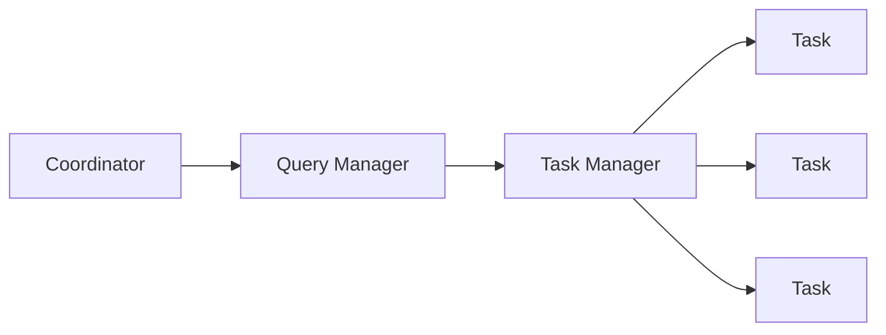

# Presto原理与代码实例讲解

## 1.背景介绍

在当今的大数据时代,数据分析和查询已经成为企业和组织的关键任务。传统的数据库系统在处理大规模数据集时往往会遇到性能瓶颈,无法满足实时查询和分析的需求。为了解决这个问题,Facebook于2012年开源了Presto,一款分布式SQL查询引擎,旨在提供快速、可扩展的大数据分析能力。

Presto的核心目标是能够在较短的时间内对存储在不同数据源(如Hadoop分布式文件系统HDFS、Amazon S3等)中的大规模数据集进行交互式分析。它采用了全新的架构设计,摒弃了传统数据库的磁盘存储和索引机制,而是将数据直接映射到内存中进行处理,从而大幅提升了查询性能。

自从推出以来,Presto已被众多知名公司和组织广泛采用,包括Netflix、Airbnb、Uber、Twitter等。它已成为处理大数据分析的重要工具之一。

## 2.核心概念与联系

### 2.1 Presto架构概述

Presto采用主从(Master-Worker)架构,由以下几个核心组件组成:



- **Coordinator**: 接收客户端的查询请求,负责查询的解析、优化、调度和管理。
- **Query Manager**: 负责查询的执行计划和任务划分。
- **Task Manager**: 管理和调度任务的执行。
- **Task**: 实际执行查询计划中的一个或多个阶段(Stage)。

### 2.2 查询执行流程

1. 客户端提交SQL查询请求到Coordinator。
2. Coordinator对SQL查询进行解析和优化,生成分布式执行计划。
3. Coordinator将执行计划分解为多个任务(Task),并将任务分发给各个Worker节点上的Task Manager。
4. Task Manager在Worker节点上启动Task,并执行相应的查询阶段。
5. Task从数据源(如HDFS)读取数据,并在内存中进行处理和计算。
6. 最终结果通过Worker节点传递回Coordinator,并返回给客户端。

### 2.3 核心特性

- **内存计算**:Presto将数据直接映射到内存中进行处理,避免了传统数据库的磁盘I/O开销。
- **列式存储**:Presto采用列式存储格式(如ORC、Parquet),提高了数据扫描和解压缩的效率。
- **代码生成**:Presto使用代码生成技术动态生成查询执行代码,提高了CPU效率。
- **向量化执行**:Presto对数据进行批量处理,充分利用现代CPU的SIMD指令集,提升了处理性能。
- **成本优化**:Presto的查询优化器会根据数据统计信息选择最优的执行计划。

## 3.核心算法原理具体操作步骤

### 3.1 SQL查询解析

Presto使用ANTLR作为SQL解析器,将SQL查询语句解析为抽象语法树(AST)。解析过程遵循以下步骤:

1. **词法分析**:将SQL查询字符串分解为一系列标记(Token)。
2. **语法分析**:根据SQL语法规则,将标记序列构建成抽象语法树。
3. **语义分析**:对AST进行类型检查、名称解析等语义验证。

### 3.2 查询优化

Presto的查询优化器会对AST进行一系列优化转换,以生成更高效的执行计划。主要优化步骤包括:

1. **逻辑优化**:如投影剪裁(Projection Pruning)、谓词下推(Predicate Pushdown)等,减少不必要的计算。
2. **代价优化**:根据数据统计信息估算每个执行计划的代价,选择代价最小的计划。
3. **物理优化**:如连接重排序(Join Reordering)、分区剪裁(Partition Pruning)等,优化物理执行计划。

### 3.3 执行计划生成

优化后的AST将被转换为分布式执行计划,包括以下步骤:

1. **Stage划分**:将查询拆分为多个Stage,每个Stage对应一个或多个Task。
2. **Task生成**:为每个Stage生成相应的Task,并分配到不同的Worker节点上执行。
3. **数据交换**:确定Stage之间的数据交换方式,如Hash重分区(Hash Repartition)、广播Join等。

### 3.4 Task执行

Task是Presto执行计划中最小的执行单元,其执行过程如下:

1. **数据读取**:从数据源(如HDFS)读取所需的数据块。
2. **代码生成**:根据Task的操作符生成高度优化的执行代码。
3. **内存处理**:将数据加载到内存中,并执行相应的计算操作。
4. **结果传输**:将计算结果传输给下一个Stage或返回给Coordinator。

## 4.数学模型和公式详细讲解举例说明

在查询优化过程中,Presto会根据数据统计信息估算不同执行计划的代价,并选择代价最小的计划。这里介绍两个常用的代价模型。

### 4.1 基于行的代价模型

基于行的代价模型假设每个操作符的代价与输入行数成正比。对于操作符$op$,其代价$cost(op)$可表示为:

$$cost(op) = rows(op) \times cpu\_cost(op) + rows(op) \times network\_cost(op)$$

其中:

- $rows(op)$表示操作符$op$的输出行数。
- $cpu\_cost(op)$表示操作符$op$的CPU代价,与操作符类型和输入行大小有关。
- $network\_cost(op)$表示操作符$op$的网络传输代价,与输出行大小和目标节点数量有关。

对于连接操作符$join$,其代价可进一步细化为:

$$cost(join) = build\_rows(join) \times cpu\_cost(build) + probe\_rows(join) \times (cpu\_cost(probe) + network\_cost(probe))$$

其中:

- $build\_rows(join)$表示构建连接哈希表的行数。
- $probe\_rows(join)$表示探测连接哈希表的行数。

### 4.2 基于字节的代价模型

基于字节的代价模型考虑了操作符的输入和输出数据大小,更适用于处理大规模数据集的场景。对于操作符$op$,其代价$cost(op)$可表示为:

$$cost(op) = input\_bytes(op) \times cpu\_cost(op) + output\_bytes(op) \times network\_cost(op)$$

其中:

- $input\_bytes(op)$表示操作符$op$的输入数据大小(字节数)。
- $output\_bytes(op)$表示操作符$op$的输出数据大小(字节数)。
- $cpu\_cost(op)$和$network\_cost(op)$分别表示操作符的CPU代价和网络传输代价,与操作符类型和数据大小有关。

对于扫描操作符$scan$,其代价$cost(scan)$可进一步细化为:

$$cost(scan) = input\_bytes(scan) \times (cpu\_cost(scan) + read\_cost(scan))$$

其中$read\_cost(scan)$表示从存储介质(如HDFS)读取数据的代价,与存储格式和压缩算法有关。

通过上述代价模型,Presto可以估算出不同执行计划的代价,并选择代价最小的计划执行查询。

## 5.项目实践:代码实例和详细解释说明

以下是一个简单的Presto查询示例,演示了如何从Hive表中查询数据并进行聚合计算。

### 5.1 创建Hive表

首先,我们需要在Hive中创建一个测试表`orders`。SQL语句如下:

```sql
CREATE TABLE orders (
  order_id BIGINT,
  customer_id BIGINT,
  order_date DATE,
  total_amount DOUBLE
)
ROW FORMAT DELIMITED
FIELDS TERMINATED BY ','
STORED AS TEXTFILE;
```

### 5.2 连接Presto并执行查询

接下来,我们使用Presto的命令行客户端连接到Presto集群,并执行SQL查询。

```sql
-- 连接Presto集群
presto>

-- 查看可用的Hive schema
presto> SHOW SCHEMAS FROM hive;

-- 使用指定的Hive schema
presto> USE hive.default;

-- 查看orders表的schema
presto> DESCRIBE orders;

-- 查询订单总金额
presto> SELECT sum(total_amount) AS total_sales
         FROM orders;

-- 按客户ID分组,计算每个客户的订单总金额
presto> SELECT customer_id, sum(total_amount) AS customer_sales
         FROM orders
         GROUP BY customer_id
         ORDER BY customer_sales DESC
         LIMIT 10;
```

上述查询演示了如何从Hive表中读取数据,并使用Presto进行聚合计算和排序等操作。

### 5.3 查询执行计划

我们可以使用`EXPLAIN`语句查看Presto的查询执行计划:

```sql
presto> EXPLAIN SELECT customer_id, sum(total_amount) AS customer_sales
                FROM orders
                GROUP BY customer_id
                ORDER BY customer_sales DESC
                LIMIT 10;
```

Presto将输出查询的分布式执行计划,包括各个Stage的操作符、数据交换方式等详细信息。

```
Fragment 0 [SINGLE]
Output layout: [customer_id, sum]
Output partitioning: SINGLE []
Stage Execution Strategy: UNGROUPED_EXECUTION

Fragment 1 [SOURCE]
Output layout: [customer_id, sum]
Output partitioning: HASH [customer_id]
Stage Execution Strategy: UNGROUPED_EXECUTION

Fragment 2 [HASH_DISTRIBUTION]
Output layout: [customer_id, total_amount]
Output partitioning: HASH [customer_id]
Stage Execution Strategy: UNGROUPED_EXECUTION

Fragment 3 [SOURCE]
Output layout: [order_id, customer_id, order_date, total_amount]
Output partitioning: BROADCAST []
Stage Execution Strategy: UNGROUPED_EXECUTION
...
```

通过分析执行计划,我们可以了解查询的执行过程,并优化查询性能。

## 6.实际应用场景

Presto广泛应用于以下场景:

1. **交互式数据分析**:Presto可以快速响应ad-hoc查询,支持对大规模数据集进行实时探索和分析。
2. **数据湖分析**:Presto可以直接查询存储在HDFS、S3等数据湖中的结构化和半结构化数据。
3. **数据仓库加速**:Presto可以作为现有数据仓库(如Hive)的加速引擎,提高分析查询的性能。
4. **ETL预处理**:Presto可用于对原始数据进行预处理和转换,为后续的ETL流程做准备。
5. **监控和报表**:Presto可以生成实时的监控报表,帮助企业及时发现异常并做出决策。

## 7.工具和资源推荐

以下是一些有用的Presto工具和资源:

- **Presto Web UI**:Presto自带的Web界面,可用于监控查询执行情况、查看集群状态等。
- **Presto CLI**:Presto命令行客户端,用于执行SQL查询和管理操作。
- **Presto JDBC驱动**:允许其他应用程序通过JDBC连接Presto并执行SQL查询。
- **Presto官方文档**:https://prestodb.io/docs/current/
- **Presto源代码**:https://github.com/prestodb/presto
- **Presto Slack社区**:https://prestodb.slack.com/

## 8.总结:未来发展趋势与挑战

Presto作为一款开源的分布式SQL查询引擎,在大数据分析领域发挥着重要作用。未来,Presto的发展趋势和面临的挑战包括:

1. **性能优化**:持续优化查询执行引擎,提高CPU和内存利用率,缩短查询响应时间。
2. **高可用性**:增强Presto集群的容错能力和自动恢复机制,提高系统的可靠性。
3. **安全性增强**:加强对数据访问控制、身份验证和审计的支持,满足企业级安全需求。
4. **云原生支持**:更好地与Kubernetes等云原生技术栈集成,实现弹性伸缩和自动化部署。
5. **新数据源支持**:扩展对更多数据源(如NoSQL数据库、消息队列等)的查询能力。
6. **机器学习集成**:将机器学习算法与Presto查询引擎相结合,支持更复杂的数据分析场景。

总的来说,Presto将继续致力于提供高性能、可扩展的大数据分析能力,满足企业日益增长的实时数据处理需求。

## 9.附