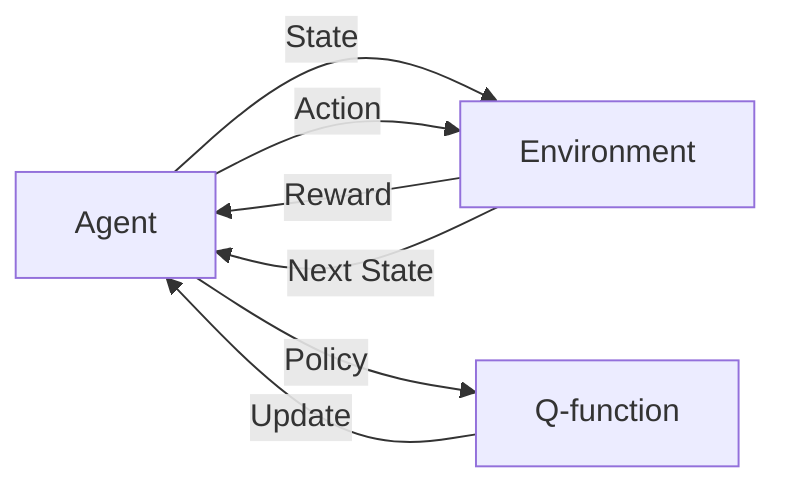

# Q-Learning算法实现：Python代码实战

## 1. 背景介绍
### 1.1 强化学习概述
强化学习(Reinforcement Learning, RL)是机器学习的一个重要分支,它研究如何让智能体(Agent)在与环境的交互过程中学习最优策略,以获得最大的累积奖励。与监督学习和非监督学习不同,强化学习不需要预先准备好训练数据,而是通过不断地试错和探索来学习。

### 1.2 Q-Learning算法简介
Q-Learning是强化学习中一种非常经典和有效的无模型(model-free)算法,由Watkins在1989年首次提出。它通过学习动作-状态值函数Q(s,a)来寻找最优策略。Q值表示在状态s下采取动作a可以获得的长期累积奖励的期望。Q-Learning的核心思想是通过不断更新Q值来逼近最优Q函数,进而得到最优策略。

### 1.3 Q-Learning的优势
- 简单易实现:Q-Learning算法流程清晰,代码实现相对简单。
- 通用性强:适用于离散状态和动作空间的各类问题。
- 理论保证:在一定条件下,Q-Learning算法可以收敛到最优策略。
- 样本效率高:通过经验回放等机制,可以提高样本利用效率。

## 2. 核心概念与联系
### 2.1 智能体(Agent)与环境(Environment)
智能体是强化学习的主体,可以感知环境状态,并根据策略选择动作与环境交互,获得即时奖励,目标是获得最大的累积奖励。环境与智能体交互,给出下一个状态和即时奖励。

### 2.2 状态(State)、动作(Action)和奖励(Reward)
- 状态:表示智能体所处的环境状况,是智能体感知的环境信息的抽象表示。
- 动作:智能体根据某种策略在特定状态下采取的行为决策。
- 奖励:环境对智能体采取特定动作的即时反馈,引导智能体学习最优策略。

### 2.3 策略(Policy)和Q函数
- 策略:是将状态映射到动作的函数,表示智能体的行为决策方式。
- Q函数:评估在某状态下采取某动作的长期累积奖励期望,是策略学习的核心。

它们之间的关系可以用下面的Mermaid流程图表示:



## 3. 核心算法原理具体操作步骤
Q-Learning算法的核心是通过不断更新Q表来逼近最优Q函数,具体步骤如下:

1. 初始化Q表,可以为全0数组。
2. 循环若干轮次(episode):
   1. 初始化环境,获得初始状态s。
   2. 循环若干步(step):
      1. 根据ε-greedy策略,以ε的概率随机选择动作,否则选择Q值最大的动作。
      2. 执行动作a,获得即时奖励r和下一状态s'。
      3. 根据Q-Learning的更新公式更新Q(s,a):
         $Q(s,a) \leftarrow Q(s,a) + \alpha[r + \gamma \max_{a'}Q(s',a') - Q(s,a)]$
      4. 将当前状态s更新为下一状态s'。
   3. 一个episode结束,环境重置。
3. 多轮次训练结束,得到最终的Q表,可以用来指导智能体的决策。

其中,α是学习率,γ是折扣因子。ε-greedy策略在探索和利用之间权衡,以一定概率随机探索,鼓励智能体尝试新的动作。

## 4. 数学模型和公式详细讲解举例说明
Q-Learning的核心是Q函数更新公式:

$$Q(s,a) \leftarrow Q(s,a) + \alpha[r + \gamma \max_{a'}Q(s',a') - Q(s,a)]$$

其中:
- $Q(s,a)$:在状态s下采取动作a的Q值。
- $\alpha$:学习率,控制Q值更新的步长,取值范围[0,1]。较大的α会加快学习速度但可能不稳定。
- $r$:采取动作a后获得的即时奖励。
- $\gamma$:折扣因子,取值范围[0,1],表示未来奖励的重要程度。γ越大,考虑的未来步数越多。
- $\max_{a'}Q(s',a')$:下一状态s'下所有可能动作a'的Q值的最大值,代表下一状态的最优Q值。

举例说明:
假设一个机器人在迷宫中寻找宝藏,状态空间为迷宫中的位置,动作空间为{上,下,左,右},奖励为找到宝藏给+10,其他为0。
- 当前状态s为(1,2),采取向右的动作a,获得奖励r=0,下一状态为s'=(1,3)。
- 假设Q表当前值如下:

|   | 上  | 下  | 左  | 右  |
|---|---|---|---|---|
|(1,2)| 0.5| 0.2|-0.1| 0.8|
|(1,3)| 0.1|-0.2| 0.3| 0.6|

则根据更新公式,假设α=0.1,γ=0.9:

$$
\begin{aligned}
Q((1,2),右) &\leftarrow Q((1,2),右) + 0.1[0 + 0.9 \max_{a'}Q((1,3),a') - Q((1,2),右)]\\
&= 0.8 + 0.1[0 + 0.9 \times 0.6 - 0.8] \\
&= 0.8 + 0.1 \times (-0.26) \\
&= 0.774
\end{aligned}
$$

即Q((1,2),右)的值从0.8更新为0.774。不断重复这一过程,最终Q表会收敛到最优值。

## 5. 项目实践：代码实例和详细解释说明
下面是使用Python实现Q-Learning算法的简单示例代码:

```python
import numpy as np

class QLearning:
    def __init__(self, state_dim, action_dim, learning_rate=0.01, gamma=0.9, epsilon=0.1):
        self.state_dim = state_dim  # 状态空间维度
        self.action_dim = action_dim  # 动作空间维度
        self.lr = learning_rate  # 学习率
        self.gamma = gamma  # 折扣因子
        self.epsilon = epsilon  # epsilon-greedy策略中的参数
        self.Q = np.zeros((state_dim, action_dim))  # Q表,初始化为全0数组

    def choose_action(self, state):
        '''根据epsilon-greedy策略选择动作'''
        if np.random.uniform(0, 1) < self.epsilon:
            action = np.random.choice(self.action_dim)  # 随机探索
        else:
            action = self.Q[state, :].argmax()  # 选择Q值最大的动作
        return action

    def update(self, state, action, reward, next_state, done):
        '''更新Q表'''
        Q_predict = self.Q[state, action]
        if done:
            Q_target = reward  # 终止状态
        else:
            Q_target = reward + self.gamma * self.Q[next_state, :].max()  # Q-Learning核心公式
        self.Q[state, action] += self.lr * (Q_target - Q_predict)  # 更新Q表

    def train(self, env, num_episodes=500):
        '''训练'''
        for episode in range(num_episodes):
            state = env.reset()  # 重置环境,获取初始状态
            done = False
            while not done:
                action = self.choose_action(state)
                next_state, reward, done, _ = env.step(action)
                self.update(state, action, reward, next_state, done)
                state = next_state
            if (episode+1) % 10 == 0:  # 每10轮打印一次
                print(f"Episode {episode+1}, Q table: \n{self.Q}")
```

代码解释:
- `__init__`方法初始化Q-Learning算法的相关参数,包括状态空间维度、动作空间维度、学习率、折扣因子、epsilon参数,以及初始化Q表。
- `choose_action`方法根据epsilon-greedy策略选择动作,以epsilon的概率随机探索,否则选择Q值最大的动作。
- `update`方法根据Q-Learning的核心公式更新Q表。如果是终止状态,Q目标值为即时奖励;否则Q目标值为即时奖励加上下一状态的最大Q值乘以折扣因子。然后根据学习率更新Q表。
- `train`方法训练Q-Learning算法。每一轮循环代表一个episode,在一个episode内,不断选择动作、执行动作、更新Q表,直到达到终止状态。每10轮打印一次Q表。

以上代码给出了Q-Learning算法的基本实现框架,可以根据具体问题进行适当修改和扩展。

## 6. 实际应用场景
Q-Learning算法在很多领域都有广泛应用,例如:
- 智能体寻路:机器人、自动驾驶汽车等在复杂环境中寻找最优路径。
- 游戏智能体:训练游戏AI,如Atari游戏、五子棋等。
- 推荐系统:根据用户反馈动态调整推荐策略,提高用户满意度。
- 智能交通:信号灯控制、路径规划等。
- 智能电网:优化电力调度,提高能源利用效率。
- 金融投资:股票、期货等量化交易策略优化。

总的来说,只要问题能够抽象为智能体与环境交互的过程,并且可以定义状态、动作、奖励,就可以尝试使用Q-Learning算法求解。

## 7. 工具和资源推荐
- OpenAI Gym:强化学习环境模拟器,提供了多种标准测试环境。
- TensorFlow、PyTorch:常用的深度学习框架,可以用于实现DQN等扩展算法。
- Keras-RL:基于Keras的强化学习库,提供了多种常用算法的实现。
- 《Reinforcement Learning:An Introduction》:由Richard S. Sutton和Andrew G. Barto编写,是强化学习领域的经典教材。
- David Silver的强化学习课程:DeepMind强化学习主要研究者David Silver在UCL开设的系列课程,对强化学习各个主题进行了深入浅出的讲解。

## 8. 总结：未来发展趋势与挑战
Q-Learning算法是强化学习领域的重要里程碑,为后续算法的发展奠定了基础。近年来,随着深度学习的发展,出现了一系列基于深度神经网络的Q-Learning扩展算法,如DQN、Double DQN、Dueling DQN等,极大地提升了Q-Learning算法的表示能力和稳定性,在更加复杂的问题上取得了突破性进展。

未来,Q-Learning算法还将在以下方面持续发展:
- 更高效的探索策略:如何在探索和利用之间取得更好的平衡,提高样本效率。
- 异步更新:多智能体并行训练,加速收敛。
- 连续动作空间:传统Q-Learning只适用于离散动作空间,如何扩展到连续动作空间是一个重要课题。
- 迁移学习:如何利用已有知识加速学习过程,实现跨任务迁移。
- 安全性和鲁棒性:在面对对抗攻击、环境扰动等情况下,如何保证算法的稳定性和可靠性。

总之,Q-Learning算法是强化学习的重要基石,在未来智能系统的构建中将继续发挥关键作用。

## 9. 附录：常见问题与解答
1. Q-Learning能否收敛到最优策略?
   在一定条件下,Q-Learning算法可以收敛到最优策略。主要条件包括:所有状态-动作对要反复无穷地被访问到;学习率满足一定条件(如$\sum \alpha_t=\infty,\sum \alpha_t^2<\infty$);以及探索策略满足一定条件(如$\epsilon-greedy$探索)。

2. Q-Learning能否应用于连续状态空间?
   传统Q-Learning算法主要针对离散状态空间,对于连续状态空间需要进行离散化处理,或者使用函数逼近的方法(如DQN)将Q函数映射到连续空间。

3. Q-Learning的探索策略有哪些?
   常见的探索策略包括:$\epsilon-greedy$探索,以$\epsilon$的概率随机选择动作;Boltzmann探索,根据Q值的指数函数计算动作的选择概率;以及UCB(Upper Confidence Bound)探索,根