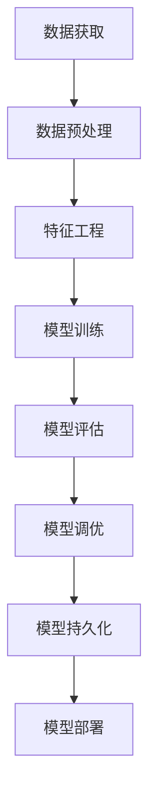

# Scikit-learn：Python机器学习库

## 1.背景介绍

在当今数据主导的时代，机器学习已经成为各行各业不可或缺的工具。Python作为一种流行的编程语言,拥有丰富的机器学习库和工具,其中Scikit-learn就是最受欢迎和使用最广泛的机器学习库之一。

Scikit-learn是一个基于Python语言的开源机器学习库,它提供了一系列高效的数据挖掘和数据分析工具,涵盖了分类、回归、聚类、降维、模型选择和预处理等多种机器学习算法。Scikit-learn的设计理念是简单高效,它基于NumPy、SciPy和matplotlib等数值计算和数据可视化库构建,可以与其他Python模块无缝集成。

自2007年首次发布以来,Scikit-learn凭借其易用性、可扩展性和高性能,已经成为Python机器学习生态系统中不可或缺的一部分,广泛应用于科学研究、商业智能和工业应用等领域。

## 2.核心概念与联系

### 2.1 机器学习概述

机器学习是一门研究如何从数据中自动分析获得模式的科学,其目标是让计算机能够自主学习和积累经验。根据学习的方式不同,机器学习可以分为监督学习、非监督学习和强化学习三大类。

- **监督学习(Supervised Learning)**:利用已知的输入数据和输出数据,训练模型学习它们之间的映射关系,以便对新的输入数据做出预测。常见算法包括线性回归、逻辑回归、决策树、支持向量机等。
- **非监督学习(Unsupervised Learning)**:只给定输入数据,算法需要自行发现数据内在的模式和规律。常见算法包括聚类分析、关联规则挖掘、降维等。
- **强化学习(Reinforcement Learning)**:智能体通过与环境的交互,不断尝试不同的行为策略,获得反馈奖励,从而学习获取最优策略。常见算法包括Q-Learning、深度Q网络等。

### 2.2 Scikit-learn核心组件

Scikit-learn库主要由以下几个核心组件构成:

- **估计器(Estimator)**:所有可被参数化以便估计一些统计量的对象。如回归器、分类器、聚类器等。
- **预测器(Predictor)**:提供预测功能的估计器,如回归器和分类器。
- **转换器(Transformer)**:转换输入数据的估计器,如标准化、编码等预处理步骤。
- **模型(Model)**:由学习算法从数据集中估计参数的对象。
- **元估计器(Meta-estimator)**:将多个估计器组合在一起形成复合估计器,如管道、特征联合等。

Scikit-learn库的API设计遵循了一致的编码风格和命名约定,使得各种算法的使用方式高度统一,大大降低了学习和使用的难度。

## 3.核心算法原理具体操作步骤

Scikit-learn库实现了大量经典和现代的机器学习算法,这些算法可以概括为以下几个步骤:



### 3.1 数据获取

机器学习算法需要大量的数据作为训练资料,因此获取高质量的数据是第一步。Scikit-learn本身不提供数据获取功能,但可以与Python其他库如Pandas等集成,从不同来源加载数据。

### 3.2 数据预处理

原始数据往往存在缺失值、异常值、噪声等问题,需要进行清洗和规范化处理。Scikit-learn提供了一系列预处理模块,如`Imputer`填充缺失值,`StandardScaler`标准化数据等。

### 3.3 特征工程

特征工程是机器学习的关键环节,旨在从原始数据中提取对学习任务更有意义的特征。Scikit-learn提供了多种特征提取和选择算法,如`PCA`主成分分析、`SelectFromModel`基于模型的特征选择等。

### 3.4 模型训练

选择合适的机器学习算法,并使用训练数据训练模型,得到模型参数的估计值。Scikit-learn实现了众多经典和新型算法,如`LinearRegression`线性回归、`RandomForestClassifier`随机森林分类等。

### 3.5 模型评估

使用测试数据评估模型的性能表现,常用的评估指标有准确率、精确率、召回率、F1分数等。Scikit-learn提供了`metrics`模块,封装了多种评估指标的计算方法。

### 3.6 模型调优

根据模型在测试数据上的表现,通过调整算法的超参数,优化模型的性能。Scikit-learn提供了`GridSearchCV`网格搜索和`RandomizedSearchCV`随机搜索等调优工具。

### 3.7 模型持久化

将训练好的模型保存到磁盘文件中,以便后续加载使用。Scikit-learn使用Python的`pickle`模块实现了模型的序列化和反序列化功能。

### 3.8 模型部署

将训练好的模型集成到实际的应用系统中,提供预测或决策服务。Scikit-learn本身不提供部署功能,但可与其他框架如Flask等集成。

## 4.数学模型和公式详细讲解举例说明

机器学习算法背后都有严谨的数学理论作为基础,下面以线性回归为例,介绍其核心数学模型和公式。

线性回归试图学习出一个线性函数,使其能够最佳地拟合给定的数据点。给定一个数据集 $\{(x_1,y_1),(x_2,y_2),...,(x_n,y_n)\}$,其中 $x_i$ 是 $d$ 维特征向量,即 $x_i=(x_i^{(1)},x_i^{(2)},...,x_i^{(d)})^T$, $y_i$ 是标量响应值。我们希望找到一个线性函数:

$$f(x)=w_0+w_1x^{(1)}+w_2x^{(2)}+...+w_dx^{(d)}=w^Tx$$

使得对所有的数据点 $(x_i,y_i)$,预测值 $f(x_i)$ 与真实值 $y_i$ 之间的差异最小。

通常使用最小二乘法来衡量这种差异,目标函数为:

$$J(w)=\sum_{i=1}^n(f(x_i)-y_i)^2=\sum_{i=1}^n(w^Tx_i-y_i)^2$$

求解最优参数向量 $w^*$:

$$w^*=\arg\min_wJ(w)$$

对 $J(w)$ 关于 $w$ 求偏导数并令其等于0,可得闭合解:

$$w^*=(X^TX)^{-1}X^Ty$$

其中 $X$ 是设计矩阵,由所有训练样本的特征向量 $x_i$ 构成。

在Scikit-learn中,可以使用`LinearRegression`类直接训练线性回归模型:

```python
from sklearn.linear_model import LinearRegression

# 创建线性回归模型实例
model = LinearRegression()

# 使用训练数据训练模型
model.fit(X_train, y_train)

# 对新数据进行预测
y_pred = model.predict(X_test)
```

## 5.项目实践:代码实例和详细解释说明

下面通过一个实际案例,演示如何使用Scikit-learn进行机器学习项目开发。我们将构建一个简单的线性回归模型,预测波士顿地区房价。

### 5.1 导入相关库

```python
import numpy as np
import pandas as pd
import matplotlib.pyplot as plt
from sklearn.datasets import load_boston
from sklearn.model_selection import train_test_split
from sklearn.linear_model import LinearRegression
from sklearn.metrics import mean_squared_error, r2_score
```

### 5.2 加载数据集

```python
# 加载波士顿房价数据集
boston = load_boston()
data = pd.DataFrame(boston.data, columns=boston.feature_names)
data['PRICE'] = boston.target
```

### 5.3 数据探索和预处理

```python
# 数据探索
print(data.info())
print(data.describe())

# 分割训练集和测试集
X = data.drop('PRICE', axis=1)
y = data['PRICE']
X_train, X_test, y_train, y_test = train_test_split(X, y, test_size=0.2, random_state=42)
```

### 5.4 训练线性回归模型

```python
# 创建线性回归模型实例
model = LinearRegression()

# 使用训练数据训练模型
model.fit(X_train, y_train)
```

### 5.5 模型评估

```python
# 对测试集进行预测
y_pred = model.predict(X_test)

# 计算均方根误差
mse = mean_squared_error(y_test, y_pred)
rmse = np.sqrt(mse)
print(f'Root Mean Squared Error: {rmse:.2f}')

# 计算决定系数R平方
r2 = r2_score(y_test, y_pred)
print(f'R-squared: {r2:.2f}')
```

### 5.6 模型可视化

```python
# 绘制实际值与预测值的散点图
plt.scatter(y_test, y_pred)
plt.xlabel('Actual Prices')
plt.ylabel('Predicted Prices')
plt.title('Linear Regression Model')
plt.show()
```

通过这个案例,我们了解了使用Scikit-learn进行机器学习项目的基本流程,包括数据加载、探索、预处理,模型训练、评估和可视化等步骤。

## 6.实际应用场景

Scikit-learn库广泛应用于各个领域,下面列举一些典型的应用场景:

- **金融风险管理**:使用监督学习算法如逻辑回归、决策树等,构建信用评分模型、欺诈检测模型等,评估客户的信用风险和交易风险。
- **推荐系统**:利用协同过滤、矩阵分解等算法,分析用户的历史行为数据,为用户推荐感兴趣的商品或内容。
- **计算机视觉**:结合深度学习模型,实现图像分类、目标检测、语义分割等视觉任务,广泛应用于安防监控、自动驾驶等领域。
- **自然语言处理**:使用词向量、主题模型等算法,进行文本分类、情感分析、机器翻译等自然语言处理任务。
- **生物信息学**:基因表达分析、蛋白质结构预测、药物设计等,帮助揭示生物大分子的结构和功能。
- **天文物理学**:利用聚类、异常检测等算法,发现新的天体、分析星系演化规律等。

## 7.工具和资源推荐

除了Scikit-learn库本身,Python机器学习生态系统还包括许多其他优秀的工具和资源,可以辅助开发和学习:

- **Pandas**:提供高性能、易用的数据结构和数据分析工具。
- **NumPy**:支持高效的多维数组和矩阵运算。
- **Matplotlib**:全面的数据可视化库。
- **SciPy**:基于NumPy构建的科学计算工具包。
- **Jupyter Notebook**:交互式计算环境,支持数据探索和可视化。
- **TensorFlow/PyTorch**:主流的深度学习框架。
- **MLflow**:机器学习生命周期管理平台,支持实验跟踪、模型管理等。
- **Dask**:用于分析大规模数据集的并行计算库。
- **scikit-learn用户指南**:官方文档,详细介绍了各种算法和用法示例。
- **机器学习课程**:像吴恩达的《机器学习》、"机器学习理论"等公开课程和教材。
- **Kaggle**:提供大量真实数据集和机器学习比赛的平台。
- **GitHub**:开源社区,有许多优秀的机器学习项目和代码库。

## 8.总结:未来发展趋势与挑战

虽然Scikit-learn已经成为Python机器学习不可或缺的基础库,但随着人工智能技术的快速发展,它也面临着一些新的挑战和发展趋势:

- **深度学习支持**:虽然Scikit-learn提供了一些深度学习模型的包装器,但与专门的深度学习框架相比,功能还比较有限。未来可能会加强对深度学习的支持。
- **自动机器学习(Auto