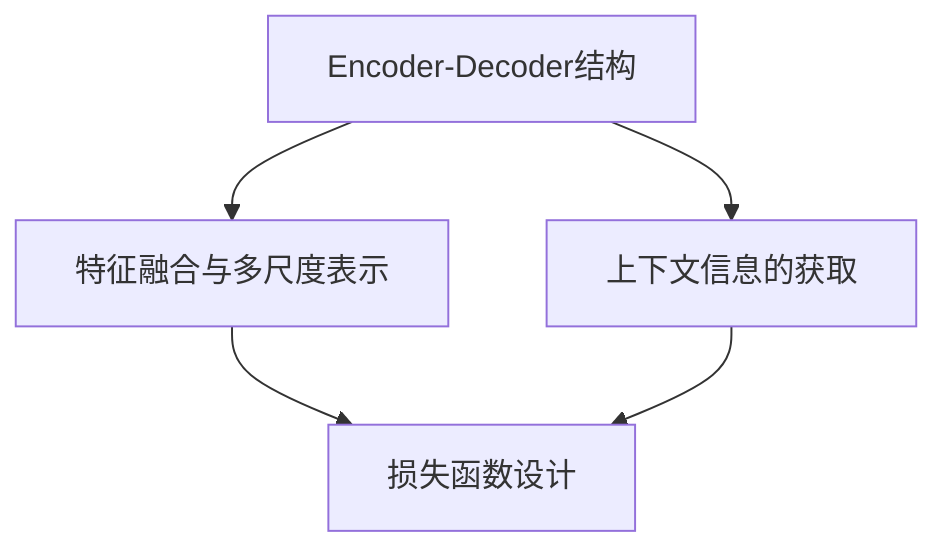

# Semantic Segmentation原理与代码实例讲解

## 1. 背景介绍
### 1.1 Semantic Segmentation的定义与意义
Semantic Segmentation（语义分割）是计算机视觉领域的一项重要任务，旨在对图像中的每个像素进行分类，将其归属到预定义的语义类别中。与传统的图像分类和目标检测任务不同，语义分割能够提供更加精细和全面的图像理解，在自动驾驶、医学影像分析、遥感图像处理等领域具有广泛的应用前景。

### 1.2 Semantic Segmentation的发展历程
早期的语义分割方法主要基于手工设计的特征和传统的机器学习分类器，如条件随机场（CRF）和支持向量机（SVM）等。随着深度学习的兴起，特别是卷积神经网络（CNN）在图像识别任务上取得了巨大成功，基于深度学习的语义分割方法逐渐成为主流。FCN、SegNet、U-Net等经典网络结构的提出，极大地推动了语义分割技术的发展。

### 1.3 Semantic Segmentation的技术挑战
尽管语义分割取得了长足进步，但仍面临着诸多技术挑战：

1. 图像的多尺度和多视角问题：如何在不同尺度和视角下准确分割目标。
2. 类别不平衡问题：不同语义类别在图像中出现的频率差异较大，导致模型训练的不平衡。
3. 上下文信息的有效利用：如何充分利用图像的全局和局部上下文信息，提高分割精度。
4. 边界和细节的精确定位：对于复杂场景和细粒度的语义类别，准确定位边界和细节仍具有挑战性。

## 2. 核心概念与联系
### 2.1 Encoder-Decoder结构
大多数语义分割网络采用Encoder-Decoder结构。Encoder通过卷积和下采样操作提取图像的高级语义特征，Decoder通过上采样和卷积操作恢复特征图的空间分辨率，最终得到与输入图像大小相同的分割结果。

### 2.2 特征融合与多尺度表示
为了获得更加丰富和鲁棒的特征表示，语义分割网络通常会融合Encoder不同层次的特征。此外，引入多尺度特征有助于处理图像中不同大小的目标，提高分割精度。常见的特征融合方式包括Skip Connection、金字塔池化等。

### 2.3 上下文信息的获取
上下文信息对于语义分割至关重要，能够帮助消除分割结果的歧义性。主流的上下文信息获取方法包括：

1. 全局平均池化：通过全局平均池化获取图像的全局特征，与局部特征结合。
2. 空洞卷积：通过扩大卷积核的感受野，获取更广泛的上下文信息。
3. 注意力机制：通过引入注意力模块，自适应地关注图像的不同区域，获取长程依赖关系。

### 2.4 损失函数设计
针对语义分割任务的特点，研究者提出了多种特定的损失函数：

1. 交叉熵损失：最常用的分类损失函数，惩罚预测概率与真实标签的差异。
2. Dice损失：基于Dice系数的损失函数，缓解类别不平衡问题。
3. Focal Loss：通过动态调整样本权重，使模型更关注难分样本。
4. 边界损失：显式地优化目标的边界定位精度。

下图展示了语义分割的核心概念及其之间的联系：



## 3. 核心算法原理具体操作步骤
### 3.1 全卷积网络FCN
FCN是语义分割领域的开创性工作，通过将传统CNN中的全连接层替换为卷积层，实现了端到端的像素级分类。

1. 使用预训练的CNN作为Encoder，提取图像特征。
2. 去除CNN的全连接层，保留卷积层和池化层。
3. 通过反卷积或上采样操作，恢复特征图的空间分辨率。
4. 融合不同层次的特征，获得多尺度表示。
5. 通过1x1卷积将特征图映射到类别数维度，得到像素级的分类结果。

### 3.2 U-Net
U-Net是一种U型Encoder-Decoder结构，广泛应用于医学影像分割任务。

1. 收缩路径（Encoder）：通过卷积和下采样操作，提取图像的高级语义特征。
2. 扩张路径（Decoder）：通过上采样和卷积操作，恢复特征图的空间分辨率。
3. Skip Connection：将收缩路径的特征图与扩张路径的特征图进行拼接，融合不同尺度的信息。
4. 最后通过1x1卷积得到像素级的分类结果。

### 3.3 DeepLab系列
DeepLab系列是语义分割领域的代表性工作，引入了空洞卷积和空间金字塔池化等创新点。

1. 使用带有空洞卷积的CNN作为Encoder，扩大感受野，获取更广泛的上下文信息。
2. 通过空间金字塔池化，融合不同尺度的特征，提高对多尺度目标的适应性。
3. 在Decoder部分，通过上采样和卷积操作恢复特征图的空间分辨率。
4. 引入全局平均池化，获取图像的全局特征，与局部特征融合。
5. 使用条件随机场（CRF）进行后处理，优化分割结果的边界和细节。

## 4. 数学模型和公式详细讲解举例说明
### 4.1 交叉熵损失
交叉熵损失是语义分割中最常用的损失函数，用于衡量预测概率分布与真实分布之间的差异。对于每个像素 $i$，交叉熵损失定义为：

$$
L_{CE}(i) = -\sum_{c=1}^{C} y_{i,c} \log(p_{i,c})
$$

其中，$C$ 是类别数，$y_{i,c}$ 是像素 $i$ 属于类别 $c$ 的真实标签（0或1），$p_{i,c}$ 是模型预测像素 $i$ 属于类别 $c$ 的概率。

整个图像的交叉熵损失为所有像素的平均：

$$
L_{CE} = \frac{1}{N} \sum_{i=1}^{N} L_{CE}(i)
$$

其中，$N$ 是图像中的像素总数。

### 4.2 Dice损失
Dice损失基于Dice系数，用于衡量预测结果与真实标签的重叠程度。对于二分类问题，Dice系数定义为：

$$
Dice = \frac{2 \times |A \cap B|}{|A| + |B|}
$$

其中，$A$ 和 $B$ 分别表示预测结果和真实标签的二值化掩码。

Dice损失则定义为：

$$
L_{Dice} = 1 - Dice
$$

对于多分类问题，可以将每个类别视为二分类问题，分别计算Dice损失，然后取平均。

### 4.3 Focal Loss
Focal Loss是一种解决类别不平衡问题的损失函数，通过引入调制因子，动态调整样本的权重。对于每个像素 $i$，Focal Loss定义为：

$$
L_{FL}(i) = -\sum_{c=1}^{C} (1-p_{i,c})^\gamma y_{i,c} \log(p_{i,c})
$$

其中，$\gamma$ 是调制因子，控制对难分样本的关注程度。当 $\gamma=0$ 时，Focal Loss退化为交叉熵损失。

整个图像的Focal Loss为所有像素的平均：

$$
L_{FL} = \frac{1}{N} \sum_{i=1}^{N} L_{FL}(i)
$$

## 5. 项目实践：代码实例和详细解释说明
下面以PyTorch为例，展示如何使用U-Net实现语义分割。

### 5.1 U-Net模型定义

```python
import torch
import torch.nn as nn

class DoubleConv(nn.Module):
    def __init__(self, in_channels, out_channels):
        super().__init__()
        self.double_conv = nn.Sequential(
            nn.Conv2d(in_channels, out_channels, kernel_size=3, padding=1),
            nn.BatchNorm2d(out_channels),
            nn.ReLU(inplace=True),
            nn.Conv2d(out_channels, out_channels, kernel_size=3, padding=1),
            nn.BatchNorm2d(out_channels),
            nn.ReLU(inplace=True)
        )

    def forward(self, x):
        return self.double_conv(x)

class UNet(nn.Module):
    def __init__(self, num_classes):
        super().__init__()
        self.enc1 = DoubleConv(3, 64)
        self.enc2 = DoubleConv(64, 128)
        self.enc3 = DoubleConv(128, 256)
        self.enc4 = DoubleConv(256, 512)
        self.enc5 = DoubleConv(512, 1024)

        self.pool = nn.MaxPool2d(2)

        self.dec5 = DoubleConv(1024, 512)
        self.dec4 = DoubleConv(1024, 256)
        self.dec3 = DoubleConv(512, 128)
        self.dec2 = DoubleConv(256, 64)
        self.dec1 = nn.Conv2d(128, num_classes, kernel_size=1)

    def forward(self, x):
        enc1 = self.enc1(x)
        enc2 = self.enc2(self.pool(enc1))
        enc3 = self.enc3(self.pool(enc2))
        enc4 = self.enc4(self.pool(enc3))
        enc5 = self.enc5(self.pool(enc4))

        dec5 = self.dec5(enc5)
        dec4 = self.dec4(torch.cat([F.interpolate(dec5, enc4.size()[2:], mode='bilinear', align_corners=True), enc4], dim=1))
        dec3 = self.dec3(torch.cat([F.interpolate(dec4, enc3.size()[2:], mode='bilinear', align_corners=True), enc3], dim=1))
        dec2 = self.dec2(torch.cat([F.interpolate(dec3, enc2.size()[2:], mode='bilinear', align_corners=True), enc2], dim=1))
        dec1 = self.dec1(torch.cat([F.interpolate(dec2, enc1.size()[2:], mode='bilinear', align_corners=True), enc1], dim=1))

        return dec1
```

### 5.2 训练过程

```python
import torch.optim as optim
from torch.utils.data import DataLoader

def train(model, train_loader, criterion, optimizer, device):
    model.train()
    train_loss = 0.0

    for images, labels in train_loader:
        images = images.to(device)
        labels = labels.to(device)

        optimizer.zero_grad()
        outputs = model(images)
        loss = criterion(outputs, labels)
        loss.backward()
        optimizer.step()

        train_loss += loss.item() * images.size(0)

    train_loss = train_loss / len(train_loader.dataset)
    return train_loss

def main():
    device = torch.device('cuda' if torch.cuda.is_available() else 'cpu')
    model = UNet(num_classes=num_classes).to(device)
    criterion = nn.CrossEntropyLoss()
    optimizer = optim.Adam(model.parameters(), lr=0.001)

    for epoch in range(num_epochs):
        train_loss = train(model, train_loader, criterion, optimizer, device)
        print(f'Epoch [{epoch+1}/{num_epochs}], Train Loss: {train_loss:.4f}')

        if (epoch + 1) % 10 == 0:
            torch.save(model.state_dict(), f'model_epoch_{epoch+1}.pth')

if __name__ == '__main__':
    main()
```

以上代码实现了U-Net的模型定义和训练过程。在训练过程中，使用交叉熵损失函数和Adam优化器，并定期保存模型权重。

## 6. 实际应用场景
语义分割在许多实际场景中都有广泛应用，例如：

1. 自动驾驶：对道路场景进行语义分割，识别车道线、车辆、行人等关键元素，为自动驾驶决策提供支持。
2. 医学影像分析：对医学图像（如CT、MRI）进行语义分割，自动勾画病变区域，辅助医生进行诊断和治疗。
3. 遥感图像处理：对卫星或航拍图像进行语义分割，识别不同的地物类别，如建筑、道路、植被等，用于土地利用分析和城市规划。
4.