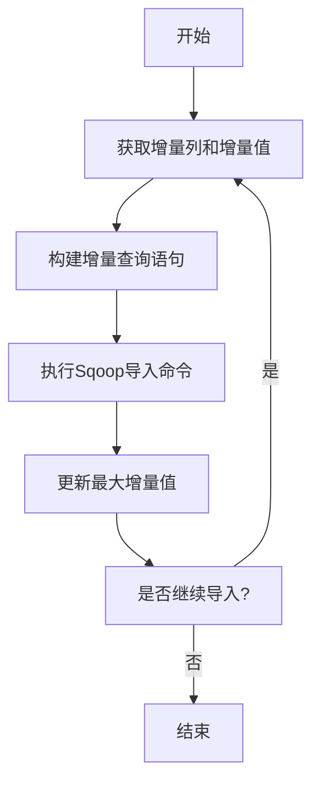

# Sqoop增量导入原理与代码实例讲解

## 1.背景介绍

在大数据时代,数据的采集和传输是一个非常重要的环节。Apache Sqoop是一款用于在Apache Hadoop和结构化数据存储(如关系数据库)之间高效传输大批量数据的工具。它支持从关系数据库(如MySQL、Oracle等)中导入数据到Hadoop的HDFS中,也可以将HDFS的数据导出到关系数据库中。

然而,在实际应用场景中,我们经常会遇到需要定期从关系数据库导入增量数据到Hadoop的需求。例如,每天只需要从数据库中导入前一天新增的数据,而不需要重新导入所有历史数据。这种增量导入可以大大提高导入效率,节省时间和存储空间。

## 2.核心概念与联系

### 2.1 Sqoop增量导入概念

Sqoop增量导入是指只导入自上次导入后新增的数据,而不是每次都重新导入所有数据。它通过记录上次导入的最大值(如ID、时间戳等),然后在下次导入时只导入大于该值的新增数据。

### 2.2 增量导入的优势

- **提高效率**:只需导入新增数据,避免重复导入已有数据,大大减少了数据传输量和处理时间。
- **节省存储空间**:只保存新增数据,不会产生数据冗余,从而节省了HDFS存储空间。
- **降低成本**:减少了数据传输和处理的资源消耗,降低了运营成本。

### 2.3 增量导入的核心要素

- **增量列**:用于判断数据是否为新增数据的列,通常是自增ID或时间戳列。
- **增量值**:上次导入的最大增量列值,用于确定本次导入的数据范围。
- **增量模式**:Sqoop支持三种增量模式,分别是`appendMode`、`lastModified`和`dateFomats`。

## 3.核心算法原理具体操作步骤

Sqoop增量导入的核心算法原理可以概括为以下几个步骤:

1. **获取增量列和增量值**

   Sqoop首先需要确定用于增量导入的增量列,通常是自增ID或时间戳列。然后获取上次导入的最大增量值,作为本次导入的下限。如果是第一次导入,则增量值为最小值。

2. **构建增量查询语句**

   根据增量列和增量值,构建SQL查询语句,只查询大于上次增量值的新增数据。查询语句的形式如下:

   ```sql
   SELECT * FROM table WHERE increment_column > :last_value
   ```

3. **执行增量导入**

   使用构建好的SQL语句执行Sqoop导入命令,将增量数据从关系数据库导入到HDFS中的目标路径。

4. **更新增量值**

   导入完成后,Sqoop会更新本次导入的最大增量值,作为下次导入的下限值。通常将最大增量值持久化存储,以便后续使用。

5. **重复执行**

   定期(如每天)重复执行上述步骤,实现持续的增量导入。

该算法的核心在于利用增量列和增量值来确定每次导入的数据范围,避免重复导入已有数据,从而实现高效的增量导入。

## 4.数学模型和公式详细讲解举例说明

在Sqoop增量导入中,没有直接涉及复杂的数学模型和公式。但是,我们可以用一些简单的数学概念来描述增量导入的原理。

假设我们有一个表`orders`,其中包含`id`(自增主键)、`order_date`(订单日期)和其他列。我们需要每天从该表中导入前一天新增的订单数据到HDFS中。

### 4.1 增量列和增量值

设`last_value`为上次导入的最大`id`值,则本次需要导入的数据范围为:

$$
id > last\_value
$$

同理,如果我们使用`order_date`作为增量列,并设`last_date`为上次导入的最大日期,则本次需要导入的数据范围为:

$$
order\_date > last\_date
$$

### 4.2 导入数据量估计

假设表`orders`中总共有`N`条记录,上次导入后新增了`n`条记录,则本次导入的数据量约为`n`条。如果每次都完整导入,则数据量为`N`条。

因此,增量导入相比完整导入,可以减少约`(N-n)/N`的数据传输量。当`n<<N`时,增量导入的效率优势就会非常明显。

我们可以用数学期望来估计长期的平均数据传输量:

$$
E(data\_size) = \lim\limits_{t\rightarrow\infty}\frac{1}{t}\sum\limits_{i=1}^{t}n_i
$$

其中,`n_i`表示第`i`次导入的新增数据量。

如果新增数据量`n_i`满足某种分布(如泊松分布),我们就可以计算出长期平均的数据传输量,从而评估增量导入的效率。

综上所述,虽然Sqoop增量导入没有直接使用复杂的数学模型,但是我们可以借助一些简单的数学概念和公式来更好地理解和分析其原理和效率。

## 5.项目实践:代码实例和详细解释说明

### 5.1 Sqoop增量导入命令

Sqoop提供了三种增量导入模式,分别是`appendMode`、`lastModified`和`dateFomats`。下面将分别介绍它们的用法和代码示例。

#### 5.1.1 appendMode模式

`appendMode`模式是最常用的增量导入模式,它基于一个自增的数值列(如自增ID或时间戳)来判断新增数据。使用方式如下:

```bash
sqoop import \
--connect jdbc:mysql://hostname/databasename \
--username yourusername \
--password yourpassword \
--table tablename \
--target-dir /user/hdfs_path \
--incremental append \
--check-column id \
--last-value 0
```

- `--incremental append`: 指定使用`appendMode`增量模式
- `--check-column id`: 指定使用`id`列作为增量列
- `--last-value 0`: 指定增量值的初始值为0,后续会自动更新

上述命令会将`tablename`表中`id`大于0的所有记录导入到HDFS的`/user/hdfs_path`路径中。后续的增量导入将自动从上次导入的最大`id`值开始导入新增数据。

#### 5.1.2 lastModified模式

`lastModified`模式基于表中的一个时间戳列(如`last_modified_time`)来判断新增数据。使用方式如下:

```bash
sqoop import \
--connect jdbc:mysql://hostname/databasename \
--username yourusername \
--password yourpassword \
--table tablename \
--target-dir /user/hdfs_path \
--incremental lastmodified \
--check-column last_modified_time \
--last-value "2023/05/01 00:00:00"
```

- `--incremental lastmodified`: 指定使用`lastModified`增量模式
- `--check-column last_modified_time`: 指定使用`last_modified_time`列作为增量列
- `--last-value "2023/05/01 00:00:00"`: 指定增量值的初始值为`2023/05/01 00:00:00`

上述命令会将`tablename`表中`last_modified_time`大于`2023/05/01 00:00:00`的所有记录导入到HDFS。后续的增量导入将自动从上次导入的最大时间戳值开始导入新增数据。

#### 5.1.3 dateFormats模式

`dateFormats`模式类似于`lastModified`模式,但它允许指定多个日期格式,以支持不同的时间戳格式。使用方式如下:

```bash
sqoop import \
--connect jdbc:mysql://hostname/databasename \
--username yourusername \
--password yourpassword \
--table tablename \
--target-dir /user/hdfs_path \
--incremental lastmodified \
--check-column timestamp_column \
--last-value "2023-05-01 00:00:00" \
--dateFormats "yyyy-MM-dd HH:mm:ss"
```

- `--dateFormats "yyyy-MM-dd HH:mm:ss"`: 指定时间戳列的格式

上述命令会将`tablename`表中`timestamp_column`大于`2023-05-01 00:00:00`的所有记录导入到HDFS。后续的增量导入将自动从上次导入的最大时间戳值开始导入新增数据。

### 5.2 增量值的持久化存储

为了实现持续的增量导入,我们需要将每次导入的最大增量值持久化存储,以便后续使用。常见的存储方式有:

1. **元数据表**

   在关系数据库中创建一个元数据表,用于存储增量值。例如:

   ```sql
   CREATE TABLE increment_meta (
     table_name VARCHAR(50) PRIMARY KEY,
     last_value BIGINT
   );
   ```

   每次导入后,使用SQL语句更新对应表的最大增量值:

   ```sql
   UPDATE increment_meta SET last_value = :new_value WHERE table_name = :table;
   ```

2. **HDFS文件**

   将增量值存储在HDFS的一个文件中,例如`/user/increment_meta.txt`。每次导入后,使用Java代码或脚本更新该文件中的增量值。

3. **Zookeeper**

   利用Zookeeper的分布式协调功能来存储和管理增量值。每个表对应一个Znode,存储该表的最大增量值。

4. **Redis**

   使用Redis键值存储来保存增量值,每个表对应一个键。

无论采用哪种存储方式,关键是要确保增量值的可靠性和一致性,避免数据丢失或重复导入。

### 5.3 Mermaid流程图

以`appendMode`模式为例,Sqoop增量导入的整体流程如下所示:



流程说明:

1. 获取用于增量导入的增量列(如`id`或`timestamp`)和上次导入的最大增量值。
2. 根据增量列和增量值构建SQL查询语句,只查询大于上次增量值的新增数据。
3. 使用构建好的SQL语句执行Sqoop导入命令,将增量数据从关系数据库导入到HDFS中。
4. 导入完成后,更新本次导入的最大增量值,作为下次导入的下限值。
5. 判断是否需要继续进行增量导入,如果是,则重复上述步骤;否则,结束流程。

该流程图清晰地展示了Sqoop增量导入的核心步骤和逻辑,有助于理解其工作原理。

## 6.实际应用场景

Sqoop增量导入在实际应用中有着广泛的使用场景,下面列举了一些典型的应用案例:

1. **日志数据采集**

   在大型网站或应用系统中,每天都会产生大量的日志数据。我们可以使用Sqoop每天从日志数据库中导入前一天新增的日志数据到Hadoop,以供后续的日志分析和挖掘。

2. **订单数据同步**

   电商网站的订单数据通常存储在关系数据库中。我们可以使用Sqoop定期从订单数据库中导入新增订单数据到Hadoop,以支持订单数据分析、推荐系统等应用。

3. **增量数据备份**

   对于一些重要的业务数据,我们可以使用Sqoop每天从关系数据库中导入新增数据到HDFS,作为增量数据备份,以防止数据丢失。

4. **数据湖构建**

   在构建数据湖时,我们可以使用Sqoop从各种数据源(如关系数据库、NoSQL数据库等)中导入增量数据到HDFS,作为数据湖的原始数据层。

5. **实时数据处理**

   结合Kafka等消息队列,我们可以使用Sqoop实时地从关系数据库中导入新增数据到Kafka,然后由实时计算框架(如Spark Streaming或Flink)进行实时处理和分析。

总的来说,Sqoop增量导入可以广泛应用于各种需要从关系数据库中采集增量数据的场景,提高了数据采集的效率和可靠性,降低了存储和计算成本。

## 7.工具和资源推荐

在使用Sqoop进行增量导入时,除了Sqoop本身外,还有一些其他有用的工具和资源可以辅助我们更好地完成任务。

### 7.1