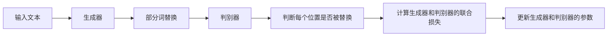

# Transformer大模型实战 了解替换标记检测任务

## 1. 背景介绍

### 1.1 Transformer模型的发展历程

Transformer模型自2017年由Google提出以来，迅速成为自然语言处理(NLP)领域的研究热点。它摒弃了传统的循环神经网络(RNN)架构，完全依赖注意力机制(Attention Mechanism)来学习文本中的长距离依赖关系，在机器翻译、文本摘要、问答系统等任务上取得了显著的性能提升。

### 1.2 大规模预训练语言模型的兴起

随着计算资源的增长和训练数据的积累，以BERT、GPT、XLNet等为代表的大规模预训练语言模型相继诞生。这些模型在大规模无监督语料上进行预训练，习得了丰富的语言知识，可以方便地迁移到下游的NLP任务，极大地推动了NLP技术的进步。

### 1.3 替换标记检测任务的提出

替换标记检测(Replaced Token Detection, RTD)是一种新颖的自监督预训练任务，由ELECTRA模型首次提出。不同于BERT的掩码语言模型(Masked Language Model, MLM)，RTD不再使用[MASK]标记，而是用同义词、近义词等相似词替换原文中的词，然后判断每个位置的词是否被替换。这种方式可以更好地利用上下文信息，学到更加细粒度的语言表征。

## 2. 核心概念与联系

### 2.1 Transformer的核心组件

- **Embedding层**：将离散的词转换为连续的向量表示。
- **位置编码(Positional Encoding)**：为每个词的向量引入位置信息。
- **多头注意力机制(Multi-Head Attention)**：捕捉词之间的相互关系和依赖。
- **前馈神经网络(Feed-Forward Network)**：对注意力层的输出进行非线性变换。
- **残差连接(Residual Connection)和层归一化(Layer Normalization)**：促进模型的训练和收敛。

### 2.2 预训练和微调范式

大规模语言模型通常采用两阶段训练范式：

1. **预训练阶段**：在大规模无标注语料上以自监督的方式训练模型，习得通用的语言表征。常见的预训练任务有语言模型、去噪自编码器等。

2. **微调阶段**：在下游任务的标注数据上微调预训练模型，使其适应特定任务。微调时一般只需要较小的学习率和训练轮数。

### 2.3 自监督预训练任务

自监督学习是一种不需要人工标注数据的机器学习范式，通过设计巧妙的预训练任务，让模型从大规模无标注数据中自主学习有用的特征表示。常见的自监督预训练任务包括：

- **语言模型(Language Modeling, LM)**：预测下一个词或前一个词。代表模型有GPT系列。
- **去噪自编码器(Denoising Autoencoder, DAE)**：从被部分遮挡的输入中重建原始文本。代表模型有BERT。
- **替换标记检测(Replaced Token Detection, RTD)**：判断词是否被替换。代表模型有ELECTRA。

## 3. 核心算法原理具体操作步骤

### 3.1 ELECTRA的生成-判别框架

ELECTRA模型由一个生成器(Generator)和一个判别器(Discriminator)组成。

1. **生成器**：通常是一个较小的BERT模型，以MLM的方式预训练，用于生成替换词。

2. **判别器**：通常是一个较大的BERT模型，以RTD的方式预训练，用于判断每个位置的词是否被替换。

生成器和判别器的联合训练过程如下：



### 3.2 RTD任务的训练过程

1. 随机选择原文中的一部分位置进行替换(例如15%)。
2. 对于每个被选中的位置，生成器输出一个概率分布，并从中采样生成替换词。
3. 将替换后的文本输入判别器，判别器对每个位置进行二分类，判断该位置的词是否被替换。
4. 计算判别器的二元交叉熵损失，以及生成器的MLM损失。
5. 联合优化生成器和判别器，更新它们的参数。

重复以上步骤，直到模型收敛。

## 4. 数学模型和公式详细讲解举例说明

### 4.1 Transformer的数学表示

Transformer的核心是注意力机制，可以用数学公式表示如下：

$$
\text{Attention}(Q, K, V) = \text{softmax}(\frac{QK^T}{\sqrt{d_k}})V
$$

其中，$Q$、$K$、$V$分别表示查询(Query)、键(Key)、值(Value)矩阵，$d_k$为键向量的维度。

多头注意力可以看作是$h$个注意力函数的并行：

$$
\text{MultiHead}(Q, K, V) = \text{Concat}(\text{head}_1, ..., \text{head}_h)W^O \
\text{head}_i = \text{Attention}(QW_i^Q, KW_i^K, VW_i^V)
$$

其中，$W_i^Q$、$W_i^K$、$W_i^V$、$W^O$为可学习的权重矩阵。

### 4.2 ELECTRA的损失函数

ELECTRA的总损失函数由生成器损失和判别器损失组成：

$$
\mathcal{L} = \mathcal{L}_{gen} + \lambda \mathcal{L}_{dis}
$$

其中，$\mathcal{L}_{gen}$为生成器的MLM损失，$\mathcal{L}_{dis}$为判别器的二元交叉熵损失，$\lambda$为平衡两个损失的超参数。

生成器的MLM损失为：

$$
\mathcal{L}_{gen} = -\sum_{i \in \mathcal{M}} \log p(x_i | \hat{x}_{\setminus i})
$$

其中，$\mathcal{M}$为被替换词的位置集合，$x_i$为原文中位置$i$的词，$\hat{x}_{\setminus i}$为替换后的文本序列。

判别器的二元交叉熵损失为：

$$
\mathcal{L}_{dis} = -\sum_{i=1}^n (y_i \log D(x_i) + (1 - y_i) \log (1 - D(x_i)))
$$

其中，$y_i$为位置$i$的标签(0表示原词，1表示替换词)，$D(x_i)$为判别器在位置$i$输出替换词的概率。

## 5. 项目实践：代码实例和详细解释说明

下面是一个使用PyTorch和Hugging Face Transformers库实现ELECTRA预训练的简单示例：

```python
import torch
from transformers import ElectraConfig, ElectraForPreTraining, ElectraTokenizer

# 加载预训练模型和分词器
config = ElectraConfig.from_pretrained('google/electra-small-discriminator')
model = ElectraForPreTraining(config)
tokenizer = ElectraTokenizer.from_pretrained('google/electra-small-discriminator')

# 准备输入数据
text = "This is an example sentence for ELECTRA pretraining."
input_ids = tokenizer.encode(text, return_tensors='pt')
labels = input_ids.clone()

# 随机替换15%的词
mask = torch.rand(input_ids.shape) < 0.15
input_ids[mask] = tokenizer.mask_token_id

# 前向传播
outputs = model(input_ids, labels=labels)
loss = outputs.loss
logits = outputs.logits

# 反向传播和优化
loss.backward()
optimizer.step()
```

以上代码的主要步骤如下：

1. 加载ELECTRA的配置、模型和分词器。
2. 将文本转换为输入ID序列。
3. 随机替换15%的词为[MASK]标记。
4. 将替换后的输入和原始标签传入模型，计算损失和logits。
5. 反向传播损失，更新模型参数。

实际训练时，需要在大规模语料上迭代多个epoch，并使用更大的批次大小和学习率衰减策略。预训练完成后，可以将判别器微调应用于下游任务。

## 6. 实际应用场景

ELECTRA及其变体在多个NLP任务上取得了优异的性能，具有广泛的应用前景，例如：

- **情感分析**：判断文本的情感倾向，如正面、负面、中性等。
- **命名实体识别**：从文本中识别出人名、地名、机构名等命名实体。
- **问答系统**：根据给定的问题和上下文，生成相应的答案。
- **文本分类**：将文本划分到预定义的类别，如新闻主题分类、垃圾邮件检测等。
- **语义相似度**：计算两个文本之间的语义相似程度，用于搜索引擎、推荐系统等。

通过在大规模语料上预训练，ELECTRA可以学到丰富的语言知识，再通过微调适应不同的下游任务，显著提升这些任务的性能。

## 7. 工具和资源推荐

- **PyTorch**：一个开源的深度学习框架，提供了灵活的API和动态计算图。
- **Hugging Face Transformers**：一个流行的NLP库，提供了多种预训练模型和便捷的微调接口。
- **Google ELECTRA**：Google发布的ELECTRA预训练模型，包括不同大小的生成器和判别器。
- **Stanford CoreNLP**：斯坦福大学开发的NLP工具包，提供了分词、词性标注、命名实体识别等功能。
- **NLTK**：自然语言工具包，提供了多种文本预处理和分析工具。
- **SpaCy**：一个高性能的NLP库，提供了丰富的文本处理功能和预训练模型。

这些工具和资源可以帮助研究者和开发者更高效地开展NLP研究和应用。

## 8. 总结：未来发展趋势与挑战

ELECTRA的提出开启了一个新的研究方向，即基于替换标记检测的预训练范式。相比传统的掩码语言模型，RTD任务可以更好地利用上下文信息，学到更加细粒度的语言表征。未来，这一范式有望进一步发展，主要趋势包括：

- **更大规模的模型和数据**：训练更大的模型和使用更多的数据，以进一步提升模型的性能和泛化能力。
- **更高效的训练方法**：设计更加高效的预训练任务和训练策略，减少计算开销和训练时间。
- **多语言和多模态扩展**：将RTD任务扩展到多语言和多模态场景，如图像-文本、视频-文本等。
- **知识增强**：将知识图谱、规则等先验知识融入预训练过程，提升模型的可解释性和推理能力。
- **模型压缩和部署**：设计模型压缩和加速技术，使预训练模型能够在资源受限的环境中高效部署。

同时，RTD范式也面临一些挑战：

- **替换词的生成**：如何生成高质量的替换词，使其既能保留原文的语义，又能引入足够的噪声，是一个关键问题。
- **任务的评估和分析**：RTD任务缺乏明确的评估指标，需要设计合理的评估方法，并深入分析模型的行为和局限性。
- **理论基础**：RTD范式的理论基础还有待进一步探索，如可学习性、泛化能力等方面的理论分析。

总之，以ELECTRA为代表的RTD预训练范式为NLP领域带来了新的研究视角和发展机遇，有望推动语言模型的进一步发展和应用。

## 9. 附录：常见问题与解答

### 9.1 ELECTRA与BERT的主要区别是什么？

ELECTRA和BERT的主要区别在于预训练任务：BERT使用MLM任务，随机掩码一部分词，并预测被掩码的词；而ELECTRA使用RTD任务，随机替换一部分词，并判断每个位置的词是否被替换。此外，ELECTRA引入了生成器-判别器的框架，而BERT只有单个的编码器。

### 9.2 ELECTRA的生成器和判别器分别有什么作用？

ELECTRA的生成器是一个小型的MLM模型，用于生成替换词；判别器是一个大型的BERT模型，用于判断每