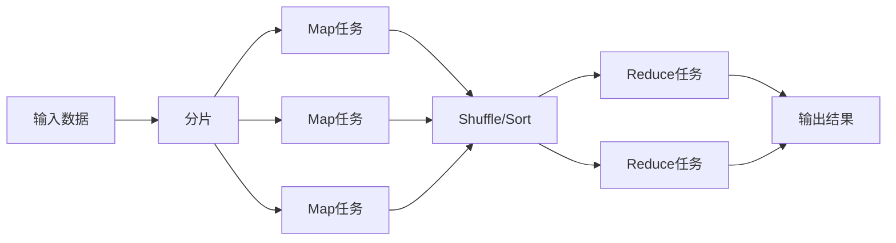

# 【AI大数据计算原理与代码实例讲解】MapReduce

## 1. 背景介绍

### 1.1 大数据处理的挑战
在当今数据爆炸式增长的时代,如何高效处理海量数据成为了一个巨大的挑战。传统的数据处理方式已经无法满足大数据时代的需求。面对TB、PB级别的海量数据,单台机器的计算能力是远远不够的,必须采用分布式计算的方式来处理。

### 1.2 MapReduce的诞生
MapReduce作为一种分布式计算模型,由Google公司在2004年提出,用于解决海量数据的并行处理问题。它将复杂的分布式计算抽象为两个基本操作:Map和Reduce,并提供了一个通用的并行计算框架。MapReduce模型一经推出就受到了学术界和工业界的广泛关注,成为大数据处理领域的重要工具。

### 1.3 MapReduce的影响力
MapReduce模型具有易用性高、可扩展性强、容错性好等优点,极大地降低了编写分布式程序的门槛。许多知名的大数据处理框架如Hadoop、Spark都是基于MapReduce思想发展而来。如今,MapReduce已经成为大数据处理领域的标准编程模型,在搜索引擎、推荐系统、数据挖掘等诸多领域得到了广泛应用。

## 2. 核心概念与联系

### 2.1 MapReduce编程模型

#### 2.1.1 Map阶段
Map阶段接收一组键值对<key, value>,对其进行用户自定义的map函数处理,产生一组中间结果键值对<key', value'>。
```
map(key, value) -> list(key', value')
```

#### 2.1.2 Reduce阶段
Reduce阶段对Map阶段产生的中间结果键值对按key'进行分组,得到<key', list(value')>,然后对每一组数据进行用户自定义的reduce函数聚合,产生最终的结果键值对<key', value''>。
```
reduce(key', list(value')) -> list(key', value'')
```

### 2.2 WordCount词频统计示例

为了更好地理解MapReduce编程模型,我们以经典的WordCount词频统计问题为例进行说明。WordCount的任务是统计一批文档中每个单词出现的次数。

#### 2.2.1 Map阶段
```
map(文档名, 文档内容):
    对文档内容进行分词处理得到单词列表words
    对于words中的每个单词word:
        输出<word, 1>
```
Map阶段的输入键值对是<文档名,文档内容>,输出键值对是<单词,1>。Map将文档内容切分成单词,然后以<单词,1>的形式输出。

#### 2.2.2 Reduce阶段
```
reduce(单词, list(数量)):
    sum = 0
    对于list(数量)中的每个数量x:
        sum += x
    输出<单词, sum>
```
Reduce阶段的输入键值对是<单词, list(数量)>,输出键值对是<单词,sum>。Reduce将Map输出的<单词,1>按单词分组,得到每个单词对应的数量列表,然后对数量列表求和得到每个单词的总频次。

### 2.3 MapReduce架构



MapReduce采用Master/Slave架构,由一个Master节点和多个Slave节点组成:
- Master节点负责任务调度、监控和容错等管理工作
- Slave节点负责执行具体的Map任务和Reduce任务

处理流程如下:
1. 输入数据被切分成等长的数据块(Split),每个数据块由一个Map任务处理
2. Map任务在本地磁盘产生中间结果,并将中间结果按key进行分区(Partition)
3. 中间结果经过Shuffle阶段,将相同key的数据发送到同一个Reduce任务
4. Reduce任务对收到的数据进行排序(Sort)后执行聚合逻辑,产生最终结果
5. 所有Reduce任务的输出结果合并,形成整个MapReduce作业的最终输出

## 3. 核心算法原理具体操作步骤

下面我们详细介绍MapReduce框架的核心算法原理和具体操作步骤。

### 3.1 作业提交
用户提交一个MapReduce作业后,Master节点首先将输入数据切分成M个Split,然后为每个Split创建一个Map任务。同时,Master会创建R个Reduce任务。M和R可以由用户指定,或者根据输入数据量和集群规模自动确定。

### 3.2 Map阶段

#### 3.2.1 读取输入
Map任务从HDFS读取对应Split的数据块,将数据块解析成<key,value>键值对,作为map函数的输入。默认情况下,key是行在数据块中的偏移量,value是行的内容。

#### 3.2.2 运行map函数
对于每一个输入键值对,运行用户自定义的map函数进行处理,产生一组中间结果键值对<key',value'>。中间结果先写入内存缓冲区。

#### 3.2.3 分区与溢写
当内存缓冲区达到阈值后,中间结果会溢写到磁盘,同时按Partition函数对key'进行分区,将相同分区的数据写入同一个文件。默认使用hash(key') mod R作为Partition函数,保证相同key'的数据会被发送到同一个Reduce任务。溢写前会对每个分区内的数据按key'进行排序。

### 3.3 Shuffle阶段

#### 3.3.1 拉取Map结果
所有Map任务完成后进入Shuffle阶段。每个Reduce任务将从所有Map任务拉取属于自己分区的中间结果文件。

#### 3.3.2 合并排序
Reduce任务在本地磁盘对拉取的多个中间结果文件进行合并,同时对key'进行排序。相同key'的数据会合并在一起,形成一组<key', list(value')>。

### 3.4 Reduce阶段

#### 3.4.1 运行reduce函数
对于每一组<key', list(value')>,运行用户自定义的reduce函数进行聚合处理,产生最终结果键值对<key', value''>。

#### 3.4.2 写出结果
Reduce任务将最终结果写回HDFS,每个Reduce任务的输出结果在HDFS上单独成文件。所有Reduce任务的输出文件共同组成了整个MapReduce作业的最终输出结果。

## 4. 数学模型和公式详细讲解举例说明

MapReduce模型可以用以下数学公式来形式化描述:

设输入数据集D由一组键值对<k1, v1>组成:
$$D = \{<k1, v1>\}$$

Map阶段对D进行处理,产生中间结果集M:
$$map(k1, v1) \rightarrow list(k2, v2)$$
$$M = \{<k2, v2>\}$$

Reduce阶段对M按k2进行分组,得到<k2, list(v2)>,然后进行聚合:
$$reduce(k2, list(v2)) \rightarrow list(k3, v3)$$
$$R = \{<k3, v3>\}$$

最终结果集R由所有Reduce任务的输出合并而成。

下面以WordCount为例对MapReduce的数学模型进行说明:

输入数据集D为一组文档,每个文档是一个键值对<文档名,文档内容>:
$$D = \{<d_1,"hello\ world">,<d_2,"hello\ hadoop">,<d_3,"hadoop\ world">\}$$

Map阶段对每个文档进行切词处理,输出<单词,1>:
$$map(k1, v1) \rightarrow list(word, 1)$$
$$M = \{<"hello",1>,<"world",1>,<"hello",1>,<"hadoop",1>,<"hadoop",1>, <"world",1>\}$$

Reduce阶段对M按单词进行分组,对每个单词的计数列表求和:
$$reduce(word, list(count)) \rightarrow <word, sum(count)>$$
$$R = \{<"hello",2>,<"world",2>,<"hadoop",2>\}$$

最终结果R表示每个单词在所有文档中出现的总次数。

从以上例子可以看出,MapReduce模型可以将复杂的分布式计算抽象为规范的数学公式,使得并行算法的设计和实现变得简洁清晰。这种简洁性正是MapReduce模型的魅力所在。

## 5. 项目实践:代码实例和详细解释说明

下面我们使用Python语言实现一个简单的MapReduce词频统计程序,并对代码进行详细解释。

```python
from mrjob.job import MRJob
import re

class MRWordCount(MRJob):

    def mapper(self, _, line):
        for word in re.findall(r'\w+', line):
            yield word.lower(), 1

    def reducer(self, word, counts):
        yield word, sum(counts)

if __name__ == '__main__':
    MRWordCount.run()
```

代码解释:

1. 导入MRJob库,它提供了一个便捷的MapReduce作业编写框架。
2. 定义一个继承自MRJob的类MRWordCount,表示这是一个MapReduce作业。
3. 定义mapper方法,实现Map阶段的逻辑。它接收一行文本作为输入,使用正则表达式提取出其中的单词,并以(word.lower(), 1)的形式输出。这里将单词转为小写以忽略大小写差异。
4. 定义reducer方法,实现Reduce阶段的逻辑。它接收一个单词word和一个计数器列表counts,对counts进行求和,得到该单词的总频次,并以(word, sum)的形式输出。
5. 在main函数中调用MRWordCount.run()运行这个MapReduce作业。

使用方法:

将以上代码保存为mr_word_count.py,然后在命令行运行:
```shell
python mr_word_count.py input.txt > output.txt
```
其中input.txt是输入文件,output.txt是输出文件。

这个简单的例子展示了如何使用MapReduce模型进行词频统计。实际的MapReduce作业通常会更加复杂,需要在Map和Reduce阶段进行更多的数据处理、过滤和转换等操作。但无论怎样,MapReduce模型提供的基本抽象和架构是不变的,这使得用户能够专注于算法本身而不用过多关注底层的分布式计算细节。

## 6. 实际应用场景

MapReduce模型在实际中有非常广泛的应用,下面列举几个典型的应用场景:

### 6.1 搜索引擎
MapReduce是搜索引擎中的核心技术之一。搜索引擎需要从海量网页中提取关键信息构建索引,并根据用户查询快速检索相关网页。这些任务都非常适合用MapReduce来实现。例如,倒排索引的构建可以使用MapReduce轻松实现:Map阶段解析网页并提取<词项,文档ID>对,Reduce阶段对相同词项的文档ID进行合并,生成<词项,文档ID列表>的倒排索引。

### 6.2 推荐系统
MapReduce在推荐系统中也有广泛应用。推荐系统需要从海量的用户行为日志中挖掘用户兴趣,计算用户或物品之间的相似度,进而给用户推荐感兴趣的内容。这些计算通常需要在TB级的数据集上进行,非常适合使用MapReduce来加速处理。例如,协同过滤算法中的相似度计算可以用MapReduce来实现:Map阶段对每个用户对应的物品向量进行分发,Reduce阶段对收到的向量进行两两计算得到相似度。

### 6.3 数据挖掘
MapReduce为数据挖掘算法提供了高效的实现手段。很多传统的数据挖掘算法如频繁模式挖掘、聚类、分类等都可以用MapReduce重新设计和实现,从而获得更好的可扩展性。以频繁模式挖掘为例,可以将Apriori算法改写为多轮MapReduce作业:每轮先用Map任务统计候选模式的支持度,再用Reduce任务过滤出频繁模式生成下一轮的候选集,多轮迭代直到找出所有的频繁模式。

### 6.4 日志分析
互联网公司每天会产生海量的日志数据,如用户行为日志、