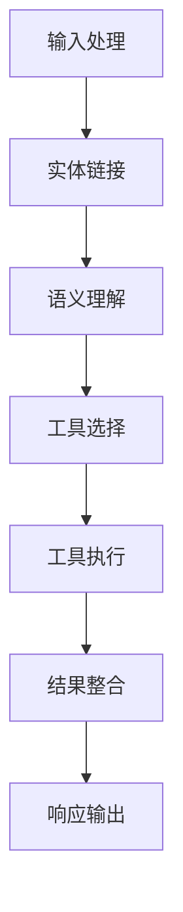

# 【LangChain编程：从入门到实践】使用LCEL进行组合

## 1.背景介绍

随着人工智能技术的不断发展,大语言模型(Large Language Model, LLM)已经成为当前最受关注的热点领域之一。LLM具有强大的自然语言理解和生成能力,可以应用于多种场景,如问答系统、文本摘要、内容创作等。然而,单一的LLM模型通常存在一些局限性,例如知识覆盖范围有限、推理能力不足等。为了解决这些问题,LangChain提出了一种新颖的编程范式——组合式编程(Compositional Programming)。

组合式编程的核心思想是将多个LLM模型、工具和数据源进行灵活组合,构建出功能更加强大的智能系统。LangChain引入了一种称为LCEL(Language Chains with Entity Links)的组合方式,通过将LLM与其他组件(如工具、数据库等)连接起来,实现了更加智能和高效的任务处理。

## 2.核心概念与联系

LCEL的核心概念包括三个部分:语言链(Language Chain)、实体链接(Entity Linking)和工具(Tools)。

### 2.1 语言链(Language Chain)

语言链是LCEL的基础组件,它将LLM模型与其他组件(如工具、数据库等)连接起来,形成一个有向图结构。在这个有向图中,每个节点代表一个组件,边则表示组件之间的交互和数据流动。语言链的作用是协调各个组件之间的交互,确保它们能够高效地完成特定任务。

### 2.2 实体链接(Entity Linking)

实体链接是LCEL中一种关键技术,它能够将自然语言文本中的实体(如人名、地名、组织机构等)与知识库中的实体进行准确匹配。通过实体链接,LCEL可以更好地理解输入文本的语义,并将相关知识准确地引入到任务处理过程中。

### 2.3 工具(Tools)

工具是LCEL中的重要组成部分,它们可以执行各种特定的功能,如数据检索、计算、API调用等。LCEL允许开发者自定义工具,并将它们与语言链和LLM模型相连接,从而扩展整个系统的功能。工具的引入使得LCEL不仅仅局限于文本处理,还能够执行更加复杂的任务。

## 3.核心算法原理具体操作步骤

LCEL的核心算法原理可以概括为以下几个步骤:

1. **输入处理**: 首先,LCEL会对用户的自然语言输入进行预处理,包括分词、命名实体识别等步骤。

2. **实体链接**: 接下来,LCEL会将输入文本中的实体与知识库中的实体进行匹配,这个过程就是实体链接。

3. **语义理解**: 基于实体链接的结果,LCEL可以更好地理解输入文本的语义,并确定需要执行的任务类型。

4. **工具选择**: 根据任务类型,LCEL会从可用的工具集合中选择合适的工具来执行该任务。

5. **工具执行**: 选定的工具会被执行,并将结果返回给语言链。

6. **结果整合**: 语言链会将工具的执行结果与LLM模型的输出进行整合,生成最终的响应。

7. **响应输出**: 最终的响应会被输出给用户。

下面是LCEL的工作流程图:



## 4.数学模型和公式详细讲解举例说明

在LCEL中,实体链接是一个关键的环节。实体链接的目标是将自然语言文本中的实体与知识库中的实体进行准确匹配。这个过程可以建模为一个排名问题,即给定一个实体mention和一组候选实体,我们需要根据一定的相似度度量,为每个候选实体赋予一个分数,并选择得分最高的实体作为最终匹配结果。

常见的相似度度量方法包括:

1. **字符串相似度**: 计算mention的字符串与候选实体名称之间的相似度,常用的方法有编辑距离、Jaccard相似度等。

2. **语义相似度**: 利用预训练的语言模型,计算mention的语义向量与候选实体描述的语义向量之间的相似度,常用的方法有余弦相似度等。

3. **上下文相似度**: 除了考虑mention本身,还可以利用mention所在的上下文信息,计算上下文向量与候选实体描述之间的相似度。

假设我们有一个mention $m$,以及一组候选实体 $\{e_1, e_2, \dots, e_n\}$,我们可以将实体链接问题形式化为一个排名问题:

$$\operatorname{score}(m, e_i) = \alpha \cdot \operatorname{str\_sim}(m, e_i) + \beta \cdot \operatorname{sem\_sim}(m, e_i) + \gamma \cdot \operatorname{ctx\_sim}(m, e_i)$$

其中,

- $\operatorname{str\_sim}(m, e_i)$ 表示mention $m$ 与候选实体 $e_i$ 的字符串相似度
- $\operatorname{sem\_sim}(m, e_i)$ 表示mention $m$ 与候选实体 $e_i$ 的语义相似度
- $\operatorname{ctx\_sim}(m, e_i)$ 表示mention $m$ 的上下文与候选实体 $e_i$ 的描述之间的相似度
- $\alpha$, $\beta$, $\gamma$ 是三个超参数,用于控制不同相似度的权重

我们的目标是找到一个候选实体 $e^*$,使得 $\operatorname{score}(m, e^*)$ 最大化:

$$e^* = \operatorname{argmax}_{e_i} \operatorname{score}(m, e_i)$$

上述公式给出了一种将实体链接问题形式化为排名问题的方法。在实际应用中,我们还可以引入其他特征,如实体的流行度、上下文的语义相关性等,来进一步提高实体链接的准确性。

## 5.项目实践:代码实例和详细解释说明

下面是一个使用LangChain和LCEL进行问答系统构建的示例代码:

```python
from langchain.agents import initialize_agent, Tool
from langchain.llms import OpenAI
from langchain.tools import WikipediaQueryRun

# 初始化LLM模型
llm = OpenAI(temperature=0)

# 定义工具
tools = [
    Tool(
        name="Wikipedia",
        func=WikipediaQueryRun().run,
        description="Useful for querying Wikipedia and getting information about people, places, companies, historical events, and more."
    )
]

# 初始化LCEL Agent
agent = initialize_agent(tools, llm, agent="conversational-react-description", verbose=True)

# 运行问答系统
query = "What is the capital of France?"
response = agent.run(query)
print(response)
```

在这个示例中,我们首先初始化了一个OpenAI的LLM模型。接下来,我们定义了一个名为"Wikipedia"的工具,它可以在Wikipedia上进行查询和信息检索。

然后,我们使用`initialize_agent`函数初始化了一个LCEL Agent,将LLM模型和工具进行了组合。在初始化过程中,我们指定了`agent="conversational-react-description"`参数,这意味着LCEL Agent会根据输入的查询,自动选择合适的工具进行执行,并将结果与LLM模型的输出进行整合,生成最终的响应。

最后,我们输入了一个查询"What is the capital of France?",LCEL Agent会自动调用Wikipedia工具进行查询,并将查询结果与LLM模型的输出进行整合,生成最终的响应。

在这个示例中,LCEL Agent的工作流程如下:

1. 用户输入查询"What is the capital of France?"。
2. LCEL Agent分析查询,确定需要执行Wikipedia查询工具。
3. Wikipedia查询工具在Wikipedia上搜索相关信息。
4. LCEL Agent将Wikipedia查询结果与LLM模型的输出进行整合,生成最终响应。

通过这个示例,我们可以看到LCEL如何将LLM模型与外部工具进行灵活组合,从而实现更加智能和高效的问答系统。

## 6.实际应用场景

LCEL可以应用于多种场景,包括但不限于:

1. **智能问答系统**: 通过将LLM模型与知识库、搜索引擎等工具相结合,LCEL可以构建出功能强大的智能问答系统,为用户提供准确、全面的答复。

2. **任务自动化**: LCEL可以将LLM模型与各种API和工具相连接,实现自动化的任务执行,如数据处理、报告生成等。

3. **决策支持系统**: 在复杂的决策场景中,LCEL可以整合多种数据源和模型,为决策者提供全面的信息支持和建议。

4. **个性化推荐系统**: 通过分析用户的历史数据和偏好,LCEL可以为用户提供个性化的内容推荐,如新闻、产品、娱乐等。

5. **智能写作辅助**: LCEL可以将LLM模型与各种知识库和工具相结合,为作者提供智能的写作辅助,如主题选择、素材收集、内容优化等。

6. **智能客服系统**: 在客服场景中,LCEL可以整合LLM模型、知识库和各种工具,为用户提供智能、高效的客户服务体验。

总的来说,LCEL为构建智能系统提供了一种全新的编程范式,它的应用前景广阔,有望在多个领域产生深远的影响。

## 7.工具和资源推荐

如果您对LCEL感兴趣并希望进一步学习和实践,以下是一些推荐的工具和资源:

1. **LangChain**: LangChain是一个强大的Python库,它提供了LCEL的实现,以及丰富的工具集和示例代码。您可以在 [https://github.com/hwchase17/langchain](https://github.com/hwchase17/langchain) 上找到LangChain的源代码和文档。

2. **OpenAI API**: OpenAI提供了多种大语言模型,如GPT-3、InstructGPT等,这些模型可以作为LCEL中的LLM组件。您可以在 [https://openai.com/api/](https://openai.com/api/) 上注册并获取API密钥。

3. **Hugging Face Transformers**: Hugging Face Transformers是一个流行的自然语言处理库,它提供了多种预训练语言模型,如BERT、GPT-2等,也可以作为LCEL中的LLM组件。您可以在 [https://huggingface.co/transformers/](https://huggingface.co/transformers/) 上找到相关资源。

4. **LangChain Examples**: LangChain官方提供了多个示例项目,展示了LCEL在不同场景下的应用,如问答系统、数据分析等。您可以在 [https://github.com/hwchase17/langchain/tree/master/examples](https://github.com/hwchase17/langchain/tree/master/examples) 上查看这些示例。

5. **LangChain论坛**: LangChain官方论坛是一个活跃的社区,您可以在这里与其他开发者交流、提问和分享经验。论坛地址为 [https://discord.gg/6adqQn6qDG](https://discord.gg/6adqQn6qDG)。

6. **LangChain文档**: LangChain提供了详细的文档,涵盖了LCEL的概念、API使用方法、最佳实践等内容。您可以在 [https://python.langchain.com/en/latest/index.html](https://python.langchain.com/en/latest/index.html) 上查阅文档。

7. **LangChain教程和博客**:网上有许多优秀的教程和博客文章,介绍了LCEL的原理和应用。您可以通过搜索引擎找到这些资源,如"LangChain tutorial"、"LCEL examples"等。

通过学习和实践,相信您一定能够掌握LCEL的核心概念和编程技巧,并将其应用于实际项目中,开发出更加智能和强大的系统。

## 8.总结:未来发展趋势与挑战

LCEL作为一种新颖的编程范式,为构建智能系统提供了全新的思路和方法。它的核心思想是将大语言模型与各种工具和数据源进行灵活组合,充分发挥各个组件的长处,实现协同工作。

未来,