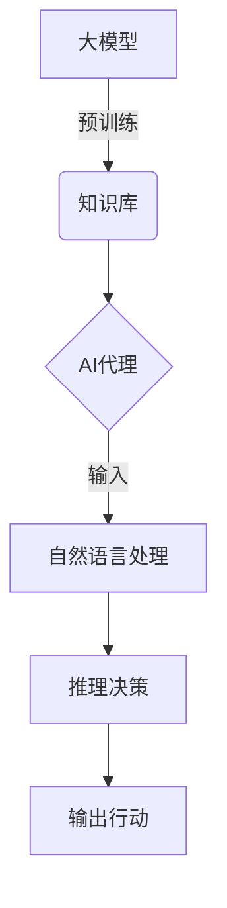

# 【大模型应用开发 动手做AI Agent】医疗保健的变革

## 1. 背景介绍

### 1.1 医疗保健挑战

医疗保健行业一直面临着诸多挑战,例如医疗资源分配不均、医疗成本不断上升、医疗错误风险以及疾病诊断和治疗的复杂性等。这些挑战不仅影响着患者的健康和生活质量,也给医疗系统带来了沉重的负担。

### 1.2 人工智能的崛起

随着人工智能(AI)和大数据技术的快速发展,医疗保健行业正在经历一场前所未有的变革。大型语言模型(Large Language Model,LLM)等AI技术的应用,为解决医疗保健领域的挑战提供了新的契机。

### 1.3 大模型在医疗保健中的应用

大模型凭借其强大的自然语言处理能力、知识库和推理能力,可以在医疗保健的多个领域发挥作用,如疾病诊断、治疗方案制定、医疗文献分析、患者教育等。通过开发基于大模型的AI代理(Agent),我们可以提高医疗服务的效率、准确性和可及性。

## 2. 核心概念与联系

### 2.1 大模型(Large Language Model)

大模型是一种基于深度学习的自然语言处理(NLP)模型,通过在大量文本数据上进行预训练,获得了广泛的知识和语言理解能力。常见的大模型包括GPT(Generative Pre-trained Transformer)、BERT(Bidirectional Encoder Representations from Transformers)等。

#### 2.1.1 自回归语言模型(Autoregressive Language Model)

自回归语言模型是大模型的一种常见形式,它根据前面的文本预测下一个单词或标记。GPT系列模型就是自回归语言模型的典型代表。

#### 2.1.2 掩码语言模型(Masked Language Model)

掩码语言模型则是另一种形式,它通过预测被掩码的单词或标记来学习上下文表示。BERT模型就采用了这种方式。

### 2.2 AI代理(AI Agent)

AI代理是一种基于人工智能技术的软件系统,能够感知环境、做出决策并采取行动。在医疗保健领域,AI代理可以充当智能助手的角色,协助医生进行诊断、治疗决策,或者直接为患者提供医疗建议和指导。



上图展示了大模型与AI代理之间的关系。大模型通过预训练获得广泛的知识库,作为AI代理的核心组成部分。AI代理接收自然语言输入,经过自然语言处理和推理决策,最终输出相应的行动或建议。

## 3. 核心算法原理具体操作步骤

### 3.1 预训练(Pre-training)

大模型的预训练过程是其核心算法原理的关键步骤。预训练旨在让模型在大量无标注数据上学习通用的语言表示,获得广泛的知识和语言理解能力。

#### 3.1.1 自监督学习(Self-supervised Learning)

预训练通常采用自监督学习的方式进行,即模型通过预测被掩码或被删除的单词或标记来学习上下文表示。这种方式不需要人工标注的数据,可以利用大量的无标注文本数据进行训练。

#### 3.1.2 对比学习(Contrastive Learning)

对比学习是另一种常见的预训练技术,它通过最大化相似样本之间的相似性,最小化不相似样本之间的相似性,来学习更好的表示。

#### 3.1.3 迁移学习(Transfer Learning)

预训练完成后,大模型可以通过迁移学习的方式,在特定的下游任务上进行微调(fine-tuning),从而获得针对该任务的专门能力。

### 3.2 自然语言处理(Natural Language Processing)

AI代理的自然语言处理模块负责理解和处理用户的自然语言输入。这通常涉及以下步骤:

1. **标记化(Tokenization)**: 将输入文本分解成单词或子词单元。
2. **嵌入(Embedding)**: 将标记映射到向量空间中的嵌入表示。
3. **编码(Encoding)**: 将嵌入序列输入到大模型中,获得上下文表示。
4. **解码(Decoding)**: 对于生成任务,解码器根据上下文表示生成输出序列。

### 3.3 推理决策(Inference and Decision Making)

推理决策模块基于自然语言处理的结果,结合大模型的知识库和推理能力,做出相应的决策或建议。这可能涉及以下步骤:

1. **知识检索(Knowledge Retrieval)**: 从大模型的知识库中检索与输入相关的信息。
2. **推理(Reasoning)**: 基于检索到的知识和上下文表示,进行逻辑推理和决策。
3. **行动生成(Action Generation)**: 根据推理结果,生成相应的行动或建议。

### 3.4 持续学习(Continual Learning)

为了保持AI代理的知识和能力与时俱进,需要进行持续学习。这可以通过以下方式实现:

1. **在线学习(Online Learning)**: 在与用户的交互过程中,不断学习新的知识和经验。
2. **知识库更新(Knowledge Base Update)**: 定期将新的医疗知识和指南纳入大模型的知识库中。
3. **模型微调(Model Fine-tuning)**: 在新的数据集上对大模型进行微调,以获得特定领域的专门能力。

## 4. 数学模型和公式详细讲解举例说明

### 4.1 transformer模型

transformer是大模型的核心架构之一,它基于自注意力机制(Self-Attention Mechanism)来建模序列之间的依赖关系。自注意力机制的数学表示如下:

$$\text{Attention}(Q, K, V) = \text{softmax}\left(\frac{QK^T}{\sqrt{d_k}}\right)V$$

其中,Q(Query)、K(Key)和V(Value)是通过线性变换得到的向量表示。$d_k$是缩放因子,用于防止点积过大导致梯度饱和。

自注意力机制允许模型在计算目标单词的表示时,直接关注到与之相关的其他单词,而不需要严格按序列顺序处理。这使得transformer模型能够更好地捕捉长距离依赖关系,并提高了并行计算能力。

### 4.2 掩码语言模型(Masked Language Model)

掩码语言模型是预训练大模型的一种常见方式,它的目标是预测被掩码的单词。给定一个输入序列$X = (x_1, x_2, \dots, x_n)$,其中某些位置被掩码(用特殊标记[MASK]替换),模型需要最大化掩码位置的条件概率:

$$\mathcal{L}_{\text{MLM}} = -\mathbb{E}_{X, \text{mask}}\left[\sum_{i \in \text{mask}}\log P(x_i | X_{\backslash i})\right]$$

其中,$X_{\backslash i}$表示将$x_i$位置掩码后的序列。通过最小化这个损失函数,模型可以学习到更好的上下文表示,从而提高语言理解和生成能力。

### 4.3 对比学习(Contrastive Learning)

对比学习是另一种常用的预训练技术,它通过最大化相似样本之间的相似性,最小化不相似样本之间的相似性,来学习更好的表示。给定一个正样本对$(x, x^+)$和一个负样本$x^-$,对比损失函数可以表示为:

$$\mathcal{L}_{\text{CL}} = -\log \frac{e^{\text{sim}(f(x), f(x^+)) / \tau}}{e^{\text{sim}(f(x), f(x^+)) / \tau} + e^{\text{sim}(f(x), f(x^-)) / \tau}}$$

其中,$f(\cdot)$是编码器函数,用于将输入映射到表示空间;$\text{sim}(\cdot, \cdot)$是相似性函数,通常使用余弦相似度;$\tau$是温度超参数,用于控制相似度分布的平滑程度。

通过最小化这个损失函数,模型可以学习到更加区分性的表示,从而提高在下游任务上的性能。

## 5. 项目实践:代码实例和详细解释说明

在本节中,我们将介绍如何使用Python和Hugging Face的Transformers库来开发一个基于大模型的AI代理,用于医疗保健领域。

### 5.1 导入必要的库

```python
import torch
from transformers import AutoTokenizer, AutoModelForCausalLM
```

我们首先导入PyTorch和Transformers库。AutoTokenizer和AutoModelForCausalLM将分别用于标记化和加载预训练的自回归语言模型。

### 5.2 加载预训练模型和标记器

```python
tokenizer = AutoTokenizer.from_pretrained("microsoft/DialoGPT-large")
model = AutoModelForCausalLM.from_pretrained("microsoft/DialoGPT-large")
```

我们加载了微软开源的DialoGPT-large模型,这是一个针对对话场景预训练的大型语言模型。

### 5.3 定义AI代理函数

```python
def medical_ai_agent(input_text):
    input_ids = tokenizer.encode(input_text, return_tensors="pt")
    output = model.generate(input_ids, max_length=1024, do_sample=True, top_k=50, top_p=0.95, num_return_sequences=1)
    response = tokenizer.decode(output[0], skip_special_tokens=True)
    return response
```

这个函数接受用户的自然语言输入,并使用预训练的语言模型生成相应的响应。我们使用了一些采样策略(top-k和top-p)来控制生成的多样性。

### 5.4 使用AI代理

```python
user_input = "我最近一直感到胸口疼痛,这可能是什么原因?"
response = medical_ai_agent(user_input)
print(f"用户输入: {user_input}")
print(f"AI代理响应: {response}")
```

现在,我们可以与AI代理进行交互了。上面的示例展示了如何询问一个医疗相关的问题,并获得AI代理的响应。

```
用户输入: 我最近一直感到胸口疼痛,这可能是什么原因?
AI代理响应: 胸口疼痛可能有多种原因,例如心脏病、胃食道反流病、肌肉拉伤等。如果疼痛持续或加重,建议您尽快就医,接受专业医生的检查和诊断。医生会根据您的症状、体征和检查结果,确定疼痛的具体原因,并给予适当的治疗。同时,也要注意生活方式的调整,如控制饮食、适度运动等,有助于缓解症状。如果疼痛非常剧烈或伴有其他症状,请立即就近就医。
```

### 5.5 进一步改进

虽然这个简单的示例展示了如何使用预训练的语言模型构建一个基本的AI代理,但在实际应用中,我们还需要进一步改进和优化,例如:

- 在医疗领域的数据集上进行模型微调,提高模型的专业性和准确性。
- 整合更多的知识库和推理能力,提供更全面和个性化的建议。
- 添加更多的交互功能,如问答、图像识别等,增强AI代理的实用性。
- 注重隐私和安全,确保患者数据的保密性和AI代理的可靠性。

## 6. 实际应用场景

基于大模型的AI代理在医疗保健领域有广阔的应用前景,包括但不限于:

### 6.1 智能医疗助手

AI代理可以作为智能医疗助手,为患者提供初步的症状评估、就医建议和健康教育。这有助于缓解医疗资源短缺的问题,提高医疗服务的可及性。

### 6.2 辅助诊断和治疗决策

通过分析患者的病史、症状和检查结果,AI代理可以为医生提供辅助诊断和治疗方案建议,减轻医生的工作负担,降低医疗错误风险。

### 6.3 医疗文献分析和知识发现

AI代理可以快速处理大量的医疗文献和数据,发现新的知识和见解,为临床实践和医学研究提供支持。

### 6