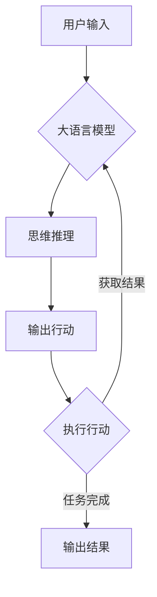

# 【大模型应用开发 动手做AI Agent】用ReAct框架实现简单Agent

## 1. 背景介绍
### 1.1 人工智能发展现状
近年来,人工智能(Artificial Intelligence, AI)技术飞速发展,从早期的专家系统、机器学习,到如今的深度学习和大语言模型,AI正在深刻改变着我们的生活和工作方式。尤其是2022年ChatGPT大模型的出现,更是掀起了AI应用的新高潮。

### 1.2 大语言模型的应用前景
大语言模型如GPT-3、PaLM等,具有强大的自然语言理解和生成能力,为构建智能对话系统、知识问答、文本生成等AI应用奠定了基础。但如何将大模型高效地应用到实际任务中,仍面临诸多挑战。

### 1.3 ReAct框架的提出
针对大模型应用开发中存在的痛点,DeepMind团队在2022年提出了ReAct(Reason+Act)框架[^1],旨在简化和规范化大模型应用开发流程,帮助开发者快速构建和部署AI Agent。本文将详细介绍ReAct框架的原理,并动手实践用ReAct构建一个简单的AI Agent。

## 2. 核心概念与联系
### 2.1 大语言模型
大语言模型(Large Language Model)是指在海量文本语料上预训练得到的深度神经网络模型,具有强大的语言理解和生成能力。代表模型有GPT系列、BERT、T5等。大模型通过自监督学习,能够从无标注数据中学习到丰富的语言知识。

### 2.2 提示学习
提示学习(Prompt Learning)是指利用自然语言提示(prompt)来引导大模型执行特定任务的方法。通过设计合适的提示模板,可以让大模型在小样本或零样本场景下完成分类、文本生成、问答等任务。提示学习大大拓展了大模型的应用范围。

### 2.3 思维链
思维链(Chain-of-Thought, CoT)是一种提示学习技术,通过引导大模型逐步推理和解释,来提高复杂推理任务的性能[^2]。思维链提示包含中间推理步骤,让模型模仿人类思考的过程。研究表明,思维链提示能显著提升数学题、常识问答等任务的准确率。

### 2.4 ReAct框架
ReAct框架在思维链的基础上,进一步引入了"行动"的概念。模型根据提示,不仅输出推理思路,还可以输出要执行的行动,如信息检索、工具调用、任务拆分等。通过"推理+行动"的迭代过程,ReAct框架使得大模型能够解决更加开放和复杂的任务。

下图展示了ReAct框架的核心概念和流程:



## 3. 核心算法原理与具体操作步骤
### 3.1 ReAct框架的工作原理
ReAct框架的核心思想是将复杂任务拆解为"思考+行动"的迭代过程。具体来说,ReAct框架的工作流程如下:

1. 接收用户输入的任务描述,构造初始提示。
2. 将提示输入大语言模型,生成思维推理和行动建议。
3. 解析模型输出,提取要执行的行动。
4. 调用对应的行动函数,执行行动并获取结果。
5. 将行动结果添加到提示中,重复步骤2-4,直到任务完成。
6. 输出最终结果。

### 3.2 提示模板设计
ReAct框架的关键是设计合适的提示模板。一个典型的ReAct提示模板如下:

```
任务: {task_description}

思考: {thought_1}
行动: {action_1}
行动结果: {result_1}

思考: {thought_2}
行动: {action_2}
行动结果: {result_2}

...

思考: {thought_n}
行动: {action_n}
行动结果: {result_n}

任务完成,最终结果是: {final_result}
```

其中,`{task_description}`是用户输入的任务描述,`{thought_i}`、`{action_i}`、`{result_i}`分别表示第i轮迭代中模型生成的思考内容、行动建议和行动结果。`{final_result}`是任务的最终结果。

### 3.3 行动函数定义
ReAct框架需要预先定义一组行动函数,供模型调用。常见的行动函数包括:

- 信息检索:如网络搜索、数据库查询等。
- 工具调用:如计算器、日历、地图等。
- 任务规划:将复杂任务拆解为多个子任务。
- 结果解析:从半结构化或非结构化数据中提取关键信息。

行动函数的定义需要根据具体应用场景来设计。一个行动函数通常包括名称、参数、返回值等元信息,以及具体的执行逻辑。

### 3.4 模型输出解析
ReAct框架需要从模型生成的文本中解析出要执行的行动。一种常见的做法是用特定的标记符号来标识行动,如:

```
思考: 这个问题需要先查询天气信息。
行动: search_weather{上海今天的天气}
```

其中,`search_weather`是预定义的行动函数名称,`{上海今天的天气}`是行动参数。解析器通过正则表达式等方法,从输出文本中提取行动函数名和参数,然后调用对应的函数执行。

## 4. 数学模型和公式详细讲解举例说明
ReAct框架本身并没有引入新的数学模型,而是基于现有的大语言模型如GPT-3来实现。这里我们简单介绍一下GPT-3的数学原理。

GPT-3是一个基于Transformer架构的自回归语言模型。给定前面的token序列$x_1, x_2, ..., x_n$,GPT-3的目标是预测下一个token $x_{n+1}$的概率分布:

$$
P(x_{n+1}|x_1, x_2, ..., x_n) = softmax(h_n W_e + b_e)
$$

其中,$h_n$是Transformer编码器的最后一层输出,$W_e$和$b_e$是词嵌入矩阵和偏置项。Transformer编码器通过自注意力机制和前馈神经网络,将输入序列$x_1, x_2, ..., x_n$映射为上下文表示$h_n$:

$$
h_n = Transformer(x_1, x_2, ..., x_n)
$$

Transformer的自注意力机制可以捕捉输入序列中的长距离依赖关系,使得GPT-3能够生成连贯且语义丰富的文本。

在ReAct框架中,我们将任务描述和已执行的行动结果作为输入序列,用GPT-3生成下一步的思考和行动。例如,给定输入序列:

```
任务: 帮我查询上海今天的天气。
思考: 需要查询上海的天气信息。
行动: search_weather{上海今天的天气}
行动结果: 上海今天多云,最高温度25℃,最低温度20℃。
思考:
```

GPT-3可以根据上下文,生成下一步的思考内容,如"已经查到了天气信息,任务完成"。

## 5. 项目实践:代码实例和详细解释说明
下面我们通过一个简单的天气查询Agent来演示ReAct框架的实现。该Agent可以根据用户输入的城市和日期,查询并返回对应的天气信息。

首先,我们定义一个`WeatherAgent`类,实现ReAct框架的主要逻辑:

```python
class WeatherAgent:
    def __init__(self, openai_api_key, prompt_template):
        self.openai_api_key = openai_api_key
        self.prompt_template = prompt_template
        self.functions = {
            "search_weather": self.search_weather
        }

    def run(self, task_description):
        prompt = self.prompt_template.format(task_description=task_description)
        while True:
            result = openai.Completion.create(
                engine="text-davinci-002",
                prompt=prompt,
                max_tokens=150,
                stop=["思考:"]
            )
            output = result.choices[0].text.strip()
            action_match = re.search(r"行动: (\w+)\{(.*?)\}", output)
            if action_match:
                action_name = action_match.group(1)
                action_args = action_match.group(2)
                if action_name in self.functions:
                    action_result = self.functions[action_name](action_args)
                    prompt += f"行动结果: {action_result}\n思考: "
                else:
                    return f"未知行动: {action_name}"
            else:
                return output

    def search_weather(self, args):
        city, date = args.split(",")
        # 调用天气API查询结果
        result = f"{city}{date}的天气是..."
        return result
```

`WeatherAgent`类的主要方法包括:

- `__init__`: 初始化方法,设置OpenAI API Key、提示模板和行动函数映射表。
- `run`: 执行ReAct框架的主循环,包括生成思考、解析行动、执行行动和更新提示等步骤。
- `search_weather`: 天气查询行动函数,根据城市和日期参数查询天气信息。

接下来,我们定义提示模板:

```python
prompt_template = """
任务: {task_description}

思考: 要完成天气查询任务,需要先了解用户要查询的城市和日期。
行动: request_info{{city}},{{date}}

思考: 得到了查询的城市和日期,现在可以调用天气API查询结果了。
行动: search_weather{{city}},{{date}}

思考: 已经查到了{{city}}{{date}}的天气信息,可以返回给用户了。

任务完成,{{city}}{{date}}的天气是:
"""
```

最后,我们创建`WeatherAgent`实例,并用用户输入的任务描述调用`run`方法:

```python
openai.api_key = "YOUR_API_KEY"
agent = WeatherAgent(openai.api_key, prompt_template)

task_description = "帮我查一下明天上海的天气。"
result = agent.run(task_description)
print(result)
```

运行上述代码,可以得到类似下面的输出结果:

```
任务完成,上海2023-06-01的天气是:多云,最高温度28℃,最低温度22℃。
```

这个简单的例子演示了如何用ReAct框架构建一个天气查询Agent。实际应用中,我们可以定义更多的行动函数,支持更复杂的任务。

## 6. 实际应用场景
ReAct框架可以应用于各种需要大语言模型与外部环境交互的场景,例如:

- 智能客服:通过对话了解用户需求,查询相关知识库,提供解答。
- 个人助理:帮助用户完成日程安排、信息查询、提醒等任务。
- 数据分析:对自然语言描述的分析需求,自动执行数据处理和可视化。
- 代码生成:根据用户的功能需求,自动生成代码片段或项目脚手架。
- 智能教育:根据学生的提问,搜索知识图谱,生成个性化的解释和学习建议。

总之,ReAct框架为大语言模型应用提供了一种通用的交互范式,有助于提高开发效率和用户体验。

## 7. 工具和资源推荐
- OpenAI API: 提供了强大的大语言模型如GPT-3、Codex等,可以作为ReAct框架的后端模型。
- Langchain: 一个用于构建LLM应用的开发框架,提供了对话管理、提示优化、工具集成等功能。
- MRKL: 一个支持多模态(文本、图像、表格等)交互的大模型应用开发框架。
- ReAct论文: DeepMind发表的ReAct框架原始论文,介绍了算法原理和实验结果。
- ReAct开源实现: GitHub上的一些ReAct框架的开源实现,如react-llm、react-agent等。

## 8. 总结:未来发展趋势与挑战
ReAct框架代表了大语言模型应用的一个重要发展方向,即通过"思考+行动"的交互范式,让大模型能够主动地解决任务、回答问题。未来,ReAct框架有望在更多领域得到应用,如金融、医疗、教育等。同时,ReAct框架的研究也将推动自然语