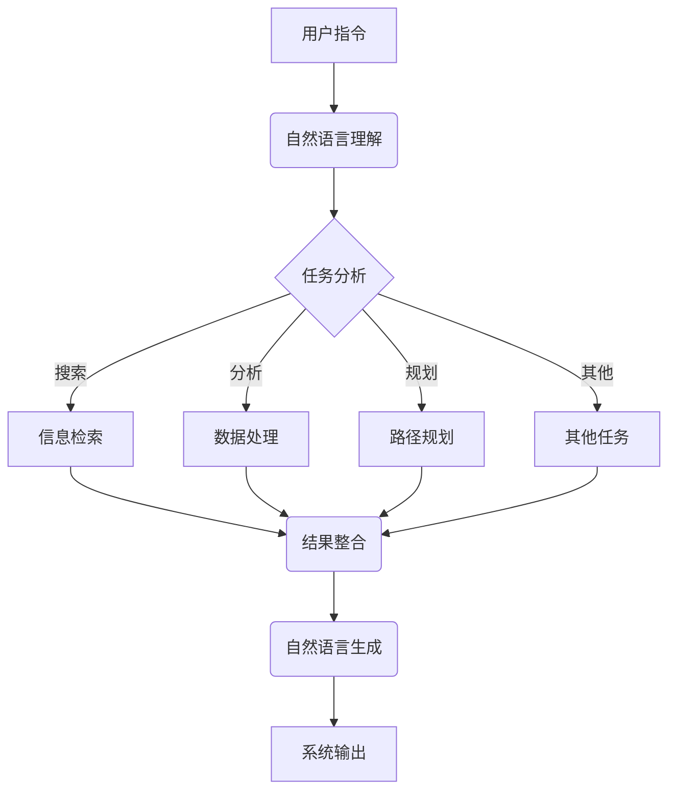
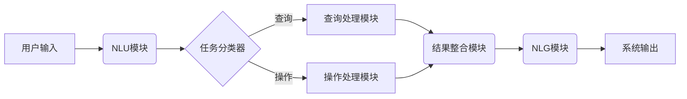

# 【大模型应用开发 动手做AI Agent】第一轮行动：工具执行搜索

## 1.背景介绍

### 1.1 人工智能的崛起

近年来,人工智能(Artificial Intelligence,AI)技术的飞速发展正在重塑各个行业,催生出无数创新应用。随着计算能力的不断提升和算法模型的不断优化,AI系统在语音识别、图像处理、自然语言处理等领域展现出超乎想象的能力,甚至在某些特定任务上已经超越了人类水平。

### 1.2 大模型的兴起

在AI技术的多个分支中,大模型(Large Language Model,LLM)凭借其强大的语言理解和生成能力,成为了当前最炙手可热的技术之一。大模型通过在海量文本数据上进行预训练,学习到了丰富的语义知识和上下文关联能力,可以生成看似人类水平的自然语言输出。

### 1.3 AI Agent:大模型的终极形态

AI Agent可以被视为大模型的终极形态。它不仅具备大模型的语言理解和生成能力,还能够根据用户的指令,执行各种复杂的任务,如搜索、分析、规划、决策等,展现出类人工智能的能力。AI Agent的出现标志着人工智能迈向通用人工智能(Artificial General Intelligence,AGI)的重要一步。

## 2.核心概念与联系

### 2.1 什么是AI Agent?

AI Agent是一种智能系统,能够感知环境、分析信息、做出决策并执行相应行为,以完成特定任务。它由以下几个核心组件构成:

- 感知器(Sensor):用于获取环境信息
- 执行器(Actuator):用于对环境执行操作
- 知识库(Knowledge Base):存储系统所掌握的知识
- 推理引擎(Inference Engine):根据知识库做出决策

### 2.2 大模型与AI Agent

大模型为AI Agent提供了强大的自然语言理解和生成能力,使其能够与人类用户进行自然语言交互。同时,大模型预训练过程中获取的广博知识,为AI Agent的知识库奠定了基础。

而AI Agent则赋予了大模型"行为"的能力,使其不仅能够回答问题,还能根据指令执行各种复杂任务,如搜索、分析、规划、编程等。

### 2.3 AI Agent的工作流程

AI Agent的典型工作流程如下所示:



1. 用户通过自然语言向AI Agent下达指令
2. AI Agent使用自然语言理解模块分析指令的语义
3. 任务分析模块确定需要执行的具体任务类型
4. 根据任务类型,调用相应的功能模块执行任务
   - 搜索:信息检索模块从知识库或互联网中查找相关信息
   - 分析:数据处理模块对信息进行清洗、整理、分析等操作
   - 规划:路径规划模块制定行动计划
   - 其他:其他特殊任务模块
5. 结果整合模块将各模块的输出进行融合
6. 自然语言生成模块将结果转化为自然语言输出
7. 系统以自然语言的形式向用户呈现最终结果

## 3.核心算法原理具体操作步骤

AI Agent的核心算法主要包括以下几个方面:

### 3.1 自然语言理解

自然语言理解(Natural Language Understanding,NLU)是AI Agent与人类进行自然语言交互的基础。它的主要任务是将用户的自然语言输入转化为计算机可以理解的语义表示。

常用的NLU算法包括:

1. **词法分析(Tokenization)**:将自然语言文本切分为单词序列
2. **词性标注(Part-of-Speech Tagging)**:为每个单词标注其词性
3. **命名实体识别(Named Entity Recognition)**:识别出文本中的人名、地名、组织机构名等命名实体
4. **句法分析(Syntactic Parsing)**:构建文本的句法树,确定词与词之间的关系
5. **语义分析(Semantic Analysis)**:提取文本的语义表示,包括实体、关系、事件等

以"查找纽约附近的中餐馆"为例,NLU模块可能会输出如下语义表示:

```json
{
  "intent": "search",
  "item": "餐馆",
  "cuisine": "中餐",
  "location": {
    "city": "纽约",
    "relation": "附近"
  }
}
```

### 3.2 任务规划与执行

任务规划(Task Planning)模块根据NLU模块输出的语义表示,确定需要执行的具体任务类型,并调用相应的功能模块执行任务。

以上例为例,任务规划模块会识别出这是一个搜索类任务,需要调用信息检索模块从知识库或互联网中查找符合条件的餐馆信息。

各功能模块的具体算法因任务类型而异,如:

- **信息检索**:基于关键词搜索、语义搜索等检索算法
- **数据处理**:基于规则、统计模型或深度学习模型进行数据清洗、聚类、分类等操作
- **路径规划**:基于图算法(如A*算法)、优化算法等规划最优路径
- **...**

### 3.3 自然语言生成

自然语言生成(Natural Language Generation,NLG)模块将任务执行的结果转化为自然语言输出,以便AI Agent与用户进行自然语言交互。

NLG的核心是序列生成问题,常用的算法有:

1. **基于模板(Template-based)**:根据预定义的模板拼接生成文本
2. **基于规则(Rule-based)**:根据一系列语法、语义规则生成文本
3. **基于统计模型(Statistical Model)**:如N-gram语言模型、最大熵模型等
4. **基于神经网络(Neural Network)**:如Seq2Seq、Transformer等

其中,基于大模型的NLG算法由于其强大的语言生成能力,已经成为主流方法。

## 4.数学模型和公式详细讲解举例说明

在AI Agent的多个模块中,都会涉及到一些数学模型和公式,下面将对其中一些核心模型进行详细讲解。

### 4.1 自然语言处理中的注意力机制

注意力机制(Attention Mechanism)是自然语言处理领域的一种关键技术,它赋予模型有选择性地聚焦于输入序列的不同部分的能力,从而提高了模型的性能。

注意力机制的数学表达式如下:

$$\begin{aligned}
\text{Attention}(Q, K, V) &= \text{softmax}(\frac{QK^T}{\sqrt{d_k}})V \
\text{head}_i &= \text{Attention}(QW_i^Q, KW_i^K, VW_i^V) \
\text{MultiHead}(Q, K, V) &= \text{Concat}(\text{head}_1, \ldots, \text{head}_h)W^O
\end{aligned}$$

其中:

- $Q$、$K$、$V$分别表示Query、Key和Value
- $W_i^Q$、$W_i^K$、$W_i^V$、$W^O$是可学习的权重矩阵
- $\sqrt{d_k}$是缩放因子,用于防止点积的值过大导致梯度消失或爆炸

以机器翻译任务为例,在将"I am a student"翻译成"我是一名学生"时,注意力机制可以让模型更多地关注"student"一词,从而产生正确的翻译结果。

### 4.2 强化学习中的Q-Learning算法

Q-Learning是强化学习领域的一种经典算法,常用于解决序列决策问题,如机器人路径规划等。它的核心思想是通过不断探索和利用,学习出在每个状态下执行每个动作的长期回报值(Q值),从而优化决策序列。

Q-Learning算法的伪代码如下:

```
初始化 Q(s, a) // 所有状态动作对的Q值
repeat:
    观测当前状态 s
    根据 epsilon-greedy 策略选择动作 a
    执行动作 a, 获得回报 r, 转移到新状态 s'
    Q(s, a) = Q(s, a) + alpha * (r + gamma * max_a' Q(s', a') - Q(s, a))
    s = s'
until 终止
```

其中:

- $\epsilon$-greedy策略平衡了探索(exploration)和利用(exploitation)
- $\alpha$是学习率,控制着新知识的学习速度
- $\gamma$是折现因子,控制着未来回报的重视程度

通过不断迭代更新Q值,最终可以得到一个最优的Q函数,指导Agent在每个状态下选择能获得最大累计回报的动作。

## 5.项目实践:代码实例和详细解释说明

为了更好地理解AI Agent的工作原理,我们将通过一个简单的示例项目进行实践。该项目的目标是开发一个简单的任务型对话系统,能够根据用户的自然语言指令执行特定的任务。

### 5.1 项目架构



该项目主要包括以下几个模块:

1. **NLU模块**:将用户输入的自然语言转化为语义表示
2. **任务分类器**:根据NLU输出,判断用户的意图是查询还是执行操作
3. **查询处理模块**:处理查询类任务,从知识库中检索相关信息
4. **操作处理模块**:处理操作类任务,如文件操作、计算等
5. **结果整合模块**:将各模块的输出进行整合
6. **NLG模块**:将结果转化为自然语言输出

### 5.2 代码示例

下面是一个简单的Python实现,仅供参考:

```python
# NLU模块
import nltk
def nlu(text):
    tokens = nltk.word_tokenize(text)
    tags = nltk.pos_tag(tokens)
    entities = nltk.chunk.ne_chunk(tags)
    # 进一步处理,提取语义表示
    ...
    return semantic_repr

# 任务分类器
def classify_task(semantic_repr):
    if semantic_repr['intent'] == 'query':
        return 'query'
    else:
        return 'operation'

# 查询处理模块
def query_handler(semantic_repr):
    # 从知识库检索相关信息
    ...
    return query_result

# 操作处理模块
def operation_handler(semantic_repr):
    # 执行相应操作
    ...
    return operation_result

# 结果整合模块
def result_aggregator(query_result, operation_result):
    # 整合查询和操作结果
    ...
    return final_result

# NLG模块
import transformers
nlg_model = transformers.AutoModelForCausalLM.from_pretrained('gpt2')
def nlg(final_result):
    # 使用大模型生成自然语言输出
    output = nlg_model.generate(final_result, max_length=100, ...)
    return output

# 主循环
while True:
    user_input = input('> ')
    semantic_repr = nlu(user_input)
    task_type = classify_task(semantic_repr)
    if task_type == 'query':
        query_result = query_handler(semantic_repr)
        final_result = result_aggregator(query_result, None)
    else:
        operation_result = operation_handler(semantic_repr)
        final_result = result_aggregator(None, operation_result)
    system_output = nlg(final_result)
    print(system_output)
```

在这个示例中,我们使用了NLTK库进行简单的自然语言理解,并模拟了查询处理、操作处理和结果整合等模块的功能。最后,我们利用预训练的GPT-2大模型生成自然语言输出。

当然,这只是一个非常简单的实现,实际的AI Agent系统会更加复杂和强大。但通过这个例子,您应该能够对AI Agent的基本工作流程有一个初步的理解。

## 6.实际应用场景

AI Agent技术由于其通用性和强大的能力,在诸多领域都有广阔的应用前景,下面列举了