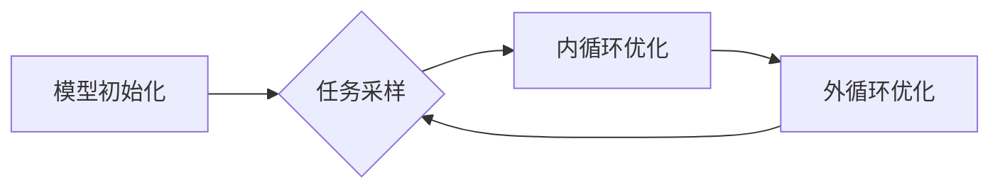

# 一切皆是映射：终身学习与元学习的关系

## 1.背景介绍
### 1.1 终身学习的必要性
在当今瞬息万变的时代,知识更新的速度越来越快。为了保持竞争力,个人和组织都需要不断学习和适应新的知识与技能。终身学习已成为现代社会的必然要求。

### 1.2 元学习的兴起
元学习(Meta-Learning),又称"学会学习"(Learning to Learn),是机器学习领域的一个新兴分支。它旨在让机器像人一样,通过学习如何学习,快速适应和掌握新知识,甚至创造出新的学习范式。元学习为实现通用人工智能(AGI)提供了新的思路。

### 1.3 映射的普遍性
从数学的角度看,学习本质上是一种映射(Mapping)过程。它把输入空间(如特征)映射到输出空间(如标签)。事实上,自然界和人类社会的很多现象,都可以用映射来描述。因此,深入理解映射的内涵,对于洞察学习的本质具有重要意义。

## 2.核心概念与联系
### 2.1 终身学习
终身学习(Lifelong Learning)是指个人在整个生命历程中,不断获取新知识、新技能,持续提升自我的过程。它强调学习应贯穿人的一生,适应时代发展需要。

### 2.2 元学习
元学习是一种让机器学习算法能够从以往的学习经验中总结规律,形成"学习的学习"能力的方法。通俗地说,它让机器拥有了学习新知识的"套路"。

#### 2.2.1 元学习的分类
- 基于度量的元学习(Metric-based)
- 基于模型的元学习(Model-based)
- 基于优化的元学习(Optimization-based)

#### 2.2.2 MAML算法
模型不可知元学习(Model-Agnostic Meta-Learning, MAML)是一种广泛使用的元学习算法。它通过两层优化,让模型参数能快速适应新任务:
- 内循环:在支撑集(Support Set)上进行梯度下降,使模型适应新任务。
- 外循环:在查询集(Query Set)上计算损失,并更新初始参数。

### 2.3 映射
映射是指两个集合X和Y之间的对应关系f: X→Y,使得X中每个元素x,在Y中都有唯一确定的像f(x)与之对应。从输入到输出的转换过程,都可视为一种映射。

#### 2.3.1 学习与映射
学习的本质是寻找一个映射f,使得输入数据x通过f作用后,输出结果f(x)与真实标签y尽可能接近。优化目标可表示为:
$$\min_{f} \mathcal{L}(f(x), y)$$

其中$\mathcal{L}$为损失函数,衡量f(x)和y之间的差异。

### 2.4 终身学习与元学习的关系
终身学习和元学习都强调从经验中学习,并将其应用到新情景中。元学习为实现终身学习提供了技术路径:
- 元学习让机器具备快速学习新知识的能力,这是终身学习的核心要义。
- 终身学习系统可以利用元学习,不断积累和迁移知识,应对新任务。

二者相辅相成,共同推动人工智能走向通用化。

## 3.核心算法原理具体操作步骤
下面以MAML算法为例,详细讲解元学习的实现步骤。

### 3.1 任务定义
给定一组训练任务$\mathcal{T}=\{T_1,\dots,T_n\}$,每个任务$T_i$包含一个支撑集$D_i^{tr}$和一个查询集$D_i^{ts}$。目标是学习一个模型,使其能在支撑集上快速适应,并在查询集上取得好的性能。

### 3.2 模型初始化
定义一个可学习的模型$f_\theta$,其中$\theta$为模型参数。通常选择神经网络作为基础模型。

### 3.3 内循环优化
对每个任务$T_i$,在支撑集$D_i^{tr}$上进行内循环优化。具体步骤为:
1. 计算支撑集上的损失:$\mathcal{L}_{T_i}(f_\theta)=\sum_{(x,y)\in D_i^{tr}} \mathcal{L}(f_\theta(x), y)$
2. 对$\theta$进行一步或多步梯度下降,得到适应后的参数$\theta_i'$:
$$\theta_i'=\theta-\alpha\nabla_\theta \mathcal{L}_{T_i}(f_\theta)$$
其中$\alpha$为内循环学习率。

### 3.4 外循环优化
在查询集$D_i^{ts}$上,用适应后的参数$\theta_i'$计算损失,并对所有任务进行求和:
$$\mathcal{L}(\theta)=\sum_{T_i\sim\mathcal{T}} \mathcal{L}_{T_i}(f_{\theta_i'})$$

然后对$\theta$进行梯度下降,更新初始参数:
$$\theta\leftarrow\theta-\beta\nabla_\theta \mathcal{L}(\theta)$$
其中$\beta$为外循环学习率。

### 3.5 算法流程图


## 4.数学模型和公式详细讲解举例说明
### 4.1 损失函数
MAML中常用的损失函数是交叉熵损失和均方误差损失。以二分类问题为例,交叉熵损失定义为:
$$\mathcal{L}(f_\theta(x), y)=-ylog(f_\theta(x))-(1-y)log(1-f_\theta(x))$$

其中y为真实标签(0或1),f_\theta(x)为模型输出的概率值。

### 4.2 梯度计算
内循环和外循环优化都需要计算梯度。以内循环为例,假设采用一步梯度下降,则适应后的参数为:
$$\theta_i'=\theta-\alpha\nabla_\theta \mathcal{L}_{T_i}(f_\theta)$$

根据链式法则,外循环梯度为:
$$\nabla_\theta \mathcal{L}(\theta)=\sum_{T_i\sim\mathcal{T}} \nabla_{\theta_i'} \mathcal{L}_{T_i}(f_{\theta_i'})\cdot(1-\alpha\nabla_\theta^2 \mathcal{L}_{T_i}(f_\theta))$$

其中$\nabla_\theta^2 \mathcal{L}_{T_i}(f_\theta)$为损失函数的二阶导数,也称为Hessian矩阵。由于计算量大,实践中常忽略二阶项,简化为:
$$\nabla_\theta \mathcal{L}(\theta)\approx\sum_{T_i\sim\mathcal{T}} \nabla_{\theta_i'} \mathcal{L}_{T_i}(f_{\theta_i'})$$

### 4.3 举例说明
考虑一个简单的Few-Shot Learning问题:给定一组5类动物的图像,每类只有1张支撑图像,要求模型在此基础上快速学习分类新图像。

假设模型$f_\theta$为一个3层全连接神经网络,损失函数为交叉熵损失。MAML的优化过程如下:
1. 在5个支撑图像上进行内循环优化,得到适应后的参数$\theta_i'$。
2. 用$\theta_i'$在查询图像上计算损失,并求和得到外循环损失。
3. 对初始参数$\theta$进行梯度下降,更新为$\theta-\beta\nabla_\theta \mathcal{L}(\theta)$。
4. 重复步骤1-3,直到外循环收敛。

经过元训练后,模型能够在新的5类动物图像上,仅用1张支撑图像就实现较高的分类精度。这体现了元学习的快速适应能力。

## 5.项目实践：代码实例和详细解释说明
下面用PyTorch实现一个简单的MAML代码。

```python
import torch
import torch.nn as nn
import torch.optim as optim

class MAML(nn.Module):
    def __init__(self, model, inner_lr, outer_lr, inner_steps):
        super(MAML, self).__init__()
        self.model = model
        self.inner_lr = inner_lr
        self.outer_lr = outer_lr
        self.inner_steps = inner_steps

    def forward(self, support_data, query_data):
        # 内循环优化
        params = list(self.model.parameters())
        for step in range(self.inner_steps):
            support_loss = self.model(support_data)
            grads = torch.autograd.grad(support_loss, params)
            params = [p - self.inner_lr * g for p, g in zip(params, grads)]

        # 外循环优化
        self.model.train()
        query_loss = self.model(query_data)
        self.model.zero_grad()
        query_loss.backward()
        outer_optimizer = optim.Adam(self.model.parameters(), lr=self.outer_lr)
        outer_optimizer.step()

        return query_loss

# 定义基础模型
model = nn.Sequential(
    nn.Linear(784, 256),
    nn.ReLU(),
    nn.Linear(256, 128),
    nn.ReLU(),
    nn.Linear(128, 10)
)

# 实例化MAML
maml = MAML(model, inner_lr=0.01, outer_lr=0.001, inner_steps=5)

# 训练
for epoch in range(num_epochs):
    for support_data, query_data in dataloader:
        loss = maml(support_data, query_data)
        print(f'Epoch: {epoch}, Loss: {loss.item()}')
```

代码说明:
- MAML类接收基础模型、内循环学习率、外循环学习率和内循环步数作为参数。
- forward方法定义了一个完整的元学习过程:
  - 内循环优化在support_data上进行,通过梯度下降更新参数。
  - 外循环优化在query_data上进行,计算损失并用Adam优化器更新初始参数。
- 基础模型是一个3层MLP,用于10分类任务(如MNIST)。
- 主训练循环中,每个batch包含一个support_data和一个query_data,代表一个任务。

以上就是MAML算法的PyTorch实现。实践中还需要注意任务的采样、数据的预处理等问题。

## 6.实际应用场景
元学习在如下场景中有广泛应用:
### 6.1 Few-Shot Learning
Few-Shot Learning旨在通过少量样本学习新概念。元学习可以帮助模型在小样本上快速适应,实现分类、回归等任务。应用包括:
- 药物发现:根据少量分子结构,预测其性质。
- 人脸识别:根据一张照片,认出新的人脸。

### 6.2 自动机器学习(AutoML)
AutoML aims to automate the process of applying machine learning to real-world problems. Meta-learning can be used to learn hyperparameters, neural architectures, and optimization algorithms, which enables AI systems to automatically design and train models. Applications include:
- Neural architecture search: automatically discover high-performance model architectures.
- Hyperparameter optimization: find the best hyperparameters for a given task and dataset.

### 6.3 Continual Learning
Continual learning, or lifelong learning, requires AI systems to continuously learn and accumulate knowledge over time. Meta-learning allows efficient adaptation and avoids catastrophic forgetting when learning new tasks. Applications include:
- Robotics: robots that can learn new skills without forgetting old ones.
- Recommendation systems: adapt to changing user preferences over time.

### 6.4 Reinforcement Learning
Meta-learning has been applied to reinforcement learning to learn policies that can quickly adapt to new tasks. This is known as meta-reinforcement learning. Applications include:
- Robotics control: learn versatile policies that can handle different environments.
- Game playing: adapt game strategies based on opponents' behaviors.

## 7.工具和资源推荐
以下是一些用于研究和实践元学习的工具和资源:
- [Torchmeta](https://github.com/tristandeleu/pytorch-meta): 基于PyTorch的元学习库,实现了MAML、Prototypical Networks等算法。
- [Learn2learn](https://github.com/learnables/learn2learn): 另一个PyTorch元学习库,提供了更高级的API和算法。
- [OpenAI Gym](https://gym.openai.com/): 强化学习环境集合,可用于测试元强化学习算法。
- [Metacademy](https://metacademy.org/): 在线学习平台,提供了元学习的系统教程。
- [Papers with Code](https://paperswithcode.com/task/meta-learning): 收集了元学习领域的重要论文和代码实现。

这些资源可以帮助你更深入地理解元学习,并将其应用到实际问题中。

## 8