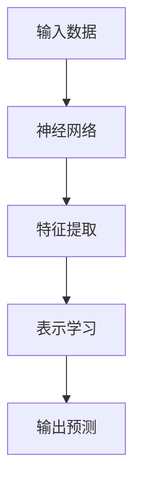
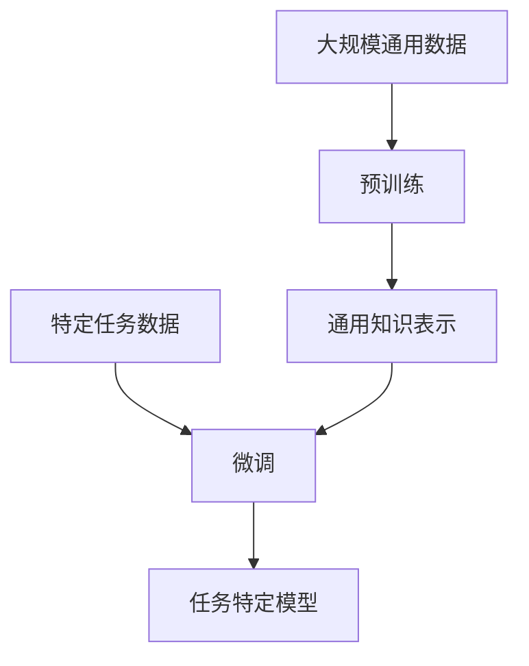

# 从零开始大模型开发与微调：深度学习与人工智能

## 1. 背景介绍

### 1.1 人工智能的崛起

人工智能(Artificial Intelligence, AI)是当代科技发展的核心驱动力之一。近年来,AI技术取得了长足进步,尤其是在深度学习和大型神经网络模型方面。大模型(Large Model)凭借其强大的计算能力和数据处理能力,在自然语言处理、计算机视觉、推理决策等领域展现出了无与伦比的性能。

### 1.2 大模型的重要性

大模型已成为推动人工智能发展的关键力量。通过在海量数据上进行预训练,大模型能够学习到丰富的知识表示,并将其泛化应用于下游任务。著名的大模型如GPT、BERT、DALL-E等,展示了其在生成式任务、理解式任务以及跨模态任务中的卓越表现。

### 1.3 微调技术的作用

尽管大模型拥有强大的能力,但直接将其应用于特定任务往往会遇到一些挑战,例如数据分布的偏移、任务特定的知识缺失等。微调(Fine-tuning)技术通过在目标任务数据上进行进一步训练,可以有效地将大模型的通用知识适配到特定任务,从而提高模型的性能和泛化能力。

## 2. 核心概念与联系

### 2.1 深度学习与神经网络

深度学习(Deep Learning)是机器学习的一个重要分支,它基于人工神经网络(Artificial Neural Network, ANN)这一生物学启发的计算模型。神经网络由多层神经元组成,通过学习数据中的模式,对输入进行特征提取和表示学习,最终实现预测或决策。



### 2.2 大模型的结构

大模型通常采用深层次的神经网络结构,包含数十亿甚至上万亿个参数。常见的大模型架构包括:

1. **Transformer**:基于自注意力机制的序列到序列模型,广泛应用于自然语言处理任务。
2. **卷积神经网络(CNN)**:擅长处理图像和视频数据,在计算机视觉领域表现出色。
3. **生成对抗网络(GAN)**:由生成器和判别器组成,用于生成逼真的图像和视频数据。

### 2.3 预训练与微调

大模型的训练通常分为两个阶段:预训练(Pre-training)和微调(Fine-tuning)。

1. **预训练**:在大规模通用数据集上进行初始训练,学习通用的知识表示。
2. **微调**:在特定任务数据上进行进一步训练,将通用知识适配到目标任务。



通过预训练和微调的组合,大模型能够在保留通用知识的同时,专门化地解决特定任务,实现更高的性能和泛化能力。

## 3. 核心算法原理具体操作步骤

### 3.1 预训练算法

预训练阶段的核心目标是在大规模通用数据上学习通用的知识表示。常见的预训练算法包括:

1. **蒙版语言模型(Masked Language Model, MLM)**: 随机掩蔽输入序列中的部分词元,并训练模型预测被掩蔽的词元。
2. **下一句预测(Next Sentence Prediction, NSP)**: 训练模型判断两个句子是否相关。
3. **自回归语言模型(Autoregressive Language Model)**: 训练模型基于前缀生成下一个词元。

以Transformer为例,预训练算法的具体操作步骤如下:

1. 准备大规模通用语料库,如网页数据、书籍等。
2. 对输入序列进行词元化,并添加特殊标记(如[MASK]、[SEP]等)。
3. 构建MLM和NSP(或自回归)任务的训练样本。
4. 使用掩码多头自注意力和前馈网络对输入进行编码和解码。
5. 计算MLM和NSP(或自回归)任务的损失函数。
6. 使用优化算法(如Adam)更新模型参数。
7. 重复训练,直至模型收敛或达到预设的训练步数。

### 3.2 微调算法

微调阶段的目标是将预训练模型的通用知识适配到特定任务。常见的微调算法包括:

1. **discriminative fine-tuning**: 在目标任务数据上进行有监督训练,更新整个模型的参数。
2. **prompt-based fine-tuning**: 通过设计任务相关的提示,引导预训练模型生成所需的输出。
3. **adapter-based fine-tuning**: 在预训练模型中插入少量可训练的适配器模块,而不更新原始参数。

以discriminative fine-tuning为例,微调算法的具体操作步骤如下:

1. 准备目标任务的训练数据。
2. 将预训练模型的输出层替换为与目标任务相关的输出层。
3. 对输入数据进行必要的预处理,如词元化、特征提取等。
4. 将预处理后的输入传入预训练模型,获取输出表示。
5. 计算目标任务的损失函数,如分类交叉熵损失、回归均方误差等。
6. 使用优化算法(如Adam)更新整个模型的参数。
7. 重复训练,直至模型在验证集上达到最佳性能或达到预设的训练步数。

## 4. 数学模型和公式详细讲解举例说明

### 4.1 注意力机制

注意力机制(Attention Mechanism)是Transformer等大模型的核心组件之一。它允许模型在编码输入序列时,动态地关注与当前预测目标相关的部分,从而提高模型的性能和解释能力。

给定查询向量 $\boldsymbol{q}$、键向量 $\boldsymbol{K}$ 和值向量 $\boldsymbol{V}$,注意力机制的计算过程如下:

$$\begin{aligned}
\text{Attention}(\boldsymbol{Q}, \boldsymbol{K}, \boldsymbol{V}) &= \text{softmax}\left(\frac{\boldsymbol{Q}\boldsymbol{K}^\top}{\sqrt{d_k}}\right)\boldsymbol{V} \
&= \sum_{i=1}^n \alpha_i \boldsymbol{v}_i
\end{aligned}$$

其中, $\alpha_i = \frac{\exp(\boldsymbol{q}\cdot\boldsymbol{k}_i)}{\sum_{j=1}^n\exp(\boldsymbol{q}\cdot\boldsymbol{k}_j)}$ 表示查询向量 $\boldsymbol{q}$ 对键向量 $\boldsymbol{k}_i$ 的注意力权重。

注意力机制能够自适应地捕捉输入序列中与当前预测目标最相关的部分,从而提高模型的表现。

### 4.2 transformer 模型

Transformer 是一种基于注意力机制的序列到序列模型,广泛应用于自然语言处理任务。它的核心组件包括编码器(Encoder)和解码器(Decoder)。

**编码器**的计算过程如下:

1. 将输入序列 $\boldsymbol{X} = (x_1, x_2, \ldots, x_n)$ 映射为嵌入向量 $(\boldsymbol{e}_1, \boldsymbol{e}_2, \ldots, \boldsymbol{e}_n)$。
2. 对嵌入向量进行位置编码,得到 $(\boldsymbol{p}_1, \boldsymbol{p}_2, \ldots, \boldsymbol{p}_n)$。
3. 使用多头自注意力层捕捉输入序列中的长程依赖关系:

$$\boldsymbol{z}_i = \text{MultiHeadAttention}(\boldsymbol{p}_i, \boldsymbol{P}, \boldsymbol{P})$$

4. 对注意力输出进行层归一化和前馈网络变换,得到编码器输出 $(\boldsymbol{h}_1, \boldsymbol{h}_2, \ldots, \boldsymbol{h}_n)$。

**解码器**的计算过程类似,但会额外引入编码器输出作为注意力的键和值,以捕捉输入和输出序列之间的依赖关系。

通过编码器-解码器架构和注意力机制,Transformer 能够有效地建模长序列之间的依赖关系,在机器翻译、文本生成等任务中表现出色。

## 5. 项目实践: 代码实例和详细解释说明

在本节中,我们将通过一个实际的代码示例,演示如何使用 Hugging Face 的 Transformers 库进行大模型的微调。我们将以情感分析任务为例,在 IMDB 电影评论数据集上对预训练的 BERT 模型进行微调。

### 5.1 导入必要的库

```python
from transformers import BertTokenizer, BertForSequenceClassification
from transformers import TrainingArguments, Trainer
from datasets import load_dataset
import torch
```

### 5.2 加载数据集

```python
dataset = load_dataset("imdb")
```

### 5.3 数据预处理

```python
tokenizer = BertTokenizer.from_pretrained("bert-base-uncased")

def preprocess_function(examples):
    return tokenizer(examples["text"], truncation=True, padding="max_length", max_length=512)

tokenized_datasets = dataset.map(preprocess_function, batched=True)
```

### 5.4 设置模型和训练参数

```python
model = BertForSequenceClassification.from_pretrained("bert-base-uncased", num_labels=2)

training_args = TrainingArguments(
    output_dir="./results",
    evaluation_strategy="epoch",
    learning_rate=2e-5,
    per_device_train_batch_size=16,
    per_device_eval_batch_size=16,
    num_train_epochs=3,
    weight_decay=0.01,
)
```

### 5.5 定义训练和评估函数

```python
import numpy as np
from datasets import load_metric

metric = load_metric("accuracy")

def compute_metrics(eval_pred):
    logits, labels = eval_pred
    predictions = np.argmax(logits, axis=-1)
    return metric.compute(predictions=predictions, references=labels)
```

### 5.6 训练模型

```python
trainer = Trainer(
    model=model,
    args=training_args,
    train_dataset=tokenized_datasets["train"],
    eval_dataset=tokenized_datasets["test"],
    compute_metrics=compute_metrics,
)

trainer.train()
```

在上述示例中,我们首先导入必要的库和加载 IMDB 数据集。然后,我们使用 BertTokenizer 对文本数据进行预处理,将其转换为 BERT 模型可以接受的输入格式。

接下来,我们从预训练的 BERT 模型中实例化一个用于序列分类的模型,并设置训练参数。我们还定义了一个用于计算模型性能的评估指标函数。

最后,我们使用 Trainer 类进行模型训练。Trainer 会自动处理数据加载、模型训练、评估和日志记录等步骤。训练完成后,我们就可以使用微调后的模型进行情感分析任务了。

通过这个示例,我们可以看到如何利用 Hugging Face 的 Transformers 库快速实现大模型的微调。该库提供了许多预训练模型和工具,极大地简化了大模型开发和应用的过程。

## 6. 实际应用场景

大模型和微调技术在各种领域都有广泛的应用,包括但不限于:

1. **自然语言处理**: 机器翻译、文本生成、情感分析、问答系统等。
2. **计算机视觉**: 图像分类、目标检测、图像生成、视频理解等。
3. **推理决策**: 知识图谱构建、关系推理、决策支持系统等。
4. **多模态任务**: 视觉问答、图文生成、多模态检索等。

以下是一些具体的应用案例:

- **GPT-3**: 一种大规模的自然语言生成模型,可用于文本生成、机器翻译、问答等任务。
- **DALL-E**: 一种基于大模型的图像生成系统,能够根据自然语言描述生成高质量的图像。
- **AlphaFold**: 一种用于蛋白质结构预测的大模型,在生物信息学领域产生了重大影响。
- **PanGu-Alpha**: 一种由百度开发的大型对话模型,可用于开放域对话、知识问答等任务。

随着计算