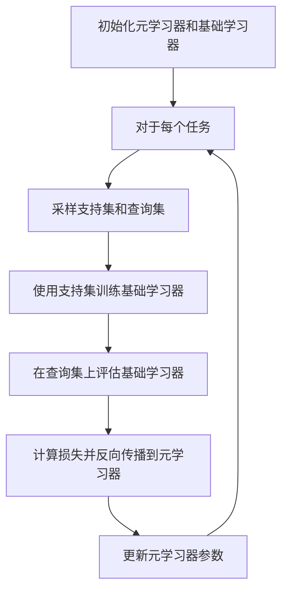

# 元学习(Meta-Learning) - 原理与代码实例讲解

## 1. 背景介绍

### 1.1 机器学习的挑战

在传统的机器学习中,我们通常需要手动设计特征工程,并针对每个新任务重新训练模型。这种方法存在一些固有的局限性:

1. **数据量需求大**:需要为每个任务收集大量的标注数据,这是一个昂贵且耗时的过程。
2. **泛化性差**:针对特定任务训练的模型往往难以泛化到新的相似任务上。
3. **缺乏适应性**:模型无法根据新数据自主调整和学习,需要人工重新训练。

### 1.2 元学习的兴起

为了解决上述挑战,元学习(Meta-Learning)应运而生。元学习旨在设计一种通用的学习算法,使机器能够从过去的经验中积累知识,并将其应用于新的学习任务。这种"学会学习"的能力使得机器可以在新环境下快速适应,并从少量数据中高效学习。

## 2. 核心概念与联系

### 2.1 元学习的定义

元学习可以被形式化定义为一个学习过程,其中一个机器学习模型在一系列相关的任务上进行训练,目的是提高在新任务上的学习效率。

### 2.2 元学习与其他学习范式的关系

- **监督学习**:传统的监督学习旨在从大量标注数据中学习一个特定任务的模型。
- **无监督学习**:无监督学习从未标注的数据中发现潜在模式和结构。
- **强化学习**:强化学习通过与环境交互来学习一个策略,以最大化累积奖励。
- **迁移学习**:迁移学习旨在利用在源域上学习到的知识来改善在目标域上的学习效果。
- **元学习**:元学习关注如何从一系列相关任务中学习一种通用的学习策略,以提高在新任务上的学习效率。

### 2.3 元学习的核心思想

元学习的核心思想是**学习一种快速学习的能力**。具体来说,我们希望模型能够从过去的经验中学习一些可迁移的知识,并在面临新任务时,利用这些知识快速适应新环境,从少量数据中高效学习。

## 3. 核心算法原理具体操作步骤

元学习算法通常由两个关键组件组成:

1. **元学习器(Meta-Learner)**:一个可训练的模型,旨在从一系列相关任务中学习一种通用的学习策略。
2. **基础学习器(Base-Learner)**:一个可训练的模型,负责在特定任务上进行实际学习。

元学习算法的工作流程可以概括为以下几个步骤:



1. **初始化**:初始化元学习器和基础学习器的参数。
2. **任务采样**:从任务分布中采样一个新任务。
3. **数据采样**:从任务数据中采样支持集(用于训练基础学习器)和查询集(用于评估基础学习器)。
4. **基础学习器训练**:使用支持集数据训练基础学习器,通常采用梯度下降等优化方法。
5. **评估与反向传播**:在查询集上评估基础学习器的性能,计算损失,并通过反向传播更新元学习器的参数。
6. **迭代优化**:重复步骤2-5,直到元学习器收敛。

通过上述过程,元学习器可以学习到一种通用的学习策略,使得在新任务上,基础学习器只需少量数据就能快速适应并取得良好性能。

## 4. 数学模型和公式详细讲解举例说明

### 4.1 模型化形式化表示

让我们将元学习过程形式化表示。假设我们有一个任务分布 $p(\mathcal{T})$,其中每个任务 $\mathcal{T}$ 都是由一个数据分布 $p(\mathcal{D}|\mathcal{T})$ 定义的。我们的目标是找到一个可训练的元学习器模型 $f_{\phi}$,使得对于任何来自 $p(\mathcal{T})$ 的新任务 $\mathcal{T}$,基础学习器 $f_{\theta}$ 在经过少量数据 $\mathcal{D}_{\text{trn}}$ 训练后,能够在该任务的测试数据 $\mathcal{D}_{\text{tst}}$ 上取得良好性能。

形式上,我们希望优化以下目标函数:

$$\min_{\phi} \mathbb{E}_{\mathcal{T} \sim p(\mathcal{T})} \left[ \mathbb{E}_{\mathcal{D}_{\text{trn}}, \mathcal{D}_{\text{tst}} \sim p(\mathcal{D}|\mathcal{T})} \left[ \mathcal{L}\left(f_{\theta^*}, \mathcal{D}_{\text{tst}}\right) \right] \right]$$

其中 $\theta^* = \arg\min_{\theta} \mathcal{L}\left(f_{\theta}, \mathcal{D}_{\text{trn}}\right)$ 是在训练数据上优化得到的基础学习器参数。

### 4.2 优化策略: 模型迭代与梯度下降

为了优化上述目标函数,我们可以采用以下策略:

1. 从任务分布 $p(\mathcal{T})$ 中采样一个任务 $\mathcal{T}$。
2. 从该任务的数据分布 $p(\mathcal{D}|\mathcal{T})$ 中采样训练数据 $\mathcal{D}_{\text{trn}}$ 和测试数据 $\mathcal{D}_{\text{tst}}$。
3. 使用训练数据 $\mathcal{D}_{\text{trn}}$ 优化基础学习器参数 $\theta$,得到 $\theta^*$。
4. 在测试数据 $\mathcal{D}_{\text{tst}}$ 上计算损失 $\mathcal{L}\left(f_{\theta^*}, \mathcal{D}_{\text{tst}}\right)$。
5. 通过反向传播,更新元学习器参数 $\phi$,使得损失最小化。
6. 重复步骤1-5,直到收敛。

这个过程可以被视为一种双循环优化:内循环是在每个任务上优化基础学习器参数 $\theta$,外循环则是优化元学习器参数 $\phi$,使得基础学习器能够在新任务上快速适应。

为了有效地优化这个双循环过程,我们可以使用一阶近似或高阶近似等优化技术,如MAML、Reptile等算法。

## 5. 项目实践:代码实例和详细解释说明

### 5.1 MAML算法实现

我们以MAML(Model-Agnostic Meta-Learning)算法为例,展示元学习的具体实现。MAML是一种基于梯度的元学习算法,它可以与任何可微分的模型一起使用。

```python
import torch

# 定义模型
model = MyModel()

# 定义优化器
meta_optimizer = torch.optim.Adam(model.parameters(), lr=meta_lr)

for batch in batches:
    # 采样任务
    tasks = sample_tasks(batch)

    # 计算元梯度
    meta_grads = []
    for task in tasks:
        # 采样支持集和查询集
        support_set, query_set = task

        # 计算支持集损失和梯度
        support_loss = model.forward_loss(support_set)
        grads = torch.autograd.grad(support_loss, model.parameters())

        # 更新模型参数
        updated_params = []
        for param, grad in zip(model.parameters(), grads):
            updated_param = param - task_lr * grad
            updated_params.append(updated_param)

        # 计算查询集损失
        query_loss = model.forward_loss(query_set, params=updated_params)

        # 计算元梯度
        meta_grads.append(torch.autograd.grad(query_loss, model.parameters()))

    # 平均元梯度并更新模型
    meta_grads = torch.mean(torch.stack(meta_grads), dim=0)
    meta_optimizer.zero_grad()
    for param, meta_grad in zip(model.parameters(), meta_grads):
        param.grad = meta_grad
    meta_optimizer.step()
```

上述代码展示了MAML算法的核心部分。首先,我们从批次数据中采样一些任务。对于每个任务,我们从任务数据中采样支持集和查询集。

接下来,我们使用支持集计算损失并获得梯度,然后使用这些梯度更新模型参数。更新后的模型参数将被用于计算查询集损失。

最后,我们计算查询集损失相对于原始模型参数的梯度(即元梯度),并使用这些元梯度更新模型参数。这个过程被重复执行,直到模型收敛。

### 5.2 Reptile算法实现

除了MAML,我们还可以看一个更简单的元学习算法Reptile的实现。Reptile通过在每个任务上进行SGD更新,然后将模型参数移动到所有任务的平均方向,从而实现元学习。

```python
import torch

# 定义模型
model = MyModel()

# 定义优化器
meta_optimizer = torch.optim.SGD(model.parameters(), lr=meta_lr)

for batch in batches:
    # 采样任务
    tasks = sample_tasks(batch)

    # 初始化参数
    original_params = [param.clone() for param in model.parameters()]

    # 在每个任务上进行SGD更新
    for task in tasks:
        support_set, query_set = task

        # 在支持集上优化
        for _ in range(num_steps):
            loss = model.forward_loss(support_set)
            loss.backward()
            meta_optimizer.step()
            meta_optimizer.zero_grad()

    # 将参数移动到所有任务的平均方向
    new_params = [param.clone() for param in model.parameters()]
    for orig_param, new_param in zip(original_params, new_params):
        orig_param.data.sub_(meta_lr * (orig_param.data - new_param.data))
```

在这个实现中,我们首先克隆原始模型参数。然后,对于每个任务,我们在支持集上进行一定步数的SGD更新。最后,我们将模型参数移动到所有任务的平均方向,以实现元学习。

这种方法相对简单,但也证明了在许多情况下能够取得不错的性能。

## 6. 实际应用场景

元学习已经在许多领域展现出了巨大的潜力,包括但不限于:

### 6.1 少样本学习(Few-Shot Learning)

在少样本学习中,我们希望模型能够从极少量的示例中快速学习一个新的概念或类别。元学习提供了一种有效的方式来解决这个问题,使得模型能够从过去的经验中学习一种快速适应新任务的能力。

### 6.2 持续学习(Continual Learning)

持续学习关注于机器学习系统如何在不断接收新数据的同时,保持对之前学习内容的记忆。元学习可以帮助模型从过去的任务中学习一种通用的知识表示,从而更好地适应新任务,而不会遗忘旧知识。

### 6.3 机器人控制(Robot Control)

在机器人控制领域,我们希望机器人能够快速适应新的环境和任务。元学习可以帮助机器人从过去的经验中学习一种通用的控制策略,从而在新环境下更快地适应和学习。

### 6.4 自动机器学习(AutoML)

自动机器学习旨在自动化机器学习管道的设计和优化过程。元学习可以用于学习一种通用的优化策略,从而加速在新的数据集和任务上的模型搜索和调优过程。

## 7. 工具和资源推荐

如果您对元学习感兴趣并希望进一步探索,以下是一些有用的工具和资源:

- **Learn2Learn**: https://github.com/learnables/learn2learn
  - 一个用于元学习研究的PyTorch库,包含了多种元学习算法的实现。
- **Meta-Dataset**: https://github.com/google-research/meta-dataset
  - 一个用于元学习研究的大型基准数据集,包含了来自多个不同领域的数据。
- **Meta-World**: https://meta-world.github.io/
  - 一个用