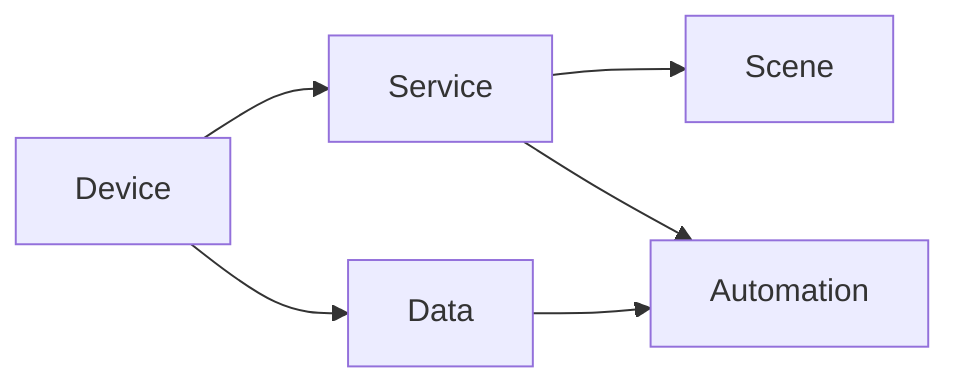

# 基于Java的智能家居设计：构建基于Java的模块化智能家居系统

## 1. 背景介绍

智能家居是物联网技术在家庭生活中的典型应用，通过各种智能设备的互联和数据交互，为用户提供安全、舒适、便捷、节能的居住体验。随着人工智能、大数据、云计算等技术的发展，智能家居系统变得越来越复杂和多样化。如何设计一个灵活、可扩展、易于维护的智能家居系统架构，成为开发者面临的重要课题。

本文将探讨如何利用Java语言及相关技术，设计和实现一个模块化的智能家居系统。我们将从智能家居的核心概念出发，分析系统的功能需求和非功能需求，然后提出一种基于微服务架构和消息队列的系统设计方案。在此基础上，我们还将讨论系统的核心算法、数据建模、接口设计等关键技术细节，并给出具体的代码实现示例。最后，本文还将介绍智能家居系统的实际应用场景、常用的开发工具和学习资源，并展望未来的发展趋势和挑战。

## 2. 核心概念与联系

要设计一个智能家居系统，首先需要理解以下几个核心概念：

- 设备(Device)：智能家居中的各种硬件设备，如智能灯泡、智能门锁、智能音箱等。每个设备都有自己的属性、状态和控制接口。
- 服务(Service)：由设备提供的某种具体的功能，如照明服务、安防服务、音频服务等。一个设备可能提供多种服务。
- 场景(Scene)：多个服务按照一定的逻辑组合在一起，完成某个特定的任务，如"回家模式"、"睡眠模式"等。
- 自动化(Automation)：根据预设的规则或机器学习算法，自动执行特定的场景或任务，如定时开关灯、自动调节温度等。
- 数据(Data)：设备产生的各种数据，包括环境数据（如温度、湿度）、设备状态数据、用户行为数据等。数据经过采集、传输、存储、分析，最终服务于智能决策。

下图展示了智能家居系统的核心概念之间的关系：



设备是智能家居的基础，提供各种服务。服务可以组合成场景，也可以通过自动化规则来触发。设备产生的数据，经过分析处理后，可以反过来优化自动化策略，形成闭环。

## 3. 核心算法原理与操作步骤

智能家居系统需要依赖多种算法来实现智能化功能，其中最关键的是基于规则的自动化决策算法和基于机器学习的用户行为预测算法。

### 3.1 基于规则的自动化决策算法

该算法的核心思想是，将自动化规则抽象为一组条件-动作对(Condition-Action Pair)。每个条件由一个或多个谓词(Predicate)组成，谓词可以是环境状态、设备状态、时间条件、地理位置条件等。每个动作由一个或多个设备控制指令组成。系统在运行时，不断检查各种条件是否满足，如果满足则触发相应的动作。

算法的基本步骤如下：

1. 将自动化规则翻译成条件-动作对的形式，存储在规则库中。
2. 订阅各种事件源(如设备状态变化、环境数据更新)，获取实时数据。
3. 遍历规则库中的每个规则：
   1. 计算该规则的所有谓词，得到一组布尔值。
   2. 对这组布尔值进行逻辑运算(如与或非)，得到规则的最终触发条件。
   3. 如果触发条件为真，执行该规则对应的动作。
4. 等待下一个事件到来，重复步骤2-3。

### 3.2 基于机器学习的用户行为预测算法

该算法的目标是通过分析历史数据，学习用户的行为模式，从而预测用户的下一步操作，提供个性化的服务。常见的机器学习算法包括：

- 关联规则挖掘(Association Rule Mining)：发现用户行为之间的关联性，如"在客厅看电视时，70%的概率会打开灯"。
- 时序模式挖掘(Sequential Pattern Mining)：发现用户行为的时序规律，如"用户每天7点起床后，会先打开卧室的灯，然后去洗手间"。
- 聚类(Clustering)：根据用户行为的相似性，将用户划分为不同的群组，为每个群组提供定制化服务。
- 异常检测(Anomaly Detection)：发现用户行为中的异常情况，如"用户通常9点睡觉，但今天凌晨2点还在活动，可能需要关注"。

这些算法的一般步骤如下：

1. 收集用户的历史行为数据，包括操作时间、地点、设备、环境等多维度信息。
2. 对数据进行清洗、转换、集成，生成适合机器学习的数据集。
3. 根据具体的业务场景和数据特点，选择合适的机器学习算法。
4. 将数据集划分为训练集和测试集，用训练集训练模型，用测试集评估模型的性能。
5. 将训练好的模型部署到线上环境，接收实时数据，给出预测结果。
6. 持续监控模型的性能，定期使用新数据重新训练模型，保持预测的准确性。

## 4. 数学模型和公式详细讲解举例说明

在智能家居系统中，我们经常需要对环境数据进行建模和分析，如温度预测、人体舒适度估计等。下面我们以温度预测为例，介绍如何使用数学模型和公式来解决实际问题。

### 4.1 问题描述

假设我们要预测未来1小时的室内温度走势，已知当前的室内温度、室外温度、空调设置温度、空调风速等参数。

### 4.2 数学建模

我们可以将室内温度看作是多个因素的函数，如：

$$T_{in} = f(T_{out}, T_{set}, V_{ac}, t)$$

其中，$T_{in}$ 表示室内温度，$T_{out}$ 表示室外温度，$T_{set}$ 表示空调设置温度，$V_{ac}$ 表示空调风速，$t$ 表示时间。

为了简化模型，我们假设室内温度与各因素之间是线性关系，且各因素之间相互独立。于是，上述函数可以写成：

$$T_{in} = a_0 + a_1 T_{out} + a_2 T_{set} + a_3 V_{ac} + a_4 t$$

其中，$a_0, a_1, a_2, a_3, a_4$ 是待求的系数。

### 4.3 数据准备

我们需要收集一段时间内的历史数据，包括每个时刻的室内温度、室外温度、空调设置温度、空调风速等。将这些数据整理成一个矩阵 $X$ 和一个向量 $y$：

$$X = \begin{bmatrix}
1 & T_{out}^{(1)} & T_{set}^{(1)} & V_{ac}^{(1)} & t^{(1)}\
1 & T_{out}^{(2)} & T_{set}^{(2)} & V_{ac}^{(2)} & t^{(2)}\
\vdots & \vdots & \vdots & \vdots & \vdots\
1 & T_{out}^{(m)} & T_{set}^{(m)} & V_{ac}^{(m)} & t^{(m)}
\end{bmatrix}$$

$$y = \begin{bmatrix}
T_{in}^{(1)}\
T_{in}^{(2)}\
\vdots\
T_{in}^{(m)}
\end{bmatrix}$$

其中，$m$ 表示样本数量。

### 4.4 模型求解

根据线性回归的原理，我们要找到一组系数 $a = [a_0, a_1, a_2, a_3, a_4]^T$，使得预测值与真实值之间的误差平方和最小，即：

$$\min_a \|Xa - y\|_2^2$$

该问题的解可以通过正规方程(Normal Equation)求得：

$$a = (X^TX)^{-1}X^Ty$$

### 4.5 模型应用

当我们获得系数 $a$ 后，就可以用当前的环境参数来预测未来1小时的温度走势了。例如，现在时刻 $t_0$ 的室外温度为 $T_{out}^{(0)}$，空调设置温度为 $T_{set}^{(0)}$，空调风速为 $V_{ac}^{(0)}$，则未来 $t$ 时刻的室内温度可以预测为：

$$\hat{T}_{in}^{(t)} = a_0 + a_1 T_{out}^{(0)} + a_2 T_{set}^{(0)} + a_3 V_{ac}^{(0)} + a_4 (t_0 + t)$$

我们可以用这个公式来预测未来1小时内的室内温度变化曲线，从而提前调节空调，让室内温度保持在舒适区间。

## 5. 项目实践：代码实例和详细解释说明

下面我们将使用Java语言，实现一个简单的温度预测模块，并集成到智能家居系统中。

### 5.1 温度预测模块

首先，我们定义一个 `TemperaturePredictor` 类，实现温度预测的功能：

```java
public class TemperaturePredictor {
    private double[] coefficients; // 模型系数

    public TemperaturePredictor(double[][] X, double[] y) {
        int m = X.length;
        int n = X[0].length;
        
        // 计算 X^T * X
        double[][] XTX = new double[n][n];
        for (int i = 0; i < n; i++) {
            for (int j = 0; j < n; j++) {
                for (int k = 0; k < m; k++) {
                    XTX[i][j] += X[k][i] * X[k][j];
                }
            }
        }
        
        // 计算 (X^T * X)^(-1)
        Matrix XTXMatrix = new Matrix(XTX);
        Matrix XTXInverse = XTXMatrix.inverse();
        
        // 计算 X^T * y
        double[] XTy = new double[n];
        for (int i = 0; i < n; i++) {
            for (int k = 0; k < m; k++) {
                XTy[i] += X[k][i] * y[k];
            }
        }
        
        // 计算系数 a = (X^T * X)^(-1) * X^T * y
        coefficients = XTXInverse.times(new Matrix(XTy, n)).getRowPackedCopy();
    }
    
    public double predict(double outdoorTemp, double setTemp, double acSpeed, double time) {
        return coefficients[0] + coefficients[1] * outdoorTemp + 
               coefficients[2] * setTemp + coefficients[3] * acSpeed + coefficients[4] * time;
    }
}
```

在构造函数中，我们根据历史数据 `X` 和 `y`，计算出模型的系数。在 `predict` 方法中，我们根据当前的环境参数，预测未来的室内温度。

这里我们使用了 `Matrix` 类（来自 `Jama` 库）来简化矩阵运算。你需要在项目中引入 `Jama` 依赖：

```xml
<dependency>
    <groupId>gov.nist.math</groupId>
    <artifactId>jama</artifactId>
    <version>1.0.3</version>
</dependency>
```

### 5.2 系统集成

接下来，我们将温度预测模块集成到智能家居系统中。假设我们使用 Spring Boot 框架，并采用微服务架构。

首先，我们定义一个 `TemperatureService`，作为温度预测的微服务：

```java
@Service
public class TemperatureService {
    private TemperaturePredictor predictor;
    
    @Autowired
    private TemperatureRepository repository;
    
    @PostConstruct
    public void init() {
        // 从数据库中加载历史数据
        List<TemperatureRecord> records = repository.findAll();
        double[][] X = new double[records.size()][5];
        double[] y = new double[records.size()];
        for (int i = 0; i < records.size(); i++) {
            TemperatureRecord record = records.get(i);
            X[i][0] = 1.0;
            X[i][1] = record.getOutdoorTemp();
            X[i][2] = record.getSetTemp();
            X[i][3] = record.getAcSpeed();
            X[i][4] = record.getTimestamp().