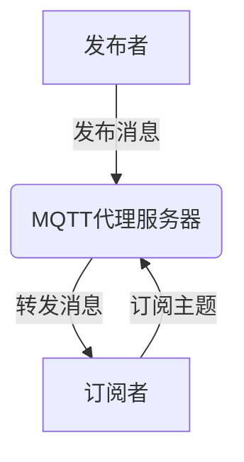
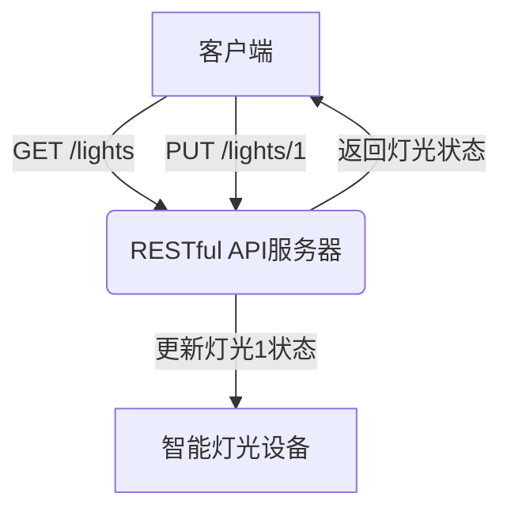

# 基于MQTT协议和RESTful API的智能家居云服务架构设计

## 1. 背景介绍

### 1.1 智能家居的兴起

随着物联网技术的不断发展,智能家居应用逐渐走进了我们的日常生活。智能家居是指将各种智能化设备和系统集成到住宅环境中,通过网络技术实现对家居设备的自动控制、远程监控和智能管理。智能家居系统可以提高生活质量、节约能源、增强安全性,并为残疾人和老年人提供方便。

### 1.2 云服务架构的优势

传统的智能家居系统通常采用本地控制的方式,存在着设备兼容性差、扩展性有限、维护成本高等问题。而基于云服务架构的智能家居系统则可以有效解决这些问题,具有以下优势:

- 设备无关性:云服务架构支持各种不同品牌、型号的智能家居设备接入,提高了系统的兼容性和扩展性。
- 远程访问:用户可以通过移动应用或网页,随时随地远程控制和监控家中的智能设备。
- 数据存储和分析:云端可以存储大量的设备数据,并对这些数据进行分析和挖掘,为用户提供个性化的服务。
- 软件升级:系统的软件升级和功能扩展可以集中在云端进行,无需对本地设备进行升级。

### 1.3 MQTT和RESTful API

在设计基于云服务架构的智能家居系统时,常用的通信协议包括MQTT(Message Queuing Telemetry Transport)和RESTful API。

- MQTT是一种轻量级的发布/订阅模式的消息传输协议,适用于物联网领域,可以有效节省网络带宽和设备资源。
- RESTful API则是一种基于HTTP协议的应用程序接口,它使用统一的资源定位方式,简化了客户端与服务器之间的通信。

通过合理利用MQTT和RESTful API,可以构建出高效、可扩展、安全的智能家居云服务架构。

## 2. 核心概念与联系

### 2.1 MQTT协议

MQTT是一种基于发布/订阅模式的轻量级消息传输协议,由IBM在1999年发布。它的主要特点包括:

- 发布/订阅模式:发布者发送消息到主题(Topic),订阅者订阅感兴趣的主题并接收消息。
- 轻量级:MQTT协议有效减小了网络开销,适用于受限的物联网环境。
- 三种通信模式:至多一次(QoS 0)、至少一次(QoS 1)、只有一次(QoS 2)。
- 持久会话:支持断线重连,消息可以持久化存储。

MQTT协议在智能家居系统中常用于智能设备与云端的通信,可以实现设备状态上报、命令下发等功能。

### 2.2 RESTful API

RESTful API是一种基于HTTP协议的应用程序接口,遵循REST(Representational State Transfer)架构风格。它的主要特点包括:

- 资源(Resource):通过URI唯一标识资源。
- 统一接口:使用HTTP标准方法(GET、POST、PUT、DELETE等)对资源进行操作。
- 无状态:客户端和服务器之间的通信是无状态的,服务器不保存客户端状态。
- 表现层:资源的表现形式可以是多种格式(JSON、XML等)。

在智能家居系统中,RESTful API常用于移动应用、网页与云端的交互,实现对智能设备的远程控制、场景联动等功能。

### 2.3 MQTT与RESTful API的关系

MQTT协议和RESTful API在智能家居云服务架构中扮演着不同的角色,但又存在一定的联系:

- MQTT常用于智能设备与云端的通信,而RESTful API则用于移动应用、网页与云端的交互。
- MQTT适合于设备与云端的实时数据传输,而RESTful API则更适合于请求-响应模式的数据交互。
- 云端可以充当MQTT代理服务器和RESTful API服务器,实现协议转换和数据转发。

通过合理利用MQTT和RESTful API,可以构建出高效、可扩展、安全的智能家居云服务架构。

## 3. 核心算法原理具体操作步骤

### 3.1 MQTT发布/订阅模式

MQTT协议采用了发布/订阅(Publish/Subscribe)模式,其核心算法原理如下:



1. 发布者(Publisher)向MQTT代理服务器发布消息,并指定消息主题(Topic)。
2. MQTT代理服务器接收到消息后,会根据主题将消息转发给所有订阅了该主题的订阅者(Subscriber)。
3. 订阅者向MQTT代理服务器发送订阅请求,订阅感兴趣的主题。

这种发布/订阅模式具有很好的松耦合性,发布者和订阅者之间没有直接的耦合关系,可以有效提高系统的可扩展性和灵活性。

### 3.2 RESTful API资源操作

RESTful API遵循REST架构风格,通过HTTP标准方法对资源进行操作。常见的资源操作包括:

- GET:获取资源表现形式。
- POST:创建新资源或附加数据。
- PUT:更新现有资源。
- DELETE:删除指定资源。

以智能家居系统中的灯光控制为例,其RESTful API资源操作步骤如下:



1. 客户端(如移动应用)向RESTful API服务器发送GET请求,获取所有智能灯光的状态。
2. RESTful API服务器返回灯光状态数据给客户端。
3. 客户端向RESTful API服务器发送PUT请求,更新编号为1的智能灯光状态。
4. RESTful API服务器通过MQTT或其他协议,将更新命令下发给对应的智能灯光设备。

通过RESTful API的统一接口,客户端可以方便地对智能家居设备进行远程控制和管理。

## 4. 数学模型和公式详细讲解举例说明

在智能家居云服务架构中,常用的数学模型和公式包括:

### 4.1 MQTT消息队列模型

MQTT协议中,消息队列可以用队列理论进行建模。假设消息到达服务器的速率为$\lambda$,服务器处理消息的速率为$\mu$,那么消息队列的长度$L$可以用下式表示:

$$L = \frac{\rho}{1-\rho}$$

其中$\rho = \frac{\lambda}{\mu}$为服务器的利用率。当$\rho < 1$时,队列长度有限;当$\rho \geq 1$时,队列长度无限增长。

通过调整$\lambda$和$\mu$,可以控制消息队列的长度,避免队列过长导致的延迟和丢包问题。

### 4.2 RESTful API负载均衡模型

对于RESTful API服务器集群,常采用负载均衡算法将请求分发到不同的服务器节点。一种简单的负载均衡模型是基于权重的轮询算法,其数学表达式如下:

$$P(i) = \frac{w_i}{\sum_{j=1}^{n}w_j}$$

其中$P(i)$表示将请求分发到第$i$个节点的概率,$w_i$表示第$i$个节点的权重,共有$n$个节点。

通过调整每个节点的权重$w_i$,可以实现基于服务器性能的动态负载均衡,提高整体系统的吞吐量和响应速度。

### 4.3 智能家居能耗优化模型

在智能家居系统中,可以通过建立能耗优化模型,实现对家居设备的智能调度,从而降低能源消耗。一种常见的能耗优化模型如下:

$$\min \sum_{i=1}^{n}c_i(x_i)$$
$$\text{s.t.} \sum_{i=1}^{n}x_i \geq D$$
$$0 \leq x_i \leq x_i^{\max}$$

其中$c_i(x_i)$表示第$i$个设备在功率$x_i$时的能耗函数,$D$表示总功率需求,${x_i^{\max}}$表示第$i$个设备的最大功率。

通过求解这个优化问题,可以得到各个设备的最优功率分配方案,从而实现整体能耗的最小化。

以上数学模型和公式为智能家居云服务架构的设计和优化提供了理论基础和量化分析方法。

## 5. 项目实践:代码实例和详细解释说明

为了更好地理解智能家居云服务架构的实现,下面将给出一些代码实例和详细解释说明。

### 5.1 MQTT客户端示例(Python)

以下是一个使用Python编写的MQTT客户端示例,用于向MQTT代理服务器发布消息:

```python
import paho.mqtt.client as mqtt

# 定义MQTT代理服务器地址和端口
broker_address = "iot.example.com"
broker_port = 1883

# 创建MQTT客户端实例
client = mqtt.Client()

# 连接到MQTT代理服务器
client.connect(broker_address, broker_port)

# 发布消息到主题"home/living_room/lights"
client.publish("home/living_room/lights", "ON")

# 断开与MQTT代理服务器的连接
client.disconnect()
```

在这个示例中,我们首先导入了`paho.mqtt.client`模块,然后创建了一个MQTT客户端实例。接下来,我们使用`client.connect()`方法连接到MQTT代理服务器。

要发布消息,我们调用`client.publish()`方法,传入消息主题和消息内容。在这个例子中,我们向主题`"home/living_room/lights"`发布了消息`"ON"`。

最后,我们使用`client.disconnect()`方法断开与MQTT代理服务器的连接。

### 5.2 RESTful API示例(Node.js)

以下是一个使用Node.js编写的RESTful API示例,用于控制智能家居设备:

```javascript
const express = require('express');
const app = express();
const mqtt = require('mqtt');

// 连接到MQTT代理服务器
const mqttClient = mqtt.connect('mqtt://iot.example.com');

// 定义RESTful API路由
app.get('/devices', (req, res) => {
  // 获取所有设备状态
  res.json(devices);
});

app.put('/devices/:id', (req, res) => {
  const deviceId = req.params.id;
  const newState = req.body.state;

  // 更新设备状态
  devices[deviceId].state = newState;

  // 通过MQTT发送控制命令
  mqttClient.publish(`home/devices/${deviceId}/control`, newState);

  res.json({ message: 'Device state updated' });
});

// 启动RESTful API服务器
app.listen(3000, () => {
  console.log('RESTful API server started on port 3000');
});
```

在这个示例中,我们首先创建了一个Express应用程序实例,并导入了`mqtt`模块。然后,我们使用`mqtt.connect()`方法连接到MQTT代理服务器。

接下来,我们定义了两个RESTful API路由:

- `GET /devices`用于获取所有智能家居设备的状态。
- `PUT /devices/:id`用于更新指定设备的状态。在这个路由中,我们首先更新了内存中设备的状态,然后通过MQTT发布控制命令到对应的主题。

最后,我们启动了RESTful API服务器,监听3000端口。

通过这个示例,你可以看到如何在Node.js中实现RESTful API,并与MQTT协议集成,实现对智能家居设备的远程控制。

## 6. 实际应用场景

基于MQTT协议和RESTful API的智能家居云服务架构可以应用于多种场景,为用户带来便利和智能化体验。

### 6.1 家居设备控制

智能家居云服务架构可以实现对各种家居设备的远程控制,如:

- 灯光控制:通过移动应用或语音助手,远程开关家中的灯光。
- 温度调节:根据天气和用户偏好,自动调节空调温度。
- 安防监控:通过摄像头实时监控家中情况,并在发生异常时发出警报。

###