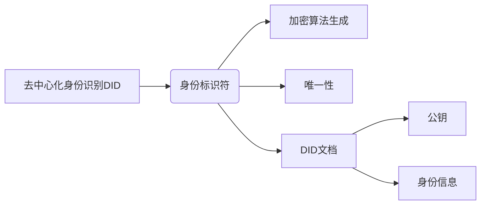
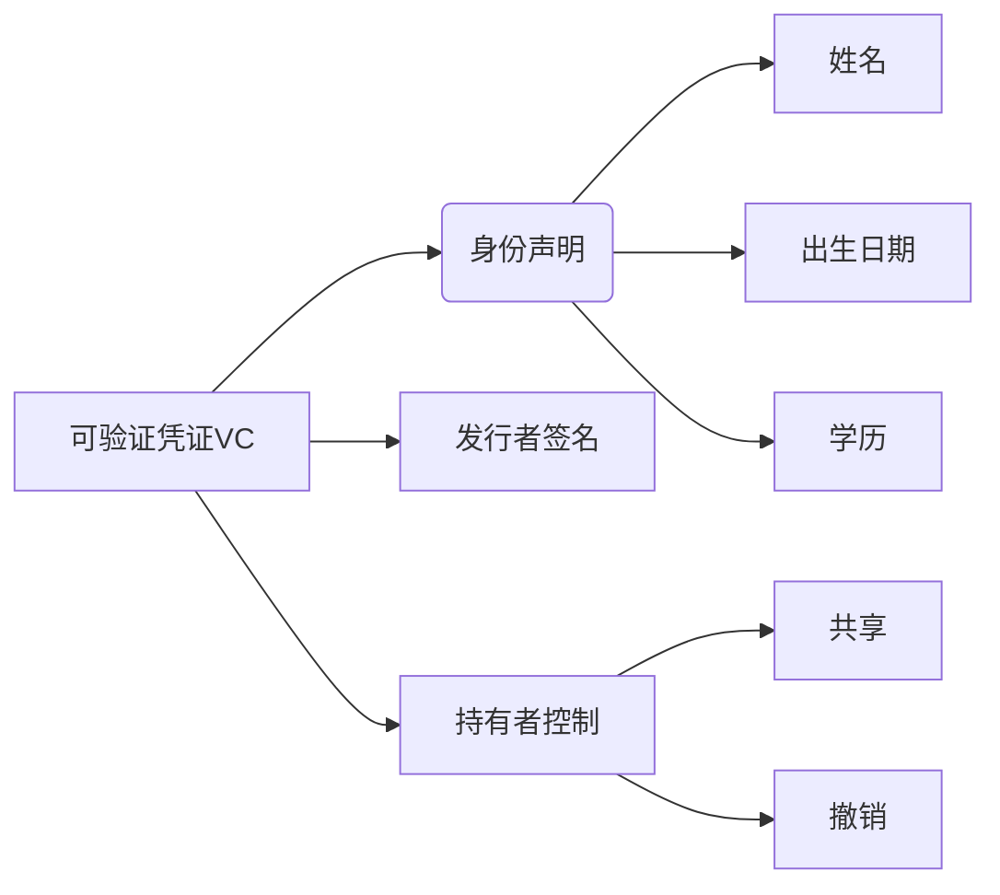
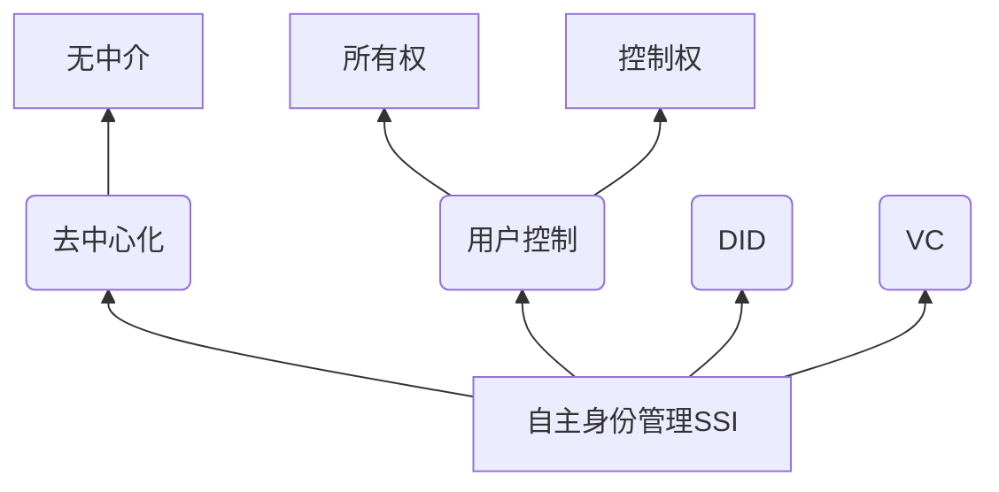
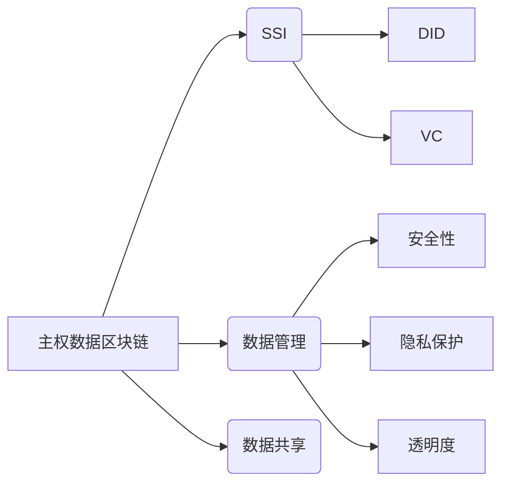
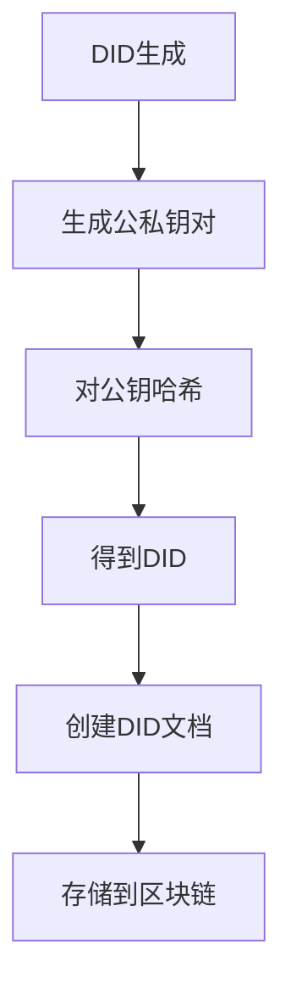
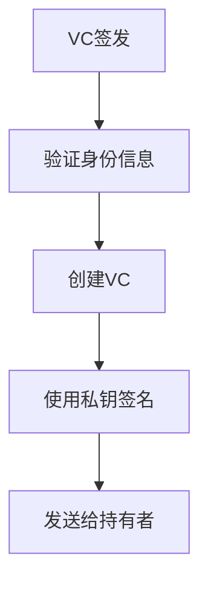
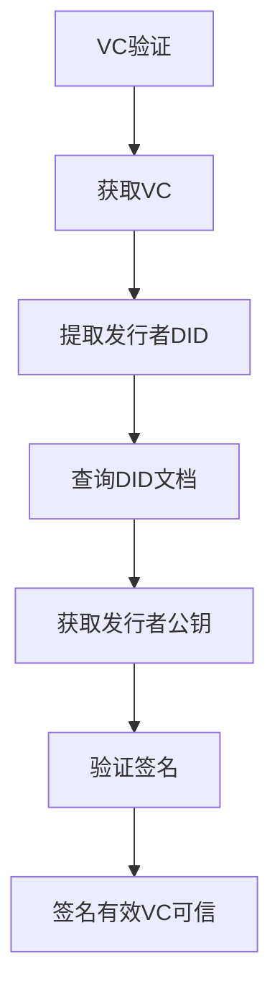

# 基于主权数据区块链的身份共享应用技术

## 1.背景介绍

### 1.1 身份认证的重要性

在当今数字化时代,身份认证无疑是最基本也是最关键的需求之一。无论是在线购物、网上银行、社交媒体等各种场景下,我们都需要通过身份认证来确保交易和信息的安全性。传统的身份认证方式如用户名密码、生物识别等存在一些缺陷,如隐私泄露风险、中央集权管理等。因此,需要一种新的身份认证解决方案来应对这些挑战。

### 1.2 区块链技术的优势

区块链技术作为一种去中心化、不可篡改的分布式账本技术,为解决身份认证问题提供了新的思路。基于区块链的身份认证系统具有去中心化、透明可信、隐私保护等优势,可以有效解决传统身份认证系统面临的问题。

### 1.3 主权数据的概念

主权数据(Sovereign Data)是指由个人或组织拥有并完全控制的数据,包括个人身份信息、财务记录、医疗数据等。通过区块链技术,可以实现对主权数据的完全掌控,避免数据被滥用或泄露。

## 2.核心概念与联系

### 2.1 去中心化身份识别(Decentralized Identity,DID)

DID是基于区块链的身份标识符,由加密算法生成的唯一标识符组成。DID不依赖于任何中央机构,由用户自行创建和管理。每个DID都与一个DID文档相关联,其中包含了用户的公钥等身份信息。



### 2.2 可验证凭证(Verifiable Credentials,VC)

VC是基于W3C标准的一种电子凭证,可以证明持有者的身份信息或声明。VC由发行者签名,持有者可自由共享和撤销。VC包含了诸如姓名、出生日期、学历等各种声明。



### 2.3 自主身份管理(Self-Sovereign Identity,SSI)

SSI是一种新型的身份管理模式,用户对自己的身份数据拥有完全的所有权和控制权,无需依赖任何中介机构。SSI建立在DID和VC之上,实现了真正意义上的身份自主权。



### 2.4 主权数据区块链

主权数据区块链是一种专门为管理和交换主权数据而设计的区块链系统。它建立在SSI的基础之上,将DID、VC等概念融入其中,为用户提供安全、隐私、透明的数据管理和共享方案。



## 3.核心算法原理具体操作步骤

主权数据区块链的核心算法原理包括DID生成、VC签发和验证等过程,具体操作步骤如下:

### 3.1 DID生成

1. 用户生成一对公私钥对(公钥和私钥)
2. 使用加密算法(如SHA-256)对公钥进行哈希运算,得到DID
3. 创建DID文档,包含公钥、身份认证方法等信息
4. 将DID文档存储到区块链上,实现公开可查询



### 3.2 VC签发

1. 发行者验证持有者的身份信息
2. 发行者创建VC,包含身份声明、元数据等
3. 发行者使用私钥对VC进行数字签名
4. 将签名后的VC发送给持有者



### 3.3 VC验证

1. 验证者获取持有者的VC
2. 从VC中提取发行者的DID
3. 查询区块链上的DID文档,获取发行者公钥
4. 使用发行者公钥验证VC的签名
5. 如果签名有效,则VC可信



上述算法原理确保了身份认证过程的安全性、隐私性和可信度。用户对自己的身份数据拥有完全控制权,同时可以在需要时安全地共享和验证身份信息。

## 4.数学模型和公式详细讲解举例说明

### 4.1 非对称加密算法

主权数据区块链中的DID生成和VC签名验证都依赖于非对称加密算法,如RSA、ECC等。这些算法基于数学原理,利用了大数的因数分解和椭圆曲线离散对数问题的困难性。

以RSA算法为例,它的数学原理可表示为:

$$
m^e \bmod n = c \
c^d \bmod n = m
$$

其中:
- $m$是明文消息
- $c$是密文消息
- $e$是公钥指数
- $d$是私钥指数
- $n$是两个大质数的乘积

加密过程是$m^e \bmod n$,解密过程是$c^d \bmod n$。由于对极大整数做因数分解是非常困难的,因此可以保证加密过程是可逆的。

### 4.2 数字签名算法

数字签名是保证信息完整性和不可抵赖性的关键技术,在VC签发和验证中发挥重要作用。常用的数字签名算法有RSA、DSA和ECDSA等。

以ECDSA(基于椭圆曲线的数字签名算法)为例,签名过程如下:

1. 计算消息的哈希值: $z = \text{Hash}(m)$
2. 选择一个随机数 $k \in [1, n-1]$
3. 计算 $(x_1, y_1) = k \times G$
4. 计算 $r = x_1 \bmod n$, 如果 $r=0$ 则重新选择 $k$
5. 计算 $s = k^{-1}(z + rd_A) \bmod n$, 如果 $s=0$ 则重新选择 $k$
6. 签名是 $(r, s)$ 对

其中:
- $m$是消息
- $G$是基点
- $n$是椭圆曲线的阶
- $d_A$是私钥
- $r$和$s$是签名的两个分量

验证签名的过程是:

1. 计算 $z = \text{Hash}(m)$
2. 计算 $u_1 = z \times s^{-1} \bmod n, u_2 = r \times s^{-1} \bmod n$
3. 计算 $(x_1, y_1) = u_1 \times G + u_2 \times Q_A$
4. 如果 $r = x_1 \bmod n$, 则签名有效

其中 $Q_A$ 是公钥。

通过上述数学原理,可以确保签名的不可伪造性和消息的完整性。

## 5.项目实践:代码实例和详细解释说明

为了更好地理解主权数据区块链的实现,我们提供了一个使用以太坊区块链和Solidity语言的示例项目。该项目包含了DID管理、VC签发和验证等核心功能。

### 5.1 DID管理合约

```solidity
pragma solidity ^0.8.0;

contract DIDRegistry {
    struct DIDDocument {
        address owner;
        bytes32 hashValue;
        mapping(bytes32 => bytes) properties;
    }

    mapping(bytes32 => DIDDocument) public didDocuments;

    event DIDDocumentUpdated(bytes32 indexed did, bytes32 hashValue);

    function createDID(bytes32 hashValue) public {
        bytes32 did = keccak256(abi.encodePacked(msg.sender));
        didDocuments[did] = DIDDocument(msg.sender, hashValue);
        emit DIDDocumentUpdated(did, hashValue);
    }

    function updateDIDDocument(bytes32 hashValue, bytes32[] memory keys, bytes[] memory values) public {
        bytes32 did = keccak256(abi.encodePacked(msg.sender));
        require(didDocuments[did].owner == msg.sender, "Only the owner can update the DID document.");

        didDocuments[did].hashValue = hashValue;
        for (uint i = 0; i < keys.length; i++) {
            didDocuments[did].properties[keys[i]] = values[i];
        }

        emit DIDDocumentUpdated(did, hashValue);
    }

    function resolveDID(bytes32 did) public view returns (bytes32, bytes32[] memory, bytes[] memory) {
        DIDDocument storage doc = didDocuments[did];
        require(doc.owner != address(0), "DID document not found.");

        bytes32[] memory keys = new bytes32[](doc.properties.length);
        bytes[] memory values = new bytes[](doc.properties.length);
        uint index = 0;
        for (bytes32 key : doc.properties) {
            keys[index] = key;
            values[index] = doc.properties[key];
            index++;
        }

        return (doc.hashValue, keys, values);
    }
}
```

上述合约实现了DID的创建、更新和解析功能。每个DID对应一个DID文档,文档包含了所有者地址、哈希值和属性映射。用户可以通过调用合约函数来管理自己的DID。

### 5.2 VC签发和验证

```solidity
pragma solidity ^0.8.0;

import "./DIDRegistry.sol";

contract VerifiableCredentials {
    DIDRegistry public didRegistry;

    struct VerifiableCredential {
        bytes32 issuerDID;
        bytes32 subjectDID;
        bytes32 hashValue;
        bytes signature;
    }

    mapping(bytes32 => VerifiableCredential) public credentials;

    event CredentialIssued(bytes32 indexed credentialHash, bytes32 issuerDID, bytes32 subjectDID);

    constructor(address didRegistryAddress) {
        didRegistry = DIDRegistry(didRegistryAddress);
    }

    function issueCredential(bytes32 subjectDID, bytes32 hashValue, bytes memory signature) public {
        bytes32 issuerDID = keccak256(abi.encodePacked(msg.sender));
        bytes32 credentialHash = keccak256(abi.encodePacked(issuerDID, subjectDID, hashValue, signature));

        credentials[credentialHash] = VerifiableCredential(issuerDID, subjectDID, hashValue, signature);
        emit CredentialIssued(credentialHash, issuerDID, subjectDID);
    }

    function verifyCredential(bytes32 credentialHash) public view returns (bool) {
        VerifiableCredential memory credential = credentials[credentialHash];

        bytes32 issuerDIDHash;
        bytes32[] memory keys;
        bytes[] memory values;
        (issuerDIDHash, keys, values) = didRegistry.resolveDID(credential.issuerDID);

        // 验证签名逻辑...

        return true;
    }
}
```

上述合约实现了VC的签发和验证功能。发行者可以调用`issueCredential`函数发放VC,持有者可以调用`verifyCredential`函数验证VC的有效性。在验证过程中,合约会从DID注册表中获取发行者的公钥,并使用该公钥验证VC的签名。

通过这个示例项目,我们可以清楚地了解主权数据区块链的实现细节,为实际应用做好准备。

## 6.实际应用场景

主权数据区块链技术可以应用于多个领域,为身份认证和数据共享提供安全可靠的解决方案。以下是一些典型的应用场景:

### 6.1 电子政务

通过主权数据区块链,公民可以完全控制自己的身份数据,并在需要时安全地共享给政府机构,从而简