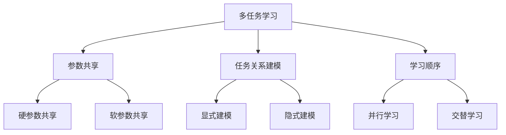
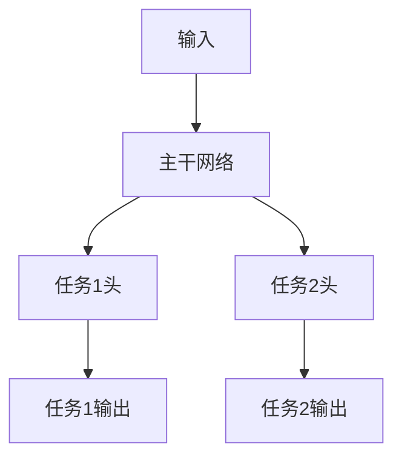

# 多任务学习Multi-Task Learning原理与代码实例讲解

## 1. 背景介绍

### 1.1 多任务学习的定义与起源

多任务学习(Multi-Task Learning, MTL)是一种机器学习范式,旨在同时学习多个相关任务,通过利用任务之间的相关性来提高模型的泛化能力和学习效率。与传统的单任务学习相比,多任务学习能够更好地利用数据,减少过拟合风险,加速模型收敛。

多任务学习最早由Rich Caruana在1997年提出,他在论文《Multitask Learning》中系统阐述了多任务学习的思想。此后,多任务学习在自然语言处理、计算机视觉、语音识别等领域得到了广泛应用。

### 1.2 多任务学习的优势

与单任务学习相比,多任务学习具有以下优势:

1. 利用任务之间的相关性,提高模型泛化能力。
2. 共享不同任务的知识,减少过拟合风险。
3. 加速模型收敛,减少训练时间。
4. 降低标注数据的需求,提高数据利用率。

### 1.3 多任务学习的应用场景

多任务学习在诸多领域得到了成功应用,例如:

- 自然语言处理:同时进行命名实体识别、词性标注、句法分析等任务。
- 计算机视觉:同时进行目标检测、语义分割、关键点检测等任务。
- 语音识别:同时进行声学建模、语言建模、说话人识别等任务。
- 推荐系统:同时预测用户评分、点击率、购买率等指标。

## 2. 核心概念与联系

### 2.1 硬参数共享与软参数共享

多任务学习的核心是参数共享,即不同任务共享部分网络参数。根据共享方式的不同,可分为硬参数共享(Hard Parameter Sharing)和软参数共享(Soft Parameter Sharing)两种。

- 硬参数共享:不同任务共享同一组参数,通常是共享网络的低层。优点是结构简单,易于实现;缺点是任务之间的差异性难以建模。

- 软参数共享:每个任务有独立的参数,但通过正则化项约束不同任务的参数接近。优点是可以建模任务差异;缺点是参数量较大,计算开销高。

### 2.2 显式建模与隐式建模

根据建模任务关系的方式,多任务学习可分为显式建模和隐式建模两类。

- 显式建模:人工设计任务之间的关系,如人工设计任务权重、任务层次等。优点是可解释性强,易于控制;缺点是依赖先验知识,缺乏灵活性。

- 隐式建模:让模型自适应地学习任务之间的关系,如自适应权重、动态路由等。优点是自动化程度高,可以发现未知的任务关系;缺点是可解释性差,调参难度大。

### 2.3 并行学习与交替学习

根据任务学习的顺序,多任务学习可分为并行学习和交替学习两种。

- 并行学习:同时训练所有任务,每个任务的梯度同步更新。优点是训练效率高;缺点是任务干扰大,难以平衡不同任务的学习进度。

- 交替学习:轮流训练不同任务,每次只更新一个任务的参数。优点是任务之间的干扰小;缺点是训练效率低,难以利用任务之间的相关性。

### 2.4 多任务学习的核心概念之间的联系

下图展示了多任务学习的核心概念之间的联系:



## 3. 核心算法原理具体操作步骤

本节以硬参数共享、隐式建模、并行学习为例,介绍多任务学习的核心算法原理和具体操作步骤。

### 3.1 网络结构设计

设计一个共享的主干网络(Backbone Network)用于提取通用特征,在主干网络之上设计独立的任务特定头(Task-Specific Head)用于处理不同任务。

以双任务学习为例,网络结构如下:



### 3.2 损失函数设计

对于每个任务 $i$,设计独立的损失函数 $L_i$。多任务学习的总损失为所有任务损失的加权和:

$$
L = \sum_{i=1}^{N} w_i L_i
$$

其中 $w_i$ 为任务 $i$ 的权重,可以是固定值,也可以是可学习的参数。

### 3.3 训练过程

1. 初始化网络参数。
2. 在每个训练步骤:
   1. 从数据集采样一个批次的数据。
   2. 前向传播,计算每个任务的输出。
   3. 计算每个任务的损失,并加权求和得到总损失。
   4. 反向传播,计算梯度。
   5. 更新网络参数。
3. 重复步骤2,直到达到预设的迭代次数或收敛条件。

### 3.4 推理过程

1. 加载训练好的模型参数。
2. 对于每个任务:
   1. 将输入数据传入主干网络,提取特征。
   2. 将特征传入对应的任务特定头,得到输出结果。

## 4. 数学模型和公式详细讲解举例说明

本节以双任务学习为例,详细讲解多任务学习的数学模型和公式。

### 4.1 符号定义

- $x$:输入数据
- $y_1$:任务1的真实标签
- $y_2$:任务2的真实标签
- $f_1$:任务1的输出函数
- $f_2$:任务2的输出函数
- $L_1$:任务1的损失函数
- $L_2$:任务2的损失函数
- $w_1$:任务1的权重
- $w_2$:任务2的权重

### 4.2 前向传播

$$
\hat{y}_1 = f_1(x) \\
\hat{y}_2 = f_2(x)
$$

其中 $f_1$ 和 $f_2$ 共享部分参数。

### 4.3 损失计算

$$
L_1 = l_1(\hat{y}_1, y_1) \\
L_2 = l_2(\hat{y}_2, y_2) \\
L = w_1 L_1 + w_2 L_2
$$

其中 $l_1$ 和 $l_2$ 分别是任务1和任务2的损失函数,如交叉熵损失、均方误差损失等。

### 4.4 反向传播

$$
\frac{\partial L}{\partial \theta} = w_1 \frac{\partial L_1}{\partial \theta} + w_2 \frac{\partial L_2}{\partial \theta}
$$

其中 $\theta$ 为网络参数。利用梯度下降法更新参数:

$$
\theta \leftarrow \theta - \alpha \frac{\partial L}{\partial \theta}
$$

其中 $\alpha$ 为学习率。

## 5. 项目实践:代码实例和详细解释说明

本节以PyTorch为例,展示多任务学习的代码实现。

### 5.1 定义数据集

```python
class MyDataset(Dataset):
    def __init__(self, data, labels1, labels2):
        self.data = data
        self.labels1 = labels1
        self.labels2 = labels2

    def __getitem__(self, index):
        return self.data[index], self.labels1[index], self.labels2[index]

    def __len__(self):
        return len(self.data)
```

### 5.2 定义模型

```python
class MyModel(nn.Module):
    def __init__(self):
        super(MyModel, self).__init__()
        self.shared_layers = nn.Sequential(
            nn.Linear(10, 20),
            nn.ReLU(),
            nn.Linear(20, 30),
            nn.ReLU()
        )
        self.task1_layers = nn.Linear(30, 5)
        self.task2_layers = nn.Linear(30, 3)

    def forward(self, x):
        h = self.shared_layers(x)
        out1 = self.task1_layers(h)
        out2 = self.task2_layers(h)
        return out1, out2
```

### 5.3 定义训练函数

```python
def train(model, dataloader, criterion, optimizer, epochs, device):
    model.train()
    for epoch in range(epochs):
        for data, labels1, labels2 in dataloader:
            data = data.to(device)
            labels1 = labels1.to(device)
            labels2 = labels2.to(device)

            out1, out2 = model(data)
            loss1 = criterion(out1, labels1)
            loss2 = criterion(out2, labels2)
            loss = loss1 + loss2

            optimizer.zero_grad()
            loss.backward()
            optimizer.step()
```

### 5.4 定义测试函数

```python
def test(model, dataloader, device):
    model.eval()
    task1_correct = 0
    task2_correct = 0
    total = 0

    with torch.no_grad():
        for data, labels1, labels2 in dataloader:
            data = data.to(device)
            labels1 = labels1.to(device)
            labels2 = labels2.to(device)

            out1, out2 = model(data)
            _, pred1 = torch.max(out1, 1)
            _, pred2 = torch.max(out2, 1)

            task1_correct += (pred1 == labels1).sum().item()
            task2_correct += (pred2 == labels2).sum().item()
            total += labels1.size(0)

    print(f'Task 1 Accuracy: {100 * task1_correct / total:.2f}%')
    print(f'Task 2 Accuracy: {100 * task2_correct / total:.2f}%')
```

### 5.5 主函数

```python
def main():
    device = torch.device('cuda' if torch.cuda.is_available() else 'cpu')

    train_data = ...
    train_labels1 = ...
    train_labels2 = ...
    test_data = ...
    test_labels1 = ...
    test_labels2 = ...

    train_dataset = MyDataset(train_data, train_labels1, train_labels2)
    test_dataset = MyDataset(test_data, test_labels1, test_labels2)

    train_dataloader = DataLoader(train_dataset, batch_size=32, shuffle=True)
    test_dataloader = DataLoader(test_dataset, batch_size=32, shuffle=False)

    model = MyModel().to(device)
    criterion = nn.CrossEntropyLoss()
    optimizer = optim.Adam(model.parameters(), lr=0.001)

    train(model, train_dataloader, criterion, optimizer, epochs=10, device=device)
    test(model, test_dataloader, device)
```

## 6. 实际应用场景

多任务学习在诸多领域得到了广泛应用,下面列举几个具体的应用场景。

### 6.1 自然语言处理

在自然语言处理领域,多任务学习可以同时进行多个任务,如命名实体识别、词性标注、句法分析等。这些任务之间存在一定的相关性,共同学习可以提高模型的性能。例如,BERT等预训练语言模型就采用了多任务学习的思想,在预训练阶段同时进行了掩码语言建模和下一句预测两个任务。

### 6.2 计算机视觉

在计算机视觉领域,多任务学习可以同时进行目标检测、语义分割、关键点检测等任务。这些任务之间存在一定的互补性,联合学习可以提高模型的鲁棒性。例如,Mask R-CNN就是一个典型的多任务学习模型,它同时进行了目标检测和实例分割两个任务。

### 6.3 语音识别

在语音识别领域,多任务学习可以同时进行声学建模、语言建模、说话人识别等任务。这些任务之间存在一定的协同性,联合建模可以提高识别准确率。例如,Deep Speech 2就采用了多任务学习的思想,在训练过程中同时优化了声学模型和语言模型。

### 6.4 推荐系统

在推荐系统领域,多任务学习可以同时预测用户的多个行为,如点击、购买、评分等。这些行为之间存在一定的相关性,联合建模可以提高推荐的准确性。例如,MMOE(Multi-gate Mixture-of-Experts)就是一个典型的多任务学习模型,它通过专家网络和门控网络来建模不同