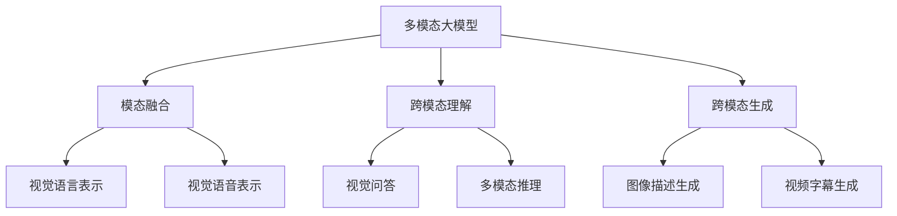

# 多模态大模型：技术原理与实战 感知能力评测

## 1.背景介绍

### 1.1 人工智能发展历程

人工智能的发展经历了几个重要阶段。早期的人工智能系统主要采用符号主义方法,基于规则和逻辑推理。20世纪90年代,机器学习和神经网络的兴起,推动了人工智能向数据驱动的连接主义方法发展。

### 1.2 大模型的崛起

2010年代,benefiting from大量数据、算力和新算法,大型神经网络模型取得了突破性进展,在自然语言处理、计算机视觉等领域表现出色。transformer等注意力模型架构成为主流,GPT、BERT等大模型应运而生。

### 1.3 多模态AI的兴起

单一模态的AI系统存在局限性,无法像人类那样融合多种感知能力。多模态AI的目标是整合视觉、语音、文本等不同模态,实现跨模态理解、推理和生成,模拟人类的多感官认知能力。

### 1.4 多模态大模型的重要性

多模态大模型是当前人工智能的前沿方向,有望突破单一模态的局限,实现更强大、更通用、更接近人类智能的AI系统。它在多领域应用中具有重要价值,如智能助手、智能教育、医疗影像辅助诊断等。

## 2.核心概念与联系



### 2.1 多模态大模型

多模态大模型是一种能够同时处理多种模态数据(如图像、文本、语音等)的大型神经网络模型。它通过统一的架构和表示空间,实现对不同模态的联合建模和融合。

### 2.2 模态融合

模态融合是多模态大模型的核心,指的是如何有效地将不同模态的信息融合在一起。常见的融合方式包括特征级融合、向量级融合和模态不变表示等。

### 2.3 跨模态理解

跨模态理解旨在从多个模态中提取信息,并综合理解它们之间的关系和语义。典型任务包括视觉问答、多模态推理等,需要模型理解跨模态的上下文关联。

### 2.4 跨模态生成

跨模态生成则是根据一种或多种模态的输入,生成另一种模态的输出。例如根据图像生成文本描述,或根据视频生成字幕等。这需要模型捕捉不同模态之间的映射关系。

## 3.核心算法原理具体操作步骤

多模态大模型的核心算法原理主要包括以下几个方面:

### 3.1 模态编码

首先需要将不同模态的输入数据编码为对应的特征表示,通常采用专门设计的编码器网络。例如,对于图像可使用CNN编码器;对于文本可使用Transformer编码器。

### 3.2 模态融合

接下来需要将不同模态的特征表示进行融合,得到一个统一的多模态表示。常见的融合方式包括:

1. **特征级融合**: 直接拼接或加权求和不同模态的特征向量。
2. **注意力融合**: 使用注意力机制动态地为不同模态分配权重,得到加权融合的表示。
3. **模态不变表示**: 使用共享的编码器或投影层,将不同模态映射到同一语义空间,得到模态不变的表示。

### 3.3 交互建模

在得到多模态融合表示后,还需要对不同模态之间的交互关系进行建模。一种常见方法是使用跨模态自注意力机制,允许不同模态的特征在注意力计算中相互作用。

### 3.4 预测与生成

最后,根据不同任务目标,可以在多模态表示的基础上进行预测或生成操作。例如,对于视觉问答任务,需要将多模态表示输入到分类器中预测答案;对于图像描述生成任务,则需要将多模态表示输入到语言模型解码器中生成文本描述。

## 4.数学模型和公式详细讲解举例说明

### 4.1 Transformer编码器

Transformer编码器广泛用于编码序列数据(如文本、语音),其核心是多头自注意力机制,用于捕捉序列元素之间的长程依赖关系。给定一个长度为 $N$ 的序列 $\boldsymbol{x} = (x_1, x_2, \ldots, x_N)$,自注意力计算过程如下:

$$\begin{aligned}
\boldsymbol{Q}, \boldsymbol{K}, \boldsymbol{V} &= \boldsymbol{x}\boldsymbol{W}^Q, \boldsymbol{x}\boldsymbol{W}^K, \boldsymbol{x}\boldsymbol{W}^V \
\text{Attention}(\boldsymbol{Q}, \boldsymbol{K}, \boldsymbol{V}) &= \text{softmax}\left(\frac{\boldsymbol{Q}\boldsymbol{K}^\top}{\sqrt{d_k}}\right)\boldsymbol{V}
\end{aligned}$$

其中 $\boldsymbol{W}^Q, \boldsymbol{W}^K, \boldsymbol{W}^V$ 为可学习的投影矩阵, $d_k$ 为缩放因子。多头注意力通过线性投影后并行计算多个注意力头,最后拼接结果:

$$\text{MultiHead}(\boldsymbol{Q}, \boldsymbol{K}, \boldsymbol{V}) = \text{Concat}(\text{head}_1, \ldots, \text{head}_h)\boldsymbol{W}^O$$

其中 $\text{head}_i = \text{Attention}(\boldsymbol{Q}\boldsymbol{W}_i^Q, \boldsymbol{K}\boldsymbol{W}_i^K, \boldsymbol{V}\boldsymbol{W}_i^V)$。

Transformer编码器将多头自注意力与前馈网络、层归一化等组件结合,形成了强大的序列建模能力。

### 4.2 视觉-语言融合

视觉-语言融合是多模态建模的一个典型场景。给定一个图像 $\boldsymbol{I}$ 和一个文本序列 $\boldsymbol{x}$,我们可以使用两个编码器分别得到它们的特征表示 $\boldsymbol{v}, \boldsymbol{h}$:

$$\boldsymbol{v} = \text{CNN}(\boldsymbol{I}), \quad \boldsymbol{h} = \text{Transformer}(\boldsymbol{x})$$

接下来需要将两种模态的特征进行融合。一种常见的融合方式是使用跨模态注意力机制:

$$\boldsymbol{z} = \text{MultiHead}(\boldsymbol{h}, \boldsymbol{v}, \boldsymbol{v})$$

其中查询 $\boldsymbol{Q} = \boldsymbol{h}$ 来自文本特征,键 $\boldsymbol{K}$ 和值 $\boldsymbol{V}$ 来自图像特征。这样可以让文本特征对图像特征进行注意力加权,得到融合的多模态表示 $\boldsymbol{z}$。

在视觉问答任务中,我们可以将 $\boldsymbol{z}$ 输入到分类器中预测答案 $\hat{y}$:

$$\hat{y} = \text{softmax}(\boldsymbol{z}\boldsymbol{W} + \boldsymbol{b})$$

通过端到端的训练,模型可以学习同时理解图像和文本的能力。

以上是一个简化的示例,实际的多模态模型可能会采用更复杂的融合机制和建模策略。

## 5.项目实践:代码实例和详细解释说明

以下是一个使用PyTorch实现的简单视觉-语言融合模型示例,用于视觉问答任务。

```python
import torch
import torch.nn as nn

# 图像编码器
class ImageEncoder(nn.Module):
    def __init__(self):
        super().__init__()
        self.cnn = ... # 使用预训练的CNN模型

    def forward(self, images):
        features = self.cnn(images) # 输出图像特征向量
        return features

# 文本编码器
class TextEncoder(nn.Module):
    def __init__(self):
        super().__init__()
        self.transformer = ... # 使用预训练的Transformer模型

    def forward(self, texts):
        features = self.transformer(texts) # 输出文本特征序列
        return features

# 多模态融合模块
class MultimodalFusion(nn.Module):
    def __init__(self, hidden_size):
        super().__init__()
        self.att = nn.MultiheadAttention(hidden_size, num_heads=8)

    def forward(self, text_features, image_features):
        fused_features, _ = self.att(text_features, image_features, image_features)
        return fused_features

# 视觉问答模型
class VQAModel(nn.Module):
    def __init__(self, num_answers):
        super().__init__()
        self.image_encoder = ImageEncoder()
        self.text_encoder = TextEncoder()
        self.fusion = MultimodalFusion(hidden_size=512)
        self.classifier = nn.Linear(512, num_answers)

    def forward(self, images, questions):
        image_features = self.image_encoder(images)
        text_features = self.text_encoder(questions)
        fused_features = self.fusion(text_features, image_features)
        logits = self.classifier(fused_features)
        return logits
```

这个示例模型包含以下几个主要组件:

1. `ImageEncoder`: 使用预训练的CNN模型(如ResNet)对输入图像进行编码,得到图像特征向量。
2. `TextEncoder`: 使用预训练的Transformer模型(如BERT)对输入文本进行编码,得到文本特征序列。
3. `MultimodalFusion`: 使用多头自注意力机制将图像特征和文本特征进行融合,得到融合的多模态表示。
4. `VQAModel`: 将上述组件集成,构建完整的视觉问答模型。在前向传播时,它首先分别编码图像和文本,然后融合两种模态的特征,最后通过分类器预测答案。

在实际使用时,需要对这个模型进行训练,并在验证集上评估性能。训练过程通常采用监督学习,给定图像-问题-答案三元组数据,最小化分类损失函数(如交叉熵损失)。经过充分训练,模型可以学习同时理解图像和文本的能力,并给出正确的答案预测。

需要注意的是,这只是一个简化的示例,实际的多模态模型可能会更加复杂,包括更先进的融合机制、注意力策略、预训练技术等。此外,不同的多模态任务(如图像描述生成、视频字幕生成等)也需要对模型进行相应的修改和调整。

## 6.实际应用场景

多模态大模型在许多实际应用场景中发挥着重要作用,以下是一些典型的应用示例:

### 6.1 智能助手

智能助手需要同时理解用户的自然语言输入、环境图像/视频等多种模态信息,并给出合理的响应。多模态大模型可以实现这种跨模态理解和生成的能力,提升智能助手的交互体验。

### 6.2 智能教育

在智能教育领域,多模态大模型可以帮助学生更好地理解教学内容。例如,模型可以根据课本文字和老师的语音解说,生成相应的图示和视频动画,使抽象概念更加形象生动。

### 6.3 医疗影像辅助诊断

医疗影像诊断需要医生同时分析患者的影像数据(如CT、MRI等)和相关病史文本信息。多模态大模型可以学习这种跨模态关联,为医生提供辅助诊断建议,提高诊断的准确性和效率。

### 6.4 机器人视觉

机器人需要融合视觉、语音、触觉等多种感知信息,才能够正确理解环境并做出合理的行为决策。多模态大模型可以在这一领域发挥重要作用,实现更智能、更鲁棒的机器人系统。

### 6.5 多媒体内容分析

在多媒体内容分析中,多模态大模型可以同时处理视频、音频和文本信息,实现自动字幕生成、视频摘要、内容审核等功能,为多媒体内容的组织和检索提供强大支持。

### 6.6 虚拟