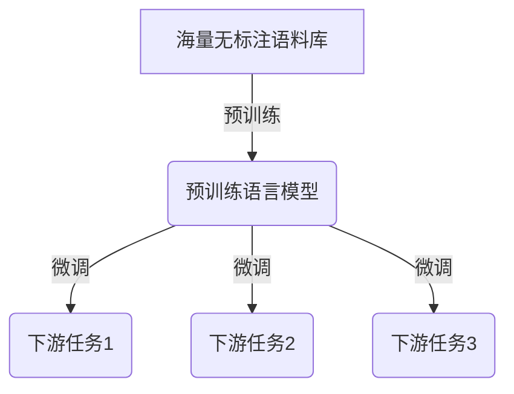
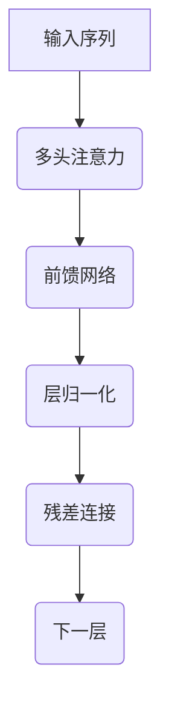
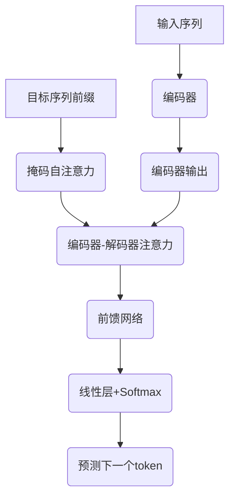

# 大规模语言模型从理论到实践 基于HuggingFace的预训练语言模型实践

## 1. 背景介绍

### 1.1 自然语言处理的重要性

在当今数字时代,自然语言处理(NLP)已经成为人工智能领域中最重要和最具挑战性的研究方向之一。随着人机交互日益普及,NLP技术在各个领域都扮演着越来越重要的角色,如智能助手、机器翻译、情感分析、文本生成等。NLP的目标是使计算机能够理解和生成人类语言,实现人机之间自然无缝的交流。

### 1.2 语言模型的发展历程

语言模型是NLP的核心组成部分,旨在捕捉语言的统计规律和语义关系。早期的语言模型主要基于n-gram模型和统计机器翻译,但存在上下文捕捉能力有限、难以处理长距离依赖等缺陷。近年来,随着深度学习技术的飞速发展,神经网络语言模型(Neural Language Model)大放异彩,尤其是transformer模型的出现,使得语言模型的性能得到了质的飞跃。

### 1.3 大规模语言模型的兴起

2018年,谷歌发布了Transformer模型,展示了其在机器翻译任务上的卓越表现。紧接着,OpenAI推出GPT(Generative Pre-trained Transformer)模型,通过在大规模语料库上进行预训练,实现了令人惊叹的文本生成能力。此后,BERT(Bidirectional Encoder Representations from Transformers)、XLNet、RoBERTa等大规模预训练语言模型(Pre-trained Language Model,PLM)不断问世,在各种NLP任务上取得了state-of-the-art的表现,推动了NLP技术的快速发展。

## 2. 核心概念与联系

### 2.1 预训练与微调

大规模语言模型的核心思想是先在海量无标注语料库上进行预训练,获取通用的语言表示能力,然后在特定的下游任务上进行微调(fine-tuning),从而将预训练模型中学习到的知识迁移到目标任务中。这种预训练+微调的范式大大提高了模型的泛化能力和效率,避免了从头开始训练的巨大计算开销。



### 2.2 自监督学习

预训练阶段采用自监督学习(Self-Supervised Learning)的方式,通过设计合理的预训练目标,让模型从大量无标注数据中自主学习语言的内在规律和语义知识。常见的预训练目标包括:

- **Masked Language Modeling (MLM)**: 随机掩盖部分输入token,模型需要预测被掩盖的token。
- **Next Sentence Prediction (NSP)**: 判断两个句子是否为连续的句子对。
- **Permutation Language Modeling**: 对输入序列进行排列扰动,模型需要重建原始序列。
- **Causal Language Modeling**: 基于前文预测下一个token,常用于生成式任务。

通过这些预训练目标,模型能够学习到丰富的语义和上下文信息,为后续的微调奠定基础。

### 2.3 注意力机制与Transformer

Transformer是大规模语言模型的核心架构,其基于自注意力(Self-Attention)机制,能够有效捕捉输入序列中任意两个token之间的依赖关系,解决了RNN等序列模型难以并行化和捕捉长距离依赖的问题。Transformer的编码器(Encoder)和解码器(Decoder)都由多层注意力模块和前馈网络组成,通过多头注意力机制和残差连接,实现了高效的序列建模能力。



## 3. 核心算法原理具体操作步骤

### 3.1 Transformer编码器

Transformer编码器的核心是多头自注意力机制,其计算过程如下:

1. 将输入序列 $X = (x_1, x_2, \dots, x_n)$ 映射到查询(Query)、键(Key)和值(Value)向量: $Q = XW^Q, K = XW^K, V = XW^V$。
2. 计算注意力权重矩阵: $\text{Attention}(Q, K, V) = \text{softmax}(\frac{QK^T}{\sqrt{d_k}})V$。
3. 对多头注意力的结果进行拼接和线性变换: $\text{MultiHead}(Q, K, V) = \text{Concat}(head_1, \dots, head_h)W^O$。
4. 将注意力输出与输入相加,得到编码器的输出表示。

$$\begin{aligned}
\text{MultiHead}(Q, K, V) &= \text{Concat}(head_1, \dots, head_h)W^O \
\text{where } head_i &= \text{Attention}(QW_i^Q, KW_i^K, VW_i^V)
\end{aligned}$$

### 3.2 Transformer解码器

解码器在编码器的基础上,增加了掩码自注意力层和编码器-解码器注意力层,用于生成目标序列。具体步骤如下:

1. 进行掩码自注意力,只允许每个位置关注之前的位置。
2. 进行编码器-解码器注意力,将解码器的输出与编码器的输出进行注意力计算。
3. 通过前馈网络和归一化层,得到解码器的最终输出。
4. 将输出通过线性层和softmax,预测下一个token的概率分布。



## 4. 数学模型和公式详细讲解举例说明

### 4.1 注意力机制

注意力机制是Transformer的核心,它能够捕捉输入序列中任意两个token之间的依赖关系。给定查询(Query) $q$、键(Key) $k$ 和值(Value) $v$,注意力计算公式如下:

$$\text{Attention}(q, K, V) = \text{softmax}(\frac{qK^T}{\sqrt{d_k}})V$$

其中,
- $q$, $k$, $v$ 分别表示查询、键和值向量
- $d_k$ 是缩放因子,用于防止点积过大导致softmax饱和
- $\text{softmax}(\frac{qK^T}{\sqrt{d_k}})$ 计算查询与所有键的相似性得分,作为注意力权重

通过将注意力权重与值向量相乘,可以获得查询 $q$ 对整个输入序列的加权表示,即注意力输出。

### 4.2 多头注意力

为了捕捉不同子空间的依赖关系,Transformer采用了多头注意力机制。具体来说,将查询、键和值先分别线性投影到不同的子空间,然后在每个子空间内计算注意力,最后将所有子空间的注意力输出拼接起来:

$$\begin{aligned}
\text{MultiHead}(Q, K, V) &= \text{Concat}(head_1, \dots, head_h)W^O \
\text{where } head_i &= \text{Attention}(QW_i^Q, KW_i^K, VW_i^V)
\end{aligned}$$

其中, $W_i^Q$, $W_i^K$, $W_i^V$ 分别是第 $i$ 个头的查询、键和值的线性投影矩阵, $W^O$ 是最终的线性变换矩阵。

### 4.3 位置编码

由于Transformer没有捕捉序列顺序的内在机制,因此需要为每个token添加位置信息。位置编码可以通过预定义的函数生成,例如正弦/余弦函数:

$$\begin{aligned}
\text{PE}_{(pos, 2i)} &= \sin(pos / 10000^{2i / d_\text{model}}) \
\text{PE}_{(pos, 2i+1)} &= \cos(pos / 10000^{2i / d_\text{model}})
\end{aligned}$$

其中, $pos$ 是token的位置索引, $i$ 是维度索引, $d_\text{model}$ 是embedding的维度。位置编码与token embedding相加,作为Transformer的输入。

## 5. 项目实践: 代码实例和详细解释说明

在本节中,我们将使用HuggingFace的Transformers库,实践基于BERT的文本分类任务。HuggingFace是一个提供各种预训练模型和工具的开源库,极大地简化了NLP任务的开发流程。

### 5.1 安装依赖

首先,我们需要安装必要的Python包:

```bash
pip install transformers datasets
```

### 5.2 加载数据集

我们使用HuggingFace Datasets库中的IMDB电影评论数据集进行文本分类任务。

```python
from datasets import load_dataset

dataset = load_dataset("imdb")
```

### 5.3 数据预处理

将数据集分为训练集和测试集,并对文本进行tokenization。

```python
from transformers import AutoTokenizer

tokenizer = AutoTokenizer.from_pretrained("bert-base-cased")

def preprocess(examples):
    return tokenizer(examples["text"], truncation=True, padding="max_length", max_length=512)

encoded_dataset = dataset.map(preprocess, batched=True)
encoded_dataset.set_format("torch", columns=["input_ids", "attention_mask", "label"])

train_dataset = encoded_dataset["train"]
test_dataset = encoded_dataset["test"]
```

### 5.4 定义模型

加载预训练的BERT模型,并在最后一层添加分类头。

```python
from transformers import AutoModelForSequenceClassification

model = AutoModelForSequenceClassification.from_pretrained("bert-base-cased", num_labels=2)
```

### 5.5 训练

使用Trainer API进行模型训练。

```python
from transformers import TrainingArguments, Trainer

training_args = TrainingArguments(output_dir="./results", num_train_epochs=3, per_device_train_batch_size=16)
trainer = Trainer(model=model, args=training_args, train_dataset=train_dataset, eval_dataset=test_dataset)
trainer.train()
```

### 5.6 评估

在测试集上评估模型的性能。

```python
eval_result = trainer.evaluate()
print(f"Accuracy: {eval_result['eval_accuracy']}")
```

通过上述代码,我们成功地在IMDB数据集上微调了BERT模型,并获得了不错的分类准确率。HuggingFace的Transformers库极大地简化了预训练模型的使用流程,使得NLP任务的开发变得更加高效和便捷。

## 6. 实际应用场景

大规模预训练语言模型在各种NLP任务中都有广泛的应用,包括但不限于:

### 6.1 文本分类

通过微调预训练模型,可以实现高精度的文本分类,如情感分析、新闻分类、垃圾邮件检测等。

### 6.2 机器翻译

预训练模型可以作为机器翻译系统的编码器和解码器,提高翻译质量。

### 6.3 问答系统

利用预训练模型的语义理解能力,可以构建高性能的问答系统,回答各种复杂问题。

### 6.4 文本生成

预训练模型擅长捕捉语言的统计规律,可以生成流畅、连贯的文本,如新闻报道、小说创作等。

### 6.5 语音识别

将预训练模型与声学模型相结合,可以提高语音识别的准确性。

### 6.6 代码生成

最新的大型语言模型如Codex和AlphaCode,已经展现出生成高质量代码的潜力,有望推动软件开发的自动化。

## 7. 工具和资源推荐

### 7.1 HuggingFace Transformers

HuggingFace Transformers是一个集成了各种预训练模型和工具的开源库,极大地简化了NLP任务的开发流程。它提供了丰富的模型资源、数据集和示例代码,是学习和使用预训练语言模型的绝佳选择。

### 7.2 OpenAI GPT-3

GPT-3是OpenAI推出的一个超大型语言模型,具有惊人的文本生成能力。虽然目前GPT-3