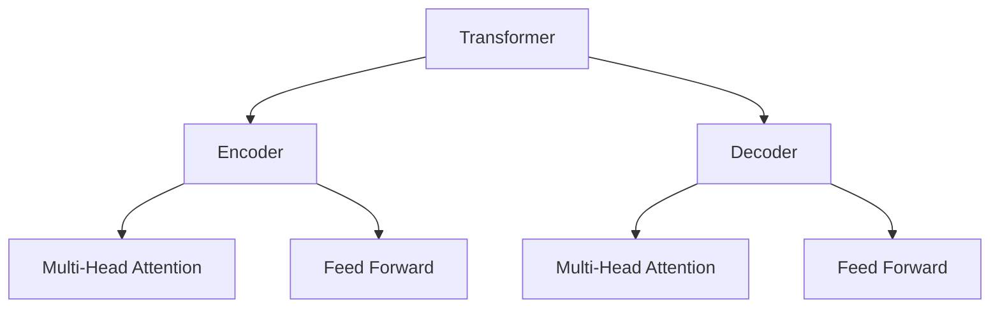

# 大规模语言模型从理论到实践 大语言模型的构建流程

## 1. 背景介绍

### 1.1 语言模型的重要性

语言模型是自然语言处理领域的核心技术之一,广泛应用于机器翻译、语音识别、文本生成、问答系统等各种任务中。随着深度学习技术的发展,大规模语言模型展现出了强大的语言理解和生成能力,成为推动自然语言处理领域飞速发展的关键驱动力。

### 1.2 大语言模型的兴起

传统的语言模型通常基于 N-gram 统计方法,但存在数据稀疏、难以捕捉长距离依赖等缺陷。2018年,Transformer 模型的提出为构建大规模语言模型奠定了基础。自2020年GPT-3模型问世以来,以 BERT、GPT、T5等为代表的大规模语言模型凭借其卓越的性能,在学术界和工业界引起了广泛关注。

### 1.3 大语言模型的特点

大规模语言模型通常具有以下特点:

- 参数规模巨大,可达数十亿甚至上百亿参数
- 使用自监督方式在大规模语料库上进行预训练
- 支持多种自然语言处理任务,具有出色的迁移能力
- 能够捕捉丰富的语义和语境信息

## 2. 核心概念与联系

### 2.1 Transformer 模型

Transformer 是大规模语言模型的核心架构,由编码器(Encoder)和解码器(Decoder)组成。它完全基于注意力机制,摒弃了传统的循环神经网络和卷积神经网络结构,有效解决了长距离依赖问题。



### 2.2 自注意力机制

自注意力机制是 Transformer 的核心,它允许模型捕捉输入序列中任意两个位置之间的依赖关系。通过计算查询(Query)、键(Key)和值(Value)之间的相似性,模型可以动态地分配不同位置的注意力权重。

$$\mathrm{Attention}(Q, K, V) = \mathrm{softmax}(\frac{QK^T}{\sqrt{d_k}})V$$

其中 $Q$ 表示查询向量、$K$ 表示键向量、$V$ 表示值向量,而 $d_k$ 是缩放因子,用于防止内积值过大导致梯度消失。

### 2.3 预训练与微调

大规模语言模型通常采用两阶段训练策略:

1. **预训练(Pre-training)**: 在大规模无标注语料库上进行自监督学习,获得通用的语言表示能力。
2. **微调(Fine-tuning)**: 在特定的自然语言处理任务上进行有监督训练,将预训练模型迁移到目标任务。

预训练和微调的分离使得大规模语言模型可以在不同任务间轻松迁移,提高了训练效率和泛化能力。

## 3. 核心算法原理具体操作步骤

### 3.1 预训练阶段

大规模语言模型的预训练阶段通常包括以下步骤:

1. **数据预处理**: 从互联网或其他来源收集大量文本语料,进行标记化、过滤和shuffle等预处理操作。
2. **模型构建**: 根据任务需求选择合适的Transformer模型架构,如BERT、GPT、T5等。
3. **自监督目标设计**: 设计自监督学习目标,如掩码语言模型(Masked LM)、下一句预测(Next Sentence Prediction)等。
4. **模型训练**: 使用优化算法(如AdamW)在大规模语料库上训练模型,直至收敛或达到预设的训练步数。
5. **模型评估**: 在保留的验证集上评估模型性能,如困惑度(Perplexity)等指标。
6. **模型保存**: 保存训练好的模型参数,用于后续的微调和部署。

### 3.2 微调阶段

在特定的自然语言处理任务上,需要对预训练模型进行微调:

1. **任务数据准备**: 收集并预处理目标任务的训练数据,如文本分类、机器翻译等。
2. **模型加载**: 加载预训练好的语言模型参数。
3. **任务特定模块**: 根据任务需求,设计和添加任务特定的输入表示、输出层等模块。
4. **模型微调训练**: 在目标任务的训练数据上对模型进行有监督微调,通常只需要训练少量步数。
5. **模型评估**: 在保留的测试集上评估微调后模型的性能。
6. **模型部署**: 将微调好的模型部署到生产环境中,服务于实际应用。

## 4. 数学模型和公式详细讲解举例说明

### 4.1 Transformer 模型公式

Transformer 模型的核心计算过程可以用以下公式表示:

1. **缩放点积注意力**:

$$\mathrm{Attention}(Q, K, V) = \mathrm{softmax}(\frac{QK^T}{\sqrt{d_k}})V$$

2. **多头注意力**:

$$\mathrm{MultiHead}(Q, K, V) = \mathrm{Concat}(head_1, ..., head_h)W^O$$
$$\text{where } head_i = \mathrm{Attention}(QW_i^Q, KW_i^K, VW_i^V)$$

3. **前馈神经网络**:

$$\mathrm{FFN}(x) = \max(0, xW_1 + b_1)W_2 + b_2$$

其中 $W_i^Q$、$W_i^K$、$W_i^V$ 和 $W_O$ 是可训练的权重矩阵,而 $W_1$、$b_1$、$W_2$、$b_2$ 是前馈神经网络的参数。

### 4.2 掩码语言模型目标函数

掩码语言模型(Masked LM)是 BERT 预训练的主要目标之一,其目标函数可表示为:

$$\mathcal{L}_{\mathrm{MLM}}(\theta) = -\mathbb{E}_{x \sim X} \left[ \sum_{i \in \mathcal{M}} \log P_\theta(x_i | x_{\backslash i}) \right]$$

其中 $\theta$ 表示模型参数,而 $\mathcal{M}$ 是输入序列 $x$ 中被掩码的位置索引集合。目标是最大化掩码位置的条件概率,以学习上下文语义表示。

### 4.3 示例:BERT 模型注意力可视化

我们可以通过可视化 BERT 模型的注意力权重,直观地理解其捕捉上下文依赖的能力。以下是一个示例:

```python
import numpy as np
import matplotlib.pyplot as plt
from transformers import BertTokenizer, BertModel

# 加载预训练 BERT 模型和分词器
tokenizer = BertTokenizer.from_pretrained('bert-base-uncased')
model = BertModel.from_pretrained('bert-base-uncased')

# 输入文本
text = "The quick brown fox jumps over the lazy dog."

# 对文本进行分词和编码
inputs = tokenizer(text, return_tensors="pt")
outputs = model(**inputs, output_attentions=True)

# 提取注意力权重
attentions = outputs.attentions

# 可视化注意力权重
fig, ax = plt.subplots(figsize=(10, 5))
ax = attentions[0][0].detach().numpy()
im = ax.imshow(ax, cmap='YlGn')
fig.colorbar(im)
plt.show()
```

上述代码将可视化 BERT 模型第一层编码器的自注意力权重矩阵,更高层的注意力权重可能会更加关注语义和上下文信息。

## 5. 项目实践:代码实例和详细解释说明

在本节,我们将使用 Hugging Face 的 Transformers 库,演示如何对 BERT 模型进行微调,以完成文本分类任务。

### 5.1 准备数据

我们将使用 GLUE 基准测试中的 SST-2 数据集,该数据集包含了大量带有情感极性标签(正面或负面)的电影评论文本。

```python
from datasets import load_dataset

dataset = load_dataset("glue", "sst2")
```

### 5.2 数据预处理

我们需要对文本进行分词和编码,将其转换为模型可接受的输入格式。

```python
from transformers import BertTokenizer

tokenizer = BertTokenizer.from_pretrained("bert-base-uncased")

def preprocess(examples):
    return tokenizer(examples["sentence"], truncation=True)

dataset = dataset.map(preprocess, batched=True)
```

### 5.3 定义模型和训练参数

我们将使用 BERT 作为基础模型,并在其之上添加一个分类头。

```python
from transformers import BertForSequenceClassification, TrainingArguments, Trainer

model = BertForSequenceClassification.from_pretrained("bert-base-uncased", num_labels=2)

training_args = TrainingArguments(
    output_dir="./results",
    evaluation_strategy="epoch",
    learning_rate=2e-5,
    per_device_train_batch_size=16,
    per_device_eval_batch_size=16,
    num_train_epochs=3,
    weight_decay=0.01,
)
```

### 5.4 训练和评估

使用 Trainer API 进行模型训练和评估,并在测试集上评估最终性能。

```python
trainer = Trainer(
    model=model,
    args=training_args,
    train_dataset=dataset["train"],
    eval_dataset=dataset["validation"],
)

trainer.train()
eval_result = trainer.evaluate(dataset["test"])
print(f"Test accuracy: {eval_result['eval_accuracy']:.4f}")
```

通过上述代码,我们可以在 SST-2 数据集上对 BERT 模型进行微调,并获得不错的文本分类性能。

## 6. 实际应用场景

大规模语言模型在自然语言处理领域有着广泛的应用场景,包括但不限于:

1. **文本生成**: 利用语言模型的强大生成能力,可以生成高质量的文本内容,如新闻报道、小说、诗歌等。
2. **机器翻译**: 将语言模型与序列到序列模型相结合,可以构建出色的机器翻译系统。
3. **问答系统**: 语言模型能够理解和回答各种形式的自然语言问题,是构建智能问答系统的核心技术。
4. **文本摘要**: 通过捕捉文本的关键信息,语言模型可以生成高质量的文本摘要。
5. **情感分析**: 利用语言模型对文本进行情感极性判断,广泛应用于社交媒体监测、客户服务等领域。
6. **代码生成**: 最新的大规模语言模型如 Codex 展现出了生成代码的能力,有望辅助软件开发。

总的来说,大规模语言模型正在推动自然语言处理技术向着通用人工智能的方向发展,其应用前景十分广阔。

## 7. 工具和资源推荐

在构建和使用大规模语言模型的过程中,以下工具和资源可以为您提供帮助:

1. **Hugging Face Transformers**: 提供了大量预训练语言模型和相关工具,是目前最流行的 NLP 库之一。
2. **AllenNLP**: 由 AI2 开发的开源 NLP 研究库,提供了丰富的模型和数据集。
3. **fairseq**: Facebook AI 开发的序列建模工具包,支持构建和训练自定义语言模型。
4. **GPT-3 API**: OpenAI 提供的 GPT-3 语言模型 API,可以方便地集成到应用程序中。
5. **GLUE 基准测试**: 用于评估和比较不同语言模型在多项任务上的性能表现。
6. **语料库资源**: 包括 BookCorpus、Wikipedia、WebText 等大规模无标注语料库。
7. **云计算资源**: 如 Google Cloud、AWS 等云服务提供商,可以提供足够的计算资源用于训练大型模型。
8. **模型压缩技术**: 如量化、知识蒸馏等技术,可以减小语言模型的存储和计算开销。

通过合理利用这些工具和资源,您可以更高效地开发和应用大规模语言模型。

## 8. 总结:未来发展趋势与挑战

### 8.1 发展趋势

1. **模型规模持续增长**: 随着计算能力的提升,语言模型的参数规模将继续增长,以捕捉更丰富的语义和知识。
2. **多模态融合