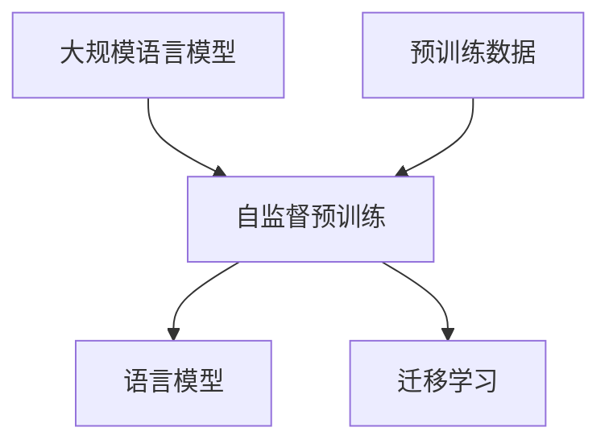

# 大规模语言模型从理论到实践：大语言模型预训练数据

## 1. 背景介绍

### 1.1 自然语言处理的重要性

在当今信息时代,自然语言处理(Natural Language Processing,NLP)已经成为人工智能领域中最重要和最具挑战性的研究方向之一。随着互联网和智能设备的普及,人类与机器之间的自然语言交互需求日益增长。NLP技术在机器翻译、智能问答、信息检索、情感分析等领域发挥着关键作用。

### 1.2 大规模语言模型的兴起

传统的NLP模型通常基于有限的标注语料库进行训练,其性能和应用场景受到了很大限制。近年来,随着计算能力的提高和海量文本数据的出现,大规模语言模型(Large Language Model,LLM)应运而生。LLM通过在大规模无标注文本语料上进行自监督预训练,学习到了丰富的语言知识,从而在下游NLP任务中表现出卓越的性能。

### 1.3 预训练数据的重要性

预训练数据是训练大规模语言模型的基础。高质量、多样化的预训练数据不仅能够提高模型的泛化能力,还能够减少模型在特定领域的偏差。因此,如何构建高质量的预训练数据集成为了LLM研究的关键环节之一。

## 2. 核心概念与联系

### 2.1 自监督预训练

自监督预训练(Self-Supervised Pretraining)是训练大规模语言模型的核心技术。与传统的监督学习不同,自监督预训练不需要人工标注的数据,而是通过设计特殊的预训练任务,利用大量无标注文本数据进行训练。常见的预训练任务包括掩码语言模型(Masked Language Modeling)和下一句预测(Next Sentence Prediction)等。

### 2.2 语言模型

语言模型(Language Model)是自然语言处理的基础模型,旨在学习语言的概率分布。给定一个文本序列,语言模型可以计算该序列出现的概率。大规模语言模型通过在海量文本数据上训练,学习到了丰富的语言知识,因此在下游NLP任务中表现出色。

### 2.3 迁移学习

迁移学习(Transfer Learning)是将在源域学习到的知识迁移到目标域的一种机器学习范式。在NLP领域,大规模语言模型通过自监督预训练学习到了通用的语言知识,然后可以通过微调(Fine-tuning)的方式将这些知识迁移到下游NLP任务中,从而提高模型的性能。

### 2.4 核心概念关系图



## 3. 核心算法原理具体操作步骤

### 3.1 自监督预训练任务

大规模语言模型的预训练通常采用自监督学习的方式,常见的预训练任务包括:

1. **掩码语言模型(Masked Language Modeling,MLM)**: 在输入序列中随机掩码部分单词,模型需要根据上下文预测被掩码的单词。

2. **下一句预测(Next Sentence Prediction,NSP)**: 给定两个句子,模型需要预测第二个句子是否为第一个句子的下一句。

3. **替换令牌检测(Replaced Token Detection,RTD)**: 在输入序列中随机替换部分单词,模型需要检测出被替换的单词位置。

4. **序列到序列预训练(Sequence-to-Sequence Pretraining)**: 模型需要根据输入序列生成相应的目标序列,常用于机器翻译等任务。

这些预训练任务的目标是让模型学习到语言的统计规律和语义信息,从而在下游任务中表现出良好的泛化能力。

### 3.2 预训练数据构建

高质量的预训练数据对于训练出优秀的大规模语言模型至关重要。构建预训练数据集的一般步骤包括:

1. **数据采集**: 从互联网、书籍、新闻等多种来源采集大量文本数据。

2. **数据清洗**: 去除垃圾数据、低质量数据,进行文本规范化处理。

3. **数据过滤**: 根据特定需求过滤不相关的数据,如过滤掉特定语种、领域等。

4. **数据去重**: 去除重复数据,提高数据多样性。

5. **数据切分**: 将文本切分为适合模型输入的序列长度。

6. **数据打乱**: 随机打乱数据顺序,增加数据多样性。

在构建过程中,还需要注意数据的版权、隐私等法律问题,确保数据的合法性和安全性。

### 3.3 模型训练

经过预训练数据构建后,可以开始训练大规模语言模型。训练过程包括以下主要步骤:

1. **选择模型架构**: 常见的模型架构包括Transformer、BERT、GPT等。

2. **数据预处理**: 对预训练数据进行tokenization、padding等预处理操作。

3. **设置训练参数**: 确定批次大小、学习率、训练轮数等超参数。

4. **模型初始化**: 根据选择的模型架构初始化模型参数。

5. **模型训练**: 使用预训练数据和自监督预训练任务对模型进行训练,优化模型参数。

6. **模型评估**: 在开发集或测试集上评估模型性能,根据需要进行模型微调。

7. **模型部署**: 将训练好的模型部署到生产环境中,用于下游NLP任务。

训练大规模语言模型通常需要大量的计算资源和时间,因此分布式训练和模型并行化技术被广泛应用。

## 4. 数学模型和公式详细讲解举例说明

### 4.1 语言模型概率计算

语言模型的目标是学习一个概率分布 $P(X)$,其中 $X = (x_1, x_2, ..., x_n)$ 表示一个长度为 $n$ 的文本序列。根据链式法则,我们可以将 $P(X)$ 分解为:

$$P(X) = P(x_1, x_2, ..., x_n) = \prod_{i=1}^{n}P(x_i|x_1, x_2, ..., x_{i-1})$$

其中 $P(x_i|x_1, x_2, ..., x_{i-1})$ 表示在给定前 $i-1$ 个单词的情况下,第 $i$ 个单词出现的条件概率。

语言模型的目标就是学习这个条件概率分布,从而能够预测下一个单词的概率。在实践中,由于计算复杂度的原因,通常采用 $n$-gram 语言模型,即只考虑有限个历史单词的影响:

$$P(x_i|x_1, x_2, ..., x_{i-1}) \approx P(x_i|x_{i-n+1}, x_{i-n+2}, ..., x_{i-1})$$

其中 $n$ 通常取较小的值,如 $n=3$ 表示三元语言模型。

### 4.2 掩码语言模型

掩码语言模型(MLM)是训练BERT等Transformer模型的核心任务。给定一个输入序列 $X$,我们随机选择一些位置进行掩码,得到掩码序列 $\hat{X}$。模型的目标是根据上下文预测被掩码的单词,即最大化以下条件概率:

$$\max_{\theta} \prod_{x_i \in \mathcal{M}} P(x_i|\hat{X}, \theta)$$

其中 $\mathcal{M}$ 表示被掩码的单词位置集合, $\theta$ 表示模型参数。

在实现时,通常采用两种策略处理被掩码的单词:

1. **Replacement**: 将被掩码的单词替换为特殊的 `[MASK]` 标记。
2. **Corruption**: 将被掩码的单词替换为随机单词或保留原单词(根据一定概率)。

通过这种方式,模型被迫从上下文中学习单词的语义信息,从而获得更好的语言理解能力。

### 4.3 下一句预测

下一句预测(NSP)是训练BERT模型的另一个预训练任务。给定两个句子 $A$ 和 $B$,模型需要预测 $B$ 是否为 $A$ 的下一句,即计算:

$$P(B|A, \theta) = \begin{cases}
P(IsNext|\vec{A}, \vec{B}, \theta) & \text{if } B \text{ is next sentence of } A\
P(NotNext|\vec{A}, \vec{B}, \theta) & \text{otherwise}
\end{cases}$$

其中 $\vec{A}$ 和 $\vec{B}$ 分别表示句子 $A$ 和 $B$ 的向量表示,通过对输入序列 `[CLS] A [SEP] B [SEP]` 进行编码得到。

NSP任务的目标是让模型学习句子之间的coherence和relationship,从而提高模型对上下文的理解能力。

### 4.4 自回归语言模型

自回归语言模型(Autoregressive Language Model)是GPT等模型采用的预训练方式。给定一个输入序列 $X = (x_1, x_2, ..., x_n)$,模型的目标是最大化序列的条件概率:

$$\max_{\theta} \prod_{i=1}^{n} P(x_i|x_1, x_2, ..., x_{i-1}, \theta)$$

这种方式直接对应语言模型的概率计算公式,模型被迫学习单词之间的依赖关系,从而获得更强的语言生成能力。

在实现时,通常采用掩码的方式,即在每一步预测时,将已经生成的单词作为输入,预测下一个单词。这种方式被称为Teacher Forcing,可以加速训练过程。

## 5. 项目实践:代码实例和详细解释说明

在这一部分,我们将通过一个实际的代码示例,演示如何使用Python和Hugging Face Transformers库来训练一个掩码语言模型。

### 5.1 导入必要的库

```python
import torch
from transformers import BertTokenizer, BertForMaskedLM
```

我们将使用BERT模型和tokenizer作为示例。

### 5.2 准备数据

```python
text = "The quick brown fox jumps over the lazy dog."
tokenizer = BertTokenizer.from_pretrained('bert-base-uncased')
inputs = tokenizer.encode_plus(text, return_tensors='pt', add_special_tokens=True)
```

我们首先定义一个示例文本,然后使用BERT tokenizer对其进行编码,得到输入张量。

### 5.3 创建掩码

```python
masked_index = 8  # 掩码位置
inputs['input_ids'][0, masked_index] = tokenizer.mask_token_id
labels = inputs['input_ids'].clone()
```

我们选择文本中的第8个单词"jumps"进行掩码,将其替换为特殊的`[MASK]`标记。同时,我们保留原始标签,用于计算损失函数。

### 5.4 加载预训练模型

```python
model = BertForMaskedLM.from_pretrained('bert-base-uncased')
model.eval()
```

我们加载预训练的BERT模型,并将其设置为评估模式。

### 5.5 预测被掩码的单词

```python
with torch.no_grad():
    outputs = model(**inputs)
    predicted_index = torch.argmax(outputs.logits[0, masked_index]).item()
    predicted_token = tokenizer.decode([predicted_index])
    print(f"Predicted token: {predicted_token}")
```

我们将输入传递给模型,获取预测的logits。然后,我们找到掩码位置对应的最大logit值的索引,并使用tokenizer将其解码为单词。

在这个示例中,预训练的BERT模型应该能够正确预测被掩码的单词"jumps"。

通过这个简单的示例,我们可以看到如何使用Transformers库来加载预训练模型、处理输入数据,以及进行掩码语言模型预测。在实际项目中,您可以根据需要对数据进行预处理、设置训练参数,并在自己的数据集上进行模型微调。

## 6. 实际应用场景

大规模语言模型在自然语言处理的多个领域发挥着重要作用,下面是一些典型的应用场景:

### 6.1 机器翻译

机器翻译是NLP的经典应用之一。大规模语言模型可以作为机器翻译系统的核心组件,通过学习源语言和目标语言的联合概率分布,实现高质量的翻译。例如,谷歌的