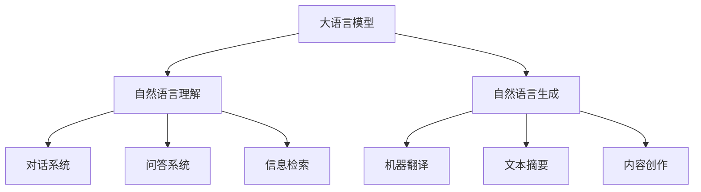

# 大语言模型原理与工程实践：什么是大语言模型

## 1. 背景介绍

### 1.1 人工智能的发展历程

人工智能(Artificial Intelligence, AI)是当代科技发展的前沿领域,旨在使计算机系统能够模拟人类的认知功能,如学习、推理、感知和自然语言处理等。自20世纪50年代AI概念被正式提出以来,经历了多个发展阶段。

### 1.2 深度学习的兴起

近年来,深度学习(Deep Learning)技术的突破性进展推动了AI的快速发展。深度学习是一种基于人工神经网络的机器学习方法,能够从大量数据中自动学习特征表示,并用于各种复杂任务,如计算机视觉、自然语言处理等。

### 1.3 大语言模型的崛起

在自然语言处理领域,大型神经网络语言模型取得了令人瞩目的成就。这些模型被称为"大语言模型"(Large Language Model, LLM),能够从海量文本数据中学习语言知识和模式,展现出惊人的语言理解和生成能力。

## 2. 核心概念与联系

### 2.1 什么是大语言模型?

大语言模型是一种基于深度学习的巨大神经网络,通过自监督学习方式在海量文本语料上进行训练,掌握了丰富的语言知识和上下文信息。它们能够理解和生成流畅、连贯的自然语言文本,被广泛应用于对话系统、机器翻译、文本摘要、问答系统等各种自然语言处理任务。



### 2.2 大语言模型的核心特点

1. **规模庞大**:大语言模型通常包含数十亿甚至上百亿个参数,模型规模空前巨大。
2. **自监督学习**:大语言模型采用自监督学习方式,从海量未标注文本数据中学习语言知识。
3. **上下文建模**:大语言模型能够有效捕捉文本的上下文信息,理解和生成连贯的长文本。
4. **通用性**:大语言模型具有强大的通用性能,可应用于多种自然语言处理任务。
5. **可扩展性**:随着计算能力的提升和训练数据的增加,大语言模型的性能可持续提高。

### 2.3 主流大语言模型

目前,主流的大语言模型包括GPT(Generative Pre-trained Transformer)系列、BERT(Bidirectional Encoder Representations from Transformers)系列、T5(Text-to-Text Transfer Transformer)、PanGu等。这些模型采用了不同的神经网络结构和训练策略,展现出卓越的语言理解和生成能力。

## 3. 核心算法原理具体操作步骤

### 3.1 Transformer架构

大语言模型的核心架构是基于Transformer的序列到序列(Seq2Seq)模型。Transformer由编码器(Encoder)和解码器(Decoder)组成,利用自注意力(Self-Attention)机制有效捕捉序列中元素之间的长程依赖关系。


### 3.2 自监督学习

大语言模型采用自监督学习方式进行训练,主要有以下两种策略:

1. **掩码语言模型(Masked Language Modeling, MLM)**:在输入序列中随机掩码部分词元,模型需要预测被掩码的词元。
2. **下一句预测(Next Sentence Prediction, NSP)**:给定两个句子,模型需要判断第二个句子是否为第一个句子的下一句。

通过这种自监督学习方式,大语言模型能够从海量未标注文本数据中学习语言知识和模式。

### 3.3 预训练与微调

大语言模型的训练过程分为两个阶段:

1. **预训练(Pre-training)**:在大规模通用语料上进行自监督学习,获得通用的语言表示能力。
2. **微调(Fine-tuning)**:在特定任务的标注数据上进行监督学习,将预训练模型适应于目标任务。

微调过程通常只需调整模型的部分参数,可以快速converge,并保留预训练模型中学习到的语言知识。

### 3.4 生成式任务

对于生成式任务(如机器翻译、文本摘要等),大语言模型通常采用以下步骤:

1. 将输入序列输入编码器,获得其隐藏状态表示。
2. 将编码器的隐藏状态作为解码器的初始状态。
3. 解码器基于输入的隐藏状态,自回归地生成输出序列的每个词元。

通过掩码语言模型的训练,大语言模型学会了预测下一个词元的能力,因此能够生成流畅、连贯的文本序列。

## 4. 数学模型和公式详细讲解举例说明

### 4.1 Transformer模型

Transformer模型的核心是自注意力(Self-Attention)机制,它能够直接捕捉序列中任意两个位置的元素之间的依赖关系。

给定一个长度为 $n$ 的序列 $\boldsymbol{x} = (x_1, x_2, \ldots, x_n)$,自注意力的计算过程如下:

$$\begin{aligned}
\boldsymbol{Q} &= \boldsymbol{X} \boldsymbol{W}^Q \
\boldsymbol{K} &= \boldsymbol{X} \boldsymbol{W}^K \
\boldsymbol{V} &= \boldsymbol{X} \boldsymbol{W}^V \
\text{Attention}(\boldsymbol{Q}, \boldsymbol{K}, \boldsymbol{V}) &= \text{softmax}\left(\frac{\boldsymbol{Q}\boldsymbol{K}^\top}{\sqrt{d_k}}\right)\boldsymbol{V}
\end{aligned}$$

其中 $\boldsymbol{W}^Q$、$\boldsymbol{W}^K$、$\boldsymbol{W}^V$ 分别是查询(Query)、键(Key)和值(Value)的线性投影矩阵,用于将输入序列映射到不同的子空间;$d_k$ 是缩放因子,用于平衡点积的大小。

通过计算查询和所有键的点积,然后对点积结果进行软最大化,我们可以获得每个位置对其他位置的注意力分布。将注意力分布与值相乘,即可得到该位置的表示,该表示融合了全局信息。

### 4.2 掩码语言模型

掩码语言模型(MLM)是大语言模型预训练的核心任务之一。给定一个长度为 $n$ 的序列 $\boldsymbol{x} = (x_1, x_2, \ldots, x_n)$,我们随机掩码部分位置的词元,得到掩码后的序列 $\boldsymbol{\tilde{x}}$。模型的目标是预测被掩码的词元,即最大化以下条件概率:

$$\mathcal{L}_\text{MLM} = \mathbb{E}_{\boldsymbol{x} \sim \mathcal{D}} \left[ \sum_{i \in \mathcal{M}} \log P(x_i | \boldsymbol{\tilde{x}}) \right]$$

其中 $\mathcal{M}$ 是被掩码位置的集合,$ \mathcal{D}$ 是训练语料的数据分布。通过最大化上式,模型可以学习到丰富的语言知识和上下文信息。

在实践中,我们通常采用两种掩码策略:

1. **随机掩码**:随机选择 15% 的词元进行掩码,其中 80% 用特殊的 `[MASK]` 标记替换,10% 保持不变,10% 替换为随机词元。
2. **连续掩码**:按照一定长度随机采样连续的span进行掩码,这有助于模型学习更长程的依赖关系。

通过上述掩码策略,大语言模型能够在预训练阶段学习到丰富的语言知识,为下游任务的微调奠定基础。

## 5. 项目实践:代码实例和详细解释说明

以下是使用PyTorch实现掩码语言模型的简化示例代码,供参考:

```python
import torch
import torch.nn as nn
from transformers import BertTokenizer, BertModel

# 加载预训练BERT模型和分词器
tokenizer = BertTokenizer.from_pretrained('bert-base-uncased')
bert_model = BertModel.from_pretrained('bert-base-uncased')

# 定义掩码语言模型
class MaskedLM(nn.Module):
    def __init__(self, bert_model):
        super(MaskedLM, self).__init__()
        self.bert = bert_model
        self.lm_head = nn.Linear(bert_model.config.hidden_size, bert_model.config.vocab_size)

    def forward(self, input_ids, attention_mask, masked_lm_labels):
        outputs = self.bert(input_ids, attention_mask=attention_mask)
        sequence_output = outputs[0]
        prediction_scores = self.lm_head(sequence_output)

        masked_lm_loss = None
        if masked_lm_labels is not None:
            loss_fct = nn.CrossEntropyLoss()
            masked_lm_loss = loss_fct(prediction_scores.view(-1, self.bert.config.vocab_size),
                                      masked_lm_labels.view(-1))

        return prediction_scores, masked_lm_loss

# 示例输入
input_text = "The quick brown fox [MASK] over the lazy dog."
input_ids = tokenizer.encode(input_text, return_tensors='pt')
masked_lm_labels = tokenizer.encode("The quick brown fox jumps over the lazy dog.", return_tensors='pt')

# 构建模型并计算损失
model = MaskedLM(bert_model)
outputs = model(input_ids, attention_mask=input_ids.ne(tokenizer.pad_token_id), masked_lm_labels=masked_lm_labels)
prediction_scores, masked_lm_loss = outputs

print(f"Masked LM Loss: {masked_lm_loss.item()}")
```

上述代码的关键步骤如下:

1. 加载预训练的BERT模型和分词器。
2. 定义掩码语言模型类 `MaskedLM`,它包含BERT模型和一个线性层用于词元预测。
3. 在 `forward` 函数中,首先通过BERT模型获取序列的隐藏状态表示 `sequence_output`。
4. 将 `sequence_output` 输入线性层 `lm_head`,得到每个位置的词元预测分数 `prediction_scores`。
5. 如果提供了掩码标签 `masked_lm_labels`,计算交叉熵损失 `masked_lm_loss`。
6. 构建模型实例,输入示例文本和掩码标签,计算掩码语言模型的损失。

通过上述代码,我们可以在预训练语料上训练掩码语言模型,使其学习到丰富的语言知识和上下文信息。在下游任务中,我们可以对预训练模型进行微调,以适应特定的任务需求。

## 6. 实际应用场景

大语言模型在自然语言处理领域展现出了广泛的应用前景,包括但不限于以下场景:

### 6.1 对话系统

大语言模型可以用于构建智能对话系统,如聊天机器人、虚拟助手等。这些系统能够理解用户的自然语言输入,并生成相应的自然语言响应,实现人机自然交互。

### 6.2 机器翻译

大语言模型在机器翻译任务中表现出色,能够生成流畅、准确的目标语言文本。通过预训练和微调,大语言模型可以学习不同语言之间的映射关系,克服传统统计机器翻译方法的局限性。

### 6.3 文本摘要

文本摘要是自然语言处理的一个重要任务,旨在从长文本中自动提取出关键信息和核心内容。大语言模型可以学习到文本的语义和结构信息,从而生成高质量的文本摘要。

### 6.4 问答系统

大语言模型在问答系统中发挥着关键作用,能够理解复杂的自然语言问题,并从知识库或文本中检索相关信息,生成准确的答案。这为构建智能问答系统提供了强大的技术支持。

### 6.5 内容创作

除了理解和生成自然语言,大语言模型还可以用于辅助内容创作,如新闻报道、