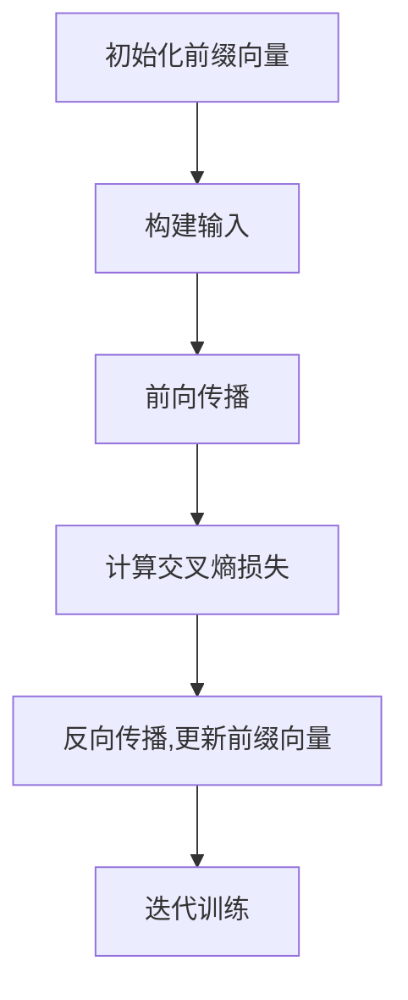

# 大语言模型原理与工程实践：前缀微调

## 1. 背景介绍

在过去几年中,大型语言模型(Large Language Models, LLMs)在自然语言处理(NLP)领域取得了令人瞩目的进展。这些模型通过在海量文本数据上进行预训练,学习了丰富的语言知识和上下文信息,展现出惊人的泛化能力,可以应用于广泛的下游NLP任务。

然而,直接将预训练语言模型应用于特定任务通常效果并不理想,因为预训练数据与目标任务存在分布偏移。为了解决这一问题,研究人员提出了一种称为"前缀微调"(Prefix Tuning)的技术,旨在有效地将通用语言模型适配到特定任务上,同时保持模型大部分参数不变。

## 2. 核心概念与联系

### 2.1 前缀微调的核心思想

前缀微调的核心思想是为每个任务学习一个可续写的"前缀"(Prefix),该前缀作为输入的一部分,与原始输入文本拼接后喂入语言模型。在训练过程中,只有这个前缀的参数会被微调,而语言模型的主干参数保持不变。这种方法可以显著降低微调所需的计算资源,同时避免了对预训练模型的破坏性修改。

### 2.2 前缀表示

前缀可以用一系列的向量来表示,每个向量对应于一个虚拟的"前缀令牌"(Prefix Token)。这些前缀令牌与输入文本的实际令牌拼接后,喂入语言模型进行处理。前缀的长度是一个超参数,需要根据具体任务进行调整。

### 2.3 前缀与任务的关联

每个任务都会学习一个专用的前缀,该前缀编码了任务的指令和上下文信息。在推理阶段,将对应任务的前缀与输入文本拼接,然后输入到语言模型中,模型会根据前缀的指导生成与该任务相关的输出。

## 3. 核心算法原理具体操作步骤

前缀微调算法的核心步骤如下:

1. **初始化前缀向量**: 为每个任务随机初始化一个前缀向量序列,长度为超参数`prefix_length`。

2. **构建输入**: 将前缀向量序列与输入文本拼接,形成新的输入序列`inputs`。

3. **前向传播**: 将`inputs`输入到语言模型中,获得模型的输出`outputs`。

4. **计算损失**: 根据任务目标(如分类、生成等)计算损失函数`loss`。

5. **反向传播**: 对前缀向量进行梯度更新,语言模型主干参数保持不变。

6. **迭代训练**: 重复步骤2-5,直到前缀向量收敛或达到最大训练步数。

以文本分类任务为例,算法流程如下所示:



## 4. 数学模型和公式详细讲解举例说明

### 4.1 前缀表示

假设我们有一个长度为$m$的前缀,它由$m$个前缀向量$\{p_1, p_2, \dots, p_m\}$组成,其中每个$p_i \in \mathbb{R}^{d_\text{model}}$是一个$d_\text{model}$维的向量。我们将这些前缀向量与输入文本$x=\{x_1, x_2, \dots, x_n\}$拼接,形成新的输入序列:

$$\text{inputs} = [p_1, p_2, \dots, p_m, x_1, x_2, \dots, x_n]$$

这个新的输入序列将被喂入语言模型进行处理。

### 4.2 前缀微调目标函数

在训练过程中,我们希望学习到一组最优的前缀向量$\{p_1^*, p_2^*, \dots, p_m^*\}$,使得在给定任务上,语言模型的输出$y$与期望输出$\hat{y}$之间的损失函数$\mathcal{L}$最小化。具体来说,我们希望最小化以下目标函数:

$$\mathcal{J}(\{p_i\}) = \mathbb{E}_{(x, \hat{y}) \sim \mathcal{D}}\left[\mathcal{L}\left(f_\theta\left([p_1, p_2, \dots, p_m, x]\right), \hat{y}\right)\right]$$

其中,$\mathcal{D}$表示训练数据的分布,$f_\theta$是参数为$\theta$的语言模型,$\mathcal{L}$是任务相关的损失函数(如交叉熵损失函数用于分类任务)。

在优化过程中,我们只更新前缀向量$\{p_i\}$的参数,而语言模型$f_\theta$的参数$\theta$保持不变。这种训练策略可以避免对预训练语言模型的破坏性微调,同时显著降低了计算资源的需求。

### 4.3 前缀长度的选择

前缀的长度$m$是一个重要的超参数,它决定了前缀所能编码的信息量。一般来说,较长的前缀可以编码更多的任务相关信息,但也会增加计算开销。在实践中,通常需要根据具体任务和资源约束,选择合适的前缀长度。

## 5. 项目实践: 代码实例和详细解释说明

以下是一个使用PyTorch实现前缀微调的简单示例,用于文本分类任务。为了便于说明,我们使用一个小型语言模型和一个简单的数据集。

### 5.1 导入所需库

```python
import torch
import torch.nn as nn
from torch.utils.data import DataLoader
from transformers import AutoTokenizer, AutoModelForSequenceClassification
```

### 5.2 定义前缀编码器

```python
class PrefixEncoder(nn.Module):
    def __init__(self, config, prefix_length):
        super().__init__()
        self.prefix_length = prefix_length
        self.prefix_encoder = nn.Embedding(1, config.hidden_size)
        self.prefix_tokens = torch.zeros(prefix_length).long()

    def forward(self):
        past_key_values = self.prefix_encoder(self.prefix_tokens.unsqueeze(0))
        return past_key_values
```

`PrefixEncoder`模块用于生成前缀向量序列。它包含一个`nn.Embedding`层,用于将一个标量(在这里是0)映射到一个前缀向量序列。`prefix_length`是前缀的长度,是一个超参数。

### 5.3 定义前缀微调模型

```python
class PrefixTuningModel(nn.Module):
    def __init__(self, config, prefix_length):
        super().__init__()
        self.prefix_encoder = PrefixEncoder(config, prefix_length)
        self.model = AutoModelForSequenceClassification.from_pretrained("bert-base-uncased")

    def forward(self, input_ids, attention_mask, labels=None):
        past_key_values = self.prefix_encoder()
        outputs = self.model(input_ids, attention_mask=attention_mask, past_key_values=past_key_values, labels=labels)
        return outputs
```

`PrefixTuningModel`是前缀微调的主要模型。它包含一个`PrefixEncoder`模块和一个预训练的语言模型(在这里是BERT)。在前向传播时,首先通过`PrefixEncoder`生成前缀向量序列,然后将其与输入文本拼接,喂入语言模型进行处理。

### 5.4 准备数据集和数据加载器

```python
# 加载数据集和标签
train_data = ...
train_labels = ...

# tokenizer
tokenizer = AutoTokenizer.from_pretrained("bert-base-uncased")

# 数据预处理
train_encodings = tokenizer(train_data, truncation=True, padding=True)
train_dataset = torch.utils.data.TensorDataset(
    torch.tensor(train_encodings["input_ids"]),
    torch.tensor(train_encodings["attention_mask"]),
    torch.tensor(train_labels)
)

# 数据加载器
train_loader = DataLoader(train_dataset, batch_size=16, shuffle=True)
```

这部分代码用于准备训练数据集和数据加载器。具体实现细节根据实际情况而定。

### 5.5 训练循环

```python
# 初始化模型和优化器
model = PrefixTuningModel(config, prefix_length=10)
optimizer = torch.optim.AdamW(model.prefix_encoder.parameters(), lr=1e-4)

# 训练循环
for epoch in range(num_epochs):
    for batch in train_loader:
        input_ids, attention_mask, labels = batch
        outputs = model(input_ids, attention_mask, labels=labels)
        loss = outputs.loss
        loss.backward()
        optimizer.step()
        optimizer.zero_grad()
```

在训练循环中,我们初始化了`PrefixTuningModel`和优化器。注意,我们只优化前缀编码器的参数,而语言模型的参数保持不变。在每个批次中,我们计算损失,执行反向传播和参数更新。

以上代码仅为示例,在实际应用中,您可能需要进行更多的数据预处理、超参数调整和模型评估等工作。

## 6. 实际应用场景

前缀微调技术已经在多个领域的实际应用中取得了成功,包括但不限于:

1. **自然语言理解任务**: 如文本分类、情感分析、命名实体识别等,前缀微调可以有效地将通用语言模型适配到特定任务上。

2. **自然语言生成任务**: 如机器翻译、文本摘要、对话系统等,前缀微调可以指导语言模型生成符合特定任务要求的输出。

3. **多任务学习**: 前缀微调为每个任务学习一个专用的前缀,从而实现了在单一模型上同时支持多个任务的目标。

4. **Few-shot学习**: 在数据量有限的情况下,前缀微调可以快速地将语言模型适配到新任务上,展现出出色的Few-shot学习能力。

5. **个性化语言模型**: 通过为不同的用户或领域学习专用的前缀,可以构建个性化的语言模型,满足特定需求。

6. **知识库构建**: 前缀微调可以用于从大规模语料中提取特定领域的知识,构建专门的知识库。

总的来说,前缀微调技术为大型语言模型在各种应用场景中的高效部署提供了一种灵活且高效的解决方案。

## 7. 工具和资源推荐

如果您希望在实践中应用前缀微调技术,以下是一些推荐的工具和资源:

1. **Hugging Face Transformers库**: 这是一个流行的NLP库,提供了预训练语言模型和各种NLP任务的实现。它支持前缀微调,并提供了相关的示例代码。

2. **Prefix-Tuning库**: 这是一个专门用于前缀微调的开源Python库,提供了易于使用的API和多种预训练模型的支持。

3. **OpenAI Prefix-Tuning论文**: 这是前缀微调技术的原始论文,详细介绍了该方法的理论基础和实验结果。

4. **Prefix-Tuning教程和博客**: 网上有许多优秀的教程和博客文章,详细解释了前缀微调的原理和实现细节,可以作为入门学习资源。

5. **开源项目和代码示例**: 在GitHub和其他代码托管平台上,有许多开源项目和代码示例展示了如何应用前缀微调技术解决实际问题。

6. **NLP社区和论坛**: 加入NLP相关的社区和论坛,与其他研究人员和从业者交流,分享经验和最新进展。

通过利用这些工具和资源,您可以更好地掌握前缀微调技术,并将其应用于自己的项目和研究工作中。

## 8. 总结: 未来发展趋势与挑战

前缀微调技术为大型语言模型的高效微调提供了一种有前景的解决方案。它不仅可以显著降低计算资源需求,而且避免了对预训练模型的破坏性修改,保留了模型的泛化能力。

然而,前缀微调技术也面临一些挑战和局限性:

1. **前缀长度选择**: 前缀长度是一个关键的超参数,需要根据具体任务进行调整。过长的前缀可能会导致计算开销过大,而过短的前缀则可能无法有效编码任务信息。

2. **前缀可解释性**: 虽然前缀可以编码任务相关的信息,但它们的内部表示形式通常