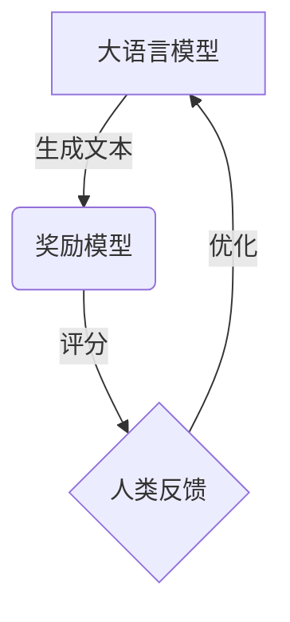
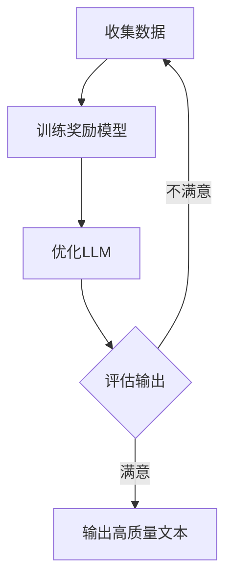

# 大语言模型原理与工程实践：奖励模型的结构

## 1. 背景介绍

### 1.1 大语言模型的兴起

近年来,大型语言模型(Large Language Models, LLMs)在自然语言处理领域取得了巨大的突破。LLMs是一种基于深度学习的模型,能够从大量文本数据中学习语言的统计规律,并生成看似人类写作的自然语言输出。代表性的LLMs包括GPT-3、BERT、XLNet等。

### 1.2 奖励模型的重要性

尽管LLMs表现出色,但它们仍然存在一些缺陷,例如生成的文本缺乏连贯性、偏差和不当内容等。为了解决这些问题,研究人员提出了奖励模型(Reward Model)的概念,旨在引导LLMs生成更加高质量、符合人类偏好的输出。

## 2. 核心概念与联系

### 2.1 奖励模型的定义

奖励模型是一种机器学习模型,它能够对LLMs生成的文本进行评分,从而指导LLMs优化其输出,生成更加符合人类期望的文本。奖励模型的核心思想是将人类的偏好编码为一个评分函数,LLMs则尝试最大化这个评分函数的值。

### 2.2 奖励模型与强化学习

奖励模型与强化学习(Reinforcement Learning, RL)理论密切相关。在RL中,智能体通过与环境交互获得奖励信号,并根据这些奖励信号调整其行为策略,以最大化未来的累积奖励。类似地,LLMs可以被视为智能体,而奖励模型则提供了奖励信号,指导LLMs优化其语言生成策略。

### 2.3 奖励模型与人类反馈

奖励模型的一个关键特点是,它能够将人类的反馈直接纳入模型中。通过收集人类对LLMs生成文本的评分或排序,我们可以训练奖励模型来学习人类的偏好,从而更好地指导LLMs生成符合人类期望的输出。



## 3. 核心算法原理具体操作步骤

奖励模型的训练和应用过程可以概括为以下几个步骤:

### 3.1 数据收集

首先,我们需要收集一个包含LLMs生成文本及其对应人类评分的数据集。这可以通过众包平台(如Amazon Mechanical Turk)或内部人工标注的方式完成。

### 3.2 奖励模型训练

使用收集到的数据集,我们可以训练一个奖励模型,将人类的评分作为监督信号。常见的奖励模型架构包括基于BERT的分类模型、基于语言模型的评分模型等。

### 3.3 LLM优化

利用训练好的奖励模型,我们可以优化LLMs的语言生成策略,使其生成的文本能够获得更高的奖励分数。优化方法包括:

1. **策略梯度方法**: 通过奖励模型的反馈信号,计算LLM的策略梯度,并沿着梯度方向更新LLM的参数。

2. **基于搜索的方法**: 对LLM生成的候选文本进行采样,使用奖励模型评分,并选择得分最高的文本作为最终输出。

3. **基于能量的方法**: 将奖励模型的评分视为能量函数,使用基于能量的采样方法(如Langevin动力学)生成高质量文本。

### 3.4 迭代优化

上述优化过程可以重复进行多次迭代,每次使用优化后的LLM生成新的文本,并收集人类反馈,进一步优化奖励模型和LLM。这种人机协同的方式可以不断提高LLM的输出质量。



## 4. 数学模型和公式详细讲解举例说明

### 4.1 奖励模型的形式化定义

让我们使用数学符号来形式化定义奖励模型。假设我们有一个LLM $P_\theta(x)$,它能够生成文本序列 $x = (x_1, x_2, \dots, x_T)$,其中 $\theta$ 是LLM的参数。我们的目标是找到一个参数 $\theta^*$,使得LLM生成的文本能够最大化一个奖励函数 $R(x)$,即:

$$\theta^* = \arg\max_\theta \mathbb{E}_{x \sim P_\theta(x)}[R(x)]$$

其中,奖励函数 $R(x)$ 表示人类对文本 $x$ 的评分或偏好程度。

### 4.2 基于策略梯度的优化

一种常见的优化方法是基于策略梯度(Policy Gradient)的方法。根据策略梯度定理,我们可以计算目标函数关于LLM参数 $\theta$ 的梯度:

$$\nabla_\theta \mathbb{E}_{x \sim P_\theta(x)}[R(x)] = \mathbb{E}_{x \sim P_\theta(x)}[R(x) \nabla_\theta \log P_\theta(x)]$$

然后,我们可以沿着这个梯度方向更新LLM的参数:

$$\theta \leftarrow \theta + \alpha \mathbb{E}_{x \sim P_\theta(x)}[R(x) \nabla_\theta \log P_\theta(x)]$$

其中 $\alpha$ 是学习率。这种方法被称为REINFORCE算法。

### 4.3 基于搜索的优化

另一种优化方法是基于搜索的方法。我们可以使用LLM生成多个候选文本 $\{x^{(1)}, x^{(2)}, \dots, x^{(N)}\}$,然后使用奖励模型对每个候选文本进行评分,并选择得分最高的文本作为最终输出:

$$x^* = \arg\max_{x^{(i)}} R(x^{(i)})$$

这种方法被称为贪婪搜索(Greedy Search)或束搜索(Beam Search)。

### 4.4 基于能量的优化

最后,我们还可以使用基于能量的优化方法。在这种方法中,我们将奖励模型的评分视为一个能量函数 $E(x) = -R(x)$,目标是找到一个概率分布 $Q(x)$,使得它在低能量区域的质量更高:

$$Q(x) \propto P_\theta(x) \exp(-E(x)/\tau)$$

其中 $\tau$ 是一个温度参数。我们可以使用基于能量的采样方法(如Langevin动力学)来近似采样 $Q(x)$,从而生成高质量的文本。

通过上述数学模型和公式,我们可以更好地理解奖励模型的原理及其优化方法。在实际应用中,我们需要根据具体情况选择合适的优化算法,并进行大量的实验和调优。

## 5. 项目实践:代码实例和详细解释说明

为了更好地理解奖励模型的实现,我们提供了一个基于PyTorch的代码示例。该示例实现了一个简单的基于BERT的奖励模型,并使用策略梯度方法优化LLM。

### 5.1 定义奖励模型

```python
import torch
import torch.nn as nn
from transformers import BertModel

class RewardModel(nn.Module):
    def __init__(self):
        super(RewardModel, self).__init__()
        self.bert = BertModel.from_pretrained('bert-base-uncased')
        self.dropout = nn.Dropout(0.3)
        self.classifier = nn.Linear(768, 1)

    def forward(self, input_ids, attention_mask):
        outputs = self.bert(input_ids, attention_mask=attention_mask)
        pooled_output = outputs.pooler_output
        pooled_output = self.dropout(pooled_output)
        logits = self.classifier(pooled_output)
        return logits
```

在这个示例中,我们使用预训练的BERT模型作为奖励模型的backbone,并在顶层添加了一个dropout层和一个线性层,用于将BERT的输出映射到一个标量奖励分数。

### 5.2 优化LLM

```python
import torch.optim as optim

reward_model = RewardModel()
llm = ... # 初始化LLM模型

optimizer = optim.Adam(llm.parameters(), lr=1e-5)

for epoch in range(num_epochs):
    for batch in data_loader:
        input_ids, attention_mask, labels = batch
        outputs = llm(input_ids, attention_mask)
        logits = reward_model(input_ids, attention_mask)
        rewards = logits.squeeze(-1)

        loss = -torch.mean(rewards * outputs.log_probs)
        loss.backward()
        optimizer.step()
        optimizer.zero_grad()
```

在这个示例中,我们使用策略梯度方法优化LLM。对于每个批次的数据,我们首先使用LLM生成文本输出,然后使用奖励模型对这些输出进行评分。接下来,我们计算LLM输出的对数概率与奖励分数的乘积的负值作为损失函数,并使用反向传播算法更新LLM的参数。

需要注意的是,这只是一个简单的示例,在实际应用中,您可能需要进行更多的调整和优化,例如使用更复杂的奖励模型架构、采用不同的优化算法等。

## 6. 实际应用场景

奖励模型在自然语言处理领域有着广泛的应用前景,包括但不限于以下几个方面:

### 6.1 文本生成

通过结合奖励模型,我们可以指导LLMs生成更加符合人类偏好的文本,例如新闻报道、小说创作、广告文案等。奖励模型可以确保生成的文本在语言流畅性、主题连贯性、情感色彩等方面符合预期。

### 6.2 对话系统

在对话系统中,奖励模型可以用于评估对话机器人生成的回复是否合适、友好、有意义。通过优化对话模型以最大化奖励分数,我们可以提高对话系统的自然语言交互能力。

### 6.3 机器翻译

奖励模型可以用于评估机器翻译的质量,例如翻译的准确性、流畅性、语言风格等。通过优化机器翻译模型以最大化奖励分数,我们可以提高翻译质量。

### 6.4 内容审核

在用户生成内容(User-Generated Content, UGC)平台上,奖励模型可以用于自动检测和过滤不当内容,如仇恨言论、色情内容等。通过训练奖励模型识别这些不当内容,我们可以提高内容审核的效率和准确性。

### 6.5 教育领域

在教育领域,奖励模型可以用于评估学生的作文、论文等写作质量,并提供反馈和建议。通过优化语言模型以最大化奖励分数,我们可以帮助学生提高写作能力。

总的来说,奖励模型为LLMs提供了一种有效的方式,将人类的偏好和评判纳入模型中,从而生成更加符合人类期望的高质量输出。随着技术的不断发展,奖励模型在自然语言处理领域的应用前景将越来越广阔。

## 7. 工具和资源推荐

在实现和应用奖励模型时,有许多优秀的工具和资源可以使用:

### 7.1 深度学习框架

- **PyTorch**: 一个流行的深度学习框架,提供了强大的GPU加速和动态计算图功能,非常适合实现奖励模型和LLM。
- **TensorFlow**: 另一个知名的深度学习框架,具有良好的可扩展性和部署能力。
- **Hugging Face Transformers**: 一个集成了多种预训练语言模型的库,可以方便地加载和使用BERT、GPT-2等模型。

### 7.2 数据集和基准测试

- **GLUE**: 一个广泛使用的自然语言理解基准测试集,可用于评估奖励模型的性能。
- **SummarizationQA**: 一个用于评估文本摘要质量的数据集,可用于训练奖励模型。
- **PAWS**: 一个用于检测文本对抄袭的数据集,可用于训练奖励模型识别不当内容。

### 7.3 开源项目和论文

- **OpenAI Reward Modeling**: OpenAI发布的一个奖励模型开