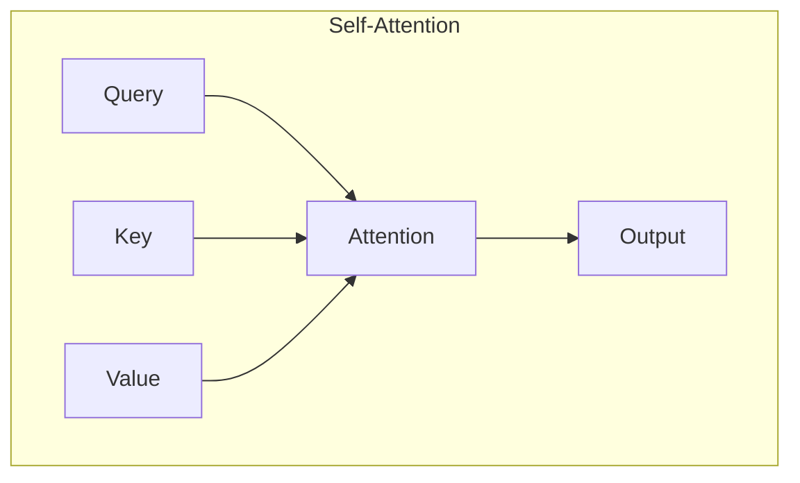
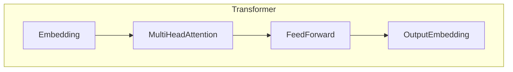
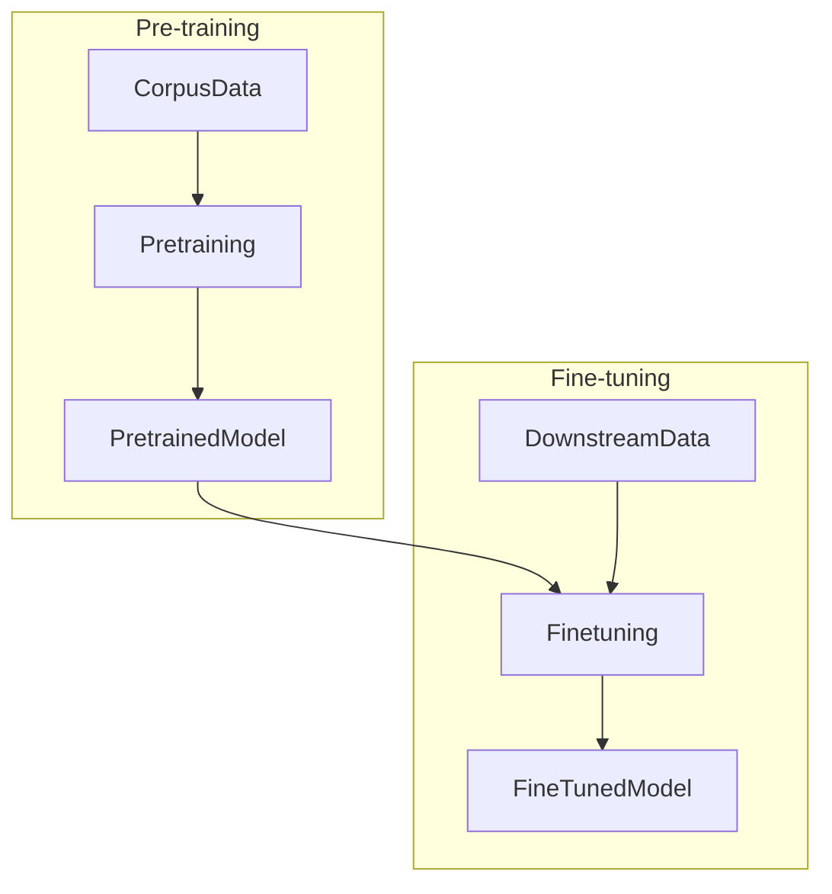

# 大语言模型原理基础与前沿 单位缩放

## 1.背景介绍

### 1.1 语言模型的重要性

语言模型是自然语言处理领域的核心技术之一,广泛应用于机器翻译、语音识别、文本生成等多个领域。随着深度学习技术的发展,大型神经网络语言模型展现出了强大的语言理解和生成能力,成为当前自然语言处理研究的主流方向。

### 1.2 大语言模型的兴起

近年来,benefiting from大规模计算资源、海量训练数据和新型网络架构,大型语言模型取得了突破性进展。代表性模型包括GPT(Generative Pre-trained Transformer)、BERT(Bidirectional Encoder Representations from Transformers)、XLNet等,这些模型在多项自然语言处理任务上取得了新的state-of-the-art性能。

### 1.3 单位缩放的重要意义

随着模型规模的不断扩大,训练和推理计算量呈指数级增长,给硬件资源带来了巨大压力。因此,如何在保证模型性能的前提下,降低计算和存储开销,实现高效的单位缩放,成为大语言模型发展的一个重要课题。

## 2.核心概念与联系

### 2.1 自注意力机制(Self-Attention)



自注意力机制是Transformer等大语言模型的核心,它通过Query、Key和Value之间的相似度计算来捕获输入序列中元素之间的依赖关系,是实现长程依赖建模的关键。

### 2.2 Transformer架构



Transformer是一种全新的基于注意力机制的序列到序列模型,不依赖于RNN或CNN,通过多头注意力和前馈神经网络构建编码器-解码器架构,在机器翻译等任务上表现出色。

### 2.3 预训练与微调(Pre-training & Fine-tuning)



预训练是大语言模型的关键步骤,通过在大规模无监督语料上训练获得通用的语言表征能力。微调则是将预训练模型在特定任务数据上进行进一步训练,以适应特定的下游任务。

## 3.核心算法原理具体操作步骤

### 3.1 Transformer的自注意力计算过程

1) 线性投影: 将输入序列 $X$ 分别投影到 Query、Key 和 Value 空间,得到 $Q$、$K$ 和 $V$。

$$Q = XW_Q, K = XW_K, V = XW_V$$

2) 相似度计算: 计算 $Q$ 和 $K$ 的缩放点积注意力权重。

$$\text{Attention}(Q, K, V) = \text{softmax}(\frac{QK^T}{\sqrt{d_k}})V$$

3) 多头注意力: 将多个注意力头的结果拼接。

$$\text{MultiHead}(Q, K, V) = \text{Concat}(head_1, ..., head_h)W^O$$

4) 残差连接和层归一化。

### 3.2 BERT的掩蔽语言模型预训练

1) 构建掩蔽语料: 在输入序列中随机掩蔽15%的token。

2) 对掩蔽位置进行预测: BERT的编码器输出对应掩蔽位置的向量,将其输入到分类器,预测掩蔽token的词元。

3) 预训练目标: 最小化掩蔽词元的负对数似然损失。

### 3.3 GPT的因果语言模型预训练

1) 构建标准语料: 不进行任何掩蔽操作。

2) 序列到序列预测: GPT的解码器对输入序列进行自回归,预测下一个token。

3) 预训练目标: 最小化序列token的负对数似然损失。

## 4.数学模型和公式详细讲解举例说明

### 4.1 注意力机制(Attention)

注意力机制是序列模型的核心,它通过计算Query和Key的相似度,对Value进行加权求和,捕获输入序列中元素之间的依赖关系。

$$\begin{aligned}
\text{Attention}(Q, K, V) &= \text{softmax}(\frac{QK^T}{\sqrt{d_k}})V\
&= \sum_{j=1}^n \alpha_{ij}v_j\
\alpha_{ij} &= \frac{\exp(q_i^Tk_j/\sqrt{d_k})}{\sum_{l=1}^n\exp(q_i^Tk_l/\sqrt{d_k})}
\end{aligned}$$

其中, $\alpha_{ij}$ 表示 Query $q_i$ 对 Key $k_j$ 的注意力权重。$\sqrt{d_k}$ 是缩放因子,防止内积值过大导致softmax饱和。

例如,在机器翻译任务中,注意力机制可以自动学习到源语言和目标语言之间的对齐关系,对应用程序的输入输出建模。

### 4.2 Transformer位置编码(Positional Encoding)

由于Transformer没有循环或卷积结构,无法直接获取序列位置信息,因此引入位置编码来赋予每个位置不同的向量表示。

$$\begin{aligned}
\text{PE}_{(pos, 2i)} &= \sin(pos/10000^{2i/d_{model}})\
\text{PE}_{(pos, 2i+1)} &= \cos(pos/10000^{2i/d_{model}})
\end{aligned}$$

其中 $pos$ 是token的位置索引, $i$ 是维度索引。位置编码与embedding相加,为每个token赋予位置信息。

### 4.3 BERT掩蔽语言模型(Masked LM)

BERT的掩蔽语言模型通过随机掩蔽输入token,并在预训练时学习预测掩蔽位置的token,捕获双向上下文信息。

$$\begin{aligned}
\mathcal{L}_{\text{MLM}} &= -\mathbb{E}_{x \sim X} \left[\sum_{i \in \mathcal{M}} \log P\left(x_i | x_{\backslash i}\right)\right]\
P\left(x_i | x_{\backslash i}\right) &= \text{softmax}\left(\mathbf{h}_i^T \mathbf{W}_e\right)
\end{aligned}$$

其中 $\mathcal{M}$ 是掩蔽位置集合, $x_{\backslash i}$ 表示除 $i$ 位置外的其他token, $\mathbf{h}_i$ 是 $i$ 位置的编码器输出, $\mathbf{W}_e$ 是词嵌入矩阵。

## 5.项目实践: 代码实例和详细解释说明

以下是使用PyTorch实现Transformer的简化版本代码:

```python
import torch
import torch.nn as nn

# 定义多头注意力
class MultiHeadAttention(nn.Module):
    def __init__(self, heads, head_dim, dropout=0.1):
        super().__init__()
        self.heads = heads
        self.head_dim = head_dim

        self.queries = nn.Linear(head_dim, head_dim, bias=False)
        self.keys = nn.Linear(head_dim, head_dim, bias=False)
        self.values = nn.Linear(head_dim, head_dim, bias=False)

        self.fc = nn.Linear(heads * head_dim, head_dim)

    def forward(self, queries, keys, values, mask=None):
        N = queries.shape[0]  # batch size

        # 线性投影得到 Q, K, V
        queries = self.queries(queries).view(N, -1, self.heads, self.head_dim).permute(0, 2, 1, 3)
        keys = self.keys(keys).view(N, -1, self.heads, self.head_dim).permute(0, 2, 1, 3)
        values = self.values(values).view(N, -1, self.heads, self.head_dim).permute(0, 2, 1, 3)

        # 计算注意力权重
        energy = torch.einsum("nqhd,nkhd->nhqk", [queries, keys]) # 批向量乘
        if mask is not None:
            energy = energy.masked_fill(mask == 0, float("-1e20"))
        attention = torch.softmax(energy / (self.head_dim ** (1/2)), dim=3)

        # 加权求和
        out = torch.einsum("nhql,nlhd->nqhd", [attention, values]).permute(0, 2, 1, 3)
        out = out.contiguous().view(N, -1, self.heads * self.head_dim)
        out = self.fc(out)

        return out

# Transformer 编码器层
class TransformerEncoderLayer(nn.Module):
    def __init__(self, heads, head_dim, feedforward_dim, dropout=0.1):
        super().__init__()
        self.attn = MultiHeadAttention(heads, head_dim, dropout)
        self.ffn = nn.Sequential(
            nn.Linear(head_dim, feedforward_dim),
            nn.ReLU(),
            nn.Dropout(dropout),
            nn.Linear(feedforward_dim, head_dim),
        )
        self.norm1 = nn.LayerNorm(head_dim)
        self.norm2 = nn.LayerNorm(head_dim)
        self.dropout = nn.Dropout(dropout)

    def forward(self, x, mask=None):
        attended = self.attn(x, x, x, mask)
        x = x + self.dropout(attended)
        x = self.norm1(x)

        forwarded = self.ffn(x)
        x = x + self.dropout(forwarded)
        x = self.norm2(x)

        return x
```

上述代码实现了Transformer的核心组件:多头注意力(MultiHeadAttention)和编码器层(TransformerEncoderLayer)。

- `MultiHeadAttention`类实现了多头注意力机制,包括线性投影、缩放点积注意力计算和多头拼接等步骤。
- `TransformerEncoderLayer`类封装了一个完整的Transformer编码器层,包含多头注意力子层、前馈网络子层,以及残差连接和层归一化操作。

使用这些模块,我们可以构建出完整的Transformer编码器,并在各种自然语言处理任务中进行预训练和微调。

## 6.实际应用场景

大语言模型在自然语言处理领域有着广泛的应用,包括但不限于:

1. **机器翻译**: 使用编码器-解码器架构的Transformer模型,可以实现高质量的机器翻译系统,如谷歌翻译、微软翻译等。

2. **文本生成**: 基于GPT等大型生成式语言模型,可以生成看似人类水平的文本内容,在内容创作、对话系统等领域有重要应用。

3. **问答系统**: 通过预训练和针对性微调,大语言模型可以从海量文本中学习知识,用于构建高性能的开放域问答系统。

4. **文本分类**: 将BERT等模型微调到文本分类任务上,可以获得最先进的分类性能,广泛应用于情感分析、垃圾邮件检测等场景。

5. **关系抽取**: 利用大语言模型捕获文本中的语义关系信息,可以实现高精度的关系抽取,为知识图谱构建等任务提供支持。

6. **语音识别**: 将Transformer编码器应用于语音特征序列建模,可以显著提升语音识别的性能和鲁棒性。

总的来说,大语言模型为自然语言处理领域带来了革命性的变革,其强大的语言理解和生成能力正在推动着人工智能技术的快速发展。

## 7.工具和资源推荐

在大语言模型的研究和应用过程中,以下工具和资源可以为您提供帮助:

1. **开源模型库**:
   - Hugging Face Transformers: https://huggingface.co/transformers/
   - PyTorch Lightning: https://www.pytorchlightning.ai/
   - TensorFlow Models: https://github.com/tensorflow/models

2. **预训练模型**:
   - GPT: https://github.com/openai/gpt-2
   - BERT: https://github.com/google-research/bert
   - XLNet: https://github.com/zihangdai/xlnet

3. **数据集**:
   - 自然语言推断 (MNLI): https://cims.nyu.edu/~sbowman/mnli/
   - SQuAD 问答数据集: https://rajpurkar.github.io/SQuAD-explorer/

4. **开发框架**:
   - PyTorch: