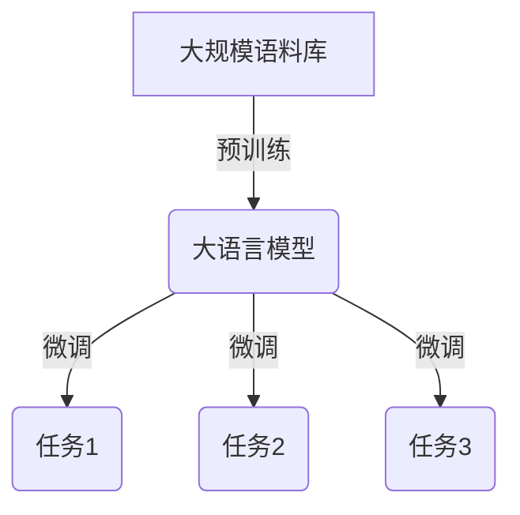
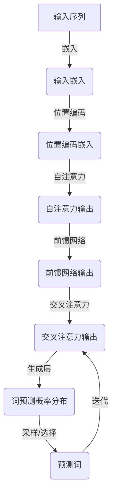
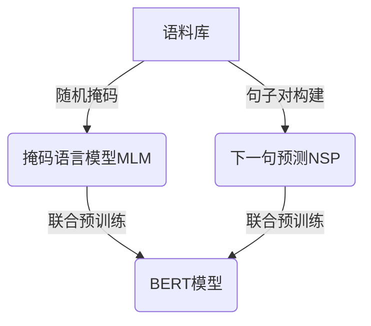

# 大语言模型原理基础与前沿 大语言模型：辩论、争议与未来发展方向

## 1. 背景介绍

### 1.1 大语言模型的崛起

近年来,大型语言模型(Large Language Models, LLMs)在自然语言处理(NLP)领域掀起了一场革命。这些模型通过在大规模语料库上进行预训练,展现出令人惊叹的语言生成和理解能力,在各种NLP任务中取得了卓越的表现。

大语言模型的核心思想是利用自监督学习(Self-Supervised Learning)的方式,从海量的文本数据中学习语言的统计规律和语义关联。通过预训练,模型可以获得对语言的深层理解,并将这种理解迁移到下游任务中,大幅提升了模型的性能。

### 1.2 代表性模型

- GPT系列(Generative Pre-trained Transformer)
- BERT(Bidirectional Encoder Representations from Transformers)
- T5(Text-to-Text Transfer Transformer)
- PaLM(Pathways Language Model)
- ...

这些模型在自然语言生成、理解、翻译、问答等多个领域展现出了强大的能力,引发了广泛的关注和讨论。

## 2. 核心概念与联系

### 2.1 自注意力机制(Self-Attention)

自注意力机制是大语言模型的核心组成部分,它允许模型捕捉输入序列中任意两个位置之间的关系,从而更好地建模长距离依赖关系。该机制通过计算查询(Query)、键(Key)和值(Value)之间的相似性,动态地为每个位置分配注意力权重,从而捕获全局信息。

### 2.2 transformer架构

Transformer是一种全新的序列到序列(Seq2Seq)模型架构,它完全依赖于自注意力机制,摒弃了传统的循环神经网络(RNN)和卷积神经网络(CNN)结构。Transformer架构的优势在于并行计算能力强、捕捉长距离依赖关系的能力强,以及更好的泛化性能。

### 2.3 预训练与微调(Pre-training and Fine-tuning)

大语言模型通常采用两阶段训练策略:预训练和微调。在预训练阶段,模型在大规模语料库上进行自监督学习,获得通用的语言表示能力。在微调阶段,模型在特定任务的标注数据上进行进一步训练,将预训练得到的知识迁移到目标任务上。这种策略大幅减少了标注数据的需求,提高了模型的性能。



## 3. 核心算法原理具体操作步骤

### 3.1 Transformer解码器(Decoder)

Transformer解码器是生成大语言模型的核心部分,它基于自注意力机制和交叉注意力机制,通过自回归(Autoregressive)的方式生成序列。具体步骤如下:

1. **输入嵌入(Input Embedding)**: 将输入序列(如文本)转换为嵌入向量表示。

2. **位置编码(Positional Encoding)**: 为每个位置添加位置信息,使模型能够捕捉序列的顺序信息。

3. **自注意力层(Self-Attention Layer)**: 计算输入序列中每个位置与其他位置的关系,捕捉长距离依赖关系。

4. **前馈神经网络(Feed-Forward Neural Network)**: 对自注意力层的输出进行非线性变换,提取更高层次的特征表示。

5. **交叉注意力层(Cross-Attention Layer)**: 将解码器的输出与编码器的输出进行注意力计算,融合源序列的信息。

6. **生成层(Generation Layer)**: 基于前一时间步的输出和当前时间步的交叉注意力输出,预测下一个词的概率分布。

7. **词预测(Word Prediction)**: 从概率分布中采样或选择概率最大的词,作为当前时间步的输出。

8. **迭代(Iteration)**: 重复步骤6和7,直到生成完整序列或达到最大长度。



### 3.2 BERT预训练

BERT(Bidirectional Encoder Representations from Transformers)是一种基于Transformer编码器的双向预训练语言模型。它采用了两种预训练任务:掩码语言模型(Masked Language Modeling, MLM)和下一句预测(Next Sentence Prediction, NSP)。

1. **掩码语言模型(MLM)**: 在输入序列中随机掩码部分词,要求模型预测被掩码的词。这种方式可以让模型学习到双向的上下文信息。

2. **下一句预测(NSP)**: 给定两个句子A和B,要求模型预测B是否为A的下一句。这个任务可以让模型学习到句子之间的关系和语义连贯性。

通过这两种预训练任务,BERT可以学习到丰富的语义和语法知识,为下游任务提供强大的语言表示能力。



## 4. 数学模型和公式详细讲解举例说明

### 4.1 自注意力机制(Self-Attention)

自注意力机制是大语言模型的核心组成部分,它允许模型捕捉输入序列中任意两个位置之间的关系。具体计算过程如下:

给定一个输入序列 $X = (x_1, x_2, \dots, x_n)$,我们需要计算每个位置 $i$ 对应的输出表示 $y_i$。

首先,我们将输入序列 $X$ 线性映射到查询(Query)、键(Key)和值(Value)向量:

$$
\begin{aligned}
Q &= XW^Q \
K &= XW^K \
V &= XW^V
\end{aligned}
$$

其中 $W^Q$、$W^K$ 和 $W^V$ 是可学习的权重矩阵。

然后,我们计算查询 $Q$ 与所有键 $K$ 的点积,获得注意力分数矩阵 $A$:

$$
A = \text{softmax}\left(\frac{QK^T}{\sqrt{d_k}}\right)
$$

其中 $d_k$ 是缩放因子,用于防止点积值过大导致梯度消失。

接下来,我们将注意力分数矩阵 $A$ 与值向量 $V$ 相乘,得到输出表示 $Y$:

$$
Y = AV
$$

最后,我们可以对输出表示 $Y$ 进行线性变换和残差连接,得到自注意力层的最终输出:

$$
\text{Output} = \text{LayerNorm}(Y + X)
$$

通过自注意力机制,模型可以动态地为每个位置分配注意力权重,捕捉全局信息和长距离依赖关系。

### 4.2 交叉注意力机制(Cross-Attention)

在序列到序列(Seq2Seq)任务中,解码器需要利用编码器的输出来生成目标序列。这就需要使用交叉注意力机制,将编码器的输出与解码器的输出进行注意力计算。

假设编码器的输出为 $E = (e_1, e_2, \dots, e_m)$,解码器的输出为 $D = (d_1, d_2, \dots, d_n)$。我们需要计算每个解码器位置 $j$ 对应的输出表示 $o_j$。

首先,我们将编码器输出 $E$ 和解码器输出 $D$ 线性映射到键(Key)和查询(Query)向量:

$$
\begin{aligned}
K &= EW^K \
Q &= DW^Q
\end{aligned}
$$

然后,我们计算查询 $Q$ 与所有键 $K$ 的点积,获得注意力分数矩阵 $A$:

$$
A = \text{softmax}\left(\frac{QK^T}{\sqrt{d_k}}\right)
$$

接下来,我们将注意力分数矩阵 $A$ 与编码器输出 $E$ 相乘,得到交叉注意力输出 $O$:

$$
O = AE
$$

最后,我们可以对交叉注意力输出 $O$ 进行线性变换和残差连接,得到交叉注意力层的最终输出:

$$
\text{Output} = \text{LayerNorm}(O + D)
$$

通过交叉注意力机制,解码器可以selectively地关注编码器的不同部分,从而更好地融合源序列的信息。

## 5. 项目实践:代码实例和详细解释说明

以下是一个使用PyTorch实现Transformer解码器的简化示例代码:

```python
import torch
import torch.nn as nn

class TransformerDecoder(nn.Module):
    def __init__(self, vocab_size, d_model, nhead, num_layers, dim_feedforward, max_len):
        super(TransformerDecoder, self).__init__()
        self.word_emb = nn.Embedding(vocab_size, d_model)
        self.pos_encoder = PositionalEncoding(d_model, max_len)
        decoder_layers = nn.TransformerDecoderLayer(d_model, nhead, dim_feedforward)
        self.transformer_decoder = nn.TransformerDecoder(decoder_layers, num_layers)
        self.output_proj = nn.Linear(d_model, vocab_size)

    def forward(self, tgt, memory, tgt_mask=None, memory_mask=None):
        tgt = self.word_emb(tgt)
        tgt = self.pos_encoder(tgt)
        output = self.transformer_decoder(tgt, memory, tgt_mask=tgt_mask, memory_mask=memory_mask)
        output = self.output_proj(output)
        return output

class PositionalEncoding(nn.Module):
    def __init__(self, d_model, max_len=5000):
        super(PositionalEncoding, self).__init__()
        pe = torch.zeros(max_len, d_model)
        position = torch.arange(0, max_len, dtype=torch.float).unsqueeze(1)
        div_term = torch.exp(torch.arange(0, d_model, 2).float() * (-math.log(10000.0) / d_model))
        pe[:, 0::2] = torch.sin(position * div_term)
        pe[:, 1::2] = torch.cos(position * div_term)
        pe = pe.unsqueeze(0)
        self.register_buffer('pe', pe)

    def forward(self, x):
        return x + self.pe[:, :x.size(1)]
```

这个示例实现了一个简化版的Transformer解码器,包括以下几个主要组件:

1. `word_emb`: 将输入词序列映射到嵌入向量。
2. `pos_encoder`: 为每个位置添加位置编码,使模型能够捕捉序列的顺序信息。
3. `transformer_decoder`: 实现了Transformer解码器的核心逻辑,包括自注意力层、交叉注意力层和前馈神经网络。
4. `output_proj`: 将解码器的输出投影到词汇表大小的空间,用于预测下一个词。

在`forward`函数中,我们首先将输入词序列`tgt`映射到嵌入向量,并添加位置编码。然后,我们将嵌入向量输入到`transformer_decoder`中,并传入编码器的输出`memory`作为交叉注意力的键和值。最后,我们对解码器的输出进行线性投影,得到每个位置的词预测概率分布。

注意,这只是一个简化版本,实际的大语言模型实现会更加复杂,包括更多的优化技巧和细节处理。

## 6. 实际应用场景

大语言模型在自然语言处理领域有着广泛的应用场景,包括但不限于:

1. **文本生成**: 利用大语言模型生成高质量的文本内容,如新闻报道、小说、诗歌等。
2. **机器翻译**: 将大语言模型应用于机器翻译任务,提高翻译质量和效率。
3. **问答系统**: 利用大语言模型构建智能问答系统,回答用户的各种问题。
4. **文本摘要**: 使用大语言模型对长文本进行摘要,提取关