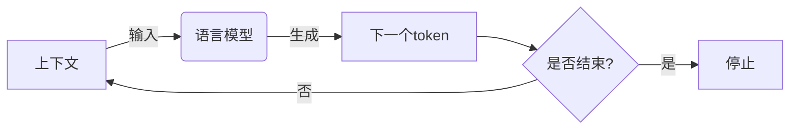
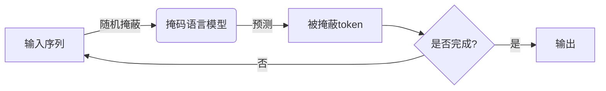

# 大语言模型原理基础与前沿：语言建模的挑战

## 1. 背景介绍

### 1.1 自然语言处理的重要性

在当今数字时代,自然语言处理(Natural Language Processing, NLP)已成为人工智能领域中最具革命性和影响力的技术之一。它赋予计算机理解、处理和生成人类语言的能力,打破了人机交互的障碍,为各行业带来了巨大的变革。

### 1.2 语言模型在NLP中的核心地位

语言模型是NLP的核心组成部分,旨在捕捉语言的统计规律和语义关联,为下游任务(如机器翻译、问答系统、文本摘要等)提供基础支撑。传统的语言模型主要基于n-gram统计方法,但存在上下文表示能力有限、难以捕捉长距离依赖等缺陷。

### 1.3 大语言模型的兴起

近年来,benefiting from大规模数据和计算能力的提升,基于深度学习的大型语言模型(Large Language Model, LLM)逐渐崭露头角,展现出强大的语言理解和生成能力。代表性模型包括GPT、BERT、XLNet、T5等,它们通过预训练-微调的范式,在广泛的NLP任务中取得了卓越的表现。

## 2. 核心概念与联系

### 2.1 语言模型的核心任务

语言模型的核心任务是估计一个句子或文本序列的概率,即P(X)=P(x1, x2, ..., xn),其中X表示文本序列,xi表示第i个token(单词或子词)。根据链式法则,该概率可分解为:

$$
P(X) = \prod_{i=1}^{n}P(x_i|x_1, x_2, ..., x_{i-1})
$$

因此,语言模型需要学习条件概率P(xi|x1, ..., xi-1),即给定前面的上下文,预测当前token的概率分布。

### 2.2 自回归语言模型

自回归语言模型(Autoregressive Language Model)是一种常见的语言模型架构,它将文本序列视为一个标记流,并按顺序生成每个标记。在生成第i个标记时,模型会利用前i-1个标记作为上下文信息。典型的自回归模型包括GPT系列。



### 2.3 掩码语言模型

掩码语言模型(Masked Language Model)是BERT等模型采用的另一种架构。它通过随机掩蔽部分输入token,并训练模型基于上下文预测被掩蔽的token。这种方式允许双向编码上下文,但代价是无法直接生成文本序列。



### 2.4 序列到序列模型

序列到序列(Seq2Seq)模型则将语言生成任务视为序列到序列的转换问题,如机器翻译任务。编码器对源序列进行编码,解码器则根据编码器的输出生成目标序列。T5等模型采用这种范式进行序列生成。


这些核心概念和架构为大语言模型的发展奠定了基础,也反映了该领域不断探索和创新的过程。

## 3. 核心算法原理具体操作步骤

### 3.1 Transformer架构

Transformer是大语言模型中广泛采用的核心架构,其主要组成部分包括:

1. **嵌入层(Embedding Layer)**: 将输入token映射到连续的向量空间。
2. **多头注意力机制(Multi-Head Attention)**: 捕捉输入序列中token之间的依赖关系。
3. **前馈神经网络(Feed-Forward Neural Network)**: 对每个token的表示进行非线性转换。
4. **规范化层(Normalization Layer)**: 加速训练收敛并提高模型性能。


Transformer的自注意力机制能够直接建模长距离依赖,避免了RNN的梯度消失问题,成为大语言模型的核心组件。

### 3.2 预训练-微调范式

大语言模型通常采用预训练-微调的两阶段训练范式:

1. **预训练(Pre-training)**: 在大规模无监督语料上训练模型,获得通用的语言表示能力。
2. **微调(Fine-tuning)**: 在特定的有监督数据集上,对预训练模型进行进一步调整,使其适应特定的下游任务。

这种范式充分利用了大规模无监督数据的优势,同时也提高了模型在特定任务上的性能表现。

### 3.3 自监督预训练目标

为了在无监督数据上训练语言模型,需要设计合适的自监督预训练目标,常见的预训练目标包括:

1. **掩码语言模型(Masked Language Modeling, MLM)**: 随机掩蔽部分输入token,预测被掩蔽的token。
2. **下一句预测(Next Sentence Prediction, NSP)**: 判断两个句子是否相邻出现。
3. **因果语言模型(Causal Language Modeling, CLM)**: 基于前缀预测下一个token。
4. **替换token检测(Replaced Token Detection, RTD)**: 检测输入序列中是否存在被替换的token。

这些预训练目标旨在捕捉语言的不同方面,如语义、语法和上下文关系,从而提高模型的泛化能力。

## 4. 数学模型和公式详细讲解举例说明

### 4.1 Transformer的注意力机制

Transformer中的多头注意力机制是核心组件之一,它能够捕捉输入序列中token之间的依赖关系。给定查询(Query)向量q、键(Key)向量k和值(Value)向量v,注意力机制的计算过程如下:

$$
\begin{aligned}
\text{Attention}(Q, K, V) &= \text{softmax}(\frac{QK^T}{\sqrt{d_k}})V \
\text{head}_i &= \text{Attention}(QW_i^Q, KW_i^K, VW_i^V) \
\text{MultiHead}(Q, K, V) &= \text{Concat}(\text{head}_1, \dots, \text{head}_h)W^O
\end{aligned}
$$

其中,d_k是缩放因子,用于防止点积过大导致softmax饱和。W_i^Q、W_i^K、W_i^V和W^O是可学习的线性变换参数。

通过计算查询与所有键的相似性分数,注意力机制能够自适应地捕捉输入序列中不同位置token之间的关联,从而建模长距离依赖。

### 4.2 BERT的掩码语言模型

BERT采用了掩码语言模型(MLM)作为预训练目标之一。在MLM中,模型需要预测被随机掩蔽的token,从而学习到双向的上下文表示。

给定输入序列X=(x1, x2, ..., xn),其中部分token被掩蔽,模型的目标是最大化被掩蔽token的条件概率:

$$
\mathcal{L}_{\text{MLM}} = \sum_{i \in \text{MaskedIndices}} \log P(x_i | X_{\backslash i})
$$

其中,MaskedIndices表示被掩蔽token的位置集合,X_{\backslash i}表示去掉xi后的输入序列。

通过最小化MLM损失函数,BERT能够学习到捕捉双向上下文的语言表示,为下游任务提供有力支持。

### 4.3 GPT的因果语言模型

GPT等自回归语言模型则采用因果语言模型(CLM)作为预训练目标,目标是最大化给定上下文的下一个token的条件概率:

$$
\mathcal{L}_{\text{CLM}} = -\sum_{t=1}^{n} \log P(x_t | x_{<t})
$$

其中,x_{<t}表示位置t之前的token序列。

通过最小化CLM损失函数,自回归模型能够学习到生成性的语言表示,可以用于文本生成、问答等任务。

这些数学模型和公式体现了大语言模型背后的核心原理,为模型的设计和优化提供了理论基础。

## 5. 项目实践:代码实例和详细解释说明

以下是使用PyTorch实现Transformer模型的简化代码示例,旨在帮助读者更好地理解Transformer的核心组件及其实现细节。

```python
import torch
import torch.nn as nn

class MultiHeadAttention(nn.Module):
    def __init__(self, embed_dim, num_heads):
        super().__init__()
        self.embed_dim = embed_dim
        self.num_heads = num_heads
        self.head_dim = embed_dim // num_heads

        self.qkv_proj = nn.Linear(embed_dim, 3 * embed_dim)
        self.out_proj = nn.Linear(embed_dim, embed_dim)

    def forward(self, x):
        batch_size, seq_len, _ = x.size()
        qkv = self.qkv_proj(x)
        q, k, v = qkv.chunk(3, dim=-1)

        q = q.view(batch_size, seq_len, self.num_heads, self.head_dim).transpose(1, 2)
        k = k.view(batch_size, seq_len, self.num_heads, self.head_dim).transpose(1, 2)
        v = v.view(batch_size, seq_len, self.num_heads, self.head_dim).transpose(1, 2)

        attn_scores = torch.matmul(q, k.transpose(-2, -1)) / math.sqrt(self.head_dim)
        attn_weights = nn.functional.softmax(attn_scores, dim=-1)
        attn_output = torch.matmul(attn_weights, v).transpose(1, 2).contiguous().view(batch_size, seq_len, -1)

        out = self.out_proj(attn_output)
        return out

class TransformerEncoderLayer(nn.Module):
    def __init__(self, embed_dim, num_heads, ff_dim, dropout_rate=0.1):
        super().__init__()
        self.attn = MultiHeadAttention(embed_dim, num_heads)
        self.ff = nn.Sequential(
            nn.Linear(embed_dim, ff_dim),
            nn.ReLU(),
            nn.Dropout(dropout_rate),
            nn.Linear(ff_dim, embed_dim),
            nn.Dropout(dropout_rate)
        )
        self.norm1 = nn.LayerNorm(embed_dim)
        self.norm2 = nn.LayerNorm(embed_dim)

    def forward(self, x):
        residual = x
        x = self.norm1(x)
        x = self.attn(x) + residual
        residual = x
        x = self.norm2(x)
        x = self.ff(x) + residual
        return x
```

上述代码实现了Transformer编码器层的核心组件:

1. `MultiHeadAttention`模块实现了多头注意力机制,包括线性投影、注意力计算和头合并等操作。
2. `TransformerEncoderLayer`模块将注意力子层和前馈子层组合在一起,并使用残差连接和层归一化进行优化。

在实际应用中,我们可以通过堆叠多个编码器层来构建完整的Transformer编码器,并与解码器结合形成序列到序列模型。此外,还需要添加位置编码、掩码等机制来处理不同的任务需求。

通过这个简化示例,读者可以更好地理解Transformer的核心思想和实现细节,为进一步探索和应用大语言模型奠定基础。

## 6. 实际应用场景

大语言模型在自然语言处理领域展现出了广泛的应用前景,涵盖了多个重要任务和场景,包括但不限于:

### 6.1 文本生成

利用自回归语言模型(如GPT)的强大生成能力,我们可以生成高质量的文本内容,如新闻报道、小说、诗歌、对话等。这为内容创作、虚拟助手、自动写作等领域带来了新的机遇。

### 6.2 机器翻译

序列到序列模型(如T5)能够将源语言文本转换为目标语言文本,实现高质量的机器翻