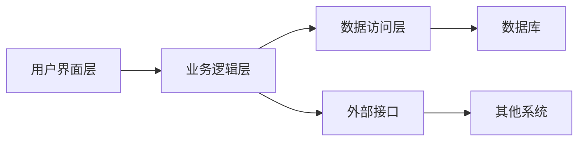

# 库存管理系统详细设计与具体代码实现

## 1. 背景介绍
### 1.1 库存管理系统的重要性
在现代企业运营中,高效的库存管理是至关重要的。库存管理系统可以帮助企业优化库存水平,减少库存成本,提高运营效率。一个设计良好的库存管理系统可以为企业带来显著的竞争优势。

### 1.2 库存管理系统的主要功能
库存管理系统的主要功能包括:
- 库存信息管理:记录和跟踪库存商品的详细信息,如商品编号、名称、规格、数量等。
- 出入库管理:处理商品的入库和出库操作,并实时更新库存数量。
- 库存盘点:定期对库存进行盘点,核对实际库存与系统记录是否一致。
- 库存预警:设置安全库存和再订货点,当库存低于预设值时发出预警。
- 库存统计与分析:生成各种库存报表,分析库存周转率、库存成本等关键指标。

### 1.3 本文的主要内容
本文将详细介绍库存管理系统的设计与实现。我们将从核心概念入手,探讨系统架构和关键算法,并提供具体的代码实例。同时,我们也会讨论库存管理系统在实际应用中的场景和挑战。

## 2. 核心概念与联系
### 2.1 库存管理的核心概念
- SKU(Stock Keeping Unit):库存管理的基本单位,通常是指一个特定规格的商品。
- 库存量:指特定时点上实际拥有的商品数量。
- 安全库存:为防止缺货而准备的额外库存,用于应对需求波动。
- 再订货点:当库存量降至此点时,需要发出补货订单。
- ABC分类:根据商品的重要性和价值将其分为A、B、C三类,采取不同的管理策略。

### 2.2 库存管理系统的关键组成部分
库存管理系统通常由以下几个关键组成部分构成:
- 数据层:负责存储和管理库存相关数据,通常使用关系型数据库如MySQL、PostgreSQL等。
- 业务逻辑层:实现库存管理的核心业务逻辑,如出入库处理、库存预警等。
- 用户界面层:为用户提供交互界面,如Web界面或移动APP。
- 外部接口:与其他系统(如ERP、电商平台)进行数据交互。

### 2.3 库存管理系统的架构设计
下图展示了一个典型的库存管理系统架构:



在这个架构中,用户通过界面层与系统交互,业务逻辑层处理核心业务逻辑,数据访问层负责与数据库交互,外部接口用于与其他系统集成。

## 3. 核心算法原理与具体操作步骤
### 3.1 经济订货批量(EOQ)模型
经济订货批量模型是确定最优订货量的经典算法。其基本思想是在订货成本和存储成本之间找到平衡点,使得总成本最小。

EOQ的计算公式为:
$$Q = \sqrt{\frac{2DS}{H}}$$

其中:
- Q:经济订货批量
- D:一定时期内的需求量
- S:每次订货的固定成本
- H:单位商品的储存成本

使用EOQ模型的具体步骤如下:
1. 确定商品的年需求量D、订货固定成本S和单位储存成本H。
2. 将D、S、H代入EOQ公式,计算出最优订货量Q。
3. 根据最优订货量Q制定订货计划。

### 3.2 ABC分类法
ABC分类法是一种根据商品重要性进行分类的库存管理方法。其基本思想是将商品分为A、B、C三类,对不同类别的商品采取不同的管理策略。

具体操作步骤如下:
1. 计算每种商品的年销售额,并按降序排列。
2. 计算每种商品的累计销售额占总销售额的百分比。
3. 将累计百分比在70%以内的商品划分为A类,70%-90%的划分为B类,90%以上的划分为C类。
4. 对A类商品重点管理,准备高安全库存;对B类商品常规管理;对C类商品简化管理,降低库存。

## 4. 数学模型和公式详细讲解举例说明
### 4.1 需求预测模型
在库存管理中,准确预测未来需求是非常重要的。常用的需求预测模型包括:

1. 移动平均法:
$$F_t = \frac{A_{t-1} + A_{t-2} + ... + A_{t-n}}{n}$$
其中,$F_t$是第t期的预测值,$A_t$是第t期的实际值,n是移动平均的期数。

例如,某商品最近5个月的销量为:100,120,110,90,130,则使用3期移动平均法预测下个月的销量为:
$$F_6 = \frac{90 + 110 + 130}{3} = 110$$

2. 指数平滑法:
$$F_t = \alpha A_{t-1} + (1-\alpha) F_{t-1}$$
其中,$\alpha$是平滑常数,取值在0到1之间。

例如,某商品上个月的预测销量为100,实际销量为120,平滑常数取0.2,则本月的预测销量为:
$$F_2 = 0.2 \times 120 + 0.8 \times 100 = 104$$

### 4.2 安全库存与再订货点模型
安全库存是为应对需求波动而准备的额外库存。其计算公式为:
$$SS = Z \times \sigma \times \sqrt{LT}$$
其中,Z是服务水平对应的标准差倍数,$\sigma$是需求的标准差,LT是提前期。

再订货点是指当库存降至此点时需要发出补货订单。其计算公式为:
$$ROP = \overline{D} \times LT + SS$$
其中,$\overline{D}$是需求的平均值。

例如,某商品的日需求量服从均值为100,标准差为20的正态分布,提前期为5天,目标服务水平为95%(对应的Z值为1.64),则其安全库存和再订货点分别为:

$$SS = 1.64 \times 20 \times \sqrt{5} = 73$$
$$ROP = 100 \times 5 + 73 = 573$$

## 5. 项目实践:代码实例和详细解释说明
下面我们使用Python实现一个简单的库存管理系统。

### 5.1 定义商品类
首先,我们定义一个`Item`类来表示库存商品:

```python
class Item:
    def __init__(self, sku, name, stock, price):
        self.sku = sku
        self.name = name
        self.stock = stock
        self.price = price
```

其中,`sku`是商品的唯一标识码,`name`是商品名称,`stock`是当前库存量,`price`是商品单价。

### 5.2 实现库存管理类
接下来,我们实现一个`InventoryManager`类,包含了库存管理的核心功能:

```python
class InventoryManager:
    def __init__(self):
        self.items = {}

    def add_item(self, item):
        self.items[item.sku] = item

    def remove_item(self, sku):
        del self.items[sku]

    def update_stock(self, sku, qty):
        self.items[sku].stock += qty

    def get_item(self, sku):
        return self.items.get(sku)

    def list_items(self):
        return list(self.items.values())
```

- `add_item`方法用于添加新商品到库存中。
- `remove_item`方法用于从库存中移除商品。
- `update_stock`方法用于更新商品的库存量。
- `get_item`方法用于根据SKU查询商品。
- `list_items`方法用于列出所有库存商品。

### 5.3 使用示例
下面是一个使用`InventoryManager`的示例:

```python
# 创建库存管理器
manager = InventoryManager()

# 添加商品
item1 = Item('SKU001', 'iPhone 12', 100, 6999)
item2 = Item('SKU002', 'MacBook Pro', 50, 12999)
manager.add_item(item1)
manager.add_item(item2)

# 更新库存
manager.update_stock('SKU001', -10)  # 售出10台iPhone 12
manager.update_stock('SKU002', 20)   # 进货20台MacBook Pro

# 查询商品
iphone = manager.get_item('SKU001')
print(f"{iphone.name} 库存量:{iphone.stock}")

# 列出所有商品
for item in manager.list_items():
    print(f"{item.sku} {item.name} 库存:{item.stock} 价格:{item.price}")
```

输出结果:
```
iPhone 12 库存量:90
SKU001 iPhone 12 库存:90 价格:6999
SKU002 MacBook Pro 库存:70 价格:12999
```

## 6. 实际应用场景
库存管理系统在各行各业中都有广泛应用,下面列举几个典型场景:

### 6.1 制造业
在制造业中,原材料、半成品、产成品都需要进行库存管理。通过库存管理系统,可以优化生产计划、减少库存积压、提高资金周转效率。

### 6.2 零售业
对于零售企业,合理的库存管理可以避免断货或者积压,提高客户满意度。库存管理系统可以帮助零售商准确跟踪库存情况,及时调整补货策略。

### 6.3 电商行业
电商企业通常需要管理大量SKU,库存管理系统可以帮助电商平台实现智能补货、动态定价等功能,提升运营效率和利润水平。

### 6.4 医疗行业
在医疗机构中,药品、耗材等的库存管理直接关系到医疗服务质量。通过库存管理系统,可以确保关键物资供应,同时减少过期药品的浪费。

## 7. 工具和资源推荐
### 7.1 开源库存管理系统
- Odoo: 基于Python的开源ERP系统,包含强大的库存管理模块。
- ERPNext: 基于Python的开源ERP系统,提供完善的库存管理功能。
- OpenBoxes: 基于Grails的开源库存管理系统,主要面向非营利组织。

### 7.2 库存管理相关书籍
- 《Inventory Management Explained》by David J. Piasecki
- 《Essentials of Inventory Management》 by Max Muller
- 《Inventory Accuracy: People, Processes, & Technology》 by David J. Piasecki

### 7.3 在线课程
- Coursera: Supply Chain Management Specialization
- edX: Supply Chain Fundamentals
- Udemy: Inventory Management 101

## 8. 总结:未来发展趋势与挑战
### 8.1 未来发展趋势
- 智能化:借助人工智能和机器学习技术,库存管理系统将变得更加智能化,能够自动优化库存策略。
- 实时化:随着物联网技术的发展,实时库存跟踪和可视化将成为现实。
- 协同化:库存管理系统将与供应链上下游系统深度集成,实现端到端的协同优化。

### 8.2 面临的挑战
- 复杂性:随着业务规模和SKU数量的增长,库存管理系统需要处理海量数据和复杂业务逻辑。
- 不确定性:需求波动、供应链风险等不确定因素给库存管理带来挑战。
- 成本压力:企业面临降低库存成本的压力,需要在成本和服务水平之间寻求平衡。

## 9. 附录:常见问题与解答
### 9.1 如何确定安全库存水平?
安全库存水平取决于需求波动、供应风险、服务水平目标等因素。可以通过统计分析历史数据,结合业务实际情况来确定。

### 9.2 如何处理滞销品和呆滞品?
对于滞销品,可以采取促销、捆绑销售等策略来加速去库存。对于呆滞品,可以考虑返工、二次利用或者报废处理。

### 9.3 如何选择合适的库存管理系统?
选择库存管理系统时,需要考虑企业规模、业务特点、IT基础设施等因素。可以对比不同系统的功能、成本、扩展性等方面,选择最适合自己的解决方案。

以上就是关于库存管