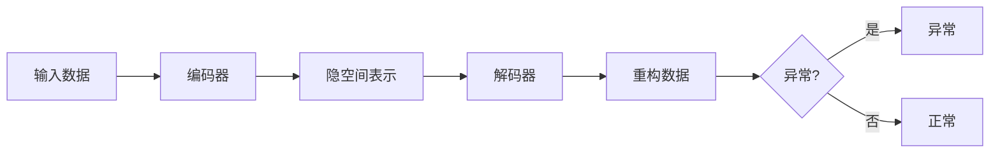

# 异常检测：基于自编码器的方法

## 1. 背景介绍

异常检测是机器学习和数据挖掘领域的一个重要课题,在工业生产、金融风控、网络安全等诸多领域有着广泛的应用。异常是指数据集中与大多数数据点有显著差异的少数样本,通常表现为偏离正常模式或规律。异常检测的目的是从大量正常数据中识别出这些异常点,为后续的分析和决策提供依据。

传统的异常检测方法主要包括基于统计的方法和基于距离的方法。基于统计的方法假设数据服从某种概率分布,将偏离分布的数据点视为异常;基于距离的方法则计算数据点之间的距离,将距离较远的点视为异常。这些方法在低维数据上效果较好,但在高维数据和复杂数据上往往表现不佳。

近年来,随着深度学习的发展,基于神经网络的异常检测方法受到越来越多的关注。其中,自编码器(Autoencoder)以其强大的特征学习和数据重构能力,成为异常检测领域的一个研究热点。本文将重点介绍基于自编码器的异常检测方法,探讨其原理、算法、应用和挑战。

## 2. 核心概念与联系

### 2.1 自编码器

自编码器是一种无监督学习的神经网络模型,由编码器(Encoder)和解码器(Decoder)两部分组成。编码器将输入数据映射到低维的隐空间,解码器则将隐空间表示重构为原始输入。通过最小化重构误差,自编码器可以学习到数据的高阶特征和内在结构。

### 2.2 重构误差

重构误差是指重构数据与原始输入之间的差异,常用均方误差(MSE)或交叉熵(Cross Entropy)来度量。对于正常数据,自编码器可以很好地重构,误差较小;而对于异常数据,由于偏离了正常模式,重构误差会较大。因此,重构误差可以作为异常分数来使用。

### 2.3 异常分数

异常分数是对数据点异常程度的度量,可以基于重构误差、隐空间表示等多种信息来定义。一般来说,异常分数越高,则该数据点越有可能是异常。通过设定阈值,可以将异常分数转化为二元的异常标签。

下图展示了自编码器异常检测的基本原理:



## 3. 核心算法原理具体操作步骤

基于自编码器的异常检测算法可分为以下几个步骤:

### 3.1 数据预处理

对原始数据进行清洗、归一化等预处理操作,去除噪声和无关特征,使数据更适合模型训练。

### 3.2 构建自编码器模型

根据数据的特点和任务的需求,设计编码器和解码器的网络结构。常见的选择包括全连接层、卷积层、循环层等。隐空间维度一般远小于输入维度。

### 3.3 训练自编码器

使用正常数据训练自编码器,目标是最小化重构误差。常用的优化算法有随机梯度下降(SGD)、Adam等。为防止过拟合,可使用L1/L2正则化、Dropout等技巧。

### 3.4 计算异常分数

在训练好的自编码器上,对每个数据点计算重构误差作为异常分数。也可以结合隐空间表示的特点(如稀疏性、聚类结构等)来设计更复杂的异常分数。

### 3.5 确定异常阈值

根据异常分数的分布,选取一个阈值将数据划分为正常和异常两类。阈值的选取需要平衡检测率和误报率,可以使用验证集进行调优,或者根据领域知识设定。

### 3.6 模型评估与调优

使用测试集评估异常检测的性能,常用的指标有准确率、召回率、F1分数、AUC等。根据评估结果对模型进行调优,如改进网络结构、调节超参数、引入新的正则化方法等。

## 4. 数学模型和公式详细讲解举例说明

自编码器的核心是编码器和解码器函数,分别记为$f(x)$和$g(h)$。编码器将输入数据$x$映射到隐空间表示$h$,解码器则将$h$重构为$\hat{x}$。整个过程可以表示为:

$$
h = f(x) \
\hat{x} = g(h)
$$

自编码器的训练目标是最小化重构误差,对于均方误差,损失函数为:

$$
L(x, \hat{x}) = \frac{1}{n} \sum_{i=1}^n (x_i - \hat{x}_i)^2
$$

其中$n$为样本数。对于二元交叉熵,损失函数为:

$$
L(x, \hat{x}) = -\frac{1}{n} \sum_{i=1}^n [x_i \log \hat{x}_i + (1-x_i) \log (1-\hat{x}_i)]
$$

在训练过程中,我们通过反向传播算法和梯度下降法来最小化损失函数,更新编码器和解码器的参数$\theta$:

$$
\theta := \theta - \alpha \nabla_\theta L(x, \hat{x})
$$

其中$\alpha$为学习率。

异常分数可以直接基于重构误差来定义,例如:

$$
s(x) = \|x - \hat{x}\|_2^2
$$

也可以结合隐空间表示的特点来设计,例如基于隐空间距离的异常分数:

$$
s(x) = \min_{x' \in \mathcal{X}} \|f(x) - f(x')\|_2^2
$$

其中$\mathcal{X}$为正常数据集。这种方法考虑了数据在隐空间中的分布,对局部异常更敏感。

## 5. 项目实践：代码实例和详细解释说明

下面是一个基于Keras实现自编码器异常检测的简单示例:

```python
import numpy as np
from keras.models import Model
from keras.layers import Input, Dense

# 构建自编码器模型
input_dim = 30
encoding_dim = 10
input_layer = Input(shape=(input_dim,))
encoder = Dense(encoding_dim, activation='relu')(input_layer)
decoder = Dense(input_dim, activation='sigmoid')(encoder)
autoencoder = Model(inputs=input_layer, outputs=decoder)

# 编译和训练模型
autoencoder.compile(optimizer='adam', loss='mse')
x_train = ...  # 正常数据
autoencoder.fit(x_train, x_train, epochs=50, batch_size=32)

# 计算异常分数
x_test = ...  # 测试数据
reconstructions = autoencoder.predict(x_test)
anomaly_scores = np.mean((x_test - reconstructions)**2, axis=1)

# 确定异常阈值
threshold = ...  # 根据异常分数分布设定
anomaly_labels = anomaly_scores > threshold
```

这个示例中,我们首先构建了一个只有一层隐空间的简单自编码器,编码维度为10。然后使用正常数据训练自编码器,最小化重构误差。在测试阶段,我们计算每个数据点的重构误差作为异常分数,并根据阈值划分异常标签。

实际应用中,我们可以根据数据的特点和任务的需求,设计更复杂的自编码器结构,如卷积自编码器、稀疏自编码器、变分自编码器等。同时,异常分数的设计也可以更加灵活,结合多种信息和先验知识。

## 6. 实际应用场景

基于自编码器的异常检测在多个领域有着广泛的应用,例如:

- 工业制造:通过对设备传感器数据进行异常检测,及早发现设备故障和异常工况,实现预测性维护。
- 金融风控:通过对交易数据、用户行为等进行异常检测,识别欺诈、洗钱等违规行为,防范金融风险。
- 网络安全:通过对网络流量、日志等进行异常检测,发现网络入侵、DDoS攻击等安全威胁,保障系统安全。
- 医疗健康:通过对医学影像、生理信号等进行异常检测,辅助疾病诊断和健康监测,提升医疗质量。

在这些应用中,自编码器异常检测可以自动化地从海量数据中发掘隐藏的异常模式,大大减轻了人工分析的负担,提高了异常检测的效率和准确性。同时,自编码器的特征学习能力也使其能够适应复杂多变的数据环境,具有良好的泛化性和鲁棒性。

## 7. 工具和资源推荐

- Keras: 基于Python的高层神经网络API,可以快速构建和训练自编码器模型。 https://keras.io/
- TensorFlow: 由Google开发的端到端开源机器学习平台,支持多种自编码器变体。 https://www.tensorflow.org/
- PyTorch: 由Facebook开发的深度学习框架,提供动态计算图和丰富的自编码器示例。 https://pytorch.org/
- scikit-learn: 基于Python的机器学习库,提供了多种异常检测算法和评估指标。 https://scikit-learn.org/
- Anomaly Detection Benchmark: 异常检测领域的综合性基准测试,包含多个数据集和算法实现。 https://github.com/GuansongPang/anomaly-detection-benchmark

这些工具和资源可以帮助我们快速上手自编码器异常检测,了解最新的研究进展和实践经验。同时,我们也要根据自己的需求和条件,选择合适的工具和资源,并进行必要的定制和优化。

## 8. 总结：未来发展趋势与挑战

自编码器异常检测是一个富有前景但也充满挑战的研究方向。未来的发展趋势可能包括:

- 融合多种异常检测方法,如结合自编码器和孤立森林、一类SVM等,实现更鲁棒的异常检测。
- 引入注意力机制、图神经网络等新的模型结构,增强自编码器处理复杂数据的能力。
- 探索无监督和半监督学习范式,减少对标注数据的依赖,提高模型的适应性。
- 开发在线学习和增量学习算法,实现实时异常检测和模型更新,适应动态变化的数据环境。

同时,自编码器异常检测也面临着一些挑战:

- 缺乏大规模、高质量的异常数据集,难以全面评估和比较不同方法的性能。
- 异常的类型和分布多种多样,难以用单一模型和分数来刻画,需要更细粒度的异常描述和检测。
- 异常检测结果的可解释性不足,难以向非专业用户解释异常的原因和影响,需要更好的可视化和交互方式。
- 在复杂的真实场景中,异常检测往往与其他任务(如故障诊断、风险评估等)交织在一起,需要更全局的系统设计和优化。

总之,自编码器异常检测是一个充满机遇和挑战的研究领域,需要理论和实践的共同努力,不断突破技术瓶颈,创新应用模式,为各行各业提供更智能、更可靠的异常检测服务。

## 9. 附录：常见问题与解答

### 9.1 自编码器异常检测与传统统计方法相比有什么优势?

自编码器异常检测的优势主要体现在:
- 自编码器可以自动学习高阶特征,减少了对专家知识和特征工程的依赖。
- 自编码器可以处理高维数据和非线性关系,对复杂数据有更强的建模能力。
- 自编码器的训练过程是无监督的,不需要异常标签,更适用于异常稀疏的场景。

### 9.2 如何选择自编码器的隐空间维度?

隐空间维度是自编码器的一个关键超参数,需要在重构能力和泛化能力之间平衡:
- 隐空间维度太低,会限制自编码器的表达能力,难以准确重构数据。
- 隐空间维度太高,会使自编码器过拟合,失去对异常的敏感性。

一般可以通过交叉验证、启发式搜索等方法来选择合适的隐空