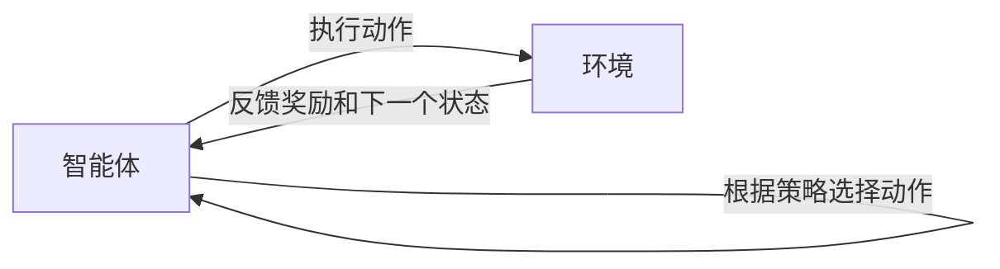

# 强化学习：未来人工智能法规的挑战

## 1. 背景介绍
### 1.1 人工智能的发展现状
#### 1.1.1 人工智能技术的快速进步
#### 1.1.2 人工智能在各行各业的广泛应用
#### 1.1.3 人工智能带来的机遇与挑战

### 1.2 强化学习的兴起
#### 1.2.1 强化学习的定义与特点
#### 1.2.2 强化学习在人工智能领域的重要地位
#### 1.2.3 强化学习的研究现状与趋势

### 1.3 人工智能法规的必要性
#### 1.3.1 人工智能技术的潜在风险
#### 1.3.2 人工智能法规的现状与不足
#### 1.3.3 强化学习对人工智能法规提出的新挑战

## 2. 核心概念与联系
### 2.1 强化学习的核心概念
#### 2.1.1 智能体(Agent)
#### 2.1.2 环境(Environment)
#### 2.1.3 状态(State)
#### 2.1.4 动作(Action)
#### 2.1.5 奖励(Reward)
#### 2.1.6 策略(Policy)

### 2.2 强化学习与其他机器学习范式的区别
#### 2.2.1 监督学习(Supervised Learning)
#### 2.2.2 无监督学习(Unsupervised Learning)
#### 2.2.3 强化学习的独特性

### 2.3 强化学习与人工智能法规的关系
#### 2.3.1 强化学习系统的自主性与不可预测性
#### 2.3.2 强化学习算法的黑盒特性
#### 2.3.3 强化学习在实际应用中的潜在风险



## 3. 核心算法原理具体操作步骤
### 3.1 马尔可夫决策过程(Markov Decision Process, MDP)
#### 3.1.1 MDP的定义与组成要素
#### 3.1.2 MDP与强化学习的关系

### 3.2 基于值函数的方法(Value-based Methods)
#### 3.2.1 Q-learning算法
##### 3.2.1.1 Q-learning的基本原理
##### 3.2.1.2 Q-learning的更新公式
##### 3.2.1.3 Q-learning的收敛性证明
#### 3.2.2 Sarsa算法
##### 3.2.2.1 Sarsa与Q-learning的区别
##### 3.2.2.2 Sarsa的更新公式
#### 3.2.3 DQN(Deep Q-Network)算法
##### 3.2.3.1 DQN的基本原理
##### 3.2.3.2 DQN的网络结构
##### 3.2.3.3 DQN的训练过程

### 3.3 基于策略的方法(Policy-based Methods)
#### 3.3.1 策略梯度(Policy Gradient)算法
##### 3.3.1.1 策略梯度定理
##### 3.3.1.2 REINFORCE算法
#### 3.3.2 演员-评论家(Actor-Critic)算法
##### 3.3.2.1 演员-评论家算法的基本原理
##### 3.3.2.2 A3C(Asynchronous Advantage Actor-Critic)算法

### 3.4 基于模型的方法(Model-based Methods)
#### 3.4.1 动态规划(Dynamic Programming)
#### 3.4.2 蒙特卡罗树搜索(Monte Carlo Tree Search, MCTS)
##### 3.4.2.1 MCTS的基本原理
##### 3.4.2.2 MCTS的四个阶段：选择、扩展、模拟、回溯

## 4. 数学模型和公式详细讲解举例说明
### 4.1 马尔可夫决策过程的数学模型
#### 4.1.1 状态转移概率矩阵
$$P(s'|s,a) = P(S_{t+1}=s'|S_t=s, A_t=a)$$
#### 4.1.2 奖励函数
$$R(s,a) = \mathbb{E}[R_{t+1}|S_t=s, A_t=a]$$
#### 4.1.3 折扣因子
$$\gamma \in [0,1]$$

### 4.2 值函数的数学定义
#### 4.2.1 状态值函数
$$V^{\pi}(s) = \mathbb{E}_{\pi}[\sum_{k=0}^{\infty}\gamma^k R_{t+k+1}|S_t=s]$$
#### 4.2.2 动作值函数
$$Q^{\pi}(s,a) = \mathbb{E}_{\pi}[\sum_{k=0}^{\infty}\gamma^k R_{t+k+1}|S_t=s, A_t=a]$$

### 4.3 贝尔曼方程(Bellman Equation)
#### 4.3.1 状态值函数的贝尔曼方程
$$V^{\pi}(s) = \sum_{a}\pi(a|s)\sum_{s',r}p(s',r|s,a)[r+\gamma V^{\pi}(s')]$$
#### 4.3.2 动作值函数的贝尔曼方程
$$Q^{\pi}(s,a) = \sum_{s',r}p(s',r|s,a)[r+\gamma \sum_{a'}\pi(a'|s')Q^{\pi}(s',a')]$$

### 4.4 Q-learning的更新公式
$$Q(S_t,A_t) \leftarrow Q(S_t,A_t) + \alpha[R_{t+1} + \gamma \max_a Q(S_{t+1},a) - Q(S_t,A_t)]$$

### 4.5 策略梯度定理
$$\nabla_{\theta}J(\theta) = \mathbb{E}_{\tau \sim p_{\theta}(\tau)}[\sum_{t=0}^{T-1}\nabla_{\theta}\log \pi_{\theta}(a_t|s_t)Q^{\pi_{\theta}}(s_t,a_t)]$$

## 5. 项目实践：代码实例和详细解释说明
### 5.1 Q-learning算法实现
```python
import numpy as np

class QLearning:
    def __init__(self, n_states, n_actions, learning_rate, discount_factor, epsilon):
        self.n_states = n_states
        self.n_actions = n_actions
        self.learning_rate = learning_rate
        self.discount_factor = discount_factor
        self.epsilon = epsilon
        self.Q_table = np.zeros((n_states, n_actions))

    def choose_action(self, state):
        if np.random.uniform(0, 1) < self.epsilon:
            action = np.random.choice(self.n_actions)
        else:
            action = np.argmax(self.Q_table[state, :])
        return action

    def update_Q_table(self, state, action, reward, next_state):
        old_value = self.Q_table[state, action]
        next_max = np.max(self.Q_table[next_state, :])
        new_value = old_value + self.learning_rate * (reward + self.discount_factor * next_max - old_value)
        self.Q_table[state, action] = new_value

    def train(self, env, num_episodes):
        for episode in range(num_episodes):
            state = env.reset()
            done = False
            while not done:
                action = self.choose_action(state)
                next_state, reward, done, _ = env.step(action)
                self.update_Q_table(state, action, reward, next_state)
                state = next_state
```
- 代码解释：
  - `__init__`方法初始化了Q-learning算法的超参数，包括状态数、动作数、学习率、折扣因子和探索率，并创建了一个Q表。
  - `choose_action`方法根据当前状态和探索率选择动作，有一定概率随机选择动作，否则选择Q值最大的动作。
  - `update_Q_table`方法根据当前状态、动作、奖励和下一个状态更新Q表，使用Q-learning的更新公式。
  - `train`方法在给定的环境中训练Q-learning算法，循环执行多个episode，在每个episode中选择动作、执行动作、获得奖励和下一个状态，并更新Q表。

### 5.2 DQN算法实现
```python
import torch
import torch.nn as nn
import torch.optim as optim
import numpy as np
import random
from collections import deque

class DQN(nn.Module):
    def __init__(self, state_dim, action_dim, hidden_dim):
        super(DQN, self).__init__()
        self.fc1 = nn.Linear(state_dim, hidden_dim)
        self.fc2 = nn.Linear(hidden_dim, hidden_dim)
        self.fc3 = nn.Linear(hidden_dim, action_dim)

    def forward(self, state):
        x = torch.relu(self.fc1(state))
        x = torch.relu(self.fc2(x))
        x = self.fc3(x)
        return x

class ReplayBuffer:
    def __init__(self, capacity):
        self.buffer = deque(maxlen=capacity)

    def push(self, state, action, reward, next_state, done):
        self.buffer.append((state, action, reward, next_state, done))

    def sample(self, batch_size):
        batch = random.sample(self.buffer, batch_size)
        states, actions, rewards, next_states, dones = zip(*batch)
        return states, actions, rewards, next_states, dones

    def __len__(self):
        return len(self.buffer)

class DQNAgent:
    def __init__(self, state_dim, action_dim, hidden_dim, learning_rate, discount_factor, epsilon, replay_buffer_capacity, batch_size):
        self.state_dim = state_dim
        self.action_dim = action_dim
        self.learning_rate = learning_rate
        self.discount_factor = discount_factor
        self.epsilon = epsilon
        self.batch_size = batch_size
        self.replay_buffer = ReplayBuffer(replay_buffer_capacity)
        self.device = torch.device("cuda" if torch.cuda.is_available() else "cpu")
        self.model = DQN(state_dim, action_dim, hidden_dim).to(self.device)
        self.optimizer = optim.Adam(self.model.parameters(), lr=learning_rate)
        self.criterion = nn.MSELoss()

    def choose_action(self, state):
        if np.random.uniform(0, 1) < self.epsilon:
            action = np.random.choice(self.action_dim)
        else:
            state_tensor = torch.FloatTensor(state).unsqueeze(0).to(self.device)
            q_values = self.model(state_tensor)
            action = q_values.argmax().item()
        return action

    def update_model(self):
        if len(self.replay_buffer) < self.batch_size:
            return
        states, actions, rewards, next_states, dones = self.replay_buffer.sample(self.batch_size)
        states_tensor = torch.FloatTensor(states).to(self.device)
        actions_tensor = torch.LongTensor(actions).unsqueeze(1).to(self.device)
        rewards_tensor = torch.FloatTensor(rewards).unsqueeze(1).to(self.device)
        next_states_tensor = torch.FloatTensor(next_states).to(self.device)
        dones_tensor = torch.FloatTensor(dones).unsqueeze(1).to(self.device)

        q_values = self.model(states_tensor).gather(1, actions_tensor)
        next_q_values = self.model(next_states_tensor).max(1)[0].unsqueeze(1)
        expected_q_values = rewards_tensor + (1 - dones_tensor) * self.discount_factor * next_q_values

        loss = self.criterion(q_values, expected_q_values.detach())
        self.optimizer.zero_grad()
        loss.backward()
        self.optimizer.step()

    def train(self, env, num_episodes):
        for episode in range(num_episodes):
            state = env.reset()
            done = False
            while not done:
                action = self.choose_action(state)
                next_state, reward, done, _ = env.step(action)
                self.replay_buffer.push(state, action, reward, next_state, done)
                self.update_model()
                state = next_state
```
- 代码解释：
  - `DQN`类定义了DQN的神经网络结构，包括两个隐藏层和一个输出层，使用ReLU激活函数。
  - `ReplayBuffer`类实现了经验回放缓冲区，用于存储和采样状态转移数据。
  - `DQNAgent`类实现了DQN算法，包括选择动作、更新模型和训练过程。
    - `choose_action`方法根据当前状态和探索率选择动作，有一定概率随机选择动作，否则选择Q值最大的动作。
    - `update_model`方法从经验回放缓冲区中采样一个批次的数据，计算Q值和期望Q值，并使用均方误差损失函数和反向传播算法更新模型参数。
    - `train`方法在给定的环境中训练DQN算法，循环执行多个episode，在每个episode中选择动作、执行动作、获得奖励和下一个状态，将状态转移数据存储到经验回放缓冲区中，并更新模型。

## 6. 实际应用场景
### 6.1 游戏AI
#### 6.1.1 AlphaGo：基于强化学习的围棋AI
#### 6.1.2 OpenAI Five：基于强化学习的Dota 2 AI
#### 6.1.3 DeepMind的Atari游戏AI