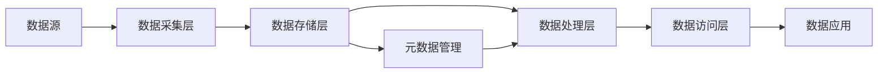

# 数据湖 原理与代码实例讲解

## 1. 背景介绍
### 1.1 大数据时代的数据管理挑战
随着大数据时代的到来,企业面临着海量、多样化数据的管理挑战。传统的数据仓库架构难以应对快速增长的非结构化数据和实时数据处理需求。数据孤岛问题阻碍了数据的共享和价值挖掘。因此,亟需一种新的数据架构来应对这些挑战。

### 1.2 数据湖的诞生
数据湖(Data Lake)概念由Pentaho公司的James Dixon于2010年提出,它提供了一种全新的海量数据存储和处理方式。数据湖旨在存储原始格式的结构化、半结构化和非结构化数据,支持多种数据处理范式,实现数据的democratization。

### 1.3 数据湖在企业中的应用现状
目前,众多企业已经开始尝试构建自己的数据湖。一些互联网巨头如亚马逊、阿里巴巴等公司更是将数据湖作为其数据战略的核心。数据湖在营销、风控、推荐等领域发挥着越来越重要的作用。

## 2. 核心概念与联系
### 2.1 数据湖的定义
数据湖是一个存储原始格式数据的集中式存储库,数据可以结构化、半结构化或非结构化。数据湖允许您在需要时存储所有数据,而无需首先构建数据结构、架构和数据模型。

### 2.2 数据湖与数据仓库的区别
- 数据存储格式:数据湖存储原始格式数据,数据仓库存储高度结构化的数据
- 数据处理方式:数据湖支持批处理、交互式查询、实时流处理等多种处理范式,数据仓库主要支持批处理和交互式查询
- 应用场景:数据湖适合数据探索和机器学习等场景,数据仓库适合数据分析和报表等场景

### 2.3 数据湖的关键特征
- 存储原始数据
- 支持多种数据类型和处理方式
- 高度扩展性和低成本
- 数据治理和元数据管理

### 2.4 数据湖架构
一个典型的数据湖架构包括以下几个关键组件:
- 数据采集层:负责从各种来源采集数据到数据湖
- 数据存储层:提供原始数据的持久化存储
- 元数据管理:负责数据湖的元数据管理,方便数据检索和治理
- 数据处理层:提供多种数据处理和分析工具
- 数据访问层:为用户提供统一的数据访问接口



## 3. 核心算法原理具体操作步骤
数据湖涉及的核心算法主要包括数据组织算法和数据处理算法两大类。下面以HDFS的数据写入和MapReduce处理为例,讲解其基本原理和操作步骤。

### 3.1 HDFS写数据过程
1. 客户端将文件切分成块,并通知NameNode
2. NameNode返回一个datanode列表,用于存储数据块和副本
3. 客户端将数据块写入datanode管道的第一个节点
4. 第一个datanode将数据块发送给管道中的第二个datanode
5. 类似地,数据块沿着管道依次传输
6. 管道中的所有datanode都向客户端发送ack,确认写入完成
7. 客户端通知NameNode数据写入完毕

### 3.2 MapReduce基本原理
MapReduce由Map和Reduce两个阶段组成,通过将任务分解和并行处理,实现对海量数据的高效计算。
1. Map阶段:并行将输入数据转化为中间的key-value对
2. Shuffle阶段:对中间结果按key进行分组,分发给Reduce任务
3. Reduce阶段:并行处理分组后的中间结果,生成最终输出

MapReduce的容错性主要通过重试和数据复制实现。Master会跟踪任务执行进度,一旦发现失败任务会自动重新调度。同时,数据块在多个节点上有副本,可以从其他节点恢复。

## 4. 数学模型和公式详细讲解举例说明
数据湖中的一些关键技术如数据分布、任务调度、异常检测等都涉及相关数学模型。下面以数据分布为例进行说明。

### 4.1 数据分布模型
在分布式存储系统中,经常使用哈希和分区两种数据分布方式。
- 哈希分布:通过对key进行哈希,将数据尽量均匀地分布到各个节点。设有M个节点,数据的key为k,则数据分布在第i个节点:
$$ i = hash(k) \bmod M $$

- 分区分布:预先定义数据的分区规则,将不同分区的数据分布到对应节点。设有M个节点,定义分区函数f(k),则数据分布在第i个节点:
$$ i = f(k),  其中0 \leq f(k) < M $$

例如,假设有1000条用户数据需要分布到5个节点,使用哈希分布方式:
1. 定义哈希函数为用户ID除以1000取余数
2. 对每个用户ID进行哈希计算,得到一个0~999的哈希值
3. 将哈希值除以节点数5取余,得到数据所属节点编号
4. 将数据写入对应节点

这种方式可以保证数据在节点间的负载是均衡的。同时,数据的位置也是确定的,查询时可以快速定位。

## 5. 项目实践：代码实例和详细解释说明
下面通过一个使用Spark和HDFS构建数据湖的代码示例,演示数据湖的常见操作:

```scala
// 1. 创建Spark会话
val spark = SparkSession.builder()
  .appName("DataLakeExample")
  .getOrCreate()

// 2. 加载原始数据
val rawData = spark.read.textFile("hdfs:///path/to/raw/data")

// 3. 数据转换
val parsedData = rawData.map(parseData)

// 4. 数据清洗
val cleanedData = parsedData.filter(isValid)

// 5. 数据存储到HDFS
cleanedData.write.format("parquet")
  .mode("overwrite")
  .save("hdfs:///path/to/data/lake")

// 6. 创建表
cleanedData.createOrReplaceTempView("my_table")

// 7. 交互式查询
val result = spark.sql("SELECT * FROM my_table WHERE ...")
result.show()

// 8. 数据分析
val aggregateResult = cleanedData.groupBy("key").count()
aggregateResult.show()
```

代码说明:
1. 首先创建一个Spark Session,作为Spark功能的主入口
2. 使用textFile API从HDFS中加载原始文本数据
3. 使用map算子对原始数据进行解析转换,提取需要的字段
4. 使用filter算子对数据进行清洗,过滤掉不合格的数据
5. 将结构化后的数据以列式存储格式parquet写回HDFS,构成数据湖
6. 使用createOrReplaceTempView将数据集注册为临时表,方便后续查询
7. 使用Spark SQL进行交互式查询,可以进行复杂的条件筛选
8. 使用Spark提供的API如groupBy、count等对数据进行分析

可以看到,使用Spark+HDFS可以方便地实现数据湖的常见操作,包括数据采集、存储、清洗、分析等。Spark提供了RDD、DataFrame、SQL等多种数据抽象和处理模型,并且可以与HDFS无缝集成,是构建数据湖的理想工具。

## 6. 实际应用场景
数据湖在各行各业都有广泛应用,下面列举几个典型场景:
### 6.1 营销分析
企业可以将来自网站、App、CRM等渠道的用户行为数据汇聚到数据湖,通过对数据的分析挖掘,洞察用户特征,优化营销策略。例如,可以进行RFM用户价值度分析、用户画像、流失预测等。

### 6.2 金融风控
银行、保险等金融机构可以将交易、行为等数据集中到数据湖,通过机器学习算法构建各种风控模型,如反欺诈、信用评分、异常检测等,提升风险管理水平。

### 6.3 物联网数据分析
随着物联网设备的普及,海量传感器数据不断产生。数据湖可以作为物联网数据的汇聚中心,为实时监控、异常告警、预测性维护等应用提供数据支撑。

### 6.4 生物信息学
在基因组学、蛋白质组学等领域,研究所需的数据呈现爆炸式增长。数据湖可以存储基因测序数据、临床数据等,通过大数据分析和机器学习,加速药物开发和精准医疗的研究进程。

## 7. 工具和资源推荐
构建数据湖需要一系列开源和商业工具的支持,下面推荐一些常用的工具和学习资源:
### 7.1 开源工具
- Apache Hadoop:提供HDFS分布式存储和MapReduce计算框架
- Apache Spark:提供分布式数据处理和机器学习库,支持多种语言API
- Apache Hive:基于Hadoop的数据仓库工具,提供类SQL查询能力
- Apache Kafka:分布式流处理平台,可用于数据采集
- Apache Atlas:Hadoop生态系统的元数据治理工具

### 7.2 商业工具
- Cloudera CDH:提供统一的Hadoop发行版和管理平台
- Hortonworks HDP:提供开源Hadoop发行版和数据管理平台
- Databricks:基于Spark的统一数据分析平台
- AWS Lake Formation:亚马逊云提供的数据湖构建服务
- Azure Data Lake:微软云提供的大数据存储和分析服务

### 7.3 学习资源
- 《Hadoop权威指南》:系统讲解Hadoop原理和实践
- 《Spark大数据处理》:全面介绍Spark原理和应用
- Coursera《大数据专项课程》:覆盖HDFS、MapReduce、Spark等主流大数据技术
- AWS Big Data Blog:分享数据湖最佳实践和案例
- Data Lake vs Data Warehouse:深入对比两种架构的异同

## 8. 总结：未来发展趋势与挑战
数据湖为海量异构数据的存储和处理提供了高度灵活和可扩展的新方案,已经成为大数据时代数据架构的重要发展方向。未来数据湖将呈现以下发展趋势:
- 云端数据湖将成为主流,云服务商提供的托管服务将大幅降低数据湖的构建和维护成本
- 数据湖将与数据仓库等架构融合,形成统一的数据管理和分析平台
- AI和机器学习在数据湖中的应用将更加深入,数据湖将成为算法训练的数据源
- 流批一体化处理将成为数据湖的标配能力,以应对实时数据处理的需求

同时,数据湖也面临一些挑战:
- 海量数据的治理和元数据管理是数据湖成功的关键,需要引入数据版本、血缘、安全等治理机制
- 缺乏统一的数据模型和语义定义,数据消费者很难理解和使用数据
- 数据孤岛问题仍然存在,不同部门和业务线构建的数据湖缺乏互通
- 数据安全和隐私保护面临更大挑战,对敏感数据需要严格的权限管控和脱敏处理

未来,通过数据治理、语义建模、主数据管理、安全审计等一系列措施,不断完善数据湖体系,必将进一步释放其价值,推动企业数字化转型。

## 9. 附录：常见问题与解答
### Q1:数据湖适合存储哪些类型的数据?
数据湖适合存储各种结构化、半结构化和非结构化数据,如日志、图像、视频、JSON、CSV等。数据湖通常不对数据格式做限制,以原始形式存储数据。

### Q2:数据湖如何保证数据质量?
数据湖需要建立一套完善的数据治理体系,包括数据质量监控、数据血