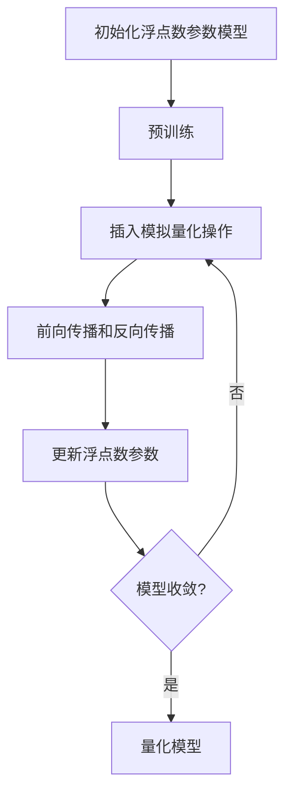
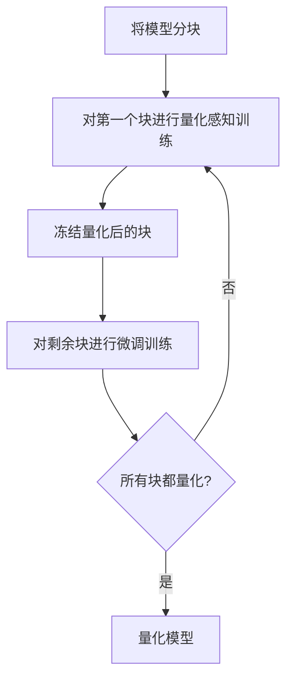

# 模型量化在语音识别中的使用案例

## 1.背景介绍

随着人工智能技术的快速发展,语音识别已经广泛应用于各个领域,如智能助手、会议记录、语音输入法等。然而,传统的语音识别模型通常需要大量的计算资源,这对于移动设备和嵌入式系统来说是一个巨大的挑战。为了在保持模型精度的同时降低计算和存储开销,模型量化技术应运而生。

模型量化是一种将深度神经网络中的浮点数参数转换为低比特表示(如8位或更低)的技术。通过这种方式,可以显著减小模型的大小,从而降低内存占用和计算量,同时保持模型性能不受太大影响。这对于在资源受限的环境中部署语音识别模型至关重要。

## 2.核心概念与联系

### 2.1 量化的基本概念

量化是将浮点数参数映射到一组有限的离散值的过程。常见的量化方法包括线性量化和对数量化等。线性量化将浮点数参数线性映射到一组等间隔的离散值,而对数量化则利用对数函数进行非线性映射,可以更好地捕捉小值参数的变化。

### 2.2 量化对语音识别模型的影响

语音识别模型通常由多层神经网络组成,包括卷积层、递归层和全连接层等。不同层的参数对量化的敏感性不同,需要采用不同的量化策略。例如,卷积层的权重参数对量化相对不敏感,而全连接层的偏置参数则比较敏感。

此外,量化还会引入量化噪声,从而影响模型的准确性。因此,在量化过程中需要采取一些技术来减小量化噪声,如量化感知训练、增量量化等。

### 2.3 量化与模型压缩的关系

模型量化是模型压缩的一种重要技术,旨在减小模型的存储和计算开销。除了量化,还有其他模型压缩技术,如剪枝、知识蒸馏等。这些技术可以单独使用,也可以组合使用,以进一步压缩模型。

## 3.核心算法原理具体操作步骤

### 3.1 量化感知训练

量化感知训练(Quantization-Aware Training, QAT)是一种常用的量化技术,它在训练过程中模拟量化过程,从而使模型更加适应量化操作。具体步骤如下:

1. 使用浮点数参数初始化模型,并进行一定的预训练。
2. 在模型的每一层之后插入模拟量化操作,将浮点数参数量化为低比特表示。
3. 使用量化后的参数进行前向传播和反向传播,更新浮点数参数。
4. 重复步骤2和3,直到模型收敛。

通过量化感知训练,模型可以在训练阶段就适应量化操作,从而减小量化噪声对模型精度的影响。



### 3.2 增量量化

增量量化(Incremental Quantization)是一种分阶段量化的方法,它可以更好地控制量化噪声,从而提高量化模型的精度。具体步骤如下:

1. 将模型分为多个块,每个块包含一个或多个层。
2. 对第一个块进行量化感知训练,得到量化后的块。
3. 将量化后的块冻结,对剩余的块进行微调训练。
4. 重复步骤2和3,直到所有块都被量化。

通过增量量化,可以逐步引入量化噪声,使模型有足够的时间来适应量化操作,从而减小量化噪声对模型精度的影响。



## 4.数学模型和公式详细讲解举例说明

### 4.1 线性量化

线性量化是最简单的量化方法,它将浮点数参数线性映射到一组等间隔的离散值。具体公式如下:

$$
q(x) = \mathrm{round}\left(\frac{x}{S}\right) \cdot S
$$

其中,$$x$$是浮点数参数,$$S$$是量化步长,$$\mathrm{round}(\cdot)$$是四舍五入函数。量化步长决定了量化的精度,步长越小,量化误差越小,但需要更多的比特位来表示。

例如,假设我们要将浮点数参数$$x=0.637$$量化为8位整数表示,量化步长$$S=0.1$$。根据上述公式,我们有:

$$
q(0.637) = \mathrm{round}\left(\frac{0.637}{0.1}\right) \cdot 0.1 = 6 \cdot 0.1 = 0.6
$$

因此,$$x=0.637$$被量化为$$0.6$$。

### 4.2 对数量化

对数量化利用对数函数进行非线性映射,可以更好地捕捉小值参数的变化。具体公式如下:

$$
q(x) = S \cdot \mathrm{sign}(x) \cdot 2^{\mathrm{round}\left(\frac{\log_2|x|}{\log_2(1+\alpha)}\right)}
$$

其中,$$x$$是浮点数参数,$$S$$是量化步长,$$\alpha$$是一个超参数,控制量化的粒度。

例如,假设我们要将浮点数参数$$x=0.0037$$量化为8位整数表示,量化步长$$S=0.001$$,超参数$$\alpha=0.1$$。根据上述公式,我们有:

$$
\begin{aligned}
q(0.0037) &= 0.001 \cdot \mathrm{sign}(0.0037) \cdot 2^{\mathrm{round}\left(\frac{\log_2|0.0037|}{\log_2(1+0.1)}\right)} \
&= 0.001 \cdot 1 \cdot 2^{\mathrm{round}\left(\frac{-8.42}{0.46}\right)} \
&= 0.001 \cdot 1 \cdot 2^{-18} \
&= 0.0038
\end{aligned}
$$

因此,$$x=0.0037$$被量化为$$0.0038$$。

## 5.项目实践：代码实例和详细解释说明

在这一部分,我们将使用PyTorch框架,对一个简单的语音识别模型进行量化。该模型由一个卷积层和两个全连接层组成,用于识别10个数字(0-9)。

### 5.1 导入必要的库

```python
import torch
import torch.nn as nn
import torch.nn.functional as F
from torch.utils.data import DataLoader
from torchvision.datasets import MNIST
import torchvision.transforms as transforms
```

### 5.2 定义模型

```python
class Net(nn.Module):
    def __init__(self):
        super(Net, self).__init__()
        self.conv1 = nn.Conv2d(1, 32, 3, 1)
        self.fc1 = nn.Linear(12 * 12 * 32, 128)
        self.fc2 = nn.Linear(128, 10)

    def forward(self, x):
        x = self.conv1(x)
        x = F.relu(x)
        x = F.max_pool2d(x, 2)
        x = torch.flatten(x, 1)
        x = self.fc1(x)
        x = F.relu(x)
        x = self.fc2(x)
        output = F.log_softmax(x, dim=1)
        return output
```

### 5.3 准备数据

```python
train_dataset = MNIST(root='./data', train=True, transform=transforms.ToTensor(), download=True)
test_dataset = MNIST(root='./data', train=False, transform=transforms.ToTensor())

train_loader = DataLoader(dataset=train_dataset, batch_size=64, shuffle=True)
test_loader = DataLoader(dataset=test_dataset, batch_size=64, shuffle=False)
```

### 5.4 训练模型

```python
model = Net().to('cpu')
optimizer = torch.optim.Adam(model.parameters(), lr=0.001)
criterion = nn.CrossEntropyLoss()

for epoch in range(10):
    for data, target in train_loader:
        optimizer.zero_grad()
        output = model(data)
        loss = criterion(output, target)
        loss.backward()
        optimizer.step()

    test_loss = 0
    correct = 0
    with torch.no_grad():
        for data, target in test_loader:
            output = model(data)
            test_loss += criterion(output, target).item()
            pred = output.argmax(dim=1, keepdim=True)
            correct += pred.eq(target.view_as(pred)).sum().item()

    test_loss /= len(test_loader.dataset)
    print(f'Epoch: {epoch}, Test Loss: {test_loss:.4f}, Accuracy: {correct / len(test_loader.dataset):.4f}')
```

### 5.5 量化模型

```python
model.eval()
quantized_model = torch.quantization.quantize_dynamic(
    model, {nn.Linear, nn.Conv2d}, dtype=torch.qint8
)

test_loss = 0
correct = 0
with torch.no_grad():
    for data, target in test_loader:
        output = quantized_model(data)
        test_loss += criterion(output, target).item()
        pred = output.argmax(dim=1, keepdim=True)
        correct += pred.eq(target.view_as(pred)).sum().item()

test_loss /= len(test_loader.dataset)
print(f'Quantized Model Test Loss: {test_loss:.4f}, Accuracy: {correct / len(test_loader.dataset):.4f}')
```

在上述代码中,我们首先定义了一个简单的卷积神经网络模型,用于识别MNIST数据集中的手写数字。然后,我们训练了该模型,并评估了它在测试集上的性能。

接下来,我们使用PyTorch提供的`torch.quantization.quantize_dynamic`函数对模型进行动态量化。该函数会自动确定量化参数,并将模型中的卷积层和全连接层量化为8位整数表示。最后,我们评估了量化后模型在测试集上的性能。

通过比较量化前后的模型精度,我们可以看到量化操作会带来一定的精度损失,但是这种损失是可以接受的。同时,量化后的模型占用更小的存储空间,计算速度也会更快,特别是在移动设备和嵌入式系统上。

## 6.实际应用场景

模型量化技术在语音识别领域有着广泛的应用前景,尤其是在移动设备和物联网设备等资源受限环境中。以下是一些典型的应用场景:

### 6.1 移动设备语音助手

智能手机和平板电脑上的语音助手(如Siri、Google Assistant等)需要在本地进行语音识别,以提高响应速度和保护用户隐私。由于移动设备的计算资源和存储空间有限,因此需要使用量化技术来压缩语音识别模型,从而实现高效的本地部署。

### 6.2 物联网设备语音控制

智能家居、可穿戴设备等物联网设备通常具有很低的计算能力,但又需要支持语音控制功能。在这种情况下,量化技术可以帮助将语音识别模型压缩到足够小的尺寸,以便在资源受限的设备上运行。

### 6.3 车载语音系统

现代汽车中的语音系统需要实时处理驾驶员的语音命令,如导航、音乐控制等。为了确保系统的响应速度和安全性,语音识别模型必须在车载计算机上本地运行。量化技术可以帮助减小模型的尺寸,从而提高系统的实时性和可靠性。

### 6.4 会议记录系统

会议记录系统需要准确识别会议过程中的发言内容,并将其转录为文本。由于会议场景通常具有一定的噪音和干扰,因此需要使用更大和更复杂的语音识别模型来提高准确性。量化技术可以帮助压缩这些大型模型,使其能够在普通计算机上高效运行。

## 7.工具和资源推荐

在实现模型量化时,有许多优秀的工具和资源可以使用。以下是一些推荐:

### 7.1 深度学习框架

- **PyTorch**:PyTorch提供了强大的量化支持,包括静态量化、动态量化和量化感知训练等功能。我们在上一节的代码示