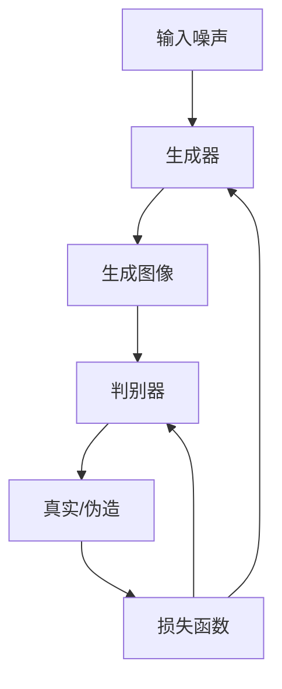
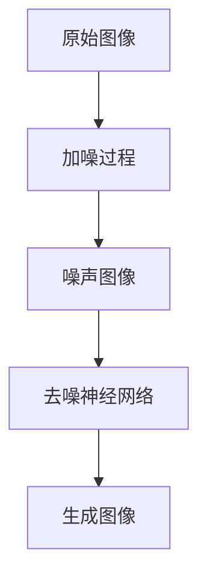
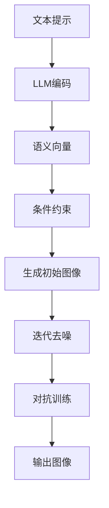

# 深入解读Midjourney的起源和发展历程

## 1.背景介绍

### 1.1 人工智能时代的到来

随着计算机技术和算力的不断提升,人工智能(AI)技术正在迅速发展,并逐渐渗透到我们生活的方方面面。在这个新兴的AI时代,各种创新应用层出不穷,其中一个备受瞩目的领域就是AI生成式内容(AI-generated content)。

### 1.2 AI绘画:艺术与科技的融合

AI绘画是指利用人工智能算法根据文本提示生成图像的技术。它将人类的创意想象与强大的AI模型相结合,打破了传统艺术创作的界限。AI绘画不仅可以满足个人创意需求,还可以为设计、广告、娱乐等领域提供全新的视觉体验。

### 1.3 Midjourney:AI绘画的佼佼者

在AI绘画领域,Midjourney是一款备受推崇的工具。它由一家独立的人工智能研究实验室开发,利用最先进的深度学习技术,能够根据用户输入的文本描述生成逼真的图像。Midjourney的出现,标志着AI绘画技术进入了一个新的里程碑。

## 2.核心概念与联系

### 2.1 生成式对抗网络(GAN)

Midjourney的核心技术是基于生成式对抗网络(Generative Adversarial Networks,GAN)。GAN是一种由两个神经网络模型组成的架构,包括生成器(Generator)和判别器(Discriminator)。

生成器的目标是生成逼真的图像数据,而判别器则负责判断生成的图像是真实的还是伪造的。两个模型相互对抗,不断提高对方的性能,最终达到生成高质量图像的目的。



### 2.2 扩散模型(Diffusion Models)

除了GAN,Midjourney还采用了扩散模型(Diffusion Models)技术。扩散模型是一种新兴的生成模型,它通过学习数据的潜在分布,逆向建模图像生成过程。

扩散模型的工作原理是先将图像加入噪声,使其变得模糊,然后训练一个神经网络去去噪,逐步恢复原始图像。该模型可以生成高分辨率、高质量的图像,并具有很好的多样性。



### 2.3 大型语言模型(Large Language Models)

为了更好地理解用户的文本提示,Midjourney整合了大型语言模型(Large Language Models,LLM)。LLM是一种基于海量文本数据训练的深度学习模型,能够掌握人类语言的语义和上下文信息。

通过LLM,Midjourney可以更准确地捕捉用户输入文本的含义,并将其转化为图像生成的条件和约束,从而生成更加贴合文本描述的图像。

## 3.核心算法原理具体操作步骤

Midjourney的图像生成过程大致可分为以下几个步骤:

1. **文本编码**:用户输入的文本提示首先会被LLM编码成语义向量表示。
2. **条件约束**:语义向量被用作条件约束,与图像潜在空间相结合,引导图像生成过程。
3. **生成初始图像**:基于条件约束,生成器网络生成一个初始的噪声图像。
4. **迭代去噪**:通过扩散模型的迭代去噪过程,逐步将噪声图像转化为清晰的目标图像。
5. **对抗训练**:生成的图像被送入判别器网络,与真实图像进行对抗训练,不断优化生成器的性能。
6. **输出图像**:经过多轮迭代后,最终生成满足文本描述的高质量图像。



整个过程中,GAN、扩散模型和LLM三种技术相互配合,确保生成的图像不仅质量出众,而且与用户的文本描述高度吻合。

## 4.数学模型和公式详细讲解举例说明

### 4.1 生成式对抗网络(GAN)

GAN的目标是学习真实数据分布 $p_{data}(x)$,使生成器 $G$ 能够从一个潜在的噪声分布 $p_z(z)$ 生成与真实数据相似的样本。判别器 $D$ 则被训练为区分生成器生成的假数据和真实数据。

生成器 $G$ 和判别器 $D$ 相互对抗,形成一个两人零和博弈:

$$\min_G \max_D V(D,G) = \mathbb{E}_{x\sim p_{data}(x)}[\log D(x)] + \mathbb{E}_{z\sim p_z(z)}[\log (1-D(G(z)))]$$

其中,判别器 $D$ 试图最大化判别真实样本和生成样本的能力,而生成器 $G$ 则试图最小化判别器对其生成样本的判别能力。通过这种对抗训练,生成器最终能够生成逼真的数据样本。

### 4.2 扩散模型(Diffusion Models)

扩散模型的核心思想是将一个高质量的数据样本 $x_0$ 通过一个渐进的噪声添加过程转化为纯噪声样本 $x_T$,然后学习一个神经网络 $p_\theta(x_{t-1}|x_t)$ 来逆向重建原始数据。

具体来说,扩散过程可以表示为马尔可夫链:

$$q(x_t|x_{t-1}) = \mathcal{N}(x_t;\sqrt{1-\beta_t}x_{t-1},\beta_tI)$$

其中 $\beta_1,\dots,\beta_T$ 是一个预定义的噪声schedual。

而逆向过程则是学习一个条件模型 $p_\theta(x_{t-1}|x_t)$ 来估计 $x_{t-1}$ 的均值,从而逐步去噪恢复原始数据:

$$p_\theta(x_{t-1}|x_t) = \mathcal{N}(x_{t-1};\mu_\theta(x_t,t),\Sigma_\theta(x_t,t))$$

通过这种方式,扩散模型可以生成高保真、多样化的图像样本。

### 4.3 大型语言模型(LLM)

LLM通常采用Transformer的序列到序列架构,对输入序列 $x = (x_1, x_2, \dots, x_n)$ 进行编码,得到其上下文表示 $h = (h_1, h_2, \dots, h_n)$,然后基于上下文表示生成目标序列 $y = (y_1, y_2, \dots, y_m)$。

编码过程可以表示为:

$$h_i = \textrm{Transformer}(x_1, x_2, \dots, x_n)$$

生成过程则是:

$$P(y|x) = \prod_{t=1}^m P(y_t|y_{<t}, h)$$

其中,Transformer由多头注意力机制和前馈神经网络组成,能够有效捕捉序列的长程依赖关系。

LLM在海量文本数据上进行预训练,学习到丰富的语言知识,因此能够较好地理解和表示输入文本的语义信息。

## 5.项目实践:代码实例和详细解释说明

这里我们提供一个使用PyTorch实现的简化版GAN示例,帮助读者更好地理解GAN的工作原理:

```python
import torch
import torch.nn as nn

# 生成器
class Generator(nn.Module):
    def __init__(self, z_dim, img_shape):
        super().__init__()
        self.z_dim = z_dim
        self.img_shape = img_shape

        def block(in_feat, out_feat, normalize=True):
            layers = [nn.Linear(in_feat, out_feat)]
            if normalize:
                layers.append(nn.BatchNorm1d(out_feat, 0.8))
            layers.append(nn.LeakyReLU(0.2, inplace=True))
            return layers

        self.model = nn.Sequential(
            *block(z_dim, 128, normalize=False),
            *block(128, 256),
            *block(256, 512),
            *block(512, 1024),
            nn.Linear(1024, int(np.prod(img_shape))),
            nn.Tanh()
        )

    def forward(self, z):
        img = self.model(z)
        img = img.view(img.size(0), *self.img_shape)
        return img

# 判别器
class Discriminator(nn.Module):
    def __init__(self, img_shape):
        super().__init__()

        self.model = nn.Sequential(
            nn.Linear(int(np.prod(img_shape)), 512),
            nn.LeakyReLU(0.2, inplace=True),
            nn.Linear(512, 256),
            nn.LeakyReLU(0.2, inplace=True),
            nn.Linear(256, 1),
            nn.Sigmoid(),
        )

    def forward(self, img):
        img_flat = img.view(img.size(0), -1)
        validity = self.model(img_flat)

        return validity

# 初始化模型
z_dim = 100
img_shape = (1, 28, 28)

generator = Generator(z_dim, img_shape)
discriminator = Discriminator(img_shape)

# 损失函数和优化器
criterion = nn.BCELoss()
g_optimizer = torch.optim.Adam(generator.parameters(), lr=0.0002)
d_optimizer = torch.optim.Adam(discriminator.parameters(), lr=0.0002)

# 训练循环
for epoch in range(num_epochs):
    for i, (imgs, _) in enumerate(dataloader):

        valid = torch.ones(batch_size, 1)
        fake = torch.zeros(batch_size, 1)

        # 训练判别器
        real_imgs = imgs.view(batch_size, -1)
        d_real_preds = discriminator(real_imgs)
        d_real_loss = criterion(d_real_preds, valid)

        z = torch.randn(batch_size, z_dim)
        fake_imgs = generator(z)
        d_fake_preds = discriminator(fake_imgs)
        d_fake_loss = criterion(d_fake_preds, fake)

        d_loss = (d_real_loss + d_fake_loss) / 2
        d_optimizer.zero_grad()
        d_loss.backward()
        d_optimizer.step()

        # 训练生成器
        z = torch.randn(batch_size, z_dim)
        fake_imgs = generator(z)
        g_preds = discriminator(fake_imgs)
        g_loss = criterion(g_preds, valid)

        g_optimizer.zero_grad()
        g_loss.backward()
        g_optimizer.step()
```

上述代码实现了一个基本的GAN架构,用于生成手写数字图像。其中:

- `Generator`类定义了生成器网络,它接受一个噪声向量 `z`,并生成一个与真实图像形状相同的张量。
- `Discriminator`类定义了判别器网络,它接受一个图像张量,并输出一个标量,表示该图像为真实图像的概率。
- `criterion`是二元交叉熵损失函数,用于计算生成器和判别器的损失。
- `g_optimizer`和`d_optimizer`分别是生成器和判别器的优化器。

在训练循环中,我们先使用真实图像和生成器生成的假图像分别训练判别器,使其能够区分真伪图像。然后,我们冻结判别器的参数,使用判别器对生成器生成的假图像的判断结果来训练生成器,目标是使生成器生成的图像足够逼真,以欺骗判别器。

通过这种对抗训练过程,生成器和判别器相互提升,最终生成器能够生成高质量的图像。

## 6.实际应用场景

### 6.1 艺术创作

AI绘画为艺术创作带来了全新的可能性。艺术家可以利用Midjourney等工具,根据自己的想象力生成精美的图像,作为创作的起点或灵感来源。这不仅提高了创作效率,还拓展了艺术表现的维度。

### 6.2 设计和广告

在设计和广告领域,AI绘画可以快速生成各种视觉素材,如产品渲染图、场景概念图等。设计师只需输入文本描述,就能获得多种可选方