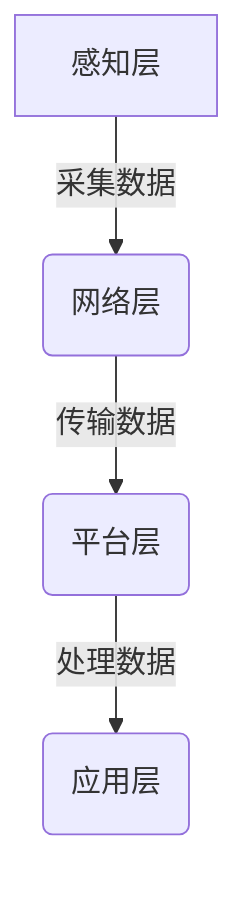

# 特征工程与物联网：赋能智能设备

## 1.背景介绍

### 1.1 物联网的崛起

随着互联网、移动通信和传感器技术的不断发展,物联网(Internet of Things, IoT)正在快速崛起,成为继计算机、互联网之后的又一重大信息技术浪潮。物联网将各种信息传感设备与互联网相连,实现物物相连、人机交互,为智能系统提供海量数据支持。物联网的应用已经渗透到生活的方方面面,如智能家居、可穿戴设备、智能交通、智慧城市等,极大地改变了人们的生活方式。

### 1.2 特征工程的重要性

在物联网大数据时代,海量的传感器数据如何被高效利用是一个关键问题。特征工程(Feature Engineering)作为数据预处理的核心环节,对于提取有价值的特征信息,改善机器学习模型的性能至关重要。良好的特征工程可以大幅提升模型的准确性,反之则会严重影响模型的泛化能力。因此,特征工程在物联网智能系统中扮演着至关重要的角色。

## 2.核心概念与联系

### 2.1 物联网系统架构

物联网系统通常由四个核心层次组成:感知层、网络层、平台层和应用层。



1. **感知层**:包括各种传感器和智能终端设备,负责采集环境数据。
2. **网络层**:通过有线或无线网络传输数据。
3. **平台层**:进行数据存储、处理和管理。
4. **应用层**:根据处理后的数据提供智能服务。

### 2.2 特征工程概念

特征工程是从原始数据中构造出能更好地表示潜在问题的特征,为机器学习算法提供优质数据输入。主要包括以下几个步骤:

1. **特征提取**:从原始数据中提取有意义的特征。
2. **特征编码**:将分类特征转换为机器可读的数值形式。
3. **特征选择**:从现有特征中选择对模型最有价值的一部分。
4. **特征构造**:通过特征衍生或特征组合创造新特征。

特征工程对于提高机器学习模型的性能至关重要,是数据预处理的核心环节。

## 3.核心算法原理具体操作步骤

### 3.1 特征提取

特征提取的目标是从原始数据中提取出对构建机器学习模型有意义的特征。常用的特征提取方法包括:

1. **统计特征**:如均值、方差、最大/最小值等统计量。
2. **时间特征**:如小时、星期、月份等时间周期性特征。
3. **文本特征**:从文本数据中提取关键词、主题等特征。
4. **图像特征**:如颜色直方图、纹理特征等计算机视觉特征。

提取特征的过程需要结合领域知识和特征重要性分析,剔除无关和冗余特征。

### 3.2 特征编码

对于分类特征,需要将其转换为机器学习算法可识别的数值形式。常用的特征编码方法包括:

1. **标签编码**:将每个分类值映射为一个整数值。
2. **One-Hot编码**:将每个分类值转换为一个新的二进制向量。
3. **目标编码**:根据分类值与目标变量的相关性赋予数值。
4. **嵌入编码**:将分类值映射到低维密集向量空间。

不同的编码方式适用于不同的场景,需要根据具体问题选择合适的编码方法。

### 3.3 特征选择

由于原始数据通常包含大量特征,不可能全部使用,因此需要进行特征选择,选取对模型最有价值的一部分特征。常用的特征选择方法包括:

1. **过滤式方法**:根据特征与目标变量的相关性评分,选择评分最高的特征。
2. **包裹式方法**:反复构建模型,选择对模型性能影响最大的特征。
3. **嵌入式方法**:在模型训练过程中自动选择特征。

特征选择不仅可以提高模型性能,还能减少模型复杂度和计算开销。

### 3.4 特征构造

通过对现有特征进行组合或衍生,可以构造出新的更有意义的特征。常用的特征构造方法包括:

1. **多项式特征**:通过多项式组合现有特征构造新特征。
2. **交互特征**:将两个或多个特征进行乘积或其他运算构造新特征。
3. **桶特征**:将连续特征按区间划分为多个桶,构造分类特征。
4. **领域特征**:利用领域知识构造具有物理意义的新特征。

特征构造可以增强模型的表达能力,捕捉特征之间的高阶关系和非线性模式。

## 4.数学模型和公式详细讲解举例说明

### 4.1 相关性分析

在特征工程中,常需要分析特征与目标变量之间的相关性,以确定特征的重要程度。常用的相关性度量包括:

1. **Pearson相关系数**:衡量两个连续变量之间的线性相关程度。

$$r=\frac{\sum_{i=1}^{n}(x_i-\bar{x})(y_i-\bar{y})}{\sqrt{\sum_{i=1}^{n}(x_i-\bar{x})^2}\sqrt{\sum_{i=1}^{n}(y_i-\bar{y})^2}}$$

其中$x_i$和$y_i$分别表示第$i$个样本的特征值和目标值,$\bar{x}$和$\bar{y}$分别表示特征值和目标值的均值。

2. **互信息**:衡量两个随机变量之间的相关程度,适用于连续和离散变量。

$$I(X;Y)=\sum_{y\in Y}\sum_{x\in X}p(x,y)\log\frac{p(x,y)}{p(x)p(y)}$$

其中$p(x,y)$表示$X$和$Y$的联合概率分布,$p(x)$和$p(y)$分别表示$X$和$Y$的边缘概率分布。

3. **卡方统计量**:衡量分类变量之间的相关程度。

$$\chi^2=\sum_{i=1}^{r}\sum_{j=1}^{c}\frac{(O_{ij}-E_{ij})^2}{E_{ij}}$$

其中$r$和$c$分别表示行数和列数,$O_{ij}$表示第$i$行第$j$列的观测值,$E_{ij}$表示第$i$行第$j$列的期望值。

根据相关性分析的结果,可以选择相关性较高的特征,剔除无关或冗余的特征。

### 4.2 降维技术

在特征工程中,常需要对高维特征进行降维,以减少特征空间的维度,提高模型的泛化能力。常用的降维技术包括:

1. **主成分分析(PCA)**:通过正交变换将原始特征投影到一组相互正交的主成分上,选择方差贡献率较大的主成分作为新的特征。

$$X'=X\times W$$

其中$X$表示原始特征矩阵,$W$表示投影矩阵,由主成分的特征向量构成。

2. **线性判别分析(LDA)**:在降维的同时,最大化不同类别样本之间的散布矩阵,最小化同类样本之间的散布矩阵,从而提高分类性能。

$$W=\arg\max\frac{|W^TSW|}{|W^TBW|}$$

其中$S$表示总散布矩阵,$B$表示类内散布矩阵。

3. **核技巧(Kernel Trick)**:通过核函数将原始特征映射到高维空间,使得在高维空间中线性可分,然后再进行降维操作。

$$\phi(x)=(1,x_1,x_2,\ldots,x_n,x_1^2,x_1x_2,\ldots,x_n^2,\ldots)$$

常用的核函数包括多项式核、高斯核等。

降维技术可以有效减少特征空间的维度,降低模型的复杂度,提高模型的泛化能力。

## 5.项目实践:代码实例和详细解释说明

以下是一个使用Python和Scikit-learn库进行特征工程的示例:

```python
import pandas as pd
from sklearn.preprocessing import LabelEncoder, OneHotEncoder
from sklearn.feature_selection import mutual_info_regression
from sklearn.decomposition import PCA

# 加载数据
data = pd.read_csv('sensor_data.csv')

# 特征提取
data['temp_mean'] = data.groupby('device_id')['temperature'].transform('mean')
data['humidity_max'] = data.groupby('device_id')['humidity'].transform('max')

# 特征编码
label_encoder = LabelEncoder()
data['location'] = label_encoder.fit_transform(data['location'])
ohe = OneHotEncoder(sparse=False)
location_ohe = ohe.fit_transform(data[['location']])
data = pd.concat([data, pd.DataFrame(location_ohe, columns=['location_'+str(i) for i in range(location_ohe.shape[1])])], axis=1)

# 特征选择
features = data.drop(['device_id', 'temperature', 'humidity', 'location'], axis=1)
target = data['energy_consumption']
selected_features = features.columns[mutual_info_regression(features, target) > 0.1]

# 特征构造
data['temp_humidity_ratio'] = data['temperature'] / data['humidity']

# 降维
pca = PCA(n_components=0.95)
features_pca = pca.fit_transform(data[selected_features])
```

上述代码包括以下步骤:

1. 从CSV文件加载传感器数据。
2. 特征提取:计算每个设备的温度均值和湿度最大值作为新特征。
3. 特征编码:对分类特征"location"进行标签编码和One-Hot编码。
4. 特征选择:使用互信息回归选择与目标变量"energy_consumption"相关性较高的特征。
5. 特征构造:构造温度与湿度的比值作为新特征。
6. 降维:使用PCA将选择的特征降维,保留95%的方差贡献率。

通过这些步骤,我们从原始传感器数据中提取出更有意义的特征,为机器学习模型提供优质的数据输入。

## 6.实际应用场景

特征工程在物联网领域有着广泛的应用,以下是一些典型的应用场景:

1. **智能家居**:从家用电器、安防系统等设备中采集数据,通过特征工程构建用户行为模型,实现智能控制和个性化服务。
2. **可穿戴设备**:从穿戴式传感器中采集生理数据,通过特征工程实现健康监测、运动跟踪等功能。
3. **智能农业**:从农场环境传感器中采集数据,通过特征工程构建作物生长模型,实现精准农业管理。
4. **预测性维护**:从工业设备中采集运行数据,通过特征工程构建故障预测模型,实现设备预测性维护。
5. **智能交通**:从交通监控系统中采集数据,通过特征工程构建交通流量预测模型,实现交通状况预测和路线规划。

特征工程在物联网领域发挥着关键作用,为智能系统提供高质量的数据输入,从而实现更精准、更智能的服务。

## 7.工具和资源推荐

在进行特征工程时,可以使用以下工具和资源:

1. **Python库**:Scikit-learn、Pandas、NumPy等Python库提供了丰富的特征工程功能。
2. **自动化工具**:如Featuretools、Driverless AI等自动化特征工程工具,可以大幅减少手动工作量。
3. **在线课程**:Coursera、edX等平台提供了多门特征工程相关的在线课程,可以系统学习相关知识。
4. **书籍资料**:《Feature Engineering for Machine Learning》、《Python数据分析与挖掘实战》等书籍对特征工程有深入讲解。
5. **社区资源**:Kaggle、GitHub等社区提供了大量特征工程相关的代码示例和讨论。

利用这些工具和资源,可以提高特征工程的效率,掌握更多技巧和最佳实践。

## 8.总结:未来发展趋势与挑战

### 8.1 发展趋势

1. **自动化特征工程**:通过机器学习和人工智