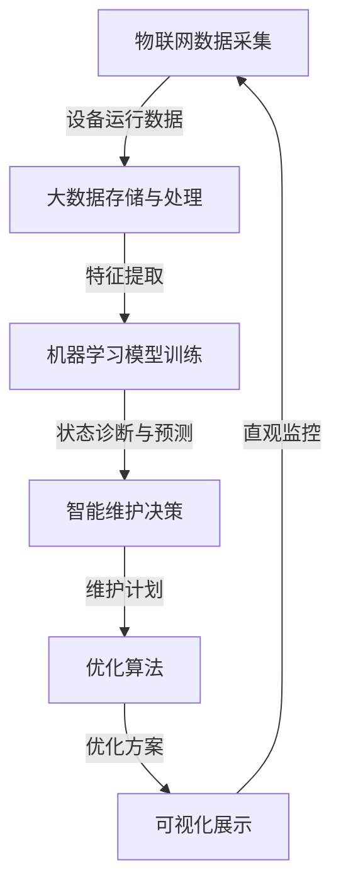

# 电气设备管理系统详细设计与具体代码实现

## 1.背景介绍

随着工业自动化和智能制造的快速发展,电气设备在现代生产系统中扮演着越来越重要的角色。电气设备的高效管理对于确保生产线的稳定运行、降低运营成本、提高能源利用效率至关重要。传统的手动管理方式已经无法满足现代化生产的需求,因此开发一个高效、智能的电气设备管理系统(Electrical Equipment Management System,EEMS)就显得尤为迫切。

本文将详细介绍电气设备管理系统的设计思路、核心算法原理、数学模型、代码实现,以及在实际应用场景中的应用。通过对该系统的深入探讨,读者将能够全面了解其工作原理、掌握关键技术,并获得在实际项目中应用该系统的实践经验。

## 2.核心概念与联系

电气设备管理系统的核心目标是实现对电气设备的高效监控、故障诊断和预测性维护。为了实现这一目标,该系统需要融合多种先进技术,包括:

1. **物联网(IoT)**: 通过部署各种传感器收集电气设备的运行数据,如温度、振动、电流等。

2. **大数据处理**: 存储和处理来自海量设备的时序数据,提取有价值的信息。

3. **机器学习**: 基于历史数据训练模型,对设备状态进行智能诊断和预测。

4. **优化算法**: 对设备维护计划、能源利用等进行优化,提高运营效率。

5. **可视化**: 直观展示设备状态、故障预警、能耗统计等信息。

这些技术相互关联、环环相扣,共同构建了一个完整的电气设备管理生态系统。



## 3.核心算法原理具体操作步骤

电气设备管理系统的核心算法包括三个主要部分:特征工程、机器学习模型和优化算法。

### 3.1 特征工程

特征工程的目标是从原始时序数据中提取出对设备状态具有区分能力的特征,为后续的机器学习模型提供高质量的输入。常用的特征工程技术包括:

1. **时域特征提取**: 计算原始时序数据的统计量,如均值、标准差、峰值等。

2. **频域特征提取**: 对时序数据进行傅里叶变换或小波变换,提取频域特征。

3. **滑动窗口特征提取**: 在一定时间窗口内计算各种统计量,捕捉时序数据的动态变化。

4. **降噪与插值**: 对原始数据进行预处理,消除噪声,填补缺失值。

以温度数据为例,可以提取均值、标准差、峰值等时域特征,同时进行小波变换提取频域特征,再结合滑动窗口特征,最终形成一个多维度的特征向量,作为机器学习模型的输入。

### 3.2 机器学习模型

根据具体的应用场景,可以采用监督学习、非监督学习或者半监督学习等不同的机器学习范式。常用的算法包括:

1. **分类算法**: 如支持向量机(SVM)、决策树、随机森林等,用于将设备状态划分为正常、轻微故障、严重故障等类别。

2. **聚类算法**: 如K-Means、DBSCAN等,用于发现设备的异常工作模式。

3. **时序模型**: 如长短期记忆网络(LSTM)、1D卷积神经网络等,用于对设备状态进行预测。

4. **异常检测算法**: 如基于重构的方法(AE、VAE)、基于密度的方法(隔离森林)等,用于发现异常工作状态。

5. **迁移学习**: 利用已有领域的模型知识,加快新领域模型的训练过程。

6. **集成学习**: 将多种模型的预测结果进行融合,提高预测的准确性和稳健性。

在实际应用中,需要根据具体场景选择合适的算法,并对算法进行调优,以获得最佳的模型性能。

### 3.3 优化算法

优化算法的目标是基于机器学习模型的输出,制定出能够最大限度降低运营成本、提高能源利用效率的维护计划和控制策略。常用的优化算法包括:

1. **整数规划**: 对设备维修时间进行优化调度,使维修成本最小化。

2. **约束规划**: 在满足各种约束条件(如设备可用性、维修工人数量等)的前提下,优化维护计划。

3. **启发式算法**: 如遗传算法、蚁群算法等,用于求解复杂的组合优化问题。

4. **动态规划**: 将大规模优化问题分解为多个子问题,递归求解。

5. **强化学习**: 将优化过程建模为马尔可夫决策过程,通过与环境交互逐步学习最优策略。

优化算法的输入包括机器学习模型的预测结果、设备的运行参数、维修成本等,输出是一个能够最大限度降低总体运营成本的维护计划和控制策略。

## 4.数学模型和公式详细讲解举例说明

### 4.1 机器学习模型

假设我们采用支持向量机(SVM)作为分类模型,对电机的状态进行诊断。给定一组训练数据 $\{(x_i, y_i)\}_{i=1}^N$,其中 $x_i \in \mathbb{R}^d$ 表示第 i 个样本的特征向量, $y_i \in \{-1, 1\}$ 表示对应的类别标签。SVM 的目标是找到一个超平面,能够将两类样本分开,且分类间隔最大化。

SVM 的基本形式可以表示为:

$$
\begin{aligned}
\min_{\omega, b, \xi} \quad & \frac{1}{2}\|\omega\|^2 + C\sum_{i=1}^N \xi_i \
\text{s.t.} \quad & y_i(\omega^T x_i + b) \geq 1 - \xi_i, \quad \xi_i \geq 0, \quad i = 1, 2, \ldots, N
\end{aligned}
$$

其中 $\omega$ 和 $b$ 分别表示超平面的法向量和偏移量, $\xi_i$ 是松弛变量, $C$ 是惩罚系数,用于权衡最大间隔和训练误差。

对于非线性可分的情况,我们可以引入核技巧,将原始特征映射到更高维的特征空间,使样本在新的特征空间中变为线性可分。常用的核函数包括线性核、多项式核、高斯核等。

以高斯核为例,其形式为:

$$
K(x_i, x_j) = \exp\left(-\frac{\|x_i - x_j\|^2}{2\sigma^2}\right)
$$

其中 $\sigma$ 是核函数的带宽参数。

在实际应用中,我们可以通过交叉验证等方法,对 SVM 模型的参数 $C$ 和核函数参数 $\sigma$ 进行调优,以获得最佳的分类性能。

### 4.2 优化模型

假设我们需要对一组 $N$ 台电机的维修时间进行优化调度,目标是使总的维修成本最小化。我们可以将这一问题建模为一个整数规划问题。

令 $x_{ij}$ 为一个二元变量,表示第 $i$ 台电机是否安排在第 $j$ 个时间段进行维修,即:

$$
x_{ij} = \begin{cases}
1, & \text{第 $i$ 台电机安排在第 $j$ 个时间段维修}\
0, & \text{其他}
\end{cases}
$$

我们的目标函数可以表示为:

$$
\min \sum_{i=1}^N \sum_{j=1}^M c_{ij} x_{ij}
$$

其中 $c_{ij}$ 表示第 $i$ 台电机在第 $j$ 个时间段进行维修的成本。

同时,我们需要满足以下约束条件:

1. 每台电机只能安排在一个时间段进行维修:

$$
\sum_{j=1}^M x_{ij} = 1, \quad i = 1, 2, \ldots, N
$$

2. 每个时间段的维修电机数量不能超过维修能力上限 $K$:

$$
\sum_{i=1}^N x_{ij} \leq K, \quad j = 1, 2, \ldots, M
$$

3. 决策变量为二元变量:

$$
x_{ij} \in \{0, 1\}, \quad i = 1, 2, \ldots, N; \quad j = 1, 2, \ldots, M
$$

通过求解这一整数规划问题,我们可以得到一个最优的维修时间安排,使总的维修成本最小化。在实际应用中,我们可以根据具体情况增加更多的约束条件,如考虑维修工人的技能等级、维修时间窗口的限制等,从而使优化模型更加贴近实际场景。

## 5.项目实践:代码实例和详细解释说明

为了更好地说明电气设备管理系统的实现细节,我们将提供一个基于 Python 的代码示例,包括数据预处理、特征工程、机器学习模型训练和优化模型求解等核心模块。

### 5.1 数据预处理

```python
import pandas as pd
import numpy as np

# 读取原始数据
data = pd.read_csv('sensor_data.csv')

# 填充缺失值
data = data.interpolate()

# 去除异常值
q1, q3 = data['temperature'].quantile([0.25, 0.75])
iqr = q3 - q1
lower_bound = q1 - 1.5 * iqr
upper_bound = q3 + 1.5 * iqr
data = data[(data['temperature'] >= lower_bound) & (data['temperature'] <= upper_bound)]

# 重采样
data = data.resample('1H').mean()
```

上述代码首先读取原始的传感器数据,然后进行以下预处理步骤:

1. 使用插值法填充缺失值。
2. 基于四分位数法则去除温度数据中的异常值。
3. 将原始数据重采样为每小时的平均值,降低数据分辨率。

预处理后的数据将被用于后续的特征工程和模型训练。

### 5.2 特征工程

```python
import numpy as np
import pywt

# 时域特征提取
def time_features(data):
    return data.agg(['mean', 'std', 'max', 'min'])

# 频域特征提取
def freq_features(data, wavelet='db4', level=4):
    coeffs = pywt.wavedec(data, wavelet, level=level)
    features = []
    for coeff in coeffs:
        features.append(np.mean(np.abs(coeff)))
    return features

# 滑动窗口特征提取
def window_features(data, window_size=24, step_size=1):
    features = []
    for i in range(0, len(data) - window_size + 1, step_size):
        window = data.iloc[i:i+window_size]
        features.append(time_features(window).values.flatten())
    return np.vstack(features)

# 特征工程
data = pd.read_csv('processed_data.csv', index_col='timestamp', parse_dates=True)
time_feats = time_features(data)
freq_feats = freq_features(data['temperature'])
window_feats = window_features(data['temperature'])
features = pd.concat([time_feats, freq_feats, window_feats], axis=1)
```

上述代码实现了三种特征工程技术:

1. 时域特征提取: 计算温度数据的均值、标准差、最大值和最小值。
2. 频域特征提取: 对温度数据进行小波变换,提取各级分解系数的均值作为频域特征。
3. 滑动窗口特征提取: 在固定大小的滑动窗口内,提取时域特征作为动态特征。

最终,我们将时域特征、频域特征和滑动窗口特征拼接起来,形成完整的特征矩阵,作为机器学习模型的输入。

### 5.3 机器学习模型训练

```python
from sklearn.svm import SVC
from sklearn.model_selection import GridSearchCV

# 加载特征和标签
X = features.values
y = data['label'].values