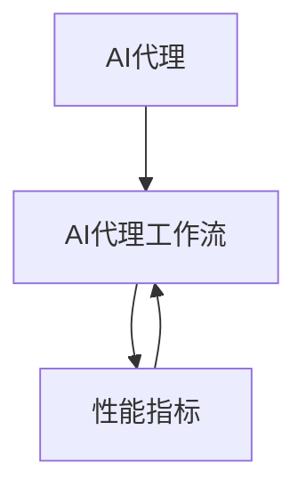

# 监控AI代理工作流：性能指标与分析

## 1. 背景介绍
### 1.1 AI代理工作流的兴起
随着人工智能技术的快速发展,AI代理在各行各业中的应用日益广泛。AI代理能够自主完成复杂的任务,提高工作效率和质量。然而,随着AI代理工作流的日益复杂化,如何有效监控其性能,保证其稳定运行,已成为亟待解决的问题。

### 1.2 监控AI代理工作流的重要性  
监控AI代理工作流的性能指标,对于保证AI系统的稳定运行、优化资源配置、提高工作效率至关重要。通过实时监测AI代理的运行状态,可以及时发现和定位潜在问题,从而快速响应和解决。同时,通过对性能指标的分析,可以洞察AI代理工作流的瓶颈所在,进而优化工作流,提升整体性能。

### 1.3 本文的主要内容
本文将重点探讨AI代理工作流的性能监控与分析。首先,我们将介绍AI代理工作流的核心概念,并阐述其内在联系。其次,重点阐述监控AI代理工作流的核心算法原理和具体操作步骤。再次,给出相关数学模型和公式的详细讲解,并结合实例加以说明。此外,本文还将提供代码实例,演示如何实现对AI代理工作流的性能监控。最后,总结AI代理工作流监控的发展趋势与面临的挑战,并提供常见问题的解答。

## 2. 核心概念与联系
### 2.1 AI代理的定义与特征
AI代理是一种能够感知环境、自主决策和执行任务的智能实体。其主要特征包括:
- 自主性:能够根据环境和目标自主地做出决策和行动
- 社会性:能够与人类或其他AI代理进行交互和协作
- 反应性:能够对环境的变化做出及时反应
- 主动性:能够主动地执行任务,而不仅仅是被动地响应

### 2.2 AI代理工作流的定义
AI代理工作流是指在完成特定任务过程中,多个AI代理之间的协作过程。通过将复杂任务分解为多个子任务,并由不同的AI代理负责完成,可以显著提高任务完成的效率和质量。一个典型的AI代理工作流包括以下步骤:
1. 任务分解:将复杂任务分解为多个可由AI代理完成的子任务
2. 任务分配:根据AI代理的能力,将子任务分配给适合的代理
3. 任务执行:AI代理按照工作流的安排,独立完成分配的子任务 
4. 结果整合:将各个AI代理完成的子任务结果进行整合,得出最终结果

### 2.3 性能指标的定义与分类
性能指标是衡量AI代理工作流运行状态和效率的关键参数。常见的性能指标可分为以下几类:
- 时间指标:衡量任务完成的速度,如平均响应时间、吞吐量等
- 资源指标:衡量系统资源的使用情况,如CPU占用率、内存占用率等
- 质量指标:衡量任务完成的准确性和效果,如错误率、精度等
- 可靠性指标:衡量系统的稳定性,如故障率、可用性等

### 2.4 核心概念之间的内在联系
AI代理、AI代理工作流、性能指标三者之间有着紧密的内在联系。AI代理是AI代理工作流的基本组成单元,工作流的性能取决于各个代理的性能表现。而性能指标则是监控和评估AI代理和工作流运行状态的重要工具。通过分析性能指标,可以发现影响工作流性能的关键因素,并采取优化措施。下图展示了三者之间的关系:



## 3. 核心算法原理具体操作步骤
### 3.1 数据采集与预处理
监控AI代理工作流的第一步是采集系统运行过程中的各项指标数据。常见的数据采集方法包括:
- 日志分析:通过分析系统日志,提取关键性能指标
- 接口监控:通过监控系统接口的调用情况,评估接口性能
- 代理监控:在AI代理中嵌入监控代码,实时采集代理运行数据

采集到的原始数据通常需要进行预处理,去除噪声数据,并转化为适合分析的格式。常见的数据预处理步骤包括:
1. 数据清洗:去除缺失值、异常值等噪声数据
2. 数据归一化:将不同指标的数据统一到相同的尺度
3. 数据离散化:将连续数据转化为离散数据,方便分析

### 3.2 性能指标计算
根据预处理后的数据,可以计算各项性能指标。常见的性能指标计算方法包括:
- 均值:反映指标数据的平均水平,如平均响应时间
- 分位数:反映指标数据的分布情况,如90%分位响应时间
- 计数:反映指标数据的数量,如请求总数、错误总数等

除了基本的统计指标外,还可以根据业务需求,定义更复杂的性能指标,如平均故障恢复时间等。

### 3.3 异常检测
通过对性能指标的监控,可以及时发现系统运行过程中的异常情况。常见的异常检测算法包括:
- 阈值检测:设定指标的正常范围,超出范围则认为是异常
- 趋势检测:通过分析指标的变化趋势,预测未来可能出现的异常
- 聚类检测:通过聚类算法,发现指标数据的异常簇

异常检测可以帮助快速定位系统故障,及时采取应对措施,保证系统的稳定运行。

### 3.4 根因分析
当检测到系统异常时,需要进一步分析异常产生的原因,以便采取针对性的优化措施。常见的根因分析方法包括:
- 相关性分析:分析异常指标与其他指标之间的相关性,发现可能的影响因素
- 对比分析:将异常时间段的指标数据与正常时间段进行对比,发现差异
- 链路分析:分析异常请求的调用链路,定位问题代码

通过根因分析,不仅可以解决当前的异常问题,还可以举一反三,预防同类问题的再次发生。

## 4. 数学模型和公式详细讲解举例说明
为了更精确地描述AI代理工作流的性能指标,可以引入数学模型和公式。下面以响应时间为例,详细讲解相关数学模型和公式。

### 4.1 基本概念
- 响应时间:从请求发出到收到响应的时间间隔
- 响应时间分布:一组响应时间数据的概率分布
- 分位数:将数据按大小排序,位于某个百分位的数值

### 4.2 数学模型
假设某个API接口的响应时间服从指数分布,其概率密度函数为:

$$
f(x)=
\begin{cases}
\lambda e^{-\lambda x},& x \geq 0 \
0,& x < 0
\end{cases}
$$

其中,$\lambda$为响应时间的倒数,反映响应速度。

则该接口的平均响应时间为:

$$
E(X)=\frac{1}{\lambda}
$$

方差为:

$$
Var(X)=\frac{1}{\lambda^2}
$$

$p$分位响应时间为:

$$
t_p=\frac{-\ln(1-p)}{\lambda}
$$

### 4.3 举例说明
假设某个API接口的平均响应时间为200ms,标准差为100ms,求其90%分位响应时间。

首先,根据平均响应时间和标准差,计算指数分布的参数$\lambda$:

$$
\lambda=\frac{1}{E(X)}=\frac{1}{200ms}=5
$$

然后,代入分位数公式,计算90%分位响应时间:

$$
t_{0.9}=\frac{-\ln(1-0.9)}{\lambda}=\frac{-\ln(0.1)}{5}=460ms
$$

可见,虽然平均响应时间只有200ms,但90%分位响应时间达到了460ms,反映了响应时间分布的长尾特性。

## 5. 项目实践：代码实例和详细解释说明
下面通过一个简单的代码实例,演示如何使用Python实现对AI代理工作流的性能监控。

### 5.1 数据采集
首先,我们需要采集AI代理工作流的运行数据。假设数据以日志的形式存储,每行表示一次请求,包含请求时间、响应时间、请求状态等字段。我们可以使用Python的`csv`模块读取日志文件:

```python
import csv

def load_data(file_path):
    data = []
    with open(file_path, 'r') as f:
        reader = csv.reader(f)
        for row in reader:
            data.append(row)
    return data
```

### 5.2 数据预处理
读取到数据后,需要进行预处理,提取出我们关注的指标。例如,我们可以提取出每个请求的响应时间:

```python
def extract_response_time(data):
    response_times = []
    for row in data:
        response_times.append(float(row[1]))
    return response_times
```

### 5.3 性能指标计算
根据提取出的响应时间数据,可以计算各项性能指标,如平均响应时间、90%分位响应时间等:

```python
import numpy as np

def calc_metrics(response_times):
    avg_time = np.mean(response_times)
    p90_time = np.percentile(response_times, 90)
    return avg_time, p90_time
```

### 5.4 异常检测
通过设定响应时间的阈值,可以实现简单的异常检测功能:

```python
def detect_anomaly(response_times, threshold):
    anomalies = []
    for time in response_times:
        if time > threshold:
            anomalies.append(time)
    return anomalies
```

### 5.5 完整代码示例
综合上述功能,我们可以实现一个简单的AI代理工作流性能监控脚本:

```python
import csv
import numpy as np

def load_data(file_path):
    """读取数据"""
    data = []
    with open(file_path, 'r') as f:
        reader = csv.reader(f)
        for row in reader:
            data.append(row)
    return data

def extract_response_time(data):
    """提取响应时间"""
    response_times = []
    for row in data:
        response_times.append(float(row[1]))
    return response_times

def calc_metrics(response_times):
    """计算性能指标"""
    avg_time = np.mean(response_times)
    p90_time = np.percentile(response_times, 90)
    return avg_time, p90_time

def detect_anomaly(response_times, threshold):
    """检测异常"""
    anomalies = []
    for time in response_times:
        if time > threshold:
            anomalies.append(time)
    return anomalies

# 主函数
if __name__ == '__main__':
    file_path = 'log.csv'
    threshold = 500 # 响应时间阈值设为500ms
    
    data = load_data(file_path)
    response_times = extract_response_time(data)
    avg_time, p90_time = calc_metrics(response_times)
    anomalies = detect_anomaly(response_times, threshold)
    
    print(f'Average Response Time: {avg_time:.2f} ms')
    print(f'90% Percentile Response Time: {p90_time:.2f} ms')
    print(f'Number of Anomalies: {len(anomalies)}')
```

以上代码先读取日志文件,提取出响应时间数据,然后计算平均响应时间和90%分位响应时间,并检测出超过阈值(500ms)的异常响应。最后,将结果打印输出。

通过这个简单的示例,我们演示了如何使用Python实现AI代理工作流的性能监控。在实际应用中,可以在此基础上,增加更多的性能指标和异常检测算法,并结合可视化工具,实现实时的性能监控和告警。

## 6. 实际应用场景
AI代理工作流的性能监控在许多实际场景中都有广泛应用,下面列举几个典型的应用场景。

### 6.1 智能客服系统
智能客服系统通常由多个AI代理协同工作,完成客户咨询、投诉等请求。通过对智能客服系统的性能监控,可以发现系统的响应速度、服务质