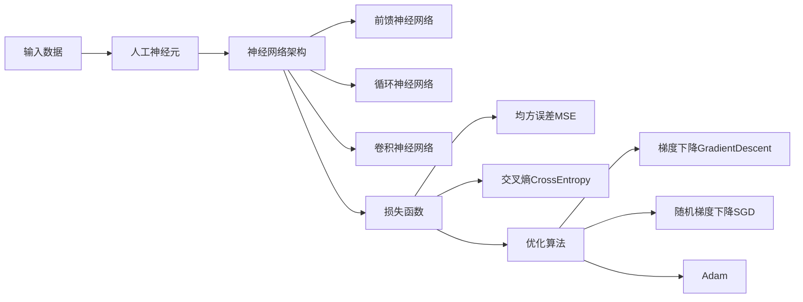

# 神经网络原理与代码实例讲解

## 1. 背景介绍

### 1.1 人工智能与神经网络
人工智能(Artificial Intelligence, AI)是计算机科学的一个重要分支,其目标是让机器具备类似人类的智能。而神经网络(Neural Network,NN)则是实现人工智能的一种重要方法。神经网络从生物学的神经系统中得到启发,通过模拟大脑的信息处理方式,使计算机系统具备类似人脑的学习和认知能力。

### 1.2 神经网络发展历程
神经网络的研究可以追溯到20世纪40年代,随着计算机技术的发展,神经网络也经历了从早期的感知机(Perceptron)到多层感知机(MLP),再到如今的深度学习(Deep Learning)等重要发展阶段。近年来,随着大数据和计算能力的提升,神经网络在计算机视觉、自然语言处理、语音识别等领域取得了突破性进展。

### 1.3 神经网络应用现状
目前,神经网络已经在工业界和学术界得到了广泛应用。在工业界,神经网络被应用于自动驾驶、智能助理、医学影像分析、金融风控等诸多领域。在学术界,神经网络相关的研究论文数量呈现爆发式增长。可以预见,随着技术的不断进步,神经网络将在更多领域发挥重要作用。

## 2. 核心概念与联系

### 2.1 人工神经元
人工神经元(Artificial Neuron)是构成神经网络的基本单元,从生物神经元中得到启发。一个人工神经元通常包括输入、权重、激活函数和输出四个部分。神经元接收一组输入信号,通过加权求和并经过激活函数处理后产生输出。

### 2.2 神经网络架构
神经网络由大量的人工神经元按照一定的拓扑结构连接而成。根据网络的层数和连接方式,神经网络可分为前馈神经网络(Feedforward Neural Network)、循环神经网络(Recurrent Neural Network)、卷积神经网络(Convolutional Neural Network)等不同类型。

### 2.3 损失函数
损失函数(Loss Function)用于衡量神经网络的预测输出与真实标签之间的差异。常见的损失函数包括均方误差(Mean Squared Error,MSE)、交叉熵(Cross Entropy)等。神经网络的训练目标就是最小化损失函数,使网络的预测结果尽可能接近真实值。

### 2.4 优化算法
优化算法(Optimization Algorithm)用于调整神经网络的参数(权重),以最小化损失函数。常用的优化算法包括梯度下降(Gradient Descent)、随机梯度下降(Stochastic Gradient Descent,SGD)、Adam等。不同的优化算法在收敛速度和稳定性方面各有优劣。

### 2.5 神经网络核心概念关系图
下面使用Mermaid流程图展示了神经网络的核心概念及其相互关系:



## 3. 核心算法原理具体操作步骤

### 3.1 前馈传播
前馈传播(Forward Propagation)是神经网络的基本工作方式。输入数据经过网络的各层传递,逐层进行加权求和和激活函数处理,最终在输出层得到预测结果。具体步骤如下:

1. 输入层接收外界输入数据
2. 隐藏层神经元对上一层输出进行加权求和,并经过激活函数处理产生输出
3. 重复步骤2,直到数据传递到输出层
4. 输出层神经元产生最终的预测结果

### 3.2 反向传播
反向传播(Backpropagation)是神经网络的核心训练算法。通过计算损失函数对各参数的梯度,并沿梯度反向调整网络参数,使网络输出不断逼近真实值。具体步骤如下:

1. 随机初始化神经网络的权重参数
2. 执行前馈传播,得到网络的预测输出
3. 计算预测输出与真实标签的损失函数值
4. 计算损失函数对输出层神经元的梯度
5. 反向传播梯度,逐层计算损失函数对隐藏层神经元和权重参数的梯度
6. 根据梯度和学习率更新网络的权重参数
7. 重复步骤2-6,直到达到预设的训练轮数或满足一定的停止条件

### 3.3 梯度下降
梯度下降是最常用的神经网络优化算法。通过沿损失函数梯度的反方向调整网络参数,使损失函数值不断减小,直至收敛到局部最小值。常见的梯度下降变体有:

- 批量梯度下降(Batch Gradient Descent):每次使用全部训练数据计算梯度并更新参数,收敛稳定但速度慢。
- 随机梯度下降(Stochastic Gradient Descent):每次随机选取一个样本计算梯度并更新参数,收敛速度快但可能波动较大。
- 小批量梯度下降(Mini-Batch Gradient Descent):每次选取一个小批量样本计算梯度并更新参数,在收敛速度和稳定性之间取得平衡。

## 4. 数学模型和公式详细讲解举例说明

### 4.1 人工神经元数学模型
设人工神经元接收 $n$ 个输入 $x_1, x_2, \cdots, x_n$,对应的权重为 $w_1, w_2, \cdots, w_n$,偏置项为 $b$,激活函数为 $\sigma$,则神经元的输出 $y$ 可表示为:

$$
y = \sigma(\sum_{i=1}^{n} w_i x_i + b)
$$

常见的激活函数包括Sigmoid、tanh、ReLU等:

- Sigmoid激活函数: $\sigma(x) = \frac{1}{1 + e^{-x}}$
- tanh激活函数: $\tanh(x) = \frac{e^x - e^{-x}}{e^x + e^{-x}}$
- ReLU激活函数: $\text{ReLU}(x) = \max(0, x)$

### 4.2 损失函数数学模型
设神经网络的预测输出为 $\hat{y}$,真实标签为 $y$,则常见的损失函数有:

- 均方误差损失(Mean Squared Error Loss):
$$
L(\hat{y}, y) = \frac{1}{2} (\hat{y} - y)^2
$$

- 交叉熵损失(Cross Entropy Loss):
$$
L(\hat{y}, y) = -[y \log \hat{y} + (1-y) \log (1-\hat{y})]
$$

### 4.3 梯度下降数学模型
设损失函数为 $L(w)$,其中 $w$ 为网络参数,学习率为 $\eta$,则梯度下降的参数更新公式为:

$$
w := w - \eta \nabla_w L(w)
$$

其中 $\nabla_w L(w)$ 表示损失函数 $L(w)$ 对参数 $w$ 的梯度。

## 5. 项目实践：代码实例和详细解释说明

下面以Python和Keras库为例,给出一个简单的神经网络代码实例:

```python
from keras.models import Sequential
from keras.layers import Dense

# 定义网络结构
model = Sequential([
    Dense(64, activation='relu', input_shape=(100,)),
    Dense(10, activation='softmax')
])

# 编译网络
model.compile(optimizer='adam',
              loss='categorical_crossentropy',
              metrics=['accuracy'])

# 训练网络
model.fit(x_train, y_train, epochs=5, batch_size=32)

# 评估网络
loss, accuracy = model.evaluate(x_test, y_test)
print('Test loss:', loss)
print('Test accuracy:', accuracy)
```

代码解释:

1. 首先导入Sequential模型和Dense层,它们是构建神经网络的基础。
2. 使用Sequential定义网络结构,其中包含一个64个神经元的隐藏层和一个10个神经元的输出层,激活函数分别为ReLU和Softmax。
3. 使用compile方法编译网络,指定优化器为Adam,损失函数为分类交叉熵,评估指标为准确率。
4. 使用fit方法在训练数据上训练网络,训练轮数为5,每次训练的批量大小为32。
5. 使用evaluate方法在测试数据上评估网络性能,输出损失值和准确率。

以上就是一个简单的神经网络代码实例。在实际应用中,可以根据具体任务设计更复杂的网络结构和训练策略。

## 6. 实际应用场景

神经网络在许多领域得到了广泛应用,下面列举几个典型场景:

### 6.1 计算机视觉
神经网络在计算机视觉领域取得了显著成果。卷积神经网络(CNN)被广泛用于图像分类、目标检测、语义分割等任务。例如,使用CNN可以实现高精度的人脸识别、车辆检测、医学影像分析等应用。

### 6.2 自然语言处理
神经网络是自然语言处理的主流方法。循环神经网络(RNN)和注意力机制被用于机器翻译、情感分析、文本分类等任务。例如,基于Transformer模型的BERT和GPT系列模型在多个NLP任务上取得了突破性进展。

### 6.3 语音识别
神经网络在语音识别领域也有广泛应用。结合CNN和RNN的深度学习模型可以实现高精度的语音识别和语音合成。例如,智能音箱、语音助手等产品都离不开语音识别技术的支持。

### 6.4 推荐系统
神经网络可以用于构建个性化推荐系统。通过学习用户的历史行为数据,神经网络可以预测用户的兴趣偏好,从而给出精准的推荐结果。例如,电商平台、视频网站等都广泛采用了基于神经网络的推荐算法。

## 7. 工具和资源推荐

下面推荐一些常用的神经网络工具和学习资源:

### 7.1 深度学习框架
- TensorFlow:由Google开发的端到端开源机器学习平台,支持多种神经网络模型。
- PyTorch:由Facebook开发的深度学习框架,具有动态计算图和良好的可读性。
- Keras:基于TensorFlow和Theano的高层神经网络API,易学易用。

### 7.2 数据集
- MNIST:手写数字识别数据集,包含60000张训练图像和10000张测试图像。
- ImageNet:大规模图像分类数据集,包含超过1400万张图像和1000个类别。
- COCO:用于目标检测、分割和字幕生成的大型数据集。

### 7.3 在线课程
- 吴恩达的深度学习课程:Coursera上的经典入门课程,包含视频讲解和编程作业。
- fast.ai实用深度学习:注重实践的深度学习课程,使用PyTorch框架。
- CS231n:斯坦福大学的卷积神经网络课程,适合有一定基础的学习者。

### 7.4 书籍
- 《深度学习》:Yoshua Bengio、Ian Goodfellow和Aaron Courville所著的深度学习圣经。
- 《神经网络与深度学习》:Michael Nielsen所著的在线书籍,深入浅出地讲解神经网络原理。
- 《Python深度学习》:Keras作者Francois Chollet所著,全面介绍如何使用Python进行深度学习。

## 8. 总结：未来发展趋势与挑战

### 8.1 未来发展趋势
神经网络技术正在飞速发展,未来可能的发展方向包括:

- 更大规模的网络和数据:随着计算能力的提升,未来神经网络的规模将变得更大,训练数据也会更加海量。
- 更多样化的网络结构:除了目前主流的CNN、RNN等,更多新颖的网络结构如Capsule Network、Graph Neural Network等可能会得到更多关注。
- 跨模态学习:将视觉、语音、文本等不同模态的数据结