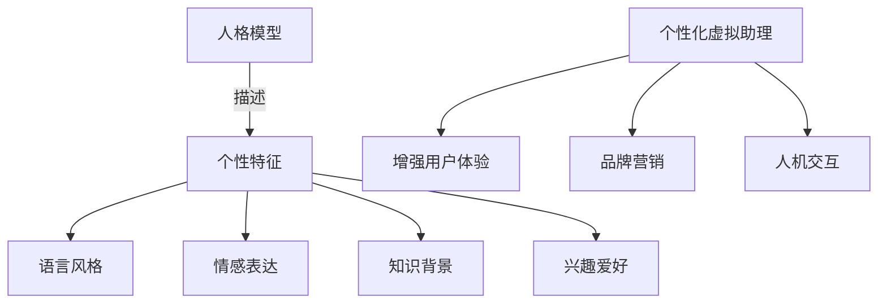
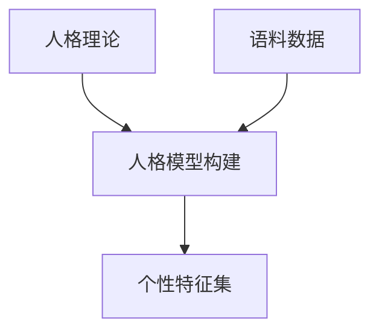
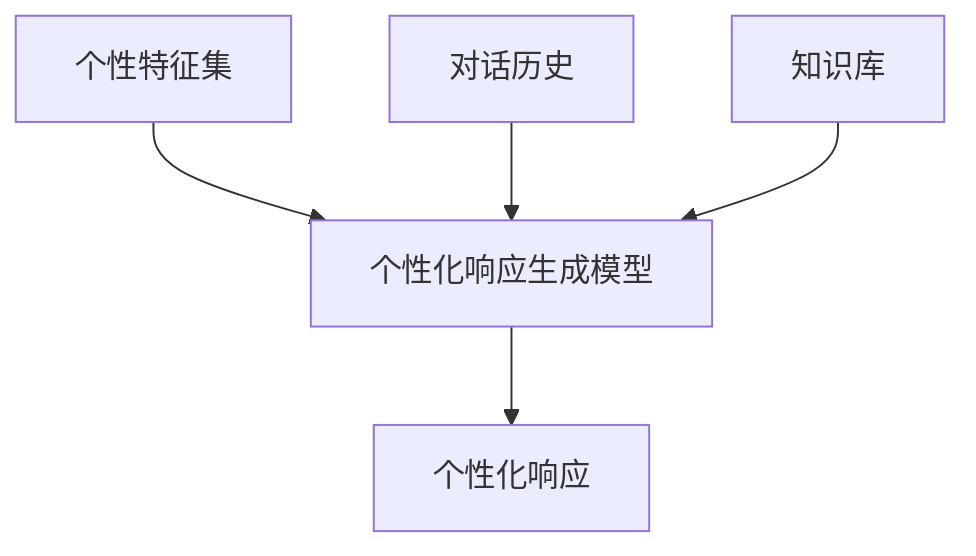
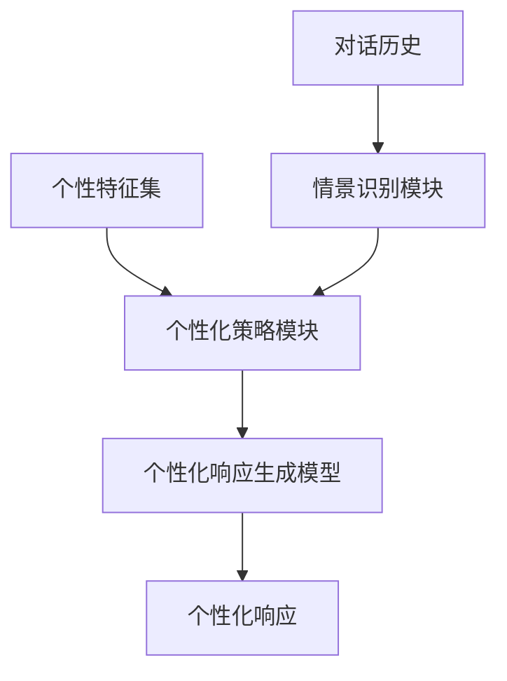
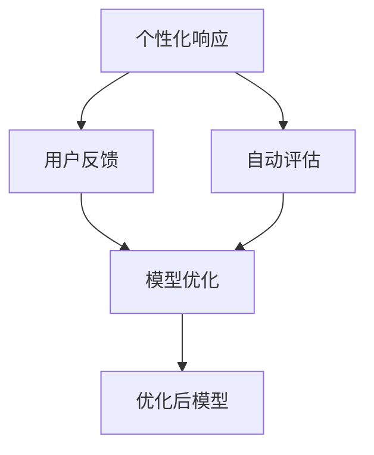

# 聊天机器人个性化:打造独特的虚拟助理形象

## 1. 背景介绍

### 1.1 人工智能助理的兴起

随着人工智能和自然语言处理技术的不断进步,智能虚拟助理正在渗透到我们生活的方方面面。从智能音箱到客户服务聊天机器人,从个人助理到企业协作助手,人工智能助理正在成为人类与数字世界交互的重要媒介。

### 1.2 个性化需求的增长

然而,当前大多数虚拟助理都采用了相对单一的个性设定,缺乏独特的个性特征。随着用户对人工智能助理的期望不断提高,个性化成为了一个迫切的需求。用户希望与之交互的虚拟助理能够展现出与众不同的个性魅力,提供更加人性化、有温度的服务体验。

### 1.3 个性化优势

个性化的虚拟助理不仅能够增强用户体验,还可以为品牌营销带来新的机遇。一个独特的虚拟助理个性可以成为品牌的代言人,传递企业文化和价值观,从而增强品牌认知度和美誉度。此外,个性化助理还能促进人机交互的自然性和亲和力,提高用户的参与度和忠诚度。

## 2. 核心概念与联系

### 2.1 个性化的定义

个性化是指赋予虚拟助理独特的个性特征,使其具有鲜明的个性魅力和行为模式。这些个性特征可以包括语言风格、情感表达、知识背景、兴趣爱好等多个方面。

### 2.2 个性化与人格模型

个性化与人格模型密切相关。人格模型是描述人类个性特征的理论框架,常见的有大五人格模型、MBTI模型等。通过构建虚拟助理的人格模型,可以赋予其一致的个性特征。



### 2.3 个性化与情景适应性

个性化虚拟助理还需要具备情景适应能力,根据不同的交互场景动态调整个性表现,提供更加自然、合理的响应。这需要将个性化与对话管理、任务完成等功能模块相结合。

### 2.4 个性化评估指标

评估个性化虚拟助理的效果需要一套科学的评估指标体系,常见的指标包括个性一致性、情景适应性、用户体验满意度等。

## 3. 核心算法原理具体操作步骤

实现个性化虚拟助理的核心算法原理包括以下几个关键步骤:

### 3.1 人格模型构建

首先需要基于心理学理论构建虚拟助理的人格模型,明确其个性特征。这可以通过专家知识或数据驱动的方式实现。



### 3.2 个性化响应生成

根据构建的人格模型,将个性特征融入到自然语言生成模型中,生成具有个性色彩的响应内容。这可以通过条件生成、风格迁移等技术实现。



### 3.3 情景适应策略

通过识别对话场景,动态调整个性化策略,使虚拟助理的响应更加自然、合理。这可以基于对话行为模式分析、上下文理解等技术实现。



### 3.4 个性化评估与优化

通过用户反馈和自动评估指标,对个性化虚拟助理的效果进行评估,并基于评估结果对模型和策略进行优化,形成闭环学习过程。



## 4. 数学模型和公式详细讲解举例说明

### 4.1 人格嵌入表示

为了将人格特征融入自然语言生成模型,需要将人格特征数学化表示为向量形式。常见的方法是通过预训练语言模型对人格语料进行编码,获取人格嵌入向量。

设人格语料为 $C = \{c_1, c_2, ..., c_n\}$,对应的人格标签为 $l_1, l_2, ..., l_n$。通过预训练语言模型 $M$ 对语料进行编码:

$$h_i = M(c_i)$$

其中 $h_i$ 为语句 $c_i$ 的隐层表示。然后将隐层表示与人格标签 $l_i$ 进行关联,得到人格嵌入向量 $e_i$:

$$e_i = f(h_i, l_i)$$

函数 $f$ 可以是简单的拼接或者基于注意力机制的融合函数。

### 4.2 个性化响应生成

基于获取的人格嵌入向量,可以将其融入到序列到序列(Seq2Seq)模型中,实现个性化响应生成。

设对话历史为 $X = \{x_1, x_2, ..., x_m\}$,目标响应为 $Y = \{y_1, y_2, ..., y_n\}$,人格嵌入向量为 $e$。Seq2Seq 模型的条件概率可以表示为:

$$P(Y|X, e) = \prod_{t=1}^{n}P(y_t|y_{<t}, X, e)$$

其中,解码器在生成每个词 $y_t$ 时,不仅考虑对话历史 $X$,还融入了人格嵌入 $e$,从而生成具有个性特征的响应。

### 4.3 个性一致性评估

为了评估生成响应的个性一致性,可以基于人格分类器对响应进行打分。

设人格分类器为 $C$,输入响应 $Y$,输出人格标签 $l$ 及其概率 $p$:

$$l, p = C(Y)$$

则个性一致性分数可以定义为:

$$\text{PersonaScore}(Y) = p(l|Y)$$

通过最大化该分数,可以提高生成响应的个性一致性。

### 4.4 反向知识蒸馏

为了进一步增强个性响应的质量,可以采用反向知识蒸馏(Reverse Knowledge Distillation)的方法。

具体来说,先使用人工标注的高质量个性响应语料 $D = \{(X_i, Y_i^*)\}$ 训练一个监督模型 $T$,作为"teacher"模型:

$$T^* = \arg\max_T \sum_{(X,Y^*)\in D}\log P_T(Y^*|X)$$

然后,将个性化生成模型 $S$ 对同一输入 $X$ 生成的响应 $Y'$ 与 $T$ 生成的 $Y^*$ 进行对比,最小化两者之间的损失:

$$L_\text{dist} = -\sum_{(X,Y^*)\in D}\log P_S(Y^*|X)$$

通过知识蒸馏,可以提高生成响应的质量和个性一致性。

## 5. 项目实践:代码实例和详细解释说明

为了更好地理解个性化虚拟助理的实现过程,我们将通过一个基于 Python 和 Hugging Face Transformers 库的代码示例来演示关键步骤。

### 5.1 导入必要库

```python
import torch
from transformers import AutoTokenizer, AutoModelForCausalLM, pipeline

# 加载预训练语言模型和tokenizer
tokenizer = AutoTokenizer.from_pretrained("microsoft/DialoGPT-small")
model = AutoModelForCausalLM.from_pretrained("microsoft/DialoGPT-small")

# 初始化文本生成pipeline
generator = pipeline('text-generation', model=model, tokenizer=tokenizer)
```

### 5.2 定义人格特征

为了简化示例,我们定义两种人格特征:"友好"和"专业"。

```python
persona_traits = ["friendly", "professional"]
```

### 5.3 构建人格提示

我们将人格特征作为提示,与对话历史一起输入到语言模型中,以影响生成的响应风格。

```python
def get_persona_prompt(persona, history):
    prompt = f"<persona>{persona}</persona> {history}"
    return prompt

# 示例输入
sample_history = "Hello, I have a question about machine learning."
friendly_prompt = get_persona_prompt(persona_traits[0], sample_history)
professional_prompt = get_persona_prompt(persona_traits[1], sample_history)
```

### 5.4 生成个性化响应

使用文本生成 pipeline,根据不同的人格提示生成响应。

```python
friendly_response = generator(friendly_prompt, max_length=100, do_sample=True)[0]['generated_text']
professional_response = generator(professional_prompt, max_length=100, do_sample=True)[0]['generated_text']

print("Friendly Response:", friendly_response)
print("Professional Response:", professional_response)
```

输出示例:

```
Friendly Response: <persona>friendly</persona> Hello, I have a question about machine learning. Hi there! I'd be happy to help you with your machine learning question. Machine learning is such an exciting field with so many applications. What would you like to know more about?

Professional Response: <persona>professional</persona> Hello, I have a question about machine learning. Certainly, I would be glad to assist you with your inquiry regarding machine learning. Could you please provide more details about the specific area or topic you need clarification on? Machine learning encompasses a broad range of algorithms and techniques, so having more context will enable me to provide a more accurate and relevant response.
```

可以看到,在相同的对话历史下,通过不同的人格提示,生成的响应风格有所不同,展现出不同的个性特征。

### 5.5 进一步优化

上述示例只是一个简单的起步,在实际应用中,还需要进行更多的优化和扩展,例如:

- 构建更加丰富的人格模型,包括多种人格特征及其组合
- 采用更加复杂的人格融合策略,如条件生成、注意力融合等
- 引入情景识别模块,实现个性响应的动态调整
- 设计人格一致性评估指标,并通过反向知识蒸馏优化模型
- 在特定领域和场景下进行定制化训练和调优

通过不断迭代和优化,我们可以打造出更加人性化、个性鲜明的虚拟助理。

## 6. 实际应用场景

个性化虚拟助理可以应用于多种场景,为用户带来更加友好、自然的交互体验。

### 6.1 智能音箱助手

智能音箱助手可以根据用户的喜好,展现出不同的个性魅力。例如,对于年轻用户,助手可以采用活泼幽默的语气;对于老年用户,则可以使用更加温和、有耐心的口吻。

### 6.2 客户服务聊天机器人

在客户服务领域,个性化的聊天机器人可以为不同类型的客户提供个性化的服务体验。例如,对于高价值客户,机器人可以使用更加亲和、专业的语气;对于一般客户,则可以采用更加简洁直接的风格。

### 6.3 教育智能助理

在教育领域,个性化的智能助理可以根据学生的年龄、知识水平等特征,调整教学方式和语言风格,提供更加有效的个性化学习体验。

### 6.4 健康医疗助理

医疗健康领域对人性化交互有着迫切需求。个性化的医疗助理可以根据患者的病情、心理状态等,采用更加贴心、同理心强的交互方式,缓解患者的焦虑情绪,提高治疗依从性。

### 6.5 企业协作助手

在企业内部,个性化的协作助手可以根据员工的职位、部门等特征,调整语言风格和服务方式,提高工作效率和协作体验。

## 7. 工具和资源推荐

在实现个性化虚拟助理的过程中,可以利