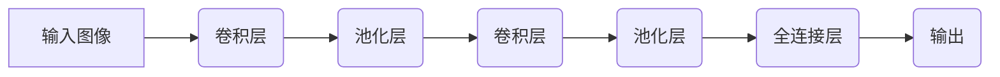
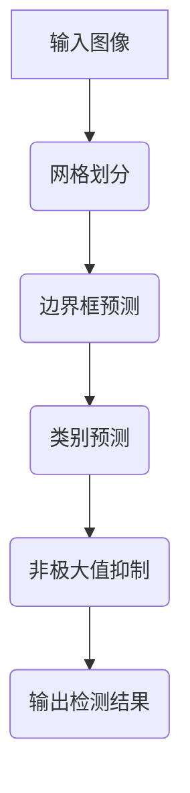

# 计算机视觉(CV)原理与代码实例讲解

## 1.背景介绍

计算机视觉(Computer Vision, CV)是人工智能领域的一个重要分支,旨在使计算机能够获取、处理、分析和理解数字图像或视频中所包含的有用信息。随着深度学习技术的不断发展,计算机视觉已经在各个领域取得了广泛的应用,如自动驾驶、人脸识别、医疗影像分析、无人机导航等。

计算机视觉系统通常包括图像采集、预处理、特征提取、模式识别和决策五个主要步骤。其中,特征提取和模式识别是计算机视觉的核心部分,直接影响着系统的性能和准确性。

## 2.核心概念与联系

### 2.1 图像处理

图像处理是计算机视觉的基础,包括图像去噪、增强、分割、变换等操作。常用的图像处理算法有高斯滤波、中值滤波、直方图均衡化、边缘检测等。

### 2.2 特征提取

特征提取是将图像转换为适合于后续任务的特征向量的过程。常用的特征提取方法有尺度不变特征变换(SIFT)、方向梯度直方图(HOG)、局部二值模式(LBP)等。近年来,基于深度学习的特征提取方法(如卷积神经网络)取得了巨大成功。

### 2.3 模式识别

模式识别是根据提取的特征对图像进行分类或回归的过程。常用的模式识别算法有支持向量机(SVM)、决策树、随机森林等。深度学习模型(如卷积神经网络、循环神经网络)也广泛应用于模式识别任务。

### 2.4 决策

决策是根据模式识别的结果,对图像所包含的信息做出判断和响应的过程。例如,在自动驾驶系统中,需要根据识别出的交通标志和行人信息做出相应的驾驶决策。

## 3.核心算法原理具体操作步骤

### 3.1 卷积神经网络(CNN)

卷积神经网络是计算机视觉领域应用最广泛的深度学习模型。它主要由卷积层、池化层和全连接层组成。

1. **卷积层**:通过滑动卷积核在输入图像上进行卷积操作,提取局部特征。
2. **池化层**:对卷积层的输出进行下采样,减小特征图的尺寸,提高模型的鲁棒性。
3. **全连接层**:将前面层的特征向量展平,并进行分类或回归任务。

CNN的训练过程采用反向传播算法,通过不断调整网络权重,使模型在训练集上的损失函数值最小化。



### 3.2 YOLO目标检测算法

YOLO(You Only Look Once)是一种端到端的目标检测算法,可以实时地对图像中的多个目标进行检测和定位。

1. **网格划分**:将输入图像划分为S×S个网格。
2. **边界框预测**:每个网格预测B个边界框及其置信度。
3. **类别预测**:每个边界框预测C个类别的概率。
4. **非极大值抑制**:去除重叠的冗余边界框。

YOLO算法的优点是速度快、端到端训练,缺点是对小目标的检测精度较低。



## 4.数学模型和公式详细讲解举例说明

### 4.1 卷积运算

卷积运算是CNN的核心操作,用于提取输入图像的局部特征。设输入图像为$I$,卷积核为$K$,卷积后的特征图为$O$,则卷积运算可表示为:

$$O(i,j) = \sum_{m}\sum_{n}I(i+m,j+n)K(m,n)$$

其中,$(i,j)$是输出特征图$O$的坐标,$(m,n)$是卷积核$K$的坐标。卷积运算通过在输入图像上滑动卷积核,计算输入图像与卷积核的点积,从而提取出局部特征。

### 4.2 池化运算

池化运算用于降低特征图的分辨率,减少计算量和防止过拟合。常用的池化方法有最大池化和平均池化。

设输入特征图为$I$,池化窗口大小为$k \times k$,步长为$s$,则最大池化运算可表示为:

$$O(i,j) = \max_{(m,n) \in R_{ij}}I(s \times i + m, s \times j + n)$$

其中,$R_{ij}$表示以$(i,j)$为中心,窗口大小为$k \times k$的区域。最大池化保留了该区域内的最大值,从而捕获了主要的特征信息。

### 4.3 交并比(IoU)

交并比(Intersection over Union, IoU)是目标检测算法中常用的评价指标,用于衡量预测边界框与真实边界框之间的重叠程度。

设预测边界框为$B_p$,真实边界框为$B_{gt}$,则IoU可表示为:

$$\text{IoU} = \frac{|B_p \cap B_{gt}|}{|B_p \cup B_{gt}|}$$

其中,$|\cdot|$表示区域的面积。IoU的取值范围为$[0,1]$,值越大表示预测边界框与真实边界框的重叠程度越高。

在目标检测任务中,通常将IoU大于某个阈值的预测边界框视为正确检测,从而评估算法的性能。

## 5.项目实践:代码实例和详细解释说明

以下是使用PyTorch实现MNIST手写数字识别的代码示例:

```python
import torch
import torch.nn as nn
import torchvision
import torchvision.transforms as transforms

# 定义卷积神经网络模型
class Net(nn.Module):
    def __init__(self):
        super(Net, self).__init__()
        self.conv1 = nn.Conv2d(1, 10, kernel_size=5)
        self.conv2 = nn.Conv2d(10, 20, kernel_size=5)
        self.pool = nn.MaxPool2d(2, 2)
        self.fc1 = nn.Linear(320, 50)
        self.fc2 = nn.Linear(50, 10)

    def forward(self, x):
        x = self.pool(nn.functional.relu(self.conv1(x)))
        x = self.pool(nn.functional.relu(self.conv2(x)))
        x = x.view(-1, 320)
        x = nn.functional.relu(self.fc1(x))
        x = self.fc2(x)
        return x

# 加载MNIST数据集
transform = transforms.Compose([transforms.ToTensor(), transforms.Normalize((0.5,), (0.5,))])
trainset = torchvision.datasets.MNIST(root='./data', train=True, download=True, transform=transform)
trainloader = torch.utils.data.DataLoader(trainset, batch_size=64, shuffle=True)

# 定义损失函数和优化器
net = Net()
criterion = nn.CrossEntropyLoss()
optimizer = torch.optim.SGD(net.parameters(), lr=0.001, momentum=0.9)

# 训练模型
for epoch in range(10):
    running_loss = 0.0
    for i, data in enumerate(trainloader, 0):
        inputs, labels = data
        optimizer.zero_grad()
        outputs = net(inputs)
        loss = criterion(outputs, labels)
        loss.backward()
        optimizer.step()
        running_loss += loss.item()
        if i % 200 == 199:
            print('[%d, %5d] loss: %.3f' % (epoch + 1, i + 1, running_loss / 200))
            running_loss = 0.0

print('Finished Training')
```

代码解释:

1. 定义卷积神经网络模型`Net`,包含两个卷积层、两个池化层和两个全连接层。
2. 加载MNIST手写数字数据集,并对数据进行标准化处理。
3. 定义交叉熵损失函数和随机梯度下降优化器。
4. 进行10轮迭代训练,每200个batch打印一次当前的损失值。
5. 训练完成后,可以使用`net.eval()`将模型设置为评估模式,并在测试集上进行预测和评估。

## 6.实际应用场景

计算机视觉技术在现实生活中有着广泛的应用,下面列举了一些典型场景:

1. **自动驾驶**:通过对路况、交通标志、行人等进行实时检测和识别,实现智能辅助驾驶和自动驾驶。
2. **人脸识别**:在安防监控、刷脸支付等场景下,对人脸进行准确识别和验证。
3. **医疗影像分析**:辅助医生诊断疾病,如CT/MRI图像分析、病理切片分类等。
4. **工业缺陷检测**:在生产线上自动检测产品的缺陷,提高质量控制效率。
5. **增强现实(AR)**:实时识别物体并叠加虚拟信息,为用户提供增强的现实体验。
6. **无人机导航**:通过对地形、障碍物的识别,实现无人机的自主导航和避障。

## 7.工具和资源推荐

计算机视觉是一个活跃的研究领域,有许多优秀的开源工具和资源可供使用:

1. **OpenCV**:一个跨平台的计算机视觉库,提供了丰富的图像处理和计算机视觉算法。
2. **PyTorch**和**TensorFlow**:两个流行的深度学习框架,广泛应用于计算机视觉任务。
3. **YOLO**和**Faster R-CNN**:两种经典的目标检测算法,开源实现代码可在GitHub上获取。
4. **ImageNet**和**COCO**:两个大型的图像数据集,可用于训练和评估计算机视觉模型。
5. **arXiv**:一个开放获取的预印本服务器,收录了大量计算机视觉领域的最新研究论文。
6. **计算机视觉课程**:像斯坦福大学的CS231n课程,提供了优质的教学资源和作业项目。

## 8.总结:未来发展趋势与挑战

计算机视觉是一个蓬勃发展的领域,未来将会有更多令人兴奋的进展和突破。以下是一些值得关注的发展趋势和挑战:

1. **少样本学习**:如何在有限的训练数据下,训练出高性能的计算机视觉模型,是一个重要的研究方向。
2. **多模态融合**:将视觉信息与其他模态(如语音、文本)相结合,实现更智能的人机交互系统。
3. **可解释性**:提高深度学习模型的可解释性,使其决策过程更加透明和可信。
4. **边缘计算**:在边缘设备(如手机、无人机)上部署计算机视觉模型,实现实时、高效的计算。
5. **隐私保护**:在保护个人隐私的同时,利用计算机视觉技术提供有价值的服务,是一个需要解决的重要问题。

总的来说,计算机视觉技术正在推动人工智能的发展,为我们的生活带来越来越多的智能化应用。期待未来会有更多令人兴奋的突破和进展。

## 9.附录:常见问题与解答

1. **什么是计算机视觉?**
   计算机视觉是人工智能的一个分支,旨在使计算机能够获取、处理、分析和理解数字图像或视频中所包含的有用信息。

2. **计算机视觉的主要任务有哪些?**
   计算机视觉的主要任务包括图像分类、目标检测、语义分割、实例分割、视频跟踪等。

3. **什么是卷积神经网络(CNN)?**
   卷积神经网络是计算机视觉领域应用最广泛的深度学习模型,主要由卷积层、池化层和全连接层组成。它能够自动学习图像的特征表示,并用于各种视觉任务。

4. **什么是目标检测?**
   目标检测是计算机视觉的一个重要任务,旨在定位图像中感兴趣的目标,并给出每个目标的边界框和类别标签。常用的目标检测算法包括YOLO、Faster R-CNN