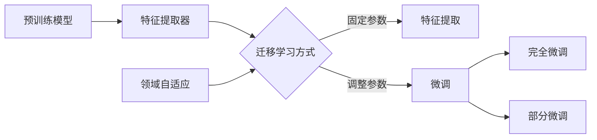

# 迁移学习的模型选择：如何选择合适的预训练模型

## 1. 背景介绍

### 1.1 什么是迁移学习
迁移学习是一种机器学习技术，它利用已经训练好的模型作为起点，将知识从源任务迁移到目标任务，从而显著减少训练时间和所需的标注数据量。迁移学习在计算机视觉、自然语言处理等领域取得了巨大成功。

### 1.2 为什么需要迁移学习
- 节省计算资源：从头开始训练大型深度学习模型需要大量的计算资源和时间。迁移学习可以利用预训练模型，大大减少训练时间和计算资源消耗。
- 缓解数据稀缺：很多任务缺乏足够的标注数据来训练模型。迁移学习可以利用在大规模数据集上预训练的模型，缓解目标任务的数据稀缺问题。
- 提高模型性能：使用高质量的预训练模型作为基础，可以显著提高目标任务的模型性能，尤其是在小数据集上。

### 1.3 迁移学习的应用场景
迁移学习广泛应用于计算机视觉、自然语言处理等领域，例如：
- 图像分类：使用在ImageNet上预训练的模型进行迁移学习，可以快速构建高精度的图像分类器。
- 目标检测：利用在COCO数据集上预训练的模型进行迁移学习，可以显著提高目标检测任务的性能。
- 语义分割：使用在Cityscapes等数据集上预训练的模型，可以加速语义分割模型的训练并提高精度。
- 文本分类：利用在大规模语料库上预训练的BERT等模型，可以显著提升文本分类任务的性能。

## 2. 核心概念与联系

### 2.1 预训练模型(Pre-trained Model)
预训练模型是指在大规模数据集上训练好的模型，通常具有强大的特征提取能力。常见的预训练模型包括：
- 计算机视觉：VGG、ResNet、Inception等
- 自然语言处理：BERT、GPT、ELMo等

### 2.2 特征提取器(Feature Extractor)
特征提取器是指预训练模型中用于提取输入数据特征的部分，通常是卷积神经网络(CNN)或transformer的前几层。特征提取器可以将原始输入转换为高级语义特征。

### 2.3 微调(Fine-tuning)
微调是指在预训练模型的基础上，针对目标任务进行进一步训练，调整模型参数以适应新任务。微调可以分为两类：
- 完全微调(Full Fine-tuning)：调整预训练模型的所有参数
- 部分微调(Partial Fine-tuning)：只调整预训练模型的部分参数，如最后几层

### 2.4 特征提取(Feature Extraction)
特征提取是指利用预训练模型的特征提取器提取输入数据的特征，然后将特征输入到新的任务专用层中进行训练。此时预训练模型的参数保持不变。

### 2.5 领域自适应(Domain Adaptation)
领域自适应是指源领域和目标领域的数据分布不同，需要使用特殊技术来缩小两个领域之间的差异。常见的领域自适应技术包括对抗训练、样本权重调整等。

### 核心概念之间的联系


## 3. 核心算法原理与具体操作步骤

### 3.1 特征提取算法原理
1. 选择合适的预训练模型作为特征提取器
2. 移除预训练模型的最后一层(通常是分类层)
3. 将目标任务的数据输入到特征提取器，得到特征向量
4. 将特征向量输入到新的任务专用层(如全连接层)进行训练
5. 在训练过程中，特征提取器的参数保持不变，只更新任务专用层的参数

### 3.2 微调算法原理
1. 选择合适的预训练模型
2. 根据任务需求，选择完全微调或部分微调
   - 完全微调：调整预训练模型的所有参数
   - 部分微调：只调整预训练模型的部分参数，如最后几层
3. 将目标任务的数据输入到微调后的模型进行训练
4. 在训练过程中，根据设定调整预训练模型的部分或全部参数

### 3.3 具体操作步骤(以PyTorch为例)

#### 3.3.1 特征提取
```python
# 加载预训练模型
model = torchvision.models.resnet50(pretrained=True)

# 移除最后一层
num_features = model.fc.in_features
model.fc = nn.Identity()

# 提取特征
features = model(input_data)

# 新的任务专用层
classifier = nn.Linear(num_features, num_classes)

# 训练任务专用层
optimizer = optim.SGD(classifier.parameters(), lr=0.001, momentum=0.9)
```

#### 3.3.2 微调
```python
# 加载预训练模型
model = torchvision.models.resnet50(pretrained=True)

# 部分微调：只调整最后两层的参数
for param in model.parameters():
    param.requires_grad = False
num_features = model.fc.in_features
model.fc = nn.Linear(num_features, num_classes)

# 完全微调：调整所有参数
for param in model.parameters():
    param.requires_grad = True

# 训练微调后的模型
optimizer = optim.SGD(model.parameters(), lr=0.001, momentum=0.9)
```

## 4. 数学模型和公式详细讲解举例说明

### 4.1 特征提取的数学模型
假设预训练模型的特征提取器为 $f(x; \theta)$，其中 $x$ 为输入数据，$\theta$ 为特征提取器的参数。特征提取可以表示为：

$$
\mathbf{z} = f(x; \theta)
$$

其中 $\mathbf{z}$ 为提取的特征向量。将特征向量输入到任务专用层 $g(z; \phi)$ 进行训练，损失函数为：

$$
\mathcal{L}(\phi) = \frac{1}{N}\sum_{i=1}^N \ell(g(f(x_i; \theta); \phi), y_i)
$$

其中 $\ell(\cdot)$ 为损失函数，$y_i$ 为第 $i$ 个样本的标签，$N$ 为样本数量。在训练过程中，只更新任务专用层的参数 $\phi$，特征提取器的参数 $\theta$ 保持不变。

### 4.2 微调的数学模型
假设预训练模型为 $h(x; \theta, \phi)$，其中 $\theta$ 为特征提取器的参数，$\phi$ 为任务专用层的参数。微调的损失函数为：

$$
\mathcal{L}(\theta, \phi) = \frac{1}{N}\sum_{i=1}^N \ell(h(x_i; \theta, \phi), y_i)
$$

- 完全微调时，更新所有参数 $\theta$ 和 $\phi$。
- 部分微调时，只更新部分参数，如任务专用层的参数 $\phi$。

### 4.3 举例说明
以图像分类任务为例，假设我们使用预训练的ResNet-50模型进行迁移学习。

#### 特征提取
1. 加载预训练的ResNet-50模型，移除最后一层全连接层。
2. 将目标任务的图像输入到ResNet-50的特征提取器，得到2048维的特征向量。
3. 将特征向量输入到新的全连接层(任务专用层)，设置适当的输出维度(类别数)。
4. 训练任务专用层，使用交叉熵损失函数和SGD优化器，特征提取器的参数保持不变。

#### 微调
1. 加载预训练的ResNet-50模型。
2. 根据任务需求，选择完全微调或部分微调：
   - 完全微调：调整ResNet-50的所有参数。
   - 部分微调：只调整ResNet-50的最后几层参数，如最后两个残差块和全连接层。
3. 将目标任务的图像输入到微调后的ResNet-50模型，得到预测结果。
4. 使用交叉熵损失函数和SGD优化器训练微调后的模型，根据设定更新部分或全部参数。

## 5. 项目实践：代码实例和详细解释说明

下面以PyTorch为例，展示如何使用预训练的ResNet-50模型进行图像分类任务的迁移学习。

### 5.1 特征提取
```python
import torch
import torchvision.models as models
from torch import nn

# 加载预训练的ResNet-50模型
resnet = models.resnet50(pretrained=True)

# 移除最后一层全连接层
num_features = resnet.fc.in_features
resnet.fc = nn.Identity()

# 新的任务专用层
num_classes = 10
classifier = nn.Linear(num_features, num_classes)

# 定义损失函数和优化器
criterion = nn.CrossEntropyLoss()
optimizer = torch.optim.SGD(classifier.parameters(), lr=0.001, momentum=0.9)

# 训练任务专用层
for epoch in range(num_epochs):
    for images, labels in train_loader:
        features = resnet(images)
        outputs = classifier(features)
        loss = criterion(outputs, labels)

        optimizer.zero_grad()
        loss.backward()
        optimizer.step()
```

在特征提取中，我们首先加载预训练的ResNet-50模型，并移除最后一层全连接层。然后，我们定义一个新的任务专用层(全连接层)，将其连接到ResNet-50的特征提取器输出。在训练过程中，我们只更新任务专用层的参数，而ResNet-50的特征提取器参数保持不变。这样，我们可以利用预训练模型的特征提取能力，同时针对目标任务训练新的分类器。

### 5.2 微调
```python
import torch
import torchvision.models as models
from torch import nn

# 加载预训练的ResNet-50模型
resnet = models.resnet50(pretrained=True)

# 部分微调：只调整最后两层的参数
for param in resnet.parameters():
    param.requires_grad = False
num_features = resnet.fc.in_features
resnet.fc = nn.Linear(num_features, num_classes)

# 定义损失函数和优化器
criterion = nn.CrossEntropyLoss()
optimizer = torch.optim.SGD(resnet.parameters(), lr=0.001, momentum=0.9)

# 训练微调后的模型
for epoch in range(num_epochs):
    for images, labels in train_loader:
        outputs = resnet(images)
        loss = criterion(outputs, labels)

        optimizer.zero_grad()
        loss.backward()
        optimizer.step()
```

在微调中，我们同样加载预训练的ResNet-50模型。根据任务需求，我们可以选择完全微调或部分微调。在部分微调的示例中，我们只调整ResNet-50最后两层(全连接层)的参数，而其他层的参数保持不变。这样，我们可以在预训练模型的基础上，针对目标任务进行微调，以提高模型的性能。

## 6. 实际应用场景

迁移学习在计算机视觉和自然语言处理领域有广泛的应用，下面列举几个典型的应用场景：

### 6.1 图像分类
- 医学影像分类：使用在ImageNet上预训练的模型，如ResNet、Inception等，进行医学影像(如X射线、CT、MRI)的分类，以辅助医生进行疾病诊断。
- 细粒度图像分类：利用预训练模型进行细粒度图像分类，如鸟类、花卉、车辆等细分类别的识别。

### 6.2 目标检测
- 自动驾驶中的目标检测：使用在COCO数据集上预训练的模型，如Faster R-CNN、YOLO等，进行行人、车辆、交通标志等目标的检测，以实现自动驾驶中的环境感知。
- 安防领域的目标检测：利用预训练模型进行人脸检测、行人检测、异常行为检测等，以提高安防系统的智能化水平。

### 6.3 语义分割
- 遥感影像语义分割：使用在Cityscapes、VOC等数据集上预训练的模型，如FCN、DeepLab等，进行遥感影像的语义分割，以实现土地利用分类、变化检测等应用。
- 医学影