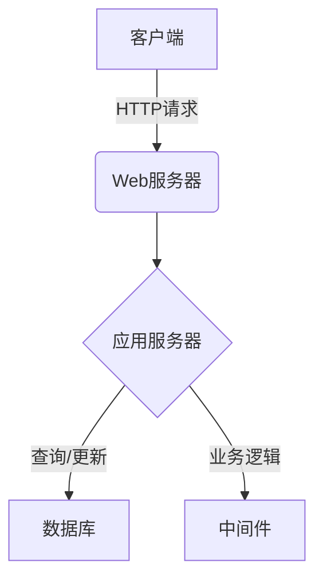
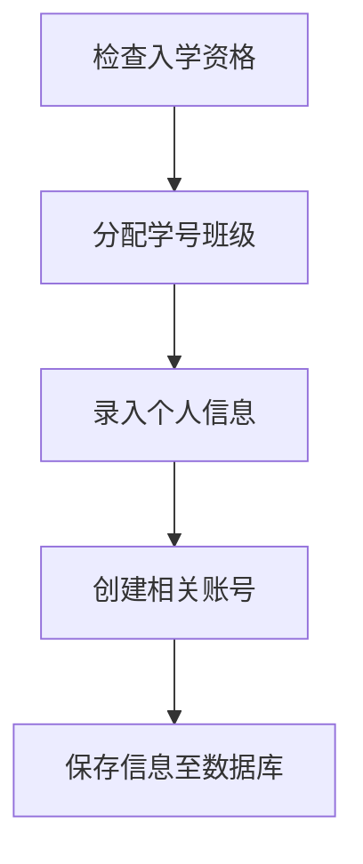
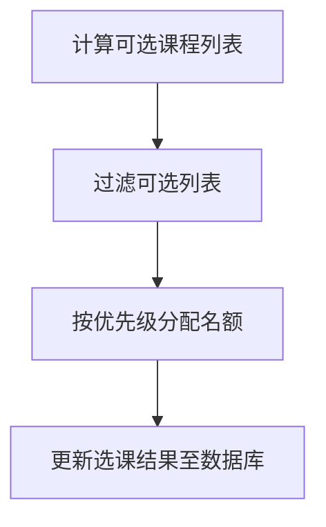
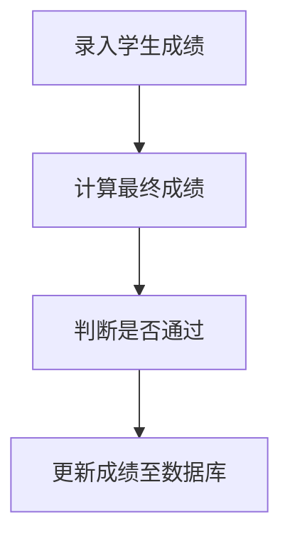
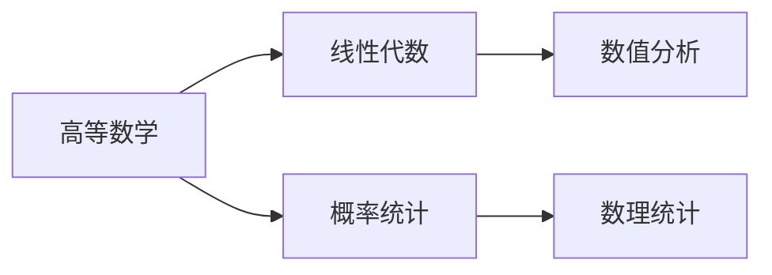

# 高校学籍管理系统详细设计与具体代码实现

## 1.背景介绍

随着高等教育的快速发展,学生人数不断增加,传统的纸质档案管理方式已经无法满足现代高校的需求。因此,构建一个高效、安全、可靠的学籍管理系统势在必行。学籍管理系统是高校管理工作的核心,涉及学生的入学、注册、选课、成绩管理、毕业等各个环节,直接关系到学校的教学质量和管理水平。

## 2.核心概念与联系

### 2.1 学籍信息

学籍信息是指学生在校期间的基本信息,包括姓名、学号、身份证号、入学年份、专业、班级等,是学生教育管理的基础数据。

### 2.2 教务管理

教务管理是指对学生的选课、成绩、考勤等教学活动的管理,是学籍管理系统的核心功能之一。

### 2.3 学生管理

学生管理包括学生的入学注册、休学复学、转专业、奖惩等各种状态的变更和记录,是对学生在校期间各种行为的管控。

### 2.4 系统架构

学籍管理系统通常采用B/S或C/S架构,前端使用Web界面,后端使用关系数据库存储数据,中间件实现业务逻辑。



## 3.核心算法原理具体操作步骤

### 3.1 学生入学注册流程

1. 检查学生入学资格,包括高考成绩、报名资格等;
2. 为符合条件的学生分配学号、班级等基本信息;
3. 录入学生个人信息,包括姓名、身份证号、联系方式等;
4. 为学生创建教务、财务等相关账号;
5. 将学生信息保存至数据库,标记为"在校生"状态。



### 3.2 学生选课算法

1. 根据学生的年级、专业、培养方案,计算可选课程列表;
2. 根据课程的先修关系、课程容量等限制条件,过滤可选列表;
3. 根据学生的优先级(绩点等)和选课时间,公平分配课程名额;
4. 将选课结果更新至数据库,标记为"已选课"状态。



### 3.3 成绩管理算法

1. 教师录入学生的平时成绩、期末考试成绩等分数项;
2. 根据课程的评分体系,计算每个学生的最终成绩;
3. 根据最终成绩,判断学生是否通过该课程;
4. 将成绩数据更新至数据库,作为学生学业档案的一部分。



## 4.数学模型和公式详细讲解举例说明

### 4.1 学生绩点计算

学生的绩点(GPA)是衡量学生学习质量的重要指标,用于评定学生的学习状况、确定学生的专业排名等,计算公式如下:

$$GPA = \frac{\sum_{i=1}^{n}(G_i \times C_i)}{\sum_{i=1}^{n}C_i}$$

其中:
- $n$ 为学生总共修读的课程门数;
- $G_i$ 为第 $i$ 门课程的绩点,一般为0-4之间的数值,4表示优秀;
- $C_i$ 为第 $i$ 门课程的学分权重。

例如,一个学生修读了5门课程,课程成绩和学分权重如下:

| 课程 | 成绩 | 绩点(4分制) | 学分权重 |
| --- | --- | --- | --- |
| 高等数学 | 92 | 4.0 | 4 |
| 大学物理 | 85 | 3.7 | 4 |
| 计算机导论 | 78 | 3.1 | 3 |
| 大学英语 | 68 | 2.2 | 4 |
| 思想道德修养 | 75 | 2.8 | 2 |

则该生的绩点计算过程为:

$$GPA = \frac{4.0\times4 + 3.7\times4 + 3.1\times3 + 2.2\times4 + 2.8\times2}{4+4+3+4+2} = \frac{48.8}{17} \approx 2.87$$

### 4.2 课程先修关系检查

某些课程有先修课程的要求,即学生必须先修读prerequisite课程,才能选修当前课程。可以使用有向图模型来表示课程之间的先修关系,检查算法如下:

1. 构建一个有向图 $G(V,E)$,每个节点 $v \in V$ 表示一门课程;
2. 对任意两门课程 $u,v \in V$,如果 $v$ 有先修课 $u$ 的要求,则在图中添加一条有向边 $(u,v) \in E$;
3. 对于待选的课程 $v$,检查是否存在一条有向路径,从图中的任意一个没修读的节点 $u$ 可以达到 $v$;
4. 如果存在这样的路径,则课程 $v$ 不可选,因为没修读先修课 $u$。

例如,有以下课程先修关系:

- 高等数学 -> 线性代数
- 高等数学 -> 概率统计
- 线性代数 -> 数值分析
- 概率统计 -> 数理统计

则对应的有向图为:



如果一个学生已修读了高等数学,想选修数值分析课程,由于存在路径"高等数学 -> 线性代数 -> 数值分析",因此可以选修。但如果想选修数理统计,则不可以,因为没修读概率统计这一先修课程。

## 5.项目实践：代码实例和详细解释说明

以下是一个使用Python语言和Flask框架实现的简单学籍管理系统的代码示例,包括学生、课程、选课等基本功能。

### 5.1 模型定义

```python
from flask_sqlalchemy import SQLAlchemy

db = SQLAlchemy()

# 学生模型
class Student(db.Model):
    id = db.Column(db.Integer, primary_key=True)
    name = db.Column(db.String(50), nullable=False)
    student_id = db.Column(db.String(20), unique=True, nullable=False)
    enrollments = db.relationship('Enrollment', backref='student')

# 课程模型
class Course(db.Model):
    id = db.Column(db.Integer, primary_key=True)
    name = db.Column(db.String(100), nullable=False)
    code = db.Column(db.String(20), unique=True, nullable=False)
    enrollments = db.relationship('Enrollment', backref='course')

# 选课模型
class Enrollment(db.Model):
    id = db.Column(db.Integer, primary_key=True)
    student_id = db.Column(db.Integer, db.ForeignKey('student.id'), nullable=False)
    course_id = db.Column(db.Integer, db.ForeignKey('course.id'), nullable=False)
    grade = db.Column(db.Float)
```

### 5.2 视图函数

```python
from flask import Flask, render_template, request, redirect, url_for
from models import db, Student, Course, Enrollment

app = Flask(__name__)
app.config['SQLALCHEMY_DATABASE_URI'] = 'sqlite:///students.db'
db.init_app(app)

# 学生列表
@app.route('/')
def index():
    students = Student.query.all()
    return render_template('index.html', students=students)

# 添加学生
@app.route('/students/add', methods=['GET', 'POST'])
def add_student():
    if request.method == 'POST':
        name = request.form['name']
        student_id = request.form['student_id']
        student = Student(name=name, student_id=student_id)
        db.session.add(student)
        db.session.commit()
        return redirect(url_for('index'))
    return render_template('add_student.html')

# 选课
@app.route('/enroll', methods=['GET', 'POST'])
def enroll():
    if request.method == 'POST':
        student_id = request.form['student_id']
        course_id = request.form['course_id']
        student = Student.query.filter_by(student_id=student_id).first()
        course = Course.query.filter_by(id=course_id).first()
        if student and course:
            enrollment = Enrollment(student=student, course=course)
            db.session.add(enrollment)
            db.session.commit()
    students = Student.query.all()
    courses = Course.query.all()
    return render_template('enroll.html', students=students, courses=courses)
```

### 5.3 模板文件

`templates/index.html`:

```html
<!-- 学生列表 -->

<p>{{ student.name }} ({{ student.student_id }})</p>

<a href="{{ url_for('add_student') }}">添加学生</a>
<a href="{{ url_for('enroll') }}">选课</a>
```

`templates/add_student.html`:

```html
<!-- 添加学生表单 -->
<form method="post">
    <label>姓名:</label>
    <input type="text" name="name" required>
    <label>学号:</label>
    <input type="text" name="student_id" required>
    <button type="submit">添加</button>
</form>
```

`templates/enroll.html`:

```html
<!-- 选课表单 -->
<form method="post">
    <label>学生:</label>
    <select name="student_id">
        
        <option value="{{ student.id }}">{{ student.name }} ({{ student.student_id }})</option>
        
    </select>
    <label>课程:</label>
    <select name="course_id">
        
        <option value="{{ course.id }}">{{ course.name }} ({{ course.code }})</option>
        
    </select>
    <button type="submit">选课</button>
</form>
```

以上代码实现了基本的学生管理、课程管理和选课功能,使用Flask框架和SQLAlchemy ORM进行数据库操作。在实际项目中,还需要添加更多的功能和安全性考虑,如用户认证、输入验证、事务处理等。

## 6.实际应用场景

学籍管理系统在高校的教务管理工作中发挥着重要作用,具体应用场景包括但不限于:

1. **学生入学注册**: 新生入学时,学校将其基本信息录入系统,分配学号、班级等,为后续的教学管理奠定基础。

2. **选课管理**: 每学期开学时,学生可通过选课系统选择自己的课程,系统根据选课规则合理分配课程资源。

3. **成绩管理**: 教师可以在系统中录入学生的各项成绩,并根据评分体系自动计算最终成绩,为后续的学分绩点统计提供数据支持。

4. **学籍变更**: 对于学生的休学、复学、转专业、退学等学籍变更情况,管理员可在系统中进行相应的状态更新和记录。

5. **毕业审核**: 在学生修完规定学分准备毕业时,系统可以自动审核其是否满足毕业要求,为学位证书的发放提供依据。

6. **教学质量分析**: 通过对系统中的历史数据进行分析,可以了解不同年级、专业的学习情况,为教学质量的持续改进提供决策支持。

7. **学生服务**: 学生可以通过系统查询自己的课表、成绩、选课情况等,校方也可以向学生发布通知、公告等信息。

8. **数据存档**: 系统为学生的整个在校期间建立了完整的学习档案,方便查阅和长期保存,为未来的统计、评估工作提供依据。

总之,高校学籍管理系统贯穿了学生在校期间的各个教育教学环节,是学校精细化管理的重要工具,对提高教学质量和管理水平具有重要意义。

## 7.工具和资源推荐

在学籍管理系统的开发过程中,可以使用以下工具和资源:

1.