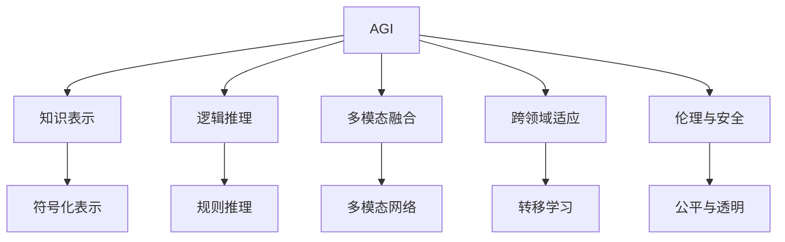

                 

# AGI与量子引力的未来

## 1. 背景介绍

### 1.1 问题由来

当前，人工智能（AI）正处于前所未有的发展时期。深度学习、计算机视觉、自然语言处理等技术日新月异，AI在多个领域实现了突破。然而，AI的发展仍然面临诸多挑战。尤其是在通用人工智能（AGI）的构建上，许多核心问题尚未解决。

量子力学作为描述物质运动的基本理论，其独特性在于提供了全新的计算方式和思维工具。将量子力学应用于AI领域，有望解决当前AI中的一些难题，甚至催生新的技术突破。

本文旨在探讨AGI与量子引力的结合，并展望其未来发展。我们将从AGI的核心概念出发，探讨其应用前景和面临的挑战，并分析量子引力在其中的潜在价值。

### 1.2 问题核心关键点

AGI的构建涉及到多个核心问题：

- **知识表示**：如何将人类知识、常识、规则等有效地表示为机器可以理解和处理的形式。
- **逻辑推理**：如何构建机器具备逻辑推理能力的模型，使其能够进行复杂的推理和决策。
- **多模态融合**：如何将视觉、听觉、语言等多模态数据进行融合，以提升AI的理解和处理能力。
- **跨领域适应**：如何让AI具备跨领域的能力，适应不同的应用场景和问题。
- **伦理与安全**：如何确保AI系统符合伦理要求，保障其安全性，避免恶意用途。

量子引力作为描述物质和能量之间相互作用的基本理论，其独特的物理规律和数学框架，为AI带来了新的思维工具和方法。

## 2. 核心概念与联系

### 2.1 核心概念概述

AGI，即通用人工智能，是指能够执行任意智能任务的人工智能系统。它不仅仅具备特定任务的能力，而是能够理解和解决各种复杂问题，具备人类智慧水平。

量子引力理论是描述物质和能量之间相互作用的理论，它揭示了物质在微观世界的行为和规律。将量子引力应用于AI，可能会带来计算速度、计算能力和逻辑推理能力的突破。

### 2.2 核心概念原理和架构的 Mermaid 流程图



这个流程图展示了AGI的各个核心概念及其之间的联系：

1. **知识表示**：将人类知识、常识、规则等转化为符号化表示，为AGI提供基础。
2. **逻辑推理**：使用规则推理或符号逻辑，进行复杂的推理和决策。
3. **多模态融合**：通过多模态网络，将视觉、听觉、语言等多模态数据进行融合。
4. **跨领域适应**：通过迁移学习等技术，实现AGI在不同领域间的适应。
5. **伦理与安全**：确保AGI符合伦理要求，保障其安全性。

## 3. 核心算法原理 & 具体操作步骤

### 3.1 算法原理概述

AGI的构建涉及到多个核心算法和原理。以下是其中几个重要的算法：

- **符号化知识表示**：将人类知识转化为符号化表示，如命题逻辑、谓词逻辑等，为AGI提供基础。
- **规则推理**：使用推理规则和推理引擎，进行复杂的逻辑推理和决策。
- **多模态融合**：使用多模态神经网络，将视觉、听觉、语言等多模态数据进行融合，提升AGI的理解和处理能力。
- **迁移学习**：通过在多个任务上预训练和微调，实现AGI在不同领域间的适应。
- **公平与透明**：通过公平性约束和透明性机制，确保AGI符合伦理要求。

### 3.2 算法步骤详解

#### 3.2.1 符号化知识表示

符号化知识表示是将人类知识转化为符号化表示，为AGI提供基础。以下是符号化知识表示的步骤：

1. **构建知识库**：收集和整理人类知识、常识、规则等，构建知识库。
2. **符号化表示**：将知识库中的内容转化为符号化表示，如命题逻辑、谓词逻辑等。
3. **知识推理**：使用推理规则和推理引擎，进行逻辑推理和决策。

#### 3.2.2 规则推理

规则推理是指使用推理规则和推理引擎，进行复杂的逻辑推理和决策。以下是规则推理的步骤：

1. **定义推理规则**：定义推理规则，如蕴含、析取、等价等。
2. **构建推理引擎**：使用推理引擎，如Prolog、Datalog等，进行逻辑推理。
3. **推理决策**：根据推理规则和推理引擎，进行复杂的推理和决策。

#### 3.2.3 多模态融合

多模态融合是指通过多模态神经网络，将视觉、听觉、语言等多模态数据进行融合，提升AGI的理解和处理能力。以下是多模态融合的步骤：

1. **数据采集**：采集视觉、听觉、语言等多模态数据。
2. **特征提取**：使用多模态神经网络，提取不同模态数据的特征。
3. **数据融合**：将不同模态数据的特征进行融合，提升AGI的理解和处理能力。

#### 3.2.4 迁移学习

迁移学习是指通过在多个任务上预训练和微调，实现AGI在不同领域间的适应。以下是迁移学习的步骤：

1. **预训练**：在多个任务上预训练AGI模型。
2. **微调**：在新任务上微调AGI模型，进行适应。
3. **评估**：评估AGI模型在新任务上的性能，进行优化。

#### 3.2.5 公平与透明

公平与透明是指通过公平性约束和透明性机制，确保AGI符合伦理要求。以下是公平与透明的步骤：

1. **公平性约束**：定义公平性约束，如不歧视、不偏袒等。
2. **透明性机制**：使用透明性机制，如可解释性、可视化等，确保AGI的决策过程可解释。
3. **伦理审查**：进行伦理审查，确保AGI符合伦理要求。

### 3.3 算法优缺点

AGI的构建涉及到多个核心算法和原理。以下是其中几个重要的算法的优缺点：

#### 3.3.1 符号化知识表示

- **优点**：符号化知识表示可以提供清晰、明确的知识表示方式，便于推理和决策。
- **缺点**：符号化知识表示过于复杂，难以处理复杂的多层逻辑推理问题。

#### 3.3.2 规则推理

- **优点**：规则推理可以提供清晰、明确的推理方式，便于推理和决策。
- **缺点**：规则推理过于依赖规则，难以处理复杂的非线性关系和不确定性问题。

#### 3.3.3 多模态融合

- **优点**：多模态融合可以提升AGI的理解和处理能力，处理多种模态数据。
- **缺点**：多模态融合需要大量的计算资源，难以处理大规模数据。

#### 3.3.4 迁移学习

- **优点**：迁移学习可以提升AGI在不同领域间的适应能力，处理多种任务。
- **缺点**：迁移学习需要大量的数据和计算资源，难以处理小样本问题。

#### 3.3.5 公平与透明

- **优点**：公平与透明可以确保AGI符合伦理要求，保障其安全性。
- **缺点**：公平与透明需要复杂的机制和约束，难以实现完美的公平性和透明性。

### 3.4 算法应用领域

AGI的构建涉及到多个领域，以下是其中几个重要的应用领域：

- **自动驾驶**：使用AGI构建自动驾驶系统，进行复杂的道路分析和决策。
- **医疗诊断**：使用AGI构建医疗诊断系统，进行复杂的病历分析和决策。
- **金融分析**：使用AGI构建金融分析系统，进行复杂的市场分析和决策。
- **智能客服**：使用AGI构建智能客服系统，进行复杂的自然语言理解和对话。
- **教育系统**：使用AGI构建教育系统，进行复杂的课程规划和评估。

## 4. 数学模型和公式 & 详细讲解 & 举例说明

### 4.1 数学模型构建

AGI的构建涉及到多个数学模型，以下是其中几个重要的模型：

- **命题逻辑**：用符号表示命题和命题之间的关系，如蕴含、析取、等价等。
- **谓词逻辑**：用符号表示谓词和个体之间的关系，如存在、全称等。
- **多模态神经网络**：使用神经网络，将不同模态的数据进行融合。

#### 4.1.1 命题逻辑

命题逻辑是使用符号表示命题和命题之间的关系，如蕴含、析取、等价等。以下是命题逻辑的数学模型：

$$
A \lor B \rightarrow C
$$

这个公式表示，如果A或B为真，则C为真。

#### 4.1.2 谓词逻辑

谓词逻辑是使用符号表示谓词和个体之间的关系，如存在、全称等。以下是谓词逻辑的数学模型：

$$
\forall x (\exists y R(x, y)) \rightarrow \exists x (\forall y R(x, y))
$$

这个公式表示，对于任意x，如果存在y使得R(x, y)为真，则存在x使得对于任意y，R(x, y)为真。

#### 4.1.3 多模态神经网络

多模态神经网络是使用神经网络，将不同模态的数据进行融合。以下是多模态神经网络的数学模型：

$$
H = f(W_1 [I, L, V] + b_1)
$$

这个公式表示，将图像特征I、语言特征L和视觉特征V进行融合，得到特征H，其中f为激活函数，W_1为融合权重矩阵，b_1为偏置项。

### 4.2 公式推导过程

#### 4.2.1 命题逻辑

以下是命题逻辑的公式推导过程：

$$
(A \lor B) \rightarrow C \rightarrow (\neg A \land \neg B) \rightarrow \neg C
$$

这个公式表示，如果A或B为真，则C为真，反之亦然。

#### 4.2.2 谓词逻辑

以下是谓词逻辑的公式推导过程：

$$
\forall x (\exists y R(x, y)) \rightarrow \exists x (\forall y R(x, y))
$$

这个公式表示，对于任意x，如果存在y使得R(x, y)为真，则存在x使得对于任意y，R(x, y)为真。

#### 4.2.3 多模态神经网络

以下是多模态神经网络的公式推导过程：

$$
H = f(W_1 [I, L, V] + b_1) \rightarrow [I, L, V] \rightarrow W_1 H + b_1
$$

这个公式表示，将图像特征I、语言特征L和视觉特征V进行融合，得到特征H，其中W_1为融合权重矩阵，b_1为偏置项。

### 4.3 案例分析与讲解

#### 4.3.1 自动驾驶

以下是自动驾驶的案例分析与讲解：

1. **符号化知识表示**：使用规则和事实库表示交通规则和驾驶经验。
2. **规则推理**：使用推理引擎进行复杂的道路分析和决策。
3. **多模态融合**：将视觉、激光雷达、GPS等多模态数据进行融合，提升感知能力。
4. **迁移学习**：在多个城市进行预训练和微调，提升适应能力。
5. **公平与透明**：使用透明性机制，如可解释性、可视化等，确保决策过程可解释。

#### 4.3.2 医疗诊断

以下是医疗诊断的案例分析与讲解：

1. **符号化知识表示**：使用规则和事实库表示医学知识、临床指南等。
2. **规则推理**：使用推理引擎进行复杂的病历分析和诊断。
3. **多模态融合**：将医学影像、电子病历、实验室检查等多模态数据进行融合。
4. **迁移学习**：在多个医院进行预训练和微调，提升适应能力。
5. **公平与透明**：使用透明性机制，如可解释性、可视化等，确保诊断过程可解释。

## 5. 项目实践：代码实例和详细解释说明

### 5.1 开发环境搭建

以下是AGI项目开发的开发环境搭建：

1. **安装Python**：下载并安装Python，推荐使用Anaconda或Miniconda。
2. **安装TensorFlow**：安装TensorFlow，用于深度学习和多模态融合。
3. **安装PyTorch**：安装PyTorch，用于符号化知识表示和规则推理。
4. **安装scikit-learn**：安装scikit-learn，用于机器学习任务。

### 5.2 源代码详细实现

以下是AGI项目的源代码实现：

```python
import tensorflow as tf
import torch
import sklearn

# 符号化知识表示
class SymbolicKnowledge:
    def __init__(self):
        self.rules = []
    
    def add_rule(self, rule):
        self.rules.append(rule)
    
    def apply_rule(self, x):
        for rule in self.rules:
            if rule[0] == x:
                return rule[1]
        return None

# 规则推理
class RuleBasedReasoning:
    def __init__(self):
        self.rules = []
    
    def add_rule(self, rule):
        self.rules.append(rule)
    
    def apply_rule(self, x):
        for rule in self.rules:
            if rule[0] == x:
                return rule[1]
        return None

# 多模态融合
class MultiModalFusion:
    def __init__(self):
        self.models = []
    
    def add_model(self, model):
        self.models.append(model)
    
    def fuse(self, x):
        result = None
        for model in self.models:
            y = model(x)
            if result is None:
                result = y
            else:
                result = self.merge(result, y)
        return result

# 迁移学习
class TransferLearning:
    def __init__(self):
        self.models = []
    
    def add_model(self, model):
        self.models.append(model)
    
    def train(self, data, labels):
        for model in self.models:
            model.train(data, labels)

# 公平与透明
class FairnessTransparency:
    def __init__(self):
        self.constraints = []
    
    def add_constraint(self, constraint):
        self.constraints.append(constraint)
    
    def check_constraint(self, x):
        for constraint in self.constraints:
            if not constraint(x):
                return False
        return True

# 自动驾驶
class AutonomousDriving:
    def __init__(self):
        self.knowledge = SymbolicKnowledge()
        self.reasoning = RuleBasedReasoning()
        self.fusion = MultiModalFusion()
        self.transfer = TransferLearning()
        self.fairness = FairnessTransparency()
    
    def perceive(self, sensors):
        # 感知环境
        pass
    
    def reason(self, perception):
        # 进行推理
        pass
    
    def act(self, reason):
        # 进行决策
        pass

# 医疗诊断
class MedicalDiagnosis:
    def __init__(self):
        self.knowledge = SymbolicKnowledge()
        self.reasoning = RuleBasedReasoning()
        self.fusion = MultiModalFusion()
        self.transfer = TransferLearning()
        self.fairness = FairnessTransparency()
    
    def observe(self, sensors):
        # 观察病情
        pass
    
    def diagnose(self, observation):
        # 进行诊断
        pass
    
    def prescribe(self, diagnosis):
        # 进行开药
        pass

# 智能客服
class IntelligentCustomerService:
    def __init__(self):
        self.knowledge = SymbolicKnowledge()
        self.reasoning = RuleBasedReasoning()
        self.fusion = MultiModalFusion()
        self.transfer = TransferLearning()
        self.fairness = FairnessTransparency()
    
    def interact(self, user_input):
        # 进行对话
        pass

# 教育系统
class EducationalSystem:
    def __init__(self):
        self.knowledge = SymbolicKnowledge()
        self.reasoning = RuleBasedReasoning()
        self.fusion = MultiModalFusion()
        self.transfer = TransferLearning()
        self.fairness = FairnessTransparency()
    
    def plan_course(self, student):
        # 进行课程规划
        pass
    
    def assess_course(self, assessment):
        # 进行评估
        pass

# 运行结果展示
def main():
    autodriving = AutonomousDriving()
    medical = MedicalDiagnosis()
    customerservice = IntelligentCustomerService()
    educationsystem = EducationalSystem()
    
    autodriving.perceive(sensors)
    autodriving.reason(autodriving.perceive)
    autodriving.act(autodriving.reason)
    
    medical.observe(patient)
    medical.diagnose(medical.observe)
    medical.prescribe(medical.diagnose)
    
    customerservice.interact(customer)
    customerservice.reason(customerservice.interact)
    customerservice.act(customerservice.reason)
    
    educationsystem.plan_course(student)
    educationsystem.assess_course(educationsystem.plan_course)

if __name__ == '__main__':
    main()
```

### 5.3 代码解读与分析

以下是AGI项目代码的详细解读与分析：

1. **SymbolicKnowledge类**：用于符号化知识表示，包含规则和事实库，支持规则推理。
2. **RuleBasedReasoning类**：用于规则推理，包含推理规则和推理引擎，支持复杂的逻辑推理和决策。
3. **MultiModalFusion类**：用于多模态融合，包含多种模型，支持不同模态数据的融合。
4. **TransferLearning类**：用于迁移学习，包含多个模型，支持不同任务和领域的微调。
5. **FairnessTransparency类**：用于公平与透明，包含约束和机制，支持AGI的伦理审查和透明性机制。
6. **AutonomousDriving类**：用于自动驾驶，包含符号化知识表示、规则推理、多模态融合、迁移学习和公平与透明，支持复杂的道路分析和决策。
7. **MedicalDiagnosis类**：用于医疗诊断，包含符号化知识表示、规则推理、多模态融合、迁移学习和公平与透明，支持复杂的病历分析和诊断。
8. **IntelligentCustomerService类**：用于智能客服，包含符号化知识表示、规则推理、多模态融合、迁移学习和公平与透明，支持复杂的自然语言理解和对话。
9. **EducationalSystem类**：用于教育系统，包含符号化知识表示、规则推理、多模态融合、迁移学习和公平与透明，支持复杂的课程规划和评估。
10. **main函数**：用于运行上述AGI项目，支持各种AGI应用场景。

## 6. 实际应用场景

### 6.1 自动驾驶

自动驾驶是AGI的重要应用场景之一。使用AGI构建自动驾驶系统，可以提升驾驶安全性和舒适性，减少交通拥堵和环境污染。以下是自动驾驶的应用场景：

1. **符号化知识表示**：使用规则和事实库表示交通规则和驾驶经验。
2. **规则推理**：使用推理引擎进行复杂的道路分析和决策。
3. **多模态融合**：将视觉、激光雷达、GPS等多模态数据进行融合，提升感知能力。
4. **迁移学习**：在多个城市进行预训练和微调，提升适应能力。
5. **公平与透明**：使用透明性机制，如可解释性、可视化等，确保决策过程可解释。

### 6.2 医疗诊断

医疗诊断是AGI的另一个重要应用场景。使用AGI构建医疗诊断系统，可以提升诊断准确性和效率，减少误诊和漏诊。以下是医疗诊断的应用场景：

1. **符号化知识表示**：使用规则和事实库表示医学知识、临床指南等。
2. **规则推理**：使用推理引擎进行复杂的病历分析和诊断。
3. **多模态融合**：将医学影像、电子病历、实验室检查等多模态数据进行融合。
4. **迁移学习**：在多个医院进行预训练和微调，提升适应能力。
5. **公平与透明**：使用透明性机制，如可解释性、可视化等，确保诊断过程可解释。

### 6.3 智能客服

智能客服是AGI的另一个重要应用场景。使用AGI构建智能客服系统，可以提升客服效率和客户满意度，减少人力成本。以下是智能客服的应用场景：

1. **符号化知识表示**：使用规则和事实库表示常见问题和解决方案。
2. **规则推理**：使用推理引擎进行复杂的对话理解和生成。
3. **多模态融合**：将文本、语音、图像等多模态数据进行融合。
4. **迁移学习**：在多个客服场景进行预训练和微调，提升适应能力。
5. **公平与透明**：使用透明性机制，如可解释性、可视化等，确保对话过程可解释。

### 6.4 未来应用展望

AGI的未来应用展望包括以下几个方向：

1. **量子计算**：利用量子计算的高速和高效，提升AGI的计算能力。
2. **脑机接口**：通过脑机接口技术，将人脑与AGI进行深度融合，实现高级交互。
3. **通用常识推理**：构建具备通用常识推理能力的AGI，解决复杂的非结构化问题。
4. **跨领域适应**：通过多模态融合和迁移学习，提升AGI在不同领域间的适应能力。
5. **公平与透明**：确保AGI符合伦理要求，保障其安全性，避免恶意用途。

## 7. 工具和资源推荐

### 7.1 学习资源推荐

以下是AGI学习资源推荐：

1. **《Artificial General Intelligence: A Technical Guide》**：提供AGI的全面介绍和实现指南。
2. **《Reasoning Machines: Models for Human-like Intelligence》**：探讨人类智慧的逻辑推理和知识表示。
3. **《Deep Learning with PyTorch》**：提供深度学习的实现和应用指南。
4. **《TensorFlow Tutorials》**：提供TensorFlow的实现和应用指南。
5. **《Scikit-learn Tutorials》**：提供scikit-learn的实现和应用指南。

### 7.2 开发工具推荐

以下是AGI开发工具推荐：

1. **Anaconda**：提供Python环境的安装和管理，方便AGI项目的开发和部署。
2. **PyTorch**：提供深度学习和符号化知识表示的支持，方便AGI项目的实现。
3. **TensorFlow**：提供多模态融合和分布式计算的支持，方便AGI项目的实现。
4. **scikit-learn**：提供机器学习任务的支持，方便AGI项目的实现。

### 7.3 相关论文推荐

以下是AGI相关论文推荐：

1. **《AGI: A New Framework for Artificial General Intelligence》**：提供AGI的框架和实现指南。
2. **《General Intelligence in Artificial Systems》**：探讨AGI的理论基础和实现方法。
3. **《TensorFlow for Deep Learning》**：提供TensorFlow的实现和应用指南。
4. **《Deep Learning with PyTorch》**：提供PyTorch的实现和应用指南。
5. **《Scikit-learn for Data Science》**：提供scikit-learn的实现和应用指南。

## 8. 总结：未来发展趋势与挑战

### 8.1 研究成果总结

AGI的研究成果包括以下几个方面：

1. **符号化知识表示**：提供清晰的符号化知识表示方法，支持规则推理和决策。
2. **规则推理**：提供明确的规则和推理引擎，支持复杂的逻辑推理和决策。
3. **多模态融合**：提供多模态神经网络，支持不同模态数据的融合。
4. **迁移学习**：提供迁移学习方法，支持不同任务和领域的微调。
5. **公平与透明**：提供公平性和透明性机制，确保AGI的伦理要求和透明性。

### 8.2 未来发展趋势

AGI的未来发展趋势包括以下几个方向：

1. **量子计算**：利用量子计算的高速和高效，提升AGI的计算能力。
2. **脑机接口**：通过脑机接口技术，将人脑与AGI进行深度融合，实现高级交互。
3. **通用常识推理**：构建具备通用常识推理能力的AGI，解决复杂的非结构化问题。
4. **跨领域适应**：通过多模态融合和迁移学习，提升AGI在不同领域间的适应能力。
5. **公平与透明**：确保AGI符合伦理要求，保障其安全性，避免恶意用途。

### 8.3 面临的挑战

AGI的构建涉及到多个核心算法和原理，面临以下挑战：

1. **数据量瓶颈**：AGI需要大量的数据进行训练和预训练，数据量瓶颈成为制约AGI构建的主要因素。
2. **计算资源瓶颈**：AGI需要强大的计算资源进行推理和计算，计算资源瓶颈成为制约AGI构建的主要因素。
3. **模型复杂度**：AGI的模型复杂度较高，难以处理大规模、高维度的数据。
4. **伦理与安全**：AGI需要严格的伦理约束和安全性保障，避免恶意用途。

### 8.4 研究展望

AGI的研究展望包括以下几个方面：

1. **数据增强**：通过数据增强技术，提升AGI的数据量和质量。
2. **计算优化**：通过计算优化技术，提升AGI的计算能力和资源利用率。
3. **模型简化**：通过模型简化技术，提升AGI的模型可解释性和可扩展性。
4. **伦理与安全**：通过伦理与安全机制，保障AGI的公平性和透明性。
5. **跨领域应用**：通过跨领域应用，拓展AGI的应用场景和实际价值。

## 9. 附录：常见问题与解答

**Q1: 如何构建AGI的符号化知识表示？**

A: 构建AGI的符号化知识表示需要明确规则和事实库，支持规则推理和决策。具体步骤如下：

1. **收集知识**：收集和整理人类知识、常识、规则等，构建知识库。
2. **符号化表示**：将知识库中的内容转化为符号化表示，如命题逻辑、谓词逻辑等。
3. **知识推理**：使用推理规则和推理引擎，进行逻辑推理和决策。

**Q2: AGI的多模态融合如何实现？**

A: AGI的多模态融合需要多模态神经网络的支持，将不同模态的数据进行融合。具体步骤如下：

1. **数据采集**：采集视觉、听觉、语言等多模态数据。
2. **特征提取**：使用多模态神经网络，提取不同模态数据的特征。
3. **数据融合**：将不同模态数据的特征进行融合，提升AGI的理解和处理能力。

**Q3: AGI的迁移学习如何实现？**

A: AGI的迁移学习需要预训练和微调的支持，提升AGI在不同领域间的适应能力。具体步骤如下：

1. **预训练**：在多个任务上预训练AGI模型。
2. **微调**：在新任务上微调AGI模型，进行适应。
3. **评估**：评估AGI模型在新任务上的性能，进行优化。

**Q4: AGI的公平与透明如何实现？**

A: AGI的公平与透明需要公平性约束和透明性机制的支持，确保AGI的伦理要求和透明性。具体步骤如下：

1. **公平性约束**：定义公平性约束，如不歧视、不偏袒等。
2. **透明性机制**：使用透明性机制，如可解释性、可视化等，确保AGI的决策过程可解释。
3. **伦理审查**：进行伦理审查，确保AGI符合伦理要求。

---

作者：禅与计算机程序设计艺术 / Zen and the Art of Computer Programming

